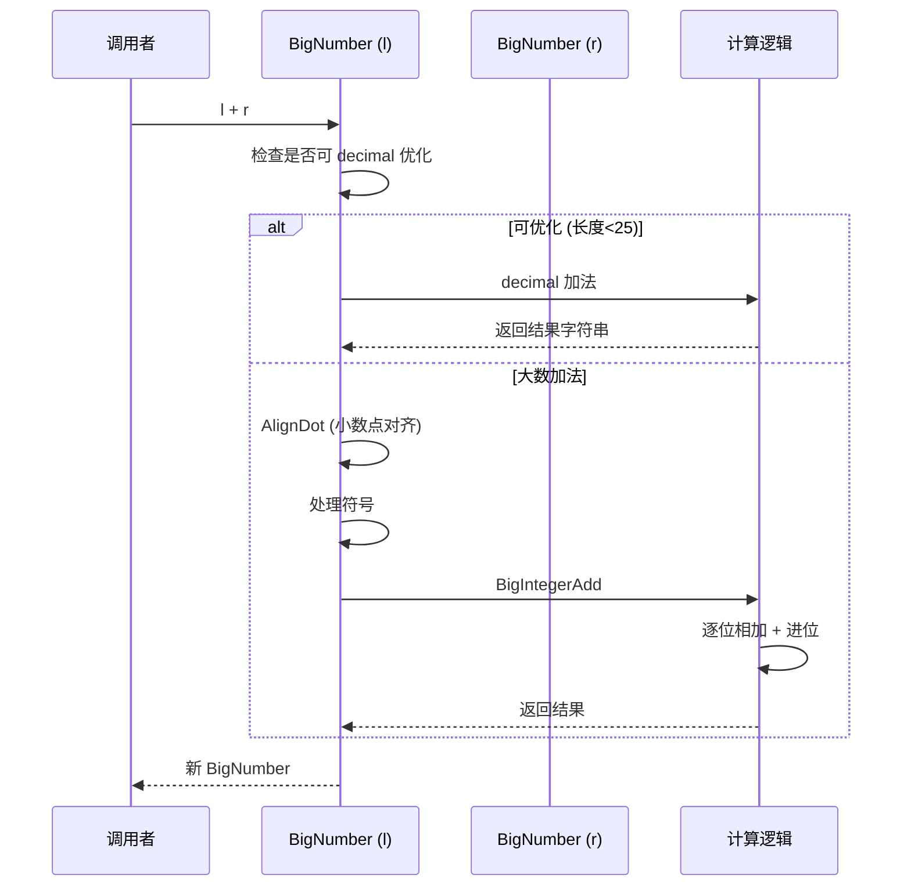
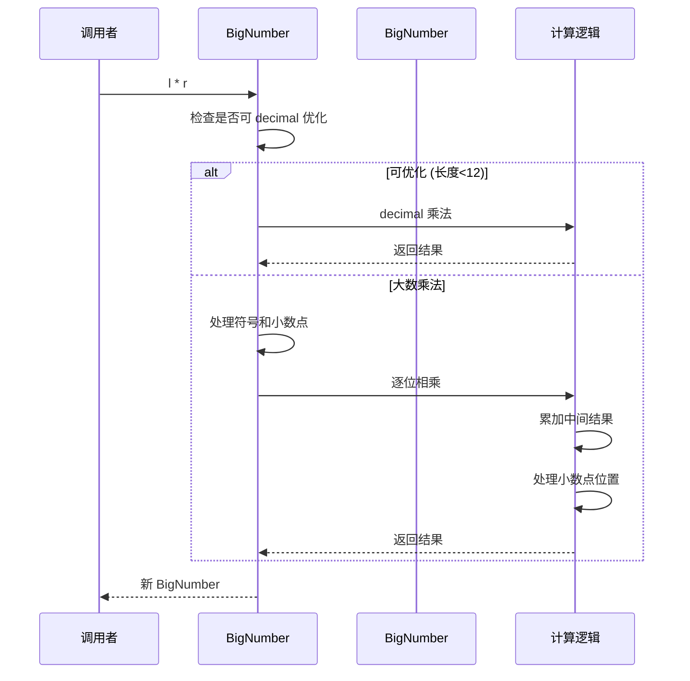

# BigNumber.cs 注解文档

## 文件基本信息

| 属性 | 值 |
|------|-----|
| **文件名** | BigNumber.cs |
| **路径** | Assets/Scripts/Mono/Core/Object/BigNumber.cs |
| **所属模块** | 框架层 → Mono/Core/Object |
| **命名空间** | `TaoTie` |
| **文件职责** | 提供任意精度大数运算，支持整数和浮点数，避免浮点精度丢失 |

---

## 类说明

### BigNumber

| 属性 | 说明 |
|------|------|
| **职责** | 表示任意精度的大数值，支持加减乘除和比较运算，内部使用字符串存储 |
| **泛型参数** | 无 |
| **继承关系** | 无继承 |
| **实现的接口** | 无（重载了运算符） |

**设计模式**: 值对象模式 + 运算符重载

```csharp
// 创建大数
BigNumber num1 = new BigNumber("12345678901234567890.123456");
BigNumber num2 = 100; // 隐式转换

// 运算
BigNumber sum = num1 + num2;
BigNumber product = num1 * num2;

// 比较
if (num1 > num2) { ... }
```

---

## 字段与属性

| 名称 | 类型 | 访问级别 | 说明 |
|------|------|----------|------|
| `PRECISION` | `ushort` | `public static` | 除法精度（默认 32 位小数） |
| `Zero` | `BigNumber` | `public static readonly` | 零值常量 |
| `FloatMax/Min` | `BigNumber` | `public static readonly` | float 最大/最小值 |
| `DoubleMax/Min` | `BigNumber` | `public static readonly` | double 最大/最小值 |
| `LongMax/Min` | `BigNumber` | `public static readonly` | long 最大/最小值 |
| `DecimalMax/Min` | `BigNumber` | `public static readonly` | decimal 最大/最小值 |
| `strValue` | `string` | `private` | 内部字符串表示 |
| `Value` | `string` | `public` | 获取字符串值（只读） |
| `IsInteger` | `bool` | `public` | 是否为整数 |
| `IntegerLength` | `int` | `public` | 整数部分长度 |
| `NumberOfDecimalPlaces` | `int` | `public` | 小数位数 |

---

## 方法说明

### 构造函数

**签名**:
```csharp
public BigNumber()                    // 创建 0
public BigNumber(string value)        // 从字符串创建
public BigNumber(BigNumber other)     // 拷贝构造
```

**职责**: 创建 BigNumber 实例

**核心逻辑**:
```
1. 验证字符串格式（正则匹配）
2. 移除前导零和尾随零
3. 处理符号
4. 存储为标准格式字符串
```

**使用示例**:
```csharp
BigNumber zero = new BigNumber();           // "0"
BigNumber num = new BigNumber("123.456");   // "123.456"
BigNumber copy = new BigNumber(num);        // 拷贝
```

---

### ToString(int count)

**签名**:
```csharp
public string ToString(int count)
```

**职责**: 保留指定小数位数

**核心逻辑**:
```
1. 找到小数点位置
2. 截取指定长度
3. 移除尾随零
```

**使用示例**:
```csharp
BigNumber num = new BigNumber("123.456789");
string s1 = num.ToString(2);  // "123.45"
string s2 = num.ToString(0);  // "123"
```

---

### ToLString(int count, bool ceil = false)

**签名**:
```csharp
public string ToLString(int count, bool ceil = false)
```

**职责**: 保留指定有效数字位数

**参数**: 
- `count` - 有效数字位数
- `ceil` - 是否向上取整

**使用示例**:
```csharp
BigNumber num = new BigNumber("12345.6789");
string s1 = num.ToLString(3);      // "12300"
string s2 = num.ToLString(3, true); // "12400" (向上取整)
```

---

### 运算符重载

#### 算术运算符

```csharp
BigNumber operator +(BigNumber l, BigNumber r)   // 加法
BigNumber operator -(BigNumber l, BigNumber r)   // 减法
BigNumber operator *(BigNumber l, int r)         // 乘法（int）
BigNumber operator *(BigNumber l, BigNumber r)   // 乘法（BigNumber）
BigNumber operator /(BigNumber l, int r)         // 除法（int）
BigNumber operator /(BigNumber l, long r)        // 除法（long）
BigNumber operator /(BigNumber l, BigNumber r)   // 除法（BigNumber）
BigNumber operator %(BigNumber l, BigNumber r)   // 取模
```

#### 比较运算符

```csharp
bool operator ==(BigNumber l, BigNumber r)       // 等于
bool operator !=(BigNumber l, BigNumber r)       // 不等于
bool operator <(BigNumber l, BigNumber r)        // 小于
bool operator >(BigNumber l, BigNumber r)        // 大于
bool operator <=(BigNumber l, BigNumber r)       // 小于等于
bool operator >=(BigNumber l, BigNumber r)       // 大于等于
```

#### 类型转换

```csharp
// 隐式转换为 BigNumber
implicit operator BigNumber(string/int/long/float/double/decimal value)

// 隐式转换为基本类型
implicit operator string/float/double/long/int(BigNumber value)
```

---

### 取整方法

#### Cell2Integer (向上取整)

**签名**:
```csharp
public static void Cell2Integer(BigNumber val)
```

**职责**: 向上取整到整数

**使用示例**:
```csharp
BigNumber num = new BigNumber("3.14");
BigNumber.Cell2Integer(num);
// num 现在是 "4"
```

#### Floor2Integer (向下取整)

**签名**:
```csharp
public static void Floor2Integer(BigNumber val)
```

**职责**: 向下取整到整数

**使用示例**:
```csharp
BigNumber num = new BigNumber("3.99");
BigNumber.Floor2Integer(num);
// num 现在是 "3"
```

#### Round2Integer (四舍五入)

**签名**:
```csharp
public static void Round2Integer(BigNumber val)
```

**职责**: 四舍五入到整数

**使用示例**:
```csharp
BigNumber num = new BigNumber("3.5");
BigNumber.Round2Integer(num);
// num 现在是 "4"
```

---

## 核心流程

### 加法流程



### 乘法流程



---

## 使用示例

### 示例 1: 基础运算

```csharp
// 创建大数
BigNumber a = new BigNumber("12345678901234567890.123456");
BigNumber b = new BigNumber("9876543210.987654");

// 加法
BigNumber sum = a + b;
Log.Info(sum.ToString());

// 减法
BigNumber diff = a - b;

// 乘法
BigNumber product = a * b;

// 除法
BigNumber quotient = a / b;

// 比较
if (a > b)
{
    Log.Info("a > b");
}
```

### 示例 2: 类型转换

```csharp
// 隐式转换
BigNumber num1 = 100;           // int
BigNumber num2 = 100L;          // long
BigNumber num3 = 3.14f;         // float
BigNumber num4 = 3.14159;       // double
BigNumber num5 = 123.456m;      // decimal
BigNumber num6 = "999";         // string

// 转回基本类型
int i = (int)num1;
long l = (long)num1;
float f = (float)num3;
double d = (double)num4;
decimal m = (decimal)num5;
string s = num6.ToString();
```

### 示例 3: 游戏数值计算

```csharp
// 避免浮点精度问题
BigNumber baseDamage = new BigNumber("100.5");
BigNumber critMultiplier = new BigNumber("2.5");
BigNumber defense = new BigNumber("30.25");

// 计算暴击伤害
BigNumber critDamage = baseDamage * critMultiplier;

// 计算最终伤害
BigNumber finalDamage = critDamage - defense;

// 显示给玩家（保留 2 位小数）
string displayDamage = finalDamage.ToString(2);
Log.Info($"最终伤害：{displayDamage}");
```

### 示例 4: 经济系统

```csharp
// 游戏货币计算（避免精度丢失）
BigNumber playerGold = new BigNumber("1000000.00");
BigNumber itemPrice = new BigNumber("99999.99");
BigNumber taxRate = new BigNumber("0.05");

// 计算税费
BigNumber tax = itemPrice * taxRate;
BigNumber.Round2Integer(tax); // 税费取整

// 计算总价
BigNumber total = itemPrice + tax;

// 检查是否足够
if (playerGold >= total)
{
    playerGold = playerGold - total;
    Log.Info($"购买成功，剩余：{playerGold}");
}
```

### 示例 5: 科学计数法支持

```csharp
// 支持科学计数法
BigNumber large = new BigNumber("1.23E+10");  // 12300000000
BigNumber small = new BigNumber("1.23E-5");   // 0.0000123

// 运算
BigNumber result = large * small;  // 123000
```

---

## 性能优化

### decimal 快速路径

对于长度较小的数字（整数部分 < 25 位），使用 decimal 进行快速计算：

```csharp
// 快速路径
if (num1.IntegerLength < 25 && num2.IntegerLength < 25)
{
    return ConvertFromFloat(d1 + d2);  // decimal 加法
}

// 大数计算
return Execute(BigIntegerAdd, value1, value2, idx_dot);
```

---

## 陷阱与注意事项

| 问题 | 说明 | 解决方案 |
|------|------|----------|
| **精度丢失** | float/double 转换可能丢失精度 | 优先使用字符串构造 |
| **性能开销** | 大数运算比基本类型慢 | 小数值使用 decimal 快速路径 |
| **除零异常** | 除以零抛出 DivideByZeroException | 检查除数是否为 0 |
| **类型转换溢出** | 超过 long/float 范围会抛出异常 | 使用 TryParse 或检查范围 |

---

## 相关文档

- [ObjectPool.cs.md](../ObjectPool.cs.md) - 对象池（ListComponent 用于大数计算）
- [NumericComponent.cs.md](../../../Code/Game/Numeric/NumericComponent.cs.md) - 数值组件（可能使用 BigNumber）
- [ConfigValue.cs.md](../../../Code/Module/Config/Value/BaseValue.cs.md) - 配置值类型

---

*文档生成时间：2026-03-02 | OpenClaw AI 助手*
