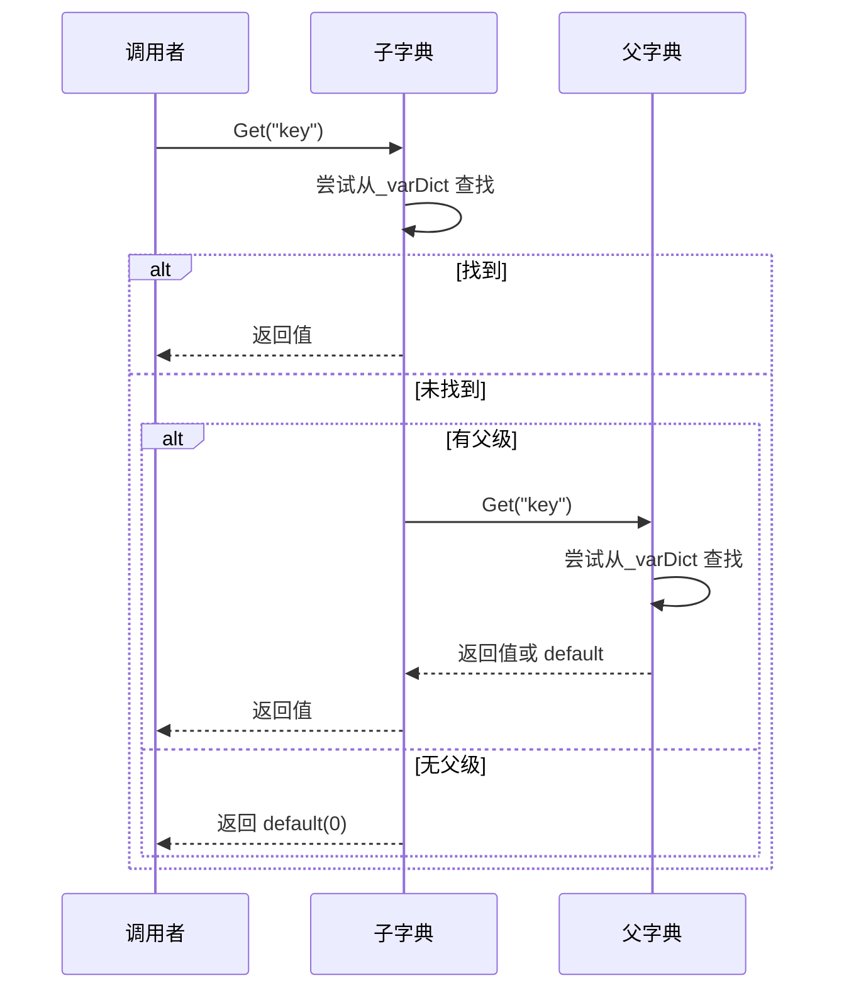
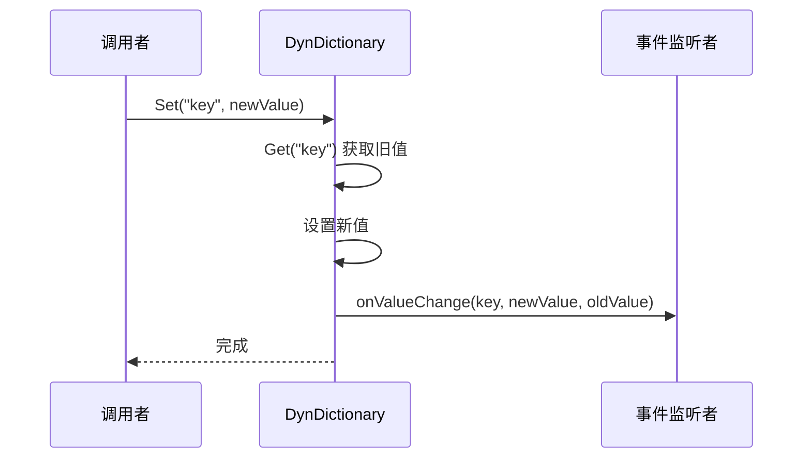

# DynDictionary.cs 注解文档

## 文件基本信息

| 属性 | 值 |
|------|-----|
| **文件名** | DynDictionary.cs |
| **路径** | Assets/Scripts/Mono/Core/Object/DynDictionary.cs |
| **所属模块** | 框架层 → Mono/Core/Object |
| **命名空间** | `TaoTie` |
| **文件职责** | 提供动态字典，支持变量存储、变更通知和父级继承 |

---

## 类说明

### DynDictionary

| 属性 | 说明 |
|------|------|
| **职责** | 动态变量字典，存储 float 类型变量，支持层级继承和变更通知 |
| **泛型参数** | 无（固定存储 float 类型） |
| **继承关系** | 无继承 |
| **实现的接口** | `IDisposable` |

**设计模式**: 对象池模式 + 观察者模式 + 原型模式（父级继承）

```csharp
// 创建动态字典
var dict = DynDictionary.Create();

// 设置变量
dict.Set("health", 100f);

// 获取变量
float health = dict.Get("health");

// 监听变更
dict.onValueChange += OnValueChange;

// 使用完毕后回收
dict.Dispose();
```

---

## 字段与属性

| 名称 | 类型 | 访问级别 | 说明 |
|------|------|----------|------|
| `_parent` | `DynDictionary` | `private` | 父级字典，用于继承查找 |
| `_varDict` | `Dictionary<string, float>` | `private` | 内部变量存储字典 |
| `onValueChange` | `OnVariableChangeDelegate` | `public event` | 变量变更事件 |

### 委托类型

```csharp
public delegate void OnVariableChangeDelegate(string key, float value, float oldValue);
```

---

## 方法说明

### Create()

**签名**:
```csharp
public static DynDictionary Create()
```

**职责**: 从对象池获取 `DynDictionary` 实例

**核心逻辑**:
```
1. 从 ObjectPool 获取实例
2. 返回复用的 DynDictionary
```

**使用示例**:
```csharp
var dict = DynDictionary.Create();
```

---

### Set(string key, float val)

**签名**:
```csharp
public void Set(string key, float val)
```

**职责**: 设置变量值，触发变更事件

**核心逻辑**:
```
1. 获取旧值
2. 设置新值（内部或新增）
3. 触发 onValueChange 事件
```

**调用者**: 任何需要设置变量的代码

**使用示例**:
```csharp
dict.Set("health", 100f);
dict.Set("speed", 5.5f);
```

---

### Get(string key)

**签名**:
```csharp
public float Get(string key)
```

**职责**: 获取变量值（支持父级继承查找）

**核心逻辑**:
```
1. 尝试从当前字典查找
2. 如果不存在且有父级，从父级递归查找
3. 否则返回 default(float) = 0
```

**调用者**: 任何需要读取变量的代码

**使用示例**:
```csharp
float health = dict.Get("health");
float speed = dict.Get("speed");
```

---

### TryGet(string key, out float res)

**签名**:
```csharp
public bool TryGet(string key, out float res)
```

**职责**: 尝试获取变量值（支持父级继承查找）

**核心逻辑**:
```
1. 尝试从当前字典查找
2. 如果不存在且有父级，从父级递归查找
3. 返回是否找到
```

**返回值**: `true` - 找到；`false` - 未找到

**使用示例**:
```csharp
if (dict.TryGet("health", out float health))
{
    Log.Info($"Health: {health}");
}
```

---

### Remove(string key)

**签名**:
```csharp
public void Remove(string key)
```

**职责**: 移除变量

**核心逻辑**:
```
1. 尝试从当前字典移除
2. 不影响父级字典
```

**使用示例**:
```csharp
dict.Remove("temporaryVar");
```

---

### Contain(string key)

**签名**:
```csharp
public bool Contain(string key)
```

**职责**: 检查是否包含变量（仅当前字典）

**核心逻辑**:
```
1. 检查当前字典是否包含键
2. 不检查父级
```

**使用示例**:
```csharp
if (dict.Contain("health"))
{
    // 当前字典有 health 变量
}
```

---

### Clear()

**签名**:
```csharp
public void Clear()
```

**职责**: 清空当前字典的所有变量

**核心逻辑**:
```
1. 调用 _varDict.Clear()
2. 不影响父级字典
```

**使用示例**:
```csharp
dict.Clear();
```

---

### SetParent(DynDictionary varset)

**签名**:
```csharp
public void SetParent(DynDictionary varset)
```

**职责**: 设置父级字典，建立继承关系

**核心逻辑**:
```
1. 设置 _parent 引用
2. Get/TryGet 时会从父级查找
```

**使用示例**:
```csharp
var parent = DynDictionary.Create();
parent.Set("globalVar", 100f);

var child = DynDictionary.Create();
child.SetParent(parent);

// 子字典可以访问父级变量
float value = child.Get("globalVar"); // 100
```

---

### Dispose()

**签名**:
```csharp
public void Dispose()
```

**职责**: 清理字典并回收到对象池

**核心逻辑**:
```
1. 清空变量字典
2. 清理事件监听
3. 清空父级引用
4. 回收到 ObjectPool
```

**使用示例**:
```csharp
using (var dict = DynDictionary.Create())
{
    dict.Set("var", 1f);
    // 自动回收
}
```

---

## 核心流程

### 变量查找流程（支持继承）



### 变量设置流程



---

## 使用示例

### 示例 1: 基础使用

```csharp
using (var dict = DynDictionary.Create())
{
    // 设置变量
    dict.Set("health", 100f);
    dict.Set("speed", 5.5f);
    dict.Set("attack", 10f);

    // 获取变量
    float health = dict.Get("health"); // 100
    float speed = dict.Get("speed");   // 5.5

    // 检查包含
    if (dict.Contain("health"))
    {
        Log.Info("Has health variable");
    }

    // 尝试获取
    if (dict.TryGet("defense", out float defense))
    {
        Log.Info($"Defense: {defense}");
    }
    else
    {
        Log.Info("No defense variable");
    }
}
```

### 示例 2: 监听变量变更

```csharp
var dict = DynDictionary.Create();

// 注册变更事件
dict.onValueChange += (key, newValue, oldValue) =>
{
    Log.Info($"变量 {key} 从 {oldValue} 变更为 {newValue}");
};

// 设置变量会触发事件
dict.Set("health", 100f); // 触发事件
dict.Set("health", 80f);  // 触发事件
```

### 示例 3: 父子继承

```csharp
// 创建父字典（全局变量）
var globalDict = DynDictionary.Create();
globalDict.Set("serverTime", 1000f);
globalDict.Set("gravity", 9.8f);

// 创建子字典（局部变量）
var localDict = DynDictionary.Create();
localDict.SetParent(globalDict);
localDict.Set("playerHealth", 100f);

// 子字典可以访问父级变量
float serverTime = localDict.Get("serverTime"); // 1000（从父级）
float gravity = localDict.Get("gravity");       // 9.8（从父级）
float playerHealth = localDict.Get("playerHealth"); // 100（本地）

// 子字典覆盖父级变量
localDict.Set("gravity", 5.0f);
float newGravity = localDict.Get("gravity"); // 5.0（本地覆盖）
```

### 示例 4: 实体属性系统

```csharp
// 实体属性字典
var entityAttrs = DynDictionary.Create();

// 设置基础属性
entityAttrs.Set("strength", 10f);
entityAttrs.Set("agility", 8f);
entityAttrs.Set("intelligence", 12f);

// 监听属性变化
entityAttrs.onValueChange += (key, newValue, oldValue) =>
{
    // 更新 UI 或触发效果
    UpdateAttributeUI(key, newValue);
};

// 修改属性
entityAttrs.Set("strength", 15f); // 触发事件
```

---

## 应用场景

| 场景 | 说明 |
|------|------|
| **实体属性** | 存储动态属性（力量、敏捷、智力等） |
| **配置变量** | 运行时配置参数，支持热更新 |
| **状态传递** | 跨模块传递状态数据 |
| **UI 数据绑定** | 变量变更自动更新 UI |
| **技能效果** | 临时 Buff/Debuff 存储 |

---

## 相关文档

- [ObjectPool.cs.md](../ObjectPool.cs.md) - 对象池核心
- [DictionaryComponent.cs.md](./DictionaryComponent.cs.md) - Dictionary 组件
- [NumericComponent.cs.md](../../../Code/Game/Numeric/NumericComponent.cs.md) - 数值组件（可能使用 DynDictionary）

---

*文档生成时间：2026-03-02 | OpenClaw AI 助手*
