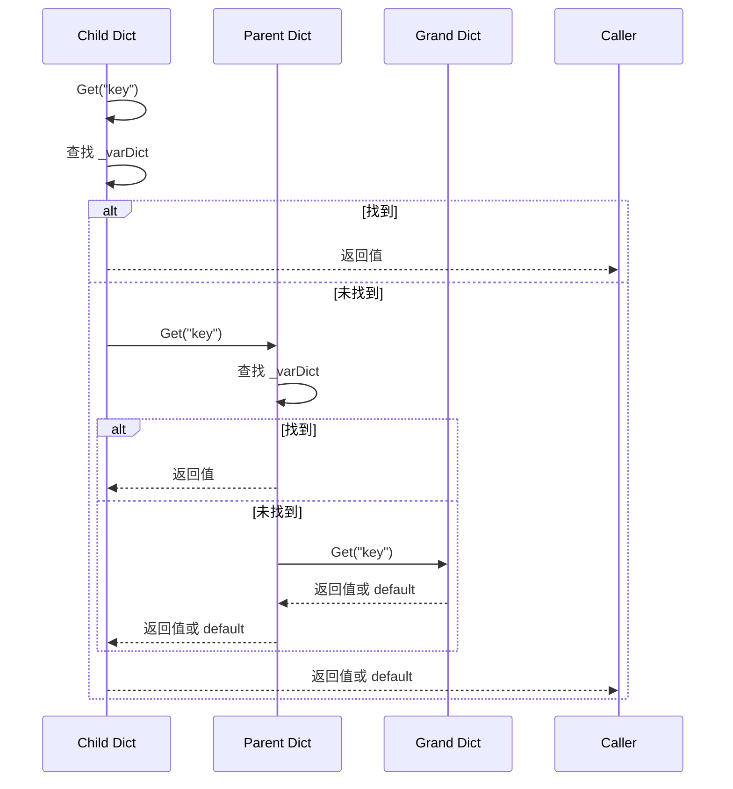
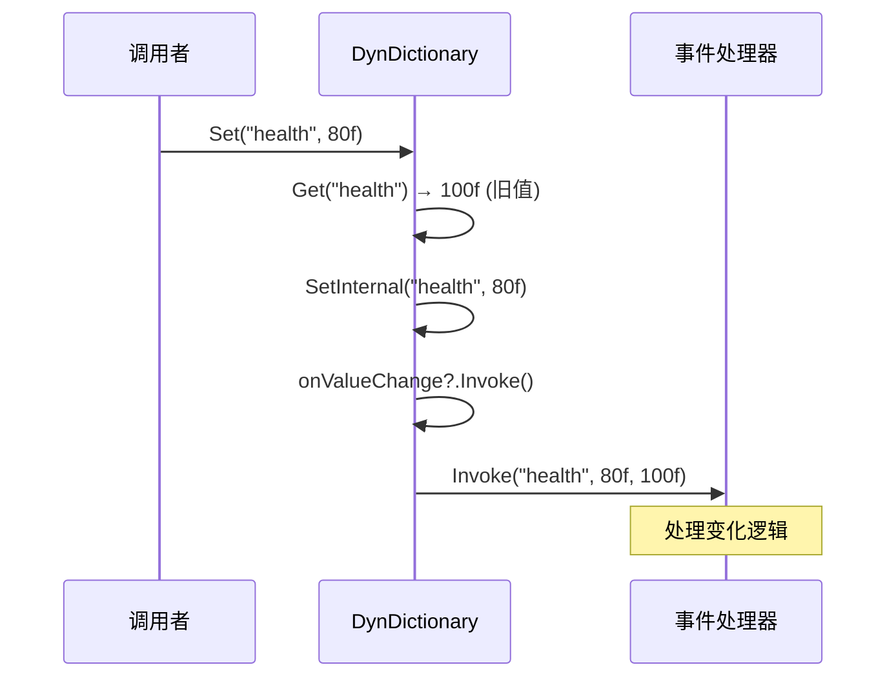

# DynDictionary.cs 注解文档

## 文件基本信息

| 属性 | 值 |
|------|-----|
| **文件名** | DynDictionary.cs |
| **路径** | Assets/Scripts/Mono/Core/Object/DynDictionary.cs |
| **所属模块** | Mono/Core/Object |
| **文件职责** | 动态字典，支持浮点数值存储、变量变化通知、父子继承 |

---

## 类/结构体说明

### DynDictionary

| 属性 | 说明 |
|------|------|
| **职责** | 存储浮点数值的动态字典，支持事件通知和父子继承链 |
| **泛型参数** | 无 |
| **继承关系** | 无 |
| **实现的接口** | `IDisposable` |

**设计模式**: 观察者模式 + 原型模式（对象池） + 责任链模式

```csharp
// 创建（从对象池获取）
var vars = DynDictionary.Create();

// 设置变量
vars.Set("health", 100f);
vars.Set("attack", 50f);

// 获取变量
float health = vars.Get("health");

// 监听变化
vars.onValueChange += (key, newValue, oldValue) => 
{
    Log.Info($"{key}: {oldValue} → {newValue}");
};

// 使用完毕后回收
vars.Dispose();
```

---

## 字段与属性

| 名称 | 类型 | 访问级别 | 说明 |
|------|------|----------|------|
| `_parent` | `DynDictionary` | `private` | 父字典，形成继承链 |
| `_varDict` | `Dictionary<string, float>` | `private` | 存储变量的字典 |
| `onValueChange` | `OnVariableChangeDelegate` | `public` | 变量值变化事件 |
| `Create()` | `static` | `public` | 从对象池创建 |

### 委托类型

```csharp
public delegate void OnVariableChangeDelegate(string key, float value, float oldValue);
```

---

## 方法说明（按重要程度排序）

### Create ⭐

**签名**:
```csharp
public static DynDictionary Create()
```

**职责**: 从对象池创建 DynDictionary 实例

**核心逻辑**:
```
1. 调用 ObjectPool.Instance.Fetch<DynDictionary>()
2. 返回实例
```

**使用示例**:
```csharp
using (var vars = DynDictionary.Create())
{
    vars.Set("key", 100f);
} // 自动回收
```

---

### Set ⭐

**签名**:
```csharp
public void Set(string key, float val)
```

**职责**: 设置变量值，触发变化事件

**核心逻辑**:
```
1. 获取旧值 Get(key)
2. 调用 SetInternal 设置值
3. 触发 onValueChange 事件
```

**使用示例**:
```csharp
vars.Set("health", 100f);
vars.Set("attack", 50f);

// 监听变化
vars.onValueChange += (key, newVal, oldVal) => 
{
    Log.Info($"{key}: {oldVal} → {newVal}");
};

vars.Set("health", 80f); // 触发事件：health: 100 → 80
```

---

### Get ⭐

**签名**:
```csharp
public float Get(string key)
```

**职责**: 获取变量值，支持父子继承链查找

**核心逻辑**:
```
1. 尝试从当前字典查找
2. 如果未找到且有父字典，递归查找父字典
3. 如果都未找到，返回 default (0f)
```

**使用示例**:
```csharp
var parent = DynDictionary.Create();
parent.Set("global", 100f);

var child = DynDictionary.Create();
child.SetParent(parent);

// 子字典可以访问父字典的变量
float global = child.Get("global"); // 100

// 子字典自己的变量优先
child.Set("local", 50f);
float local = child.Get("local"); // 50
```

---

### TryGet

**签名**:
```csharp
public bool TryGet(string key, out float res)
```

**职责**: 尝试获取变量值，支持父子继承链

**返回值**:
- `true`: 找到变量
- `false`: 未找到

**使用示例**:
```csharp
if (vars.TryGet("health", out var health))
{
    Log.Info($"Health: {health}");
}
else
{
    Log.Info("Health not set");
}
```

---

### Remove

**签名**:
```csharp
public void Remove(string key)
```

**职责**: 移除变量

**核心逻辑**:
```
1. 从当前字典移除
2. 不影响父字典
```

**使用示例**:
```csharp
vars.Set("temp", 100f);
vars.Remove("temp"); // 移除变量
```

---

### Contain

**签名**:
```csharp
public bool Contain(string key)
```

**职责**: 检查当前字典是否包含变量（不查父字典）

**使用示例**:
```csharp
if (vars.Contain("health"))
{
    Log.Info("Health is set locally");
}
```

---

### SetParent

**签名**:
```csharp
public void SetParent(DynDictionary varset)
```

**职责**: 设置父字典，形成继承链

**使用示例**:
```csharp
var global = DynDictionary.Create();
global.Set("server_time", 1000f);

var local = DynDictionary.Create();
local.SetParent(global);

// local 可以访问 global 的变量
float time = local.Get("server_time"); // 1000
```

---

### Clear

**签名**:
```csharp
public void Clear()
```

**职责**: 清空当前字典的所有变量

**说明**: 不影响父字典

---

### Dispose ⭐

**签名**:
```csharp
public void Dispose()
```

**职责**: 清理并回收到对象池

**核心逻辑**:
```
1. 调用 Clear() 清空变量
2. 移除 onValueChange 事件
3. 断开父字典引用
4. 回收到对象池
```

**使用示例**:
```csharp
// ✅ 推荐：使用 using
using (var vars = DynDictionary.Create())
{
    vars.Set("key", 100f);
} // 自动 Dispose

// ✅ 手动管理
var vars = DynDictionary.Create();
try
{
    vars.Set("key", 100f);
}
finally
{
    vars.Dispose();
}
```

---

## 流程图

### Get 继承链查找



### Set 事件触发



---

## 与其他模块的交互

```mermaid
graph TB
    subgraph Dyn["DynDictionary"]
        DD[DynDictionary]
    end
    
    subgraph Pool["对象池"]
        OP[ObjectPool]
    end
    
    subgraph Usage["使用场景"]
        UI[UI 数据绑定]
        Game[游戏数值]
        Config[动态配置]
    end
    
    DD --> OP
    UI --> DD
    Game --> DD
    Config --> DD
    
    note right of DD "DynDictionary 提供<br/>动态数值存储和<br/>变化通知功能"
    
    style Dyn fill:#e1f5ff
    style Pool fill:#fff4e1
    style Usage fill:#e8f5e9
```

---

## 学习重点与陷阱

### ✅ 学习重点

1. **对象池集成**: 必须通过 `Create()` 创建，使用 `Dispose()` 回收
2. **父子继承链**: 子字典可以访问父字典的变量，形成作用域链
3. **变化通知**: `onValueChange` 事件在值变化时触发
4. **浮点数值**: 仅支持 `float` 类型，不支持其他类型
5. **局部优先**: Get 时优先查找当前字典，再查父字典

### ⚠️ 陷阱与注意事项

| 问题 | 说明 | 解决方案 |
|------|------|----------|
| **忘记回收** | 未调用 Dispose 导致内存泄漏 | 使用 using 语句 |
| **事件泄漏** | 未移除事件导致对象无法释放 | Dispose 会自动清理 |
| **类型限制** | 仅支持 float，不能存其他类型 | 需要其他类型用其他结构 |
| **父字典提前回收** | 父字典回收后子字典访问会出错 | 确保生命周期管理正确 |
| **循环引用** | 父子形成环会导致死循环 | 避免循环设置父节点 |

---

## 最佳实践

### UI 数据绑定

```csharp
public class UIBinding : MonoBehaviour
{
    private DynDictionary data;
    private Text healthText;
    private Text attackText;
    
    void Start()
    {
        data = DynDictionary.Create();
        
        // 监听变化，更新 UI
        data.onValueChange += OnVariableChange;
        
        // 初始化
        data.Set("health", 100f);
        data.Set("attack", 50f);
    }
    
    private void OnVariableChange(string key, float newVal, float oldVal)
    {
        switch (key)
        {
            case "health":
                healthText.text = $"HP: {newVal}";
                break;
            case "attack":
                attackText.text = $"ATK: {newVal}";
                break;
        }
    }
    
    void OnDestroy()
    {
        data?.Dispose();
    }
}
```

### 游戏数值系统

```csharp
public class PlayerStats
{
    private DynDictionary baseStats;
    private DynDictionary buffStats;
    private DynDictionary finalStats;
    
    public PlayerStats()
    {
        // 基础属性
        baseStats = DynDictionary.Create();
        baseStats.Set("strength", 10f);
        baseStats.Set("agility", 8f);
        baseStats.Set("intelligence", 12f);
        
        // BUFF 属性
        buffStats = DynDictionary.Create();
        buffStats.SetParent(baseStats);
        
        // 最终属性（监听变化）
        finalStats = DynDictionary.Create();
        finalStats.SetParent(buffStats);
        finalStats.onValueChange += OnFinalStatChange;
    }
    
    public void AddBuff(string statName, float bonus)
    {
        // 当前值 = 基础值 + BUFF 值
        float baseValue = baseStats.Get(statName);
        float currentBuff = buffStats.Get(statName);
        buffStats.Set(statName, currentBuff + bonus);
    }
    
    public void RemoveBuff(string statName, float bonus)
    {
        float currentBuff = buffStats.Get(statName);
        buffStats.Set(statName, currentBuff - bonus);
    }
    
    private void OnFinalStatChange(string key, float newVal, float oldVal)
    {
        Log.Info($"{key}: {oldVal} → {newVal}");
        // 更新角色实际属性
    }
    
    public float GetStat(string statName)
    {
        return finalStats.Get(statName);
    }
    
    public void Dispose()
    {
        baseStats?.Dispose();
        buffStats?.Dispose();
        finalStats?.Dispose();
    }
}
```

### 动态配置系统

```csharp
public class DynamicConfig
{
    private static DynDictionary globalConfig;
    private static DynDictionary localConfig;
    
    public static void Init()
    {
        // 全局配置
        globalConfig = DynDictionary.Create();
        globalConfig.Set("volume", 0.8f);
        globalConfig.Set("brightness", 0.5f);
        globalConfig.Set("difficulty", 2f);
        
        // 本地配置（覆盖全局）
        localConfig = DynDictionary.Create();
        localConfig.SetParent(globalConfig);
        
        // 监听变化，保存配置
        localConfig.onValueChange += (key, val, old) => 
        {
            SaveConfig(key, val);
        };
    }
    
    public static float Get(string key)
    {
        return localConfig.Get(key);
    }
    
    public static void Set(string key, float value)
    {
        localConfig.Set(key, value);
    }
    
    public static void Reset(string key)
    {
        localConfig.Remove(key); // 移除本地覆盖，使用全局值
    }
    
    private static void SaveConfig(string key, float value)
    {
        // 保存到本地文件
        PlayerPrefs.SetFloat(key, value);
    }
    
    public static void Dispose()
    {
        globalConfig?.Dispose();
        localConfig?.Dispose();
    }
}
```

---

## 完整示例：战斗数值系统

```csharp
/// <summary>
/// 战斗数值管理器
/// 支持基础属性、装备加成、BUFF 加成、技能加成
/// </summary>
public class BattleStatsManager
{
    private DynDictionary baseStats;      // 基础属性
    private DynDictionary equipStats;     // 装备加成
    private DynDictionary buffStats;      // BUFF 加成
    private DynDictionary skillStats;     // 技能加成
    private DynDictionary finalStats;     // 最终属性
    
    public BattleStatsManager()
    {
        // 创建属性链
        baseStats = DynDictionary.Create();
        InitBaseStats();
        
        equipStats = DynDictionary.Create();
        equipStats.SetParent(baseStats);
        
        buffStats = DynDictionary.Create();
        buffStats.SetParent(equipStats);
        
        skillStats = DynDictionary.Create();
        skillStats.SetParent(buffStats);
        
        finalStats = DynDictionary.Create();
        finalStats.SetParent(skillStats);
        
        // 监听最终属性变化
        finalStats.onValueChange += OnFinalStatChange;
    }
    
    private void InitBaseStats()
    {
        baseStats.Set("hp", 1000f);
        baseStats.Set("attack", 100f);
        baseStats.Set("defense", 50f);
        baseStats.Set("speed", 10f);
        baseStats.Set("crit", 5f);
    }
    
    // 装备加成
    public void EquipItem(string statName, float bonus)
    {
        float current = equipStats.Get(statName);
        equipStats.Set(statName, current + bonus);
    }
    
    public void UnequipItem(string statName, float bonus)
    {
        float current = equipStats.Get(statName);
        equipStats.Set(statName, current - bonus);
    }
    
    // BUFF 加成
    public void AddBuff(string statName, float bonus)
    {
        float current = buffStats.Get(statName);
        buffStats.Set(statName, current + bonus);
    }
    
    public void RemoveBuff(string statName, float bonus)
    {
        float current = buffStats.Get(statName);
        buffStats.Set(statName, current - bonus);
    }
    
    // 获取最终属性
    public float GetStat(string statName)
    {
        return finalStats.Get(statName);
    }
    
    // 获取所有属性
    public Dictionary<string, float> GetAllStats()
    {
        return new Dictionary<string, float>
        {
            ["hp"] = GetStat("hp"),
            ["attack"] = GetStat("attack"),
            ["defense"] = GetStat("defense"),
            ["speed"] = GetStat("speed"),
            ["crit"] = GetStat("crit"),
        };
    }
    
    private void OnFinalStatChange(string key, float newVal, float oldVal)
    {
        Log.Info($"Stat changed: {key} {oldVal} → {newVal}");
        
        // 通知 UI 更新
        UIManager.Instance.BroadcastStatChange(key, newVal);
        
        // 重新计算衍生属性
        if (key == "strength" || key == "agility")
        {
            RecalculateDerivedStats();
        }
    }
    
    private void RecalculateDerivedStats()
    {
        // 力量 → 攻击力
        float str = GetStat("strength");
        float attack = str * 2f;
        baseStats.Set("attack", attack);
        
        // 敏捷 → 速度
        float agi = GetStat("agility");
        float speed = agi * 0.5f;
        baseStats.Set("speed", speed);
    }
    
    public void Dispose()
    {
        baseStats?.Dispose();
        equipStats?.Dispose();
        buffStats?.Dispose();
        skillStats?.Dispose();
        finalStats?.Dispose();
    }
}

// 使用示例
public class Player : MonoBehaviour
{
    private BattleStatsManager stats;
    
    void Start()
    {
        stats = new BattleStatsManager();
        
        // 装备武器
        stats.EquipItem("attack", 50f);
        
        // 添加 BUFF
        stats.AddBuff("speed", 5f);
        
        // 获取属性
        float attack = stats.GetStat("attack");
        Log.Info($"Attack: {attack}");
    }
    
    void OnDestroy()
    {
        stats?.Dispose();
    }
}
```

---

## 相关文档

- [ObjectPool.cs.md](../ObjectPool.cs.md) - 对象池
- [Component_Collections.cs.md](./Component_Collections.cs.md) - 集合组件

---

*文档由 OpenClaw AI 助手自动生成 | 基于静态代码分析*
