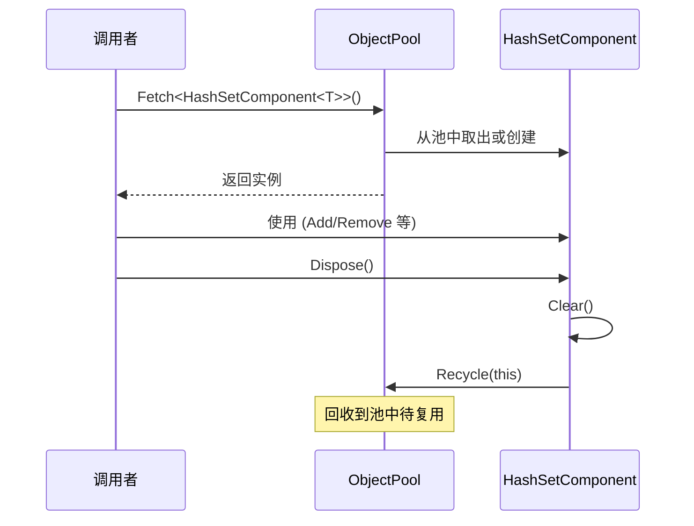

# HashSetComponent.cs 注解文档

## 文件基本信息

| 属性 | 值 |
|------|-----|
| **文件名** | HashSetComponent.cs |
| **路径** | Assets/Scripts/Mono/Core/Object/HashSetComponent.cs |
| **所属模块** | 框架层 → Mono/Core/Object |
| **命名空间** | `TaoTie` |
| **文件职责** | 提供可对象池复用的 HashSet 组件 |

---

## 类说明

### HashSetComponent<T>

| 属性 | 说明 |
|------|------|
| **职责** | 继承自 `HashSet<T>`，支持对象池创建与回收，实现 `IDisposable` 接口 |
| **泛型参数** | `T` - 集合元素类型 |
| **继承关系** | `HashSet<T>` |
| **实现的接口** | `IDisposable` |

**设计模式**: 对象池模式

```csharp
// 对象池创建
var set = HashSetComponent<int>.Create();

// 使用完毕后回收
set.Dispose();
```

---

## 字段与属性

| 名称 | 类型 | 访问级别 | 说明 |
|------|------|----------|------|
| (无额外字段) | - | - | 继承 `HashSet<T>` 的所有功能 |

---

## 方法说明

### Create()

**签名**:
```csharp
public static HashSetComponent<T> Create()
```

**职责**: 从对象池获取 `HashSetComponent<T>` 实例

**核心逻辑**:
```
1. 从 ObjectPool 获取实例
2. 返回复用的 HashSetComponent
```

**调用者**: 任何需要临时 HashSet 的代码

**使用示例**:
```csharp
// 创建一个临时 HashSet
var tempSet = HashSetComponent<int>.Create();
tempSet.Add(1);
tempSet.Add(2);

// 使用完毕后回收
tempSet.Dispose();
```

---

### Dispose()

**签名**:
```csharp
public void Dispose()
```

**职责**: 清理集合并回收到对象池

**核心逻辑**:
```
1. 调用 Clear() 清空集合
2. 回收到 ObjectPool
```

**调用者**: 使用完 HashSetComponent 的代码

**使用示例**:
```csharp
using (var set = HashSetComponent<string>.Create())
{
    set.Add("item1");
    set.Add("item2");
    // 使用...
} // 自动调用 Dispose()
```

---

## 核心流程

### 对象池复用流程



---

## 使用示例

### 示例 1: 基础使用

```csharp
// 创建集合
var set = HashSetComponent<int>.Create();

// 添加元素
set.Add(1);
set.Add(2);
set.Add(3);

// 检查包含
if (set.Contains(2))
{
    Log.Info("包含元素 2");
}

// 遍历
foreach (var item in set)
{
    Log.Info(item.ToString());
}

// 回收
set.Dispose();
```

### 示例 2: using 语句自动回收

```csharp
using (var set = HashSetComponent<string>.Create())
{
    set.Add("apple");
    set.Add("banana");
    // 自动回收，无需手动 Dispose
}
```

### 示例 3: 临时集合操作

```csharp
// 在方法中使用临时集合
void ProcessData(List<int> data)
{
    var uniqueSet = HashSetComponent<int>.Create();
    try
    {
        foreach (var item in data)
        {
            uniqueSet.Add(item); // 自动去重
        }
        // 处理唯一值...
    }
    finally
    {
        uniqueSet.Dispose();
    }
}
```

---

## 相关文档

- [ObjectPool.cs.md](../ObjectPool.cs.md) - 对象池核心
- [ListComponent.cs.md](./ListComponent.cs.md) - List 组件
- [DictionaryComponent.cs.md](./DictionaryComponent.cs.md) - Dictionary 组件
- [LinkedListComponent.cs.md](./LinkedListComponent.cs.md) - LinkedList 组件

---

*文档生成时间：2026-03-02 | OpenClaw AI 助手*
