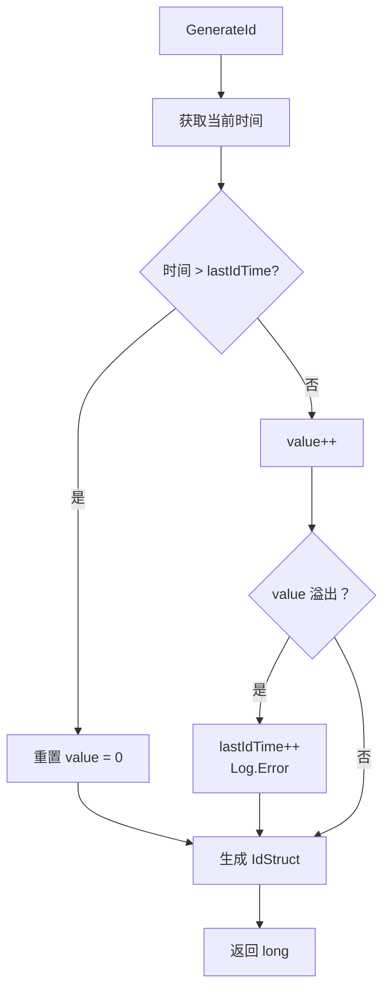
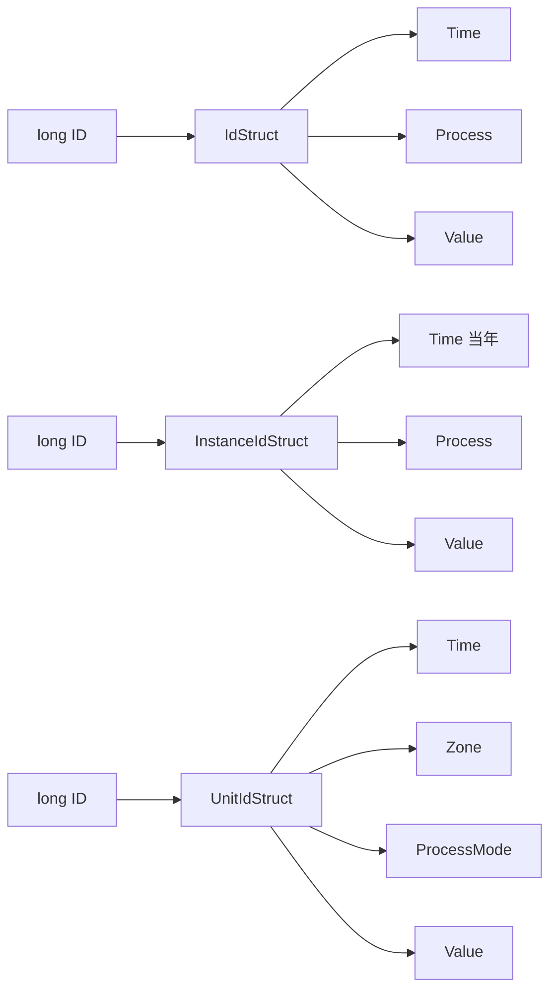

# IdGenerater.cs 注解文档

## 文件基本信息

| 属性 | 值 |
|------|------|
| **文件名** | IdGenerater.cs |
| **路径** | Assets/Scripts/Mono/Core/Object/IdGenerater.cs |
| **所属模块** | Mono/Core/Object |
| **文件职责** | 分布式 ID 生成器，生成全局唯一 ID |

---

## 概述

IdGenerater 提供三种 ID 生成策略，用于不同场景的唯一标识：

| ID 类型 | 结构 | 用途 |
|---------|------|------|
| **IdStruct** | 时间 (30bit) + 进程 (18bit) + 自增 (16bit) | 通用全局 ID |
| **InstanceIdStruct** | 时间 (28bit) + 进程 (18bit) + 自增 (18bit) | 实例 ID（当年内有效） |
| **UnitIdStruct** | 时间 (30bit) + 分区 (10bit) + 进程 (8bit) + 自增 (16bit) | 单位 ID（支持分区） |

---

## ID 结构详解

### IdStruct

**位分布**:
```
63                                    34 33            16 15             0
┌─────────────────────────────────────┬─────────────────┬───────────────┐
│              Time (30bit)           │  Process (18bit)│  Value (16bit)│
│         秒级时间戳 (2020 年起)        │     进程 ID      │   秒内自增     │
└─────────────────────────────────────┴─────────────────┴───────────────┘
```

**容量**:
- 时间范围：2020 年起约 34 年
- 进程数：2^18 = 262,144 个进程
- 每秒每进程：2^16 = 65,536 个 ID

**使用示例**:
```csharp
long id = IdGenerater.Instance.GenerateId();
IdStruct idStruct = new IdStruct(id);

Log.Info($"Process: {idStruct.Process}");
Log.Info($"Time: {idStruct.Time}");
Log.Info($"Value: {idStruct.Value}");
```

---

### InstanceIdStruct

**位分布**:
```
63                                    36 35            18 17             0
┌─────────────────────────────────────┬─────────────────┬───────────────┐
│         Time (28bit)                │  Process (18bit)│  Value (18bit)│
│    当年开始的秒数 (约 8.5 年)          │     进程 ID      │   秒内自增     │
└─────────────────────────────────────┴─────────────────┴───────────────┘
```

**容量**:
- 时间范围：当年起约 8.5 年（实际每年重置）
- 进程数：2^18 = 262,144 个进程
- 每秒每进程：2^18 = 262,144 个 ID

**使用示例**:
```csharp
long instanceId = IdGenerater.Instance.GenerateInstanceId();
InstanceIdStruct instanceStruct = new InstanceIdStruct(instanceId);

// 也可以手动创建（用于 SceneId 等）
var sceneId = new InstanceIdStruct(process: 1, value: 100);
```

---

### UnitIdStruct

**位分布**:
```
63                                    34 33    24 23              16 15             0
┌─────────────────────────────────────┬─────────┬──────────────────┬───────────────┐
│         Time (30bit)                │Zone(10b)│ProcessMode(8bit) │  Value (16bit)│
│    秒级时间戳 (2020 年起)            │ 分区 ID  │ 进程%256         │   秒内自增     │
└─────────────────────────────────────┴─────────┴──────────────────┴───────────────┘
```

**容量**:
- 时间范围：2020 年起约 34 年
- 分区数：2^10 = 1,024 个区
- 每区进程：256 个
- 每秒每进程：2^16 = 65,536 个 ID

**使用示例**:
```csharp
// 生成 Unit ID（需要指定区）
long unitId = IdGenerater.Instance.GenerateUnitId(zone: 1);

// 解析
UnitIdStruct unitStruct = new UnitIdStruct(unitId);
Log.Info($"Zone: {unitStruct.Zone}");
Log.Info($"ProcessMode: {unitStruct.ProcessMode}");

// 从 Unit ID 获取区
int zone = UnitIdStruct.GetUnitZone(unitId);
```

---

## 类/结构体说明

### IdGenerater

| 属性 | 说明 |
|------|------|
| **职责** | 单例 ID 生成器，管理时间戳和自增值 |
| **泛型参数** | 无 |
| **继承关系** | 无 |
| **实现的接口** | `IDisposable` |

**单例访问**:
```csharp
var generator = IdGenerater.Instance;
```

---

## 常量

| 名称 | 值 | 说明 |
|------|-----|------|
| `Mask18bit` | `0x03ffff` | 18 位掩码 |
| `MaxZone` | `1024` | 最大分区数 |

---

## 方法说明

### GenerateId ⭐

**签名**:
```csharp
public long GenerateId()
```

**职责**: 生成全局唯一 ID（IdStruct）

**核心逻辑**:
```
1. 获取当前时间（距 2020 年的秒数）
2. 如果时间 > 上次时间：
   - 更新时间
   - 重置自增值为 0
3. 否则：
   - 自增值 +1
   - 如果溢出，借用下一秒
4. 组合 IdStruct 并返回 long
```

**使用示例**:
```csharp
long id1 = IdGenerater.Instance.GenerateId();
long id2 = IdGenerater.Instance.GenerateId();

// ID 单调递增（同一秒内）
Log.Info(id1 < id2); // true
```

---

### GenerateInstanceId ⭐

**签名**:
```csharp
public long GenerateInstanceId()
```

**职责**: 生成实例 ID（InstanceIdStruct）

**核心逻辑**:
```
1. 获取当年开始的秒数
2. 如果时间 > 上次时间：
   - 更新时间
   - 重置自增值为 0
3. 否则：
   - 自增值 +1
   - 如果溢出，借用下一秒
4. 组合 InstanceIdStruct 并返回 long
```

**使用示例**:
```csharp
long instanceId = IdGenerater.Instance.GenerateInstanceId();

// 用于 Entity 实例 ID
entity.InstanceId = instanceId;
```

---

### GenerateUnitId ⭐

**签名**:
```csharp
public long GenerateUnitId(int zone)
```

**职责**: 生成单位 ID（UnitIdStruct）

**参数**:
- `zone`: 分区 ID（0-1023）

**核心逻辑**:
```
1. 检查 zone <= MaxZone
2. 获取当前时间（距 2020 年的秒数）
3. 如果时间 > 上次时间：
   - 更新时间
   - 重置自增值为 0
4. 否则：
   - 自增值 +1
   - 如果溢出，借用下一秒
5. 组合 UnitIdStruct 并返回 long
```

**使用示例**:
```csharp
// 为 1 区的单位生成 ID
long unitId1 = IdGenerater.Instance.GenerateUnitId(zone: 1);

// 为 2 区的单位生成 ID
long unitId2 = IdGenerater.Instance.GenerateUnitId(zone: 2);

// 提取区号
int zone = UnitIdStruct.GetUnitZone(unitId1); // 1
```

---

## 流程图

### ID 生成流程



### ID 结构转换



---

## 使用示例

### Entity ID 系统

```csharp
public class Entity
{
    public long Id { get; private set; }
    public long InstanceId { get; private set; }
    
    public Entity()
    {
        // 全局唯一 ID
        this.Id = IdGenerater.Instance.GenerateId();
        
        // 实例 ID（用于对象池等）
        this.InstanceId = IdGenerater.Instance.GenerateInstanceId();
    }
}
```

### 分布式单位系统

```csharp
public class UnitManager
{
    private int zoneId;
    private Dictionary<long, Unit> units;
    
    public UnitManager(int zone)
    {
        zoneId = zone;
        units = new Dictionary<long, Unit>();
    }
    
    public Unit CreateUnit()
    {
        // 生成本区的单位 ID
        long unitId = IdGenerater.Instance.GenerateUnitId(zoneId);
        
        var unit = new Unit
        {
            Id = unitId,
            Zone = zoneId
        };
        
        units[unitId] = unit;
        return unit;
    }
    
    public Unit GetUnit(long unitId)
    {
        units.TryGetValue(unitId, out var unit);
        return unit;
    }
    
    public int GetUnitZone(long unitId)
    {
        return UnitIdStruct.GetUnitZone(unitId);
    }
}
```

### ID 解析与显示

```csharp
public class IdHelper
{
    public static string FormatId(long id)
    {
        var idStruct = new IdStruct(id);
        return $"P{idStruct.Process}-T{idStruct.Time}-V{idStruct.Value}";
    }
    
    public static string FormatInstanceId(long id)
    {
        var instStruct = new InstanceIdStruct(id);
        return $"I{instStruct.Process}-{instStruct.Value}";
    }
    
    public static string FormatUnitId(long id)
    {
        var unitStruct = new UnitIdStruct(id);
        return $"Z{unitStruct.Zone}-P{unitStruct.ProcessMode}-V{unitStruct.Value}";
    }
    
    // 使用示例
    // FormatId(123456789) → "P1-T12345-V6789"
}
```

---

## ⚠️ 注意事项

| 问题 | 说明 | 解决方案 |
|------|------|----------|
| **时间回拨** | 系统时间回拨会导致 ID 重复 | 使用单调时钟或记录最大时间 |
| **ID 溢出** | 每秒生成超过 65K 个 ID 会借用下一秒 | 控制生成频率或增加进程数 |
| **进程 ID 冲突** | 不同进程使用相同 Process ID 会冲突 | 确保 Process 唯一 |
| **跨年重置** | InstanceId 每年重置 | 新年时注意 ID 变化 |
| **分区超限** | zone > 1024 会抛异常 | 检查 zone 范围 |

---

## 相关文档

- [BigNumber.cs.md](./BigNumber.cs.md) - 大数运算
- [ObjectPool.cs.md](../ObjectPool.cs.md) - 对象池

---

*文档由 OpenClaw AI 助手自动生成 | 基于静态代码分析*
