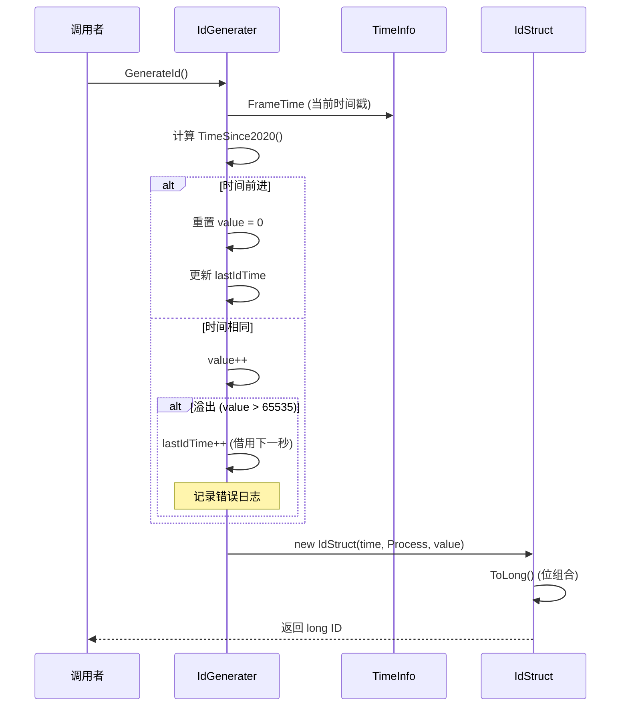
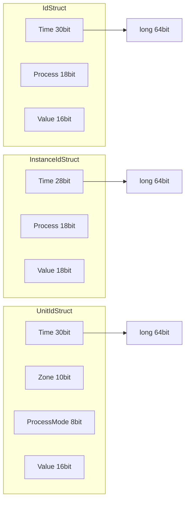

# IdGenerater.cs 注解文档

## 文件基本信息

| 属性 | 值 |
|------|-----|
| **文件名** | IdGenerater.cs |
| **路径** | Assets/Scripts/Mono/Core/Object/IdGenerater.cs |
| **所属模块** | 框架层 → Mono/Core/Object |
| **命名空间** | `TaoTie` |
| **文件职责** | 提供全局唯一 ID 生成器，支持多种 ID 格式（普通 ID、InstanceId、UnitId） |

---

## 类/结构体说明

### IdStruct

| 属性 | 说明 |
|------|------|
| **职责** | 普通 ID 结构体，30bit 时间 + 18bit 进程 + 16bit 序列号 |
| **布局** | `LayoutKind.Sequential, Pack = 1`（紧凑布局） |
| **总位数** | 64bit（转换为 long） |

**位分布**:
```
| 34-63 (30bit)    | 16-33 (18bit)    | 0-15 (16bit)     |
| Time (秒)        | Process          | Value (序列号)   |
```

---

### InstanceIdStruct

| 属性 | 说明 |
|------|------|
| **职责** | 实例 ID 结构体，28bit 年时间 + 18bit 进程 + 18bit 序列号 |
| **布局** | `LayoutKind.Sequential, Pack = 1` |
| **总位数** | 64bit（转换为 long） |
| **特点** | 每年重置时间戳，适合 Instance 级别的 ID |

**位分布**:
```
| 36-63 (28bit)    | 18-35 (18bit)    | 0-17 (18bit)     |
| Time (当年秒数)  | Process          | Value (序列号)   |
```

---

### UnitIdStruct

| 属性 | 说明 |
|------|------|
| **职责** | 单位 ID 结构体，30bit 时间 + 10bit 区服 + 8bit 进程 + 16bit 序列号 |
| **布局** | `LayoutKind.Sequential, Pack = 1` |
| **总位数** | 64bit（转换为 long） |
| **特点** | 支持跨服 Unit ID，包含区服信息 |

**位分布**:
```
| 34-63 (30bit)    | 24-33 (10bit) | 16-23 (8bit)  | 0-15 (16bit)     |
| Time (秒)        | Zone (区服)   | ProcessMode   | Value (序列号)   |
```

---

### IdGenerater

| 属性 | 说明 |
|------|------|
| **职责** | 全局唯一 ID 生成器单例，提供三种 ID 生成方法 |
| **单例** | `static IdGenerater Instance` |
| **实现的接口** | `IDisposable` |

**设计模式**: 单例模式 + 时间戳 ID 生成

---

## 字段与属性（IdGenerater）

| 名称 | 类型 | 访问级别 | 说明 |
|------|------|----------|------|
| `Instance` | `IdGenerater` | `public static` | 全局单例 |
| `Mask18bit` | `int` | `public const` | 18bit 掩码 `0x03ffff` |
| `MaxZone` | `int` | `public const` | 最大区服数 `1024` |
| `epoch2020` | `long` | `private` | 2020 年时间戳基准 |
| `epochThisYear` | `long` | `private` | 当年时间戳基准 |
| `value` | `ushort` | `private` | 普通 ID 序列号 |
| `lastIdTime` | `uint` | `private` | 上次生成 ID 的时间 |
| `instanceIdValue` | `uint` | `private` | InstanceId 序列号 |
| `lastInstanceIdTime` | `uint` | `private` | 上次生成 InstanceId 的时间 |
| `unitIdValue` | `ushort` | `private` | UnitId 序列号 |
| `lastUnitIdTime` | `uint` | `private` | 上次生成 UnitId 的时间 |

---

## 方法说明

### GenerateId()

**签名**:
```csharp
public long GenerateId()
```

**职责**: 生成普通全局唯一 ID

**核心逻辑**:
```
1. 获取自 2020 年以来的秒数
2. 如果时间前进，重置序列号为 0
3. 否则序列号 +1，溢出则借用下一秒
4. 组合 Time + Process + Value 为 IdStruct
5. 转换为 long 返回
```

**ID 容量**: 每秒最多 65536 个 ID（16bit 序列号）

**使用示例**:
```csharp
long id = IdGenerater.Instance.GenerateId();
```

---

### GenerateInstanceId()

**签名**:
```csharp
public long GenerateInstanceId()
```

**职责**: 生成实例 ID（每年重置）

**核心逻辑**:
```
1. 获取自当年年初以来的秒数
2. 如果时间前进，重置序列号为 0
3. 否则序列号 +1，溢出则借用下一秒
4. 组合 Time + Process + Value 为 InstanceIdStruct
5. 转换为 long 返回
```

**ID 容量**: 每秒最多 262144 个 ID（18bit 序列号）

**使用示例**:
```csharp
long instanceId = IdGenerater.Instance.GenerateInstanceId();
```

---

### GenerateUnitId(int zone)

**签名**:
```csharp
public long GenerateUnitId(int zone)
```

**职责**: 生成单位 ID（包含区服信息）

**核心逻辑**:
```
1. 检查区服号是否超过 MaxZone (1024)
2. 获取自 2020 年以来的秒数
3. 如果时间前进，重置序列号为 0
4. 否则序列号 +1，溢出则借用下一秒
5. 组合 Time + Zone + Process + Value 为 UnitIdStruct
6. 转换为 long 返回
```

**参数**: `zone` - 区服号（0-1023）

**ID 容量**: 每秒每个进程最多 65536 个 Unit ID

**使用示例**:
```csharp
long unitId = IdGenerater.Instance.GenerateUnitId(1); // 1 区
```

---

### GetUnitZone(long unitId)

**签名**:
```csharp
public static int GetUnitZone(long unitId)
```

**职责**: 从 UnitId 中提取区服号

**核心逻辑**:
```
1. 右移 24 位
2. 取低 10bit（掩码 0x03ff）
3. 返回区服号
```

**使用示例**:
```csharp
int zone = UnitIdStruct.GetUnitZone(unitId);
```

---

## 核心流程

### ID 生成流程



### ID 结构转换



---

## 使用示例

### 示例 1: 生成普通 ID

```csharp
// 生成实体 ID
long entityId = IdGenerater.Instance.GenerateId();

// 生成对象 ID
long objectId = IdGenerater.Instance.GenerateId();
```

### 示例 2: 生成实例 ID

```csharp
// 生成组件实例 ID
long componentId = IdGenerater.Instance.GenerateInstanceId();

// 生成 Manager 实例 ID
long managerId = IdGenerater.Instance.GenerateInstanceId();
```

### 示例 3: 生成单位 ID

```csharp
// 生成 1 区的玩家单位 ID
long playerUnitId = IdGenerater.Instance.GenerateUnitId(1);

// 生成 2 区的敌人单位 ID
long enemyUnitId = IdGenerater.Instance.GenerateUnitId(2);

// 提取区服号
int zone = UnitIdStruct.GetUnitZone(playerUnitId);
Log.Info($"玩家在 {zone} 区");
```

### 示例 4: ID 解析

```csharp
// 解析普通 ID
IdStruct idStruct = new IdStruct(entityId);
Log.Info($"Process: {idStruct.Process}, Time: {idStruct.Time}, Value: {idStruct.Value}");

// 解析实例 ID
InstanceIdStruct instanceStruct = new InstanceIdStruct(instanceId);
Log.Info($"Process: {instanceStruct.Process}, Value: {instanceStruct.Value}");

// 解析单位 ID
UnitIdStruct unitStruct = new UnitIdStruct(unitId);
Log.Info($"Zone: {unitStruct.Zone}, ProcessMode: {unitStruct.ProcessMode}");
```

---

## ID 格式对比

| ID 类型 | 时间位 | 进程位 | 序列号位 | 其他 | 每秒容量 | 特点 |
|---------|--------|--------|----------|------|----------|------|
| **IdStruct** | 30bit (34 年) | 18bit | 16bit | - | 65,536 | 通用全局 ID |
| **InstanceIdStruct** | 28bit (当年) | 18bit | 18bit | - | 262,144 | 实例 ID，每年重置 |
| **UnitIdStruct** | 30bit (34 年) | 8bit | 16bit | 10bit Zone | 65,536/进程 | 跨服单位 ID |

---

## 陷阱与注意事项

| 问题 | 说明 | 解决方案 |
|------|------|----------|
| **ID 溢出** | 每秒生成超过容量会借用下一秒 | 控制生成频率，或增加序列号位数 |
| **时间回拨** | 系统时间回拨可能导致 ID 重复 | 使用单调时钟或记录最大时间 |
| **进程号冲突** | 多进程部署时 Process 需唯一 | 配置不同的 Define.Process 值 |
| **区服超限** | zone > 1024 会抛出异常 | 检查区服号范围 |

---

## 相关文档

- [ObjectPool.cs.md](../ObjectPool.cs.md) - 对象池（ID 用于对象标识）
- [TimeInfo.cs.md](../../Module/Timer/TimeInfo.cs.md) - 时间信息服务
- [Define.cs.md](../../Define.cs.md) - 全局常量定义（包含 Process）

---

*文档生成时间：2026-03-02 | OpenClaw AI 助手*
