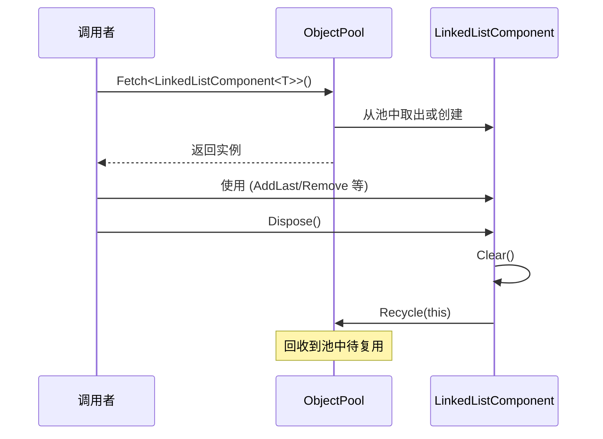

# LinkedListComponent.cs 注解文档

## 文件基本信息

| 属性 | 值 |
|------|-----|
| **文件名** | LinkedListComponent.cs |
| **路径** | Assets/Scripts/Mono/Core/Object/LinkedListComponent.cs |
| **所属模块** | 框架层 → Mono/Core/Object |
| **命名空间** | `TaoTie` |
| **文件职责** | 提供可对象池复用的 LinkedList 组件 |

---

## 类说明

### LinkedListComponent<T>

| 属性 | 说明 |
|------|------|
| **职责** | 继承自 `LinkedList<T>`，支持对象池创建与回收，实现 `IDisposable` 接口 |
| **泛型参数** | `T` - 链表元素类型 |
| **继承关系** | `LinkedList<T>` |
| **实现的接口** | `IDisposable` |

**设计模式**: 对象池模式

```csharp
// 对象池创建
var list = LinkedListComponent<int>.Create();

// 使用完毕后回收
list.Dispose();
```

---

## 字段与属性

| 名称 | 类型 | 访问级别 | 说明 |
|------|------|----------|------|
| (无额外字段) | - | - | 继承 `LinkedList<T>` 的所有功能 |

---

## 方法说明

### Create()

**签名**:
```csharp
public static LinkedListComponent<T> Create()
```

**职责**: 从对象池获取 `LinkedListComponent<T>` 实例

**核心逻辑**:
```
1. 从 ObjectPool 获取实例
2. 返回复用的 LinkedListComponent
```

**调用者**: 任何需要临时 LinkedList 的代码

**使用示例**:
```csharp
// 创建一个临时 LinkedList
var tempList = LinkedListComponent<string>.Create();
tempList.AddLast("item1");
tempList.AddLast("item2");

// 使用完毕后回收
tempList.Dispose();
```

---

### Dispose()

**签名**:
```csharp
public void Dispose()
```

**职责**: 清理链表并回收到对象池

**核心逻辑**:
```
1. 调用 Clear() 清空链表
2. 回收到 ObjectPool
```

**调用者**: 使用完 LinkedListComponent 的代码

**使用示例**:
```csharp
using (var list = LinkedListComponent<int>.Create())
{
    list.AddLast(1);
    list.AddLast(2);
    list.AddLast(3);
    // 使用...
} // 自动调用 Dispose()
```

---

## 核心流程

### 对象池复用流程



---

## 使用示例

### 示例 1: 基础使用

```csharp
// 创建链表
var list = LinkedListComponent<int>.Create();

// 添加元素
list.AddLast(1);
list.AddLast(2);
list.AddLast(3);

// 从头部添加
list.AddFirst(0);

// 访问元素
int first = list.First.Value;
int last = list.Last.Value;

// 遍历
foreach (var item in list)
{
    Log.Info(item.ToString());
}

// 回收
list.Dispose();
```

### 示例 2: using 语句自动回收

```csharp
using (var list = LinkedListComponent<string>.Create())
{
    list.AddLast("apple");
    list.AddLast("banana");
    list.AddLast("orange");
    // 自动回收，无需手动 Dispose
}
```

### 示例 3: 任务队列

```csharp
// 使用 LinkedList 作为任务队列
var taskQueue = LinkedListComponent<Action>.Create();
try
{
    // 添加任务
    taskQueue.AddLast(() => Log.Info("Task 1"));
    taskQueue.AddLast(() => Log.Info("Task 2"));
    taskQueue.AddLast(() => Log.Info("Task 3"));

    // 执行任务
    while (taskQueue.Count > 0)
    {
        var task = taskQueue.First.Value;
        taskQueue.RemoveFirst();
        task.Invoke();
    }
}
finally
{
    taskQueue.Dispose();
}
```

### 示例 4: TimerManager 中的使用

```csharp
// TimerManager 内部使用 LinkedListComponent 管理定时器
private LinkedListComponent<object> allManagers;
private LinkedListComponent<IUpdate> updateManagers;
private LinkedListComponent<ILateUpdate> lateUpdateManagers;
private LinkedListComponent<IFixedUpdate> fixedUpdateManagers;

// 添加 Manager
updateManagers.AddLast(manager);

// 遍历执行
foreach (var manager in updateManagers)
{
    manager.Update();
}
```

---

## LinkedList vs List

| 特性 | LinkedList | List |
|------|-----------|------|
| **头部插入/删除** | O(1) | O(n) |
| **中间插入/删除** | O(1)（有节点引用） | O(n) |
| **尾部插入/删除** | O(1) | O(1) |
| **随机访问** | O(n) | O(1) |
| **内存开销** | 高（每个节点有前后引用） | 低 |
| **适用场景** | 频繁插入/删除 | 随机访问 |

---

## 相关文档

- [ObjectPool.cs.md](../ObjectPool.cs.md) - 对象池核心
- [ListComponent.cs.md](./ListComponent.cs.md) - List 组件
- [HashSetComponent.cs.md](./HashSetComponent.cs.md) - HashSet 组件
- [DictionaryComponent.cs.md](./DictionaryComponent.cs.md) - Dictionary 组件
- [ManagerProvider.cs.md](../Manager/ManagerProvider.cs.md) - 使用 LinkedListComponent 的管理器

---

*文档生成时间：2026-03-02 | OpenClaw AI 助手*
