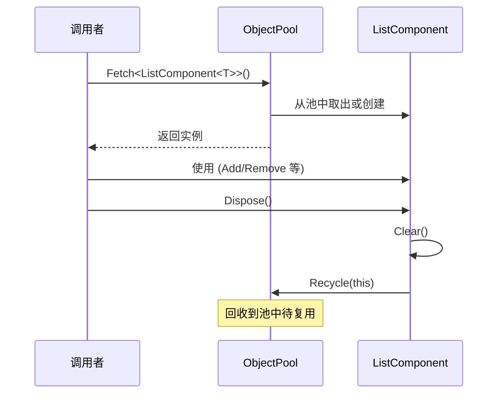

# ListComponent.cs 注解文档

## 文件基本信息

| 属性 | 值 |
|------|-----|
| **文件名** | ListComponent.cs |
| **路径** | Assets/Scripts/Mono/Core/Object/ListComponent.cs |
| **所属模块** | 框架层 → Mono/Core/Object |
| **命名空间** | `TaoTie` |
| **文件职责** | 提供可对象池复用的 List 组件 |

---

## 类说明

### ListComponent<T>

| 属性 | 说明 |
|------|------|
| **职责** | 继承自 `List<T>`，支持对象池创建与回收，实现 `IDisposable` 接口 |
| **泛型参数** | `T` - 列表元素类型 |
| **继承关系** | `List<T>` |
| **实现的接口** | `IDisposable` |

**设计模式**: 对象池模式

```csharp
// 对象池创建
var list = ListComponent<int>.Create();

// 使用完毕后回收
list.Dispose();
```

---

## 字段与属性

| 名称 | 类型 | 访问级别 | 说明 |
|------|------|----------|------|
| (无额外字段) | - | - | 继承 `List<T>` 的所有功能 |

---

## 方法说明

### Create()

**签名**:
```csharp
public static ListComponent<T> Create()
```

**职责**: 从对象池获取 `ListComponent<T>` 实例

**核心逻辑**:
```
1. 从 ObjectPool 获取实例
2. 返回复用的 ListComponent
```

**调用者**: 任何需要临时 List 的代码

**使用示例**:
```csharp
// 创建一个临时 List
var tempList = ListComponent<string>.Create();
tempList.Add("item1");
tempList.Add("item2");

// 使用完毕后回收
tempList.Dispose();
```

---

### Dispose()

**签名**:
```csharp
public void Dispose()
```

**职责**: 清理列表并回收到对象池

**核心逻辑**:
```
1. 调用 Clear() 清空列表
2. 回收到 ObjectPool
```

**调用者**: 使用完 ListComponent 的代码

**使用示例**:
```csharp
using (var list = ListComponent<int>.Create())
{
    list.Add(1);
    list.Add(2);
    list.Add(3);
    // 使用...
} // 自动调用 Dispose()
```

---

## 核心流程

### 对象池复用流程



---

## 使用示例

### 示例 1: 基础使用

```csharp
// 创建列表
var list = ListComponent<int>.Create();

// 添加元素
list.Add(1);
list.Add(2);
list.Add(3);

// 访问元素
int first = list[0];

// 遍历
foreach (var item in list)
{
    Log.Info(item.ToString());
}

// 回收
list.Dispose();
```

### 示例 2: using 语句自动回收

```csharp
using (var list = ListComponent<string>.Create())
{
    list.Add("apple");
    list.Add("banana");
    list.Add("orange");
    // 自动回收，无需手动 Dispose
}
```

### 示例 3: 临时集合操作

```csharp
// 在方法中使用临时列表
void ProcessData()
{
    var tempList = ListComponent<Entity>.Create();
    try
    {
        // 收集实体
        foreach (var entity in entityManager.GetAll())
        {
            if (entity.IsActive)
            {
                tempList.Add(entity);
            }
        }
        // 处理...
    }
    finally
    {
        tempList.Dispose();
    }
}
```

### 示例 4: 与 MultiMap 配合使用

```csharp
// MultiMap 内部使用 ListComponent
var multiMap = new MultiMap<string, int>();
multiMap.Add("category", 1);
multiMap.Add("category", 2);

// 获取列表（内部使用 ListComponent）
List<int> values = multiMap["category"];
```

---

## 性能优势

### 与传统 List 对比

| 场景 | 传统 `new List<T>()` | `ListComponent<T>.Create()` |
|------|---------------------|----------------------------|
| **创建开销** | 每次分配新内存 | 从对象池复用 |
| **GC 压力** | 高（频繁分配） | 低（复用） |
| **适用场景** | 长期持有的列表 | 临时使用的列表 |
| **内存占用** | 持续增长 | 稳定（池大小固定） |

### GC 优化效果

```csharp
// ❌ 传统方式（每帧产生 GC）
void Update()
{
    var tempList = new List<Entity>();
    // ... 使用
} // 每帧 GC 分配

// ✅ 对象池方式（无 GC）
void Update()
{
    using (var tempList = ListComponent<Entity>.Create())
    {
        // ... 使用
    } // 回收到池中，无 GC
}
```

---

## 相关文档

- [ObjectPool.cs.md](../ObjectPool.cs.md) - 对象池核心
- [HashSetComponent.cs.md](./HashSetComponent.cs.md) - HashSet 组件
- [DictionaryComponent.cs.md](./DictionaryComponent.cs.md) - Dictionary 组件
- [LinkedListComponent.cs.md](./LinkedListComponent.cs.md) - LinkedList 组件
- [MultiMap.cs.md](./MultiMap.cs.md) - 使用 ListComponent 的多重映射

---

*文档生成时间：2026-03-02 | OpenClaw AI 助手*
