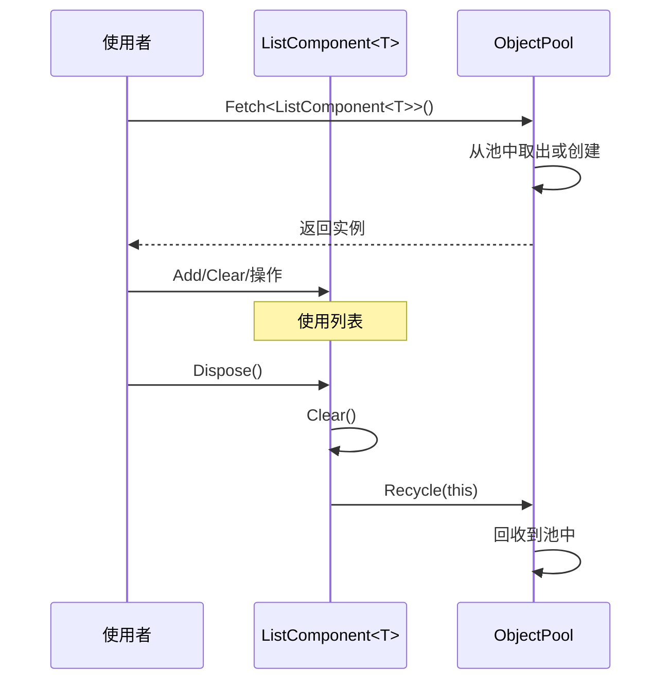

# ListComponent.cs 注解文档

## 文件基本信息

| 属性 | 值 |
|------|------|
| **文件名** | ListComponent.cs |
| **路径** | Assets/Scripts/Mono/Core/Object/ListComponent.cs |
| **所属模块** | 框架层 → Mono/Core/Object |
| **文件职责** | 提供可对象池复用的 List 组件，减少 GC 压力 |

---

## 类/结构体说明

### ListComponent<T>

| 属性 | 说明 |
|------|------|
| **职责** | 继承自 `List<T>`，支持对象池复用，自动清理和回收 |
| **泛型参数** | `T` - 列表元素类型 |
| **继承关系** | 继承 `List<T>`，实现 `IDisposable` |
| **实现的接口** | `IDisposable` |

**设计模式**: 对象池模式 + 工厂模式

```csharp
// 创建列表
using (var list = ListComponent<int>.Create())
{
    list.Add(1);
    list.Add(2);
    list.Add(3);
    
    // 使用列表
    foreach (var item in list)
    {
        Debug.Log(item);
    }
    
    // using 结束时自动 Clear 并回收到对象池
}
```

---

## 方法说明

### Create

**签名**:
```csharp
public static ListComponent<T> Create()
```

**职责**: 从对象池获取 ListComponent 实例

**核心逻辑**:
```
1. 调用 ObjectPool.Instance.Fetch<ListComponent<T>>()
2. 返回复用的实例
```

**调用者**: 任何需要临时列表的代码

**使用示例**:
```csharp
var list = ListComponent<int>.Create();
list.Add(1);
list.Add(2);
// ... 使用
list.Dispose();  // 手动回收
```

---

### Dispose

**签名**:
```csharp
public void Dispose()
```

**职责**: 清理列表并回收到对象池

**核心逻辑**:
```
1. 调用 Clear() 清空列表
2. 调用 ObjectPool.Instance.Recycle(this) 回收到对象池
```

**调用者**: using 语句块结束、手动调用

**使用示例**:
```csharp
// 方式 1: using 语句（推荐）
using (var list = ListComponent<int>.Create())
{
    // 使用列表
}  // 自动调用 Dispose()

// 方式 2: 手动调用
var list = ListComponent<int>.Create();
// ... 使用
list.Dispose();
```

---

## 继承自 List<T> 的方法

ListComponent<T> 继承 `List<T>` 的所有方法：

| 方法 | 说明 |
|------|------|
| `Add(T item)` | 添加元素 |
| `Remove(T item)` | 移除元素 |
| `Clear()` | 清空列表 |
| `Contains(T item)` | 检查是否包含 |
| `IndexOf(T item)` | 获取索引 |
| `Insert(int index, T item)` | 插入元素 |
| `RemoveAt(int index)` | 移除指定索引元素 |
| `ForEach(Action<T> action)` | 遍历执行 |
| `Find(Predicate<T> match)` | 查找元素 |
| `FindAll(Predicate<T> match)` | 查找所有匹配 |
| `Sort()` | 排序 |
| `Reverse()` | 反转 |
| `Count` | 元素数量 |
| `Capacity` | 容量 |
| `this[int index]` | 索引器 |

---

## 对象池复用流程



---

## 使用示例

### 示例 1: 临时列表收集

```csharp
// 收集所有敌人
using (var enemies = ListComponent<Enemy>.Create())
{
    foreach (var entity in allEntities)
    {
        if (entity.IsEnemy)
        {
            enemies.Add(entity);
        }
    }
    
    // 处理敌人
    foreach (var enemy in enemies)
    {
        enemy.TakeDamage(10);
    }
}  // 自动清理并回收
```

### 示例 2: 异步操作中的临时列表

```csharp
public async ETTask ProcessEntities()
{
    using (var targets = ListComponent<Entity>.Create())
    {
        // 收集目标
        CollectTargets(targets);
        
        // 异步处理
        foreach (var target in targets)
        {
            await ProcessOne(target);
        }
    }  // 自动清理
}
```

### 示例 3: 递归操作

```csharp
private void TraverseNode(Node node, ListComponent<Node> output)
{
    output.Add(node);
    
    foreach (var child in node.Children)
    {
        TraverseNode(child, output);
    }
}

// 使用
using (var nodes = ListComponent<Node>.Create())
{
    TraverseNode(root, nodes);
    Debug.Log($"总共 {nodes.Count} 个节点");
}
```

### 示例 4: 替代 LINQ 减少 GC

```csharp
// ❌ 会产生 GC
var result = entities.Where(e => e.IsAlive).ToList();

// ✅ 使用 ListComponent 减少 GC
using (var aliveList = ListComponent<Entity>.Create())
{
    foreach (var entity in entities)
    {
        if (entity.IsAlive)
        {
            aliveList.Add(entity);
        }
    }
    
    // 使用 aliveList
}
```

---

## 性能优势

### GC 对比

| 方式 | GC 分配 | 性能 |
|------|--------|------|
| `new List<T>()` | 每次分配 | ⚠️ 高 GC |
| `ListComponent<T>.Create()` | 首次分配 | ✅ 零 GC |

### 对象池复用

```csharp
// 循环中创建列表
for (int i = 0; i < 1000; i++)
{
    // ❌ 每次创建新对象，GC 压力大
    var list1 = new List<int>();
    
    // ✅ 复用对象池，几乎无 GC
    using (var list2 = ListComponent<int>.Create())
    {
        // 使用
    }
}
```

---

## 设计要点

### 为什么需要 ListComponent？

1. **减少 GC**: 频繁创建/销毁 List 会产生大量垃圾
2. **性能优化**: 对象池复用避免频繁内存分配
3. **自动清理**: Dispose 时自动 Clear，避免内存泄漏
4. **类型安全**: 泛型支持，编译时检查

### 为什么实现 IDisposable？

```csharp
public void Dispose()
{
    this.Clear();
    ObjectPool.Instance.Recycle(this);
}
```

**意义**:
- 支持 using 语法糖
- 确保资源正确释放
- 强制清理列表内容

### 为什么继承 List<T>？

**优势**:
- 完整保留 List 的所有功能
- 无需重新实现方法
- 与现有代码完全兼容
- 可以直接传递给需要 `List<T>` 的方法

---

## 注意事项

### 1. 必须调用 Dispose

```csharp
// ❌ 错误：忘记 Dispose
var list = ListComponent<int>.Create();
// 使用...
// 列表没有回收，造成对象池泄漏

// ✅ 正确：使用 using
using (var list = ListComponent<int>.Create())
{
    // 使用...
}  // 自动 Dispose
```

### 2. 不要保留引用

```csharp
// ❌ 错误：保留对象池中的列表引用
ListComponent<int> cachedList;

void Wrong()
{
    cachedList = ListComponent<int>.Create();
    cachedList.Add(1);
    cachedList.Dispose();  // 回收到池中
    
    // 后续使用会出错，因为列表已被回收
    cachedList.Add(2);  // ⚠️ 可能影响其他使用者
}

// ✅ 正确：用后即弃
using (var list = ListComponent<int>.Create())
{
    list.Add(1);
    // 使用...
}  // 不再使用
```

### 3. Clear 在回收前自动调用

```csharp
// Dispose 内部会调用 Clear()
// 所以不需要手动 Clear

using (var list = ListComponent<int>.Create())
{
    list.Add(1);
    list.Add(2);
    // 不需要 list.Clear()
}  // Dispose 会自动 Clear
```

---

## 相关文档

- [ObjectPool.cs.md](./ObjectPool.cs.md) - 对象池实现
- [IDisposable 文档](https://docs.microsoft.com/en-us/dotnet/api/system.idisposable)

---

*文档生成时间：2026-02-28 | OpenClaw AI 助手*
