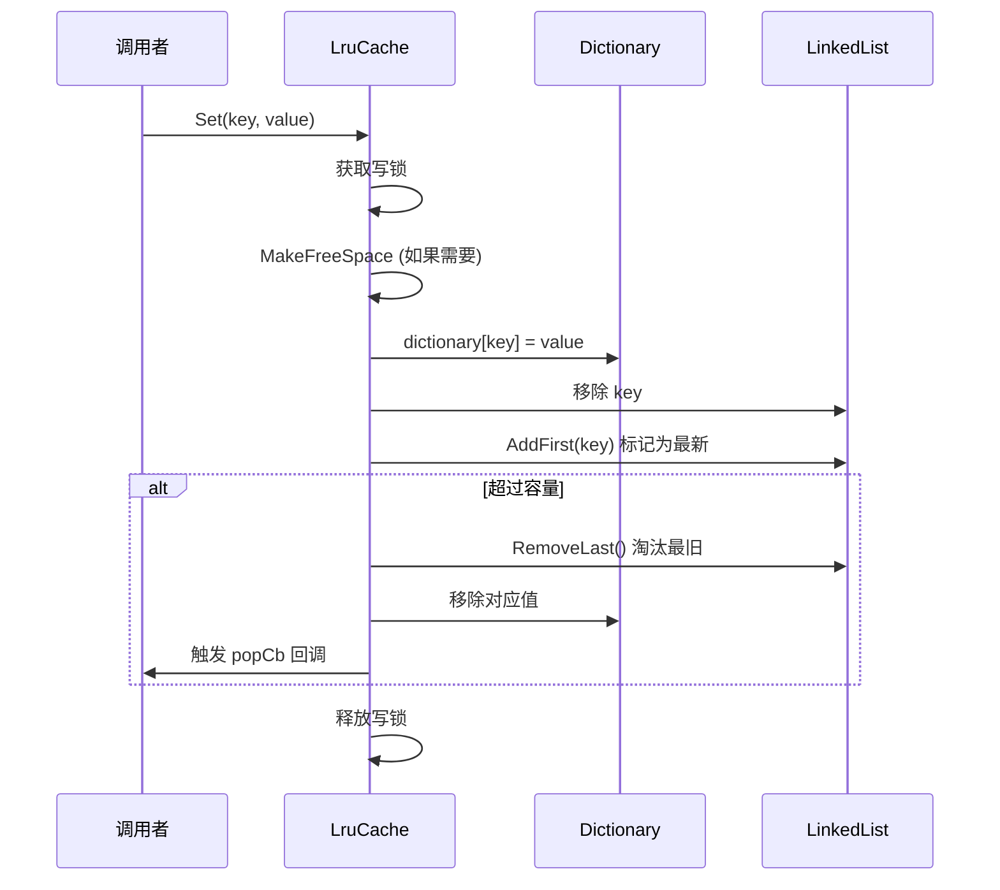
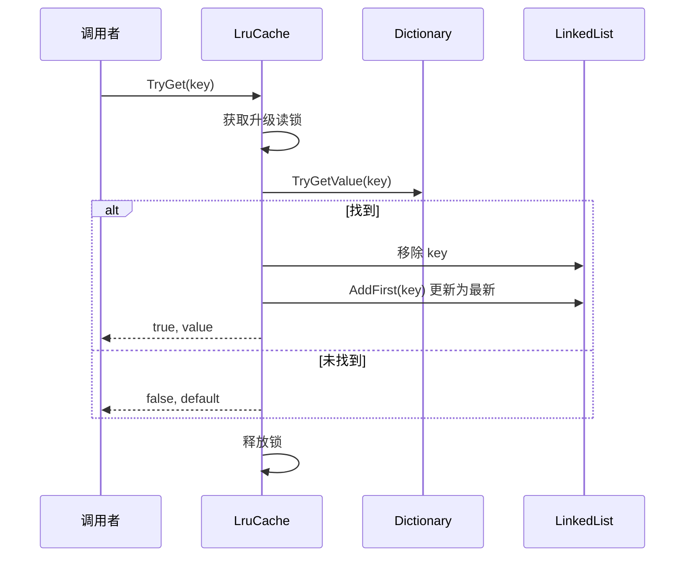

# LruCache.cs 注解文档

## 文件基本信息

| 属性 | 值 |
|------|-----|
| **文件名** | LruCache.cs |
| **路径** | Assets/Scripts/Mono/Core/Object/LruCache.cs |
| **所属模块** | 框架层 → Mono/Core/Object |
| **命名空间** | `TaoTie` |
| **文件职责** | 提供线程安全的 LRU（最近最少使用）缓存实现 |

---

## 类说明

### LruCache<TKey, TValue>

| 属性 | 说明 |
|------|------|
| **职责** | 实现 LRU 缓存算法，支持容量限制、线程安全、自定义淘汰策略 |
| **泛型参数** | `TKey` - 键类型<br>`TValue` - 值类型 |
| **继承关系** | 无继承 |
| **实现的接口** | `IEnumerable<KeyValuePair<TKey, TValue>>` |

**设计模式**: LRU 缓存 + 读写锁 + 对象池（可选）

```csharp
// 创建缓存（容量 255）
var cache = new LruCache<string, GameObject>(100);

// 添加数据
cache.Set("prefab1", gameObject1);

// 获取数据
GameObject go = cache["prefab1"];

// 设置淘汰回调
cache.SetPopCallback((key, value) => {
    // 缓存淘汰时的清理逻辑
});
```

---

## 字段与属性

| 名称 | 类型 | 访问级别 | 说明 |
|------|------|----------|------|
| `DEFAULT_CAPACITY` | `int` | `const` | 默认容量 255 |
| `capacity` | `int` | `private` | 当前容量限制 |
| `locker` | `ReaderWriterLockSlim` | `private` | 读写锁 |
| `dictionary` | `Dictionary<TKey, TValue>` | `private` | 数据存储 |
| `linkedList` | `LinkedList<TKey>` | `private` | LRU 顺序（头部=最新） |
| `checkCanPopFunc` | `Func<TKey, TValue, bool>` | `private` | 检查是否可淘汰回调 |
| `popCb` | `Action<TKey, TValue>` | `private` | 淘汰回调 |
| `this[TKey t]` | `TValue` | `public` | 索引器（获取/设置） |
| `Count` | `int` | `public` | 当前缓存数量 |
| `Capacity` | `int` | `public` | 容量限制（可调整） |
| `Keys` | `ICollection<TKey>` | `public` | 所有键 |
| `Values` | `ICollection<TValue>` | `public` | 所有值 |

---

## 方法说明

### 构造函数

**签名**:
```csharp
public LruCache()                    // 默认容量 255
public LruCache(int capacity)        // 自定义容量
```

**职责**: 创建 LRU 缓存实例

**核心逻辑**:
```
1. 初始化读写锁
2. 创建 Dictionary 和 LinkedList
3. 设置容量
```

**使用示例**:
```csharp
var cache1 = new LruCache<string, int>();           // 容量 255
var cache2 = new LruCache<string, int>(100);        // 容量 100
```

---

### Set(TKey key, TValue value)

**签名**:
```csharp
public void Set(TKey key, TValue value)
```

**职责**: 添加或更新缓存项

**核心逻辑**:
```
1. 获取写锁
2. 如果需要，腾出空间（MakeFreeSpace）
3. 设置值到 Dictionary
4. 将键移到 LinkedList 头部（标记为最新）
5. 如果超过容量，淘汰尾部（最旧）项
6. 释放写锁
```

**调用者**: 任何需要缓存数据的代码

**使用示例**:
```csharp
cache.Set("key1", value1);
cache.Set("key2", value2);
```

---

### TryGet(TKey key, out TValue value)

**签名**:
```csharp
public bool TryGet(TKey key, out TValue value)
```

**职责**: 获取缓存项（同时更新 LRU 顺序）

**核心逻辑**:
```
1. 获取升级读锁
2. 从 Dictionary 查找
3. 如果找到，将键移到 LinkedList 头部（标记为最新）
4. 释放锁
5. 返回是否找到
```

**返回值**: `true` - 找到；`false` - 未找到

**使用示例**:
```csharp
if (cache.TryGet("key1", out var value))
{
    Log.Info($"找到：{value}");
}
```

---

### TryOnlyGet(TKey key, out TValue value)

**签名**:
```csharp
public bool TryOnlyGet(TKey key, out TValue value)
```

**职责**: 仅获取值，不更新 LRU 顺序

**核心逻辑**:
```
1. 从 Dictionary 查找（无锁）
2. 返回是否找到
```

**注意**: 不调用此方法，因为会影响 LRU 顺序

---

### Remove(TKey key)

**签名**:
```csharp
public void Remove(TKey key)
```

**职责**: 移除缓存项

**核心逻辑**:
```
1. 获取写锁
2. 从 Dictionary 和 LinkedList 移除
3. 释放写锁
```

**使用示例**:
```csharp
cache.Remove("key1");
```

---

### ContainsKey(TKey key)

**签名**:
```csharp
public bool ContainsKey(TKey key)
```

**职责**: 检查是否包含键

**核心逻辑**:
```
1. 获取读锁
2. 检查 Dictionary
3. 释放读锁
```

---

### SetCheckCanPopCallback(Func<TKey, TValue, bool> func)

**签名**:
```csharp
public void SetCheckCanPopCallback(Func<TKey, TValue, bool> func)
```

**职责**: 设置检查是否可淘汰的回调

**参数**: 
- `func` - 返回 true 表示可以淘汰

**使用示例**:
```csharp
cache.SetCheckCanPopCallback((key, value) =>
{
    // 检查是否正在使用
    return !value.IsInUse;
});
```

---

### SetPopCallback(Action<TKey, TValue> func)

**签名**:
```csharp
public void SetPopCallback(Action<TKey, TValue> func)
```

**职责**: 设置淘汰回调

**参数**: 
- `func` - 淘汰时调用的清理函数

**使用示例**:
```csharp
cache.SetPopCallback((key, value) =>
{
    // 清理资源
    value.Dispose();
    Log.Info($"淘汰：{key}");
});
```

---

### CleanUp()

**签名**:
```csharp
public void CleanUp()
```

**职责**: 清理所有可淘汰的项

**核心逻辑**:
```
1. 从尾部开始遍历 LinkedList
2. 检查每个项是否可淘汰
3. 淘汰可淘汰的项
```

**使用示例**:
```csharp
cache.CleanUp(); // 手动清理
```

---

### Clear()

**签名**:
```csharp
public void Clear()
```

**职责**: 清空所有缓存

**核心逻辑**:
```
1. 清空 Dictionary
2. 清空 LinkedList
```

---

### GetAll()

**签名**:
```csharp
public Dictionary<TKey, TValue> GetAll()
```

**职责**: 获取所有缓存数据

**核心逻辑**:
```
1. 返回 dictionary 引用
```

**注意**: 返回的是内部字典引用，外部修改会影响缓存

---

## 核心流程

### LRU 缓存流程



### 获取缓存流程



---

## 使用示例

### 示例 1: 基础使用

```csharp
// 创建缓存
var cache = new LruCache<string, GameObject>(50);

// 添加数据
cache.Set("prefab1", prefab1);
cache.Set("prefab2", prefab2);

// 获取数据
if (cache.TryGet("prefab1", out var go))
{
    // 使用 GameObject
}

// 检查包含
if (cache.ContainsKey("prefab1"))
{
    Log.Info("缓存中存在");
}

// 移除
cache.Remove("prefab1");

// 清空
cache.Clear();
```

### 示例 2: 资源缓存（带淘汰回调）

```csharp
// 创建资源缓存
var resourceCache = new LruCache<string, Texture2D>(100);

// 设置淘汰回调
resourceCache.SetPopCallback((key, texture) =>
{
    // 销毁资源
    UnityEngine.Object.Destroy(texture);
    Log.Info($"淘汰纹理：{key}");
});

// 加载资源
Texture2D LoadTexture(string path)
{
    // 先查缓存
    if (resourceCache.TryGet(path, out var texture))
    {
        return texture;
    }

    // 加载新资源
    texture = Resources.Load<Texture2D>(path);
    
    // 加入缓存
    resourceCache.Set(path, texture);
    
    return texture;
}
```

### 示例 3: 自定义淘汰策略

```csharp
// 创建缓存
var cache = new LruCache<string, DataItem>(50);

// 设置检查回调（只淘汰未使用的项）
cache.SetCheckCanPopCallback((key, item) =>
{
    return !item.IsInUse; // 只淘汰未使用的
});

// 设置淘汰回调
cache.SetPopCallback((key, item) =>
{
    item.Cleanup();
});

// 手动清理
cache.CleanUp();
```

### 示例 4: 数据缓存（带容量调整）

```csharp
var cache = new LruCache<string, string>(100);

// 根据内存情况调整容量
void AdjustCapacity()
{
    if (SystemInfo.memorySize < 2048)
    {
        cache.Capacity = 50; // 低内存设备
    }
    else
    {
        cache.Capacity = 200; // 高内存设备
    }
}

// 遍历缓存
foreach (var kvp in cache)
{
    Log.Info($"{kvp.Key}: {kvp.Value}");
}
```

---

## 线程安全

### 读写锁机制

```csharp
// 读操作（共享锁）
locker.EnterReadLock();
try { ... }
finally { locker.ExitReadLock(); }

// 写操作（独占锁）
locker.EnterWriteLock();
try { ... }
finally { locker.ExitWriteLock(); }

// 升级读锁（读→写）
locker.EnterUpgradeableReadLock();
try
{
    // 读操作
    locker.EnterWriteLock();
    try { ... }
    finally { locker.ExitWriteLock(); }
}
finally { locker.ExitUpgradeableReadLock(); }
```

---

## 性能特性

### 时间复杂度

| 操作 | 时间复杂度 | 说明 |
|------|-----------|------|
| **Set** | O(1) | Dictionary + LinkedList 操作 |
| **Get** | O(1) | Dictionary 查找 |
| **Remove** | O(1) | Dictionary + LinkedList 操作 |
| **Contains** | O(1) | Dictionary 查找 |

### 空间复杂度

- **O(n)** - n 为缓存容量
- Dictionary + LinkedList 各存储 n 个元素

---

## 相关文档

- [ObjectPool.cs.md](../ObjectPool.cs.md) - 对象池（可与 LruCache 配合使用）
- [ResourcesManager.cs.md](../../../Code/Module/Resource/ResourcesManager.cs.md) - 资源管理器（可能使用 LruCache）
- [GameObjectPoolManager.cs.md](../../../Code/Module/Resource/GameObjectPoolManager.cs.md) - 对象池管理器

---

*文档生成时间：2026-03-02 | OpenClaw AI 助手*
