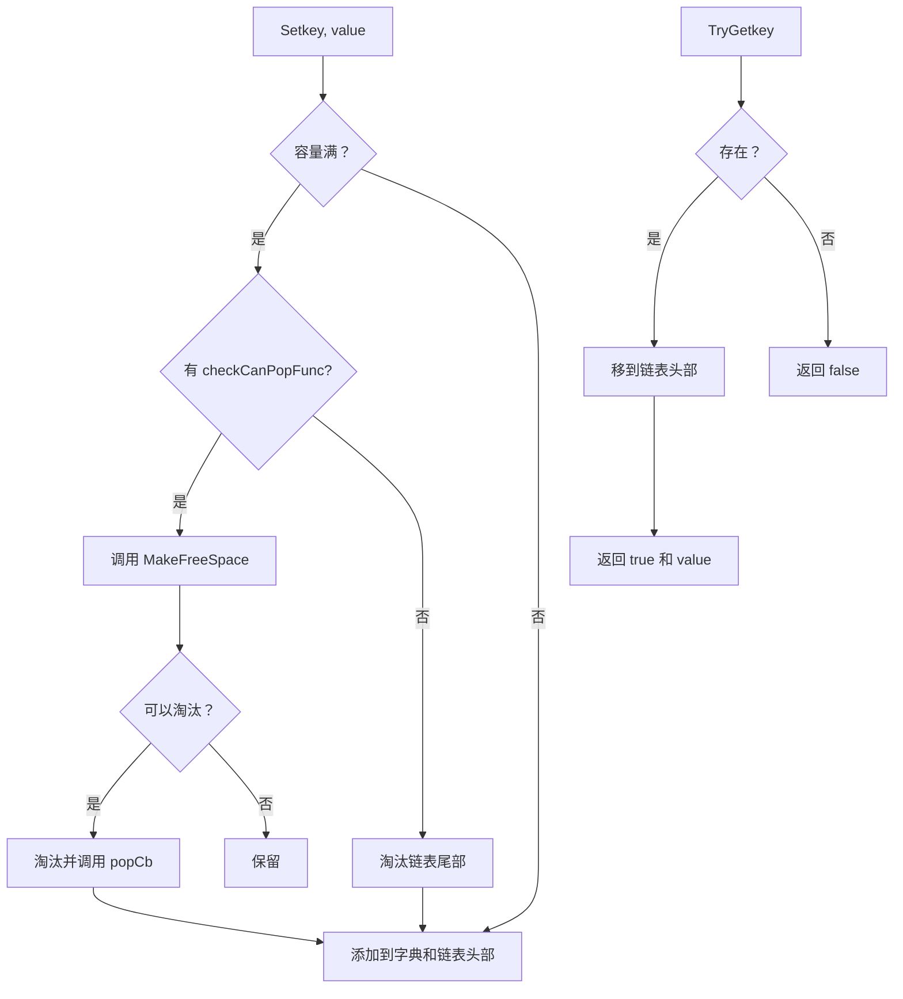
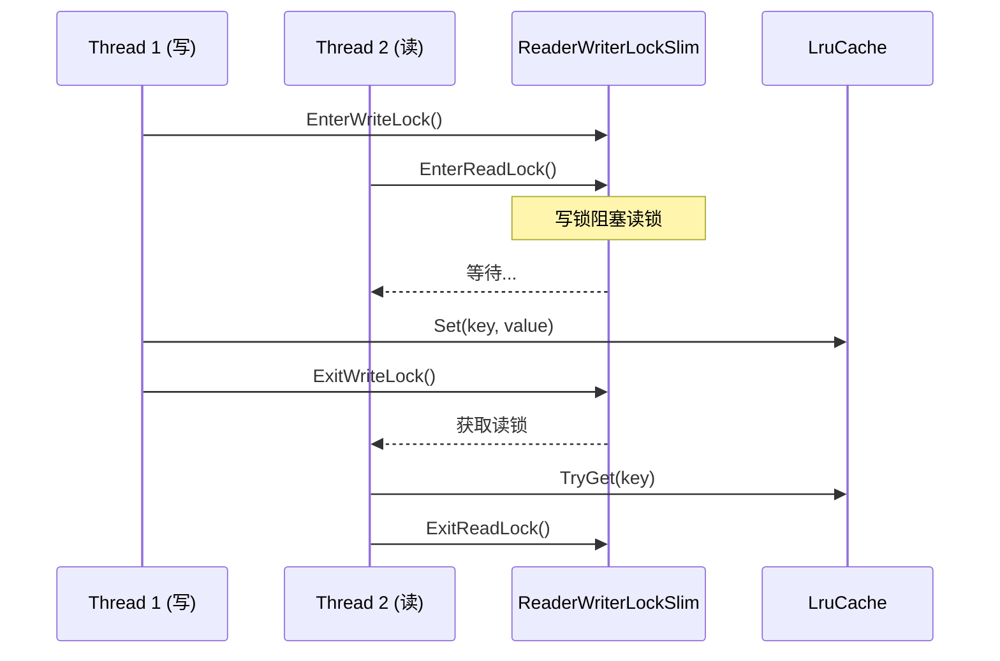

# LruCache.cs 注解文档

## 文件基本信息

| 属性 | 值 |
|------|-----|
| **文件名** | LruCache.cs |
| **路径** | Assets/Scripts/Mono/Core/Object/LruCache.cs |
| **所属模块** | Mono/Core/Object |
| **文件职责** | LRU（最近最少使用）缓存实现，支持线程安全和自动淘汰 |

---

## 类/结构体说明

### LruCache<TKey, TValue>

| 属性 | 说明 |
|------|------|
| **职责** | 线程安全的 LRU 缓存，支持容量限制、自动淘汰、回调通知 |
| **泛型参数** | `TKey` - 键类型, `TValue` - 值类型 |
| **继承关系** | 无 |
| **实现的接口** | `IEnumerable<KeyValuePair<TKey, TValue>>` |

**设计模式**: LRU 淘汰策略 + 读写锁 + 双向链表

```csharp
// 创建缓存（默认容量 255）
var cache = new LruCache<string, int>();

// 创建缓存（自定义容量）
var cache = new LruCache<string, int>(capacity: 100);

// 设置值
cache["key1"] = 100;
cache.Set("key2", 200);

// 获取值（会更新访问顺序）
if (cache.TryGet("key1", out var value))
{
    Log.Info($"Value: {value}");
}
```

---

## 字段与属性

| 名称 | 类型 | 访问级别 | 说明 |
|------|------|----------|------|
| `capacity` | `int` | `private` | 缓存容量上限 |
| `locker` | `ReaderWriterLockSlim` | `private` | 读写锁，支持并发 |
| `dictionary` | `Dictionary<TKey, TValue>` | `private` | 数据存储 |
| `linkedList` | `LinkedList<TKey>` | `private` | 访问顺序追踪（LRU） |
| `checkCanPopFunc` | `Func<TKey, TValue, bool>` | `private` | 检查是否可以淘汰的回调 |
| `popCb` | `Action<TKey, TValue>` | `private` | 淘汰时的回调 |

---

## 方法说明（按重要程度排序）

### Set ⭐

**签名**:
```csharp
public void Set(TKey key, TValue value)
```

**职责**: 设置缓存值，自动管理容量和访问顺序

**核心逻辑**:
```
1. 获取写锁
2. 如果设置了 checkCanPopFunc，调用 MakeFreeSpace() 清理空间
3. 更新 dictionary[key] = value
4. 将 key 移到链表头部（最新访问）
5. 如果超过容量且未设置 checkCanPopFunc:
   - 移除链表尾部（最久未使用）
   - 从 dictionary 删除
6. 释放写锁
```

**使用示例**:
```csharp
var cache = new LruCache<string, int>(capacity: 10);

// 设置值
cache.Set("key1", 100);
cache["key2"] = 200; // 使用索引器

// 当容量满时，最久未使用的键会自动淘汰
```

---

### TryGet ⭐

**签名**:
```csharp
public bool TryGet(TKey key, out TValue value)
```

**职责**: 获取缓存值，同时更新访问顺序（移到链表头部）

**核心逻辑**:
```
1. 获取升级读锁（可升级为写锁）
2. 从 dictionary 查找
3. 如果找到:
   - 获取写锁
   - 将 key 从链表移除并重新添加到头部
   - 释放写锁
4. 释放升级读锁
5. 返回值
```

**使用示例**:
```csharp
if (cache.TryGet("key1", out var value))
{
    Log.Info($"Found: {value}");
}
else
{
    Log.Info("Not found");
}
```

---

### TryOnlyGet

**签名**:
```csharp
public bool TryOnlyGet(TKey key, out TValue value)
```

**职责**: 仅获取值，**不更新访问顺序**

**核心逻辑**:
```
1. 从 dictionary 查找（无锁）
2. 返回值
```

**使用场景**: 仅检查值但不希望影响 LRU 顺序

**使用示例**:
```csharp
// 仅检查，不影响 LRU 顺序
if (cache.TryOnlyGet("key1", out var value))
{
    Log.Info($"Peek: {value}");
}
```

---

### Remove

**签名**:
```csharp
public void Remove(TKey key)
```

**职责**: 从缓存移除键

**核心逻辑**:
```
1. 获取写锁
2. 从 dictionary 和 linkedList 同时移除
3. 释放写锁
```

---

### ContainsKey

**签名**:
```csharp
public bool ContainsKey(TKey key)
```

**职责**: 检查键是否存在

**核心逻辑**:
```
1. 获取读锁
2. 调用 dictionary.ContainsKey
3. 释放读锁
```

---

### SetCheckCanPopCallback

**签名**:
```csharp
public void SetCheckCanPopCallback(Func<TKey, TValue, bool> func)
```

**职责**: 设置淘汰前检查回调

**参数说明**:
- `func`: 返回 `true` 表示可以淘汰，`false` 表示保留

**使用示例**:
```csharp
// 只淘汰值小于 100 的项
cache.SetCheckCanPopCallback((key, value) => value < 100);

// 只淘汰特定类型的项
cache.SetCheckCanPopCallback((key, value) => 
{
    return key.StartsWith("temp_");
});
```

---

### SetPopCallback

**签名**:
```csharp
public void SetPopCallback(Action<TKey, TValue> func)
```

**职责**: 设置淘汰时的回调通知

**使用场景**: 淘汰前清理资源、保存数据等

**使用示例**:
```csharp
// 淘汰时记录日志
cache.SetPopCallback((key, value) => 
{
    Log.Info($"Evicted: {key} = {value}");
});

// 淘汰前保存数据
cache.SetPopCallback((key, value) => 
{
    SaveToDisk(key, value);
});
```

---

### CleanUp

**签名**:
```csharp
public void CleanUp()
```

**职责**: 清理所有可淘汰的项（根据 checkCanPopFunc）

**核心逻辑**:
```
1. 从链表尾部向前遍历
2. 对每个项调用 checkCanPopFunc
3. 如果返回 true，淘汰该项
4. 调用 popCb 回调
```

**使用示例**:
```csharp
// 设置检查回调
cache.SetCheckCanPopCallback((key, value) => value < 100);

// 清理所有可淘汰的项
cache.CleanUp();
```

---

### Clear

**签名**:
```csharp
public void Clear()
```

**职责**: 清空缓存

**核心逻辑**:
```
1. 调用 dictionary.Clear()
2. 调用 linkedList.Clear()
```

---

### 索引器

**签名**:
```csharp
public TValue this[TKey t] { get; set; }
```

**职责**: 通过索引器访问缓存

**使用示例**:
```csharp
// 设置
cache["key1"] = 100;

// 获取（不存在会抛异常）
var value = cache["key1"];

// 推荐：使用 TryGet 更安全
if (cache.TryGet("key1", out var value)) { }
```

---

## 流程图

### LRU 缓存工作原理



### 线程安全机制



---

## 与其他模块的交互

```mermaid
graph TB
    subgraph Cache["LruCache"]
        LC[LruCache]
    end
    
    subgraph Usage["使用场景"]
        Res[资源缓存]
        Data[数据缓存]
        Net[网络响应缓存]
    end
    
    subgraph System["系统组件"]
        RWLock[ReaderWriterLockSlim]
        Dict[Dictionary]
        LList[LinkedList]
    end
    
    LC --> RWLock
    LC --> Dict
    LC --> LList
    
    Res --> LC
    Data --> LC
    Net --> LC
    
    note right of LC "LruCache 提供线程安全<br/>的 LRU 缓存功能"
    
    style Cache fill:#e1f5ff
    style Usage fill:#fff4e1
    style System fill:#e8f5e9
```

---

## 学习重点与陷阱

### ✅ 学习重点

1. **LRU 策略**: 最近最少使用的项会被优先淘汰
2. **线程安全**: 使用 ReaderWriterLockSlim 支持并发读写
3. **双向链表**: 追踪访问顺序，头部=最新，尾部=最旧
4. **淘汰回调**: 可在淘汰前检查或收到淘汰通知
5. **容量管理**: 超过容量自动淘汰，无需手动清理

### ⚠️ 陷阱与注意事项

| 问题 | 说明 | 解决方案 |
|------|------|----------|
| **Get 改变顺序** | TryGet 会更新访问顺序 | 仅检查用 TryOnlyGet |
| **索引器抛异常** | 访问不存在的键会抛异常 | 使用 TryGet 或 ContainsKey |
| **回调阻塞** | checkCanPopFunc 阻塞会影响性能 | 回调保持轻量 |
| **容量过小** | 容量太小会导致频繁淘汰 | 根据实际场景设置 |
| **死锁风险** | 回调中访问缓存可能死锁 | 回调中不要访问缓存 |

---

## 最佳实践

### 资源缓存

```csharp
public class ResourceCache
{
    private LruCache<string, GameObject> prefabCache;
    
    public ResourceCache(int capacity = 100)
    {
        prefabCache = new LruCache<string, GameObject>(capacity);
        
        // 淘汰时销毁资源
        prefabCache.SetPopCallback((key, prefab) => 
        {
            UnityEngine.Object.Destroy(prefab);
            Log.Info($"Destroyed prefab: {key}");
        });
    }
    
    public async ETTask<GameObject> GetPrefab(string path)
    {
        // 先查缓存
        if (prefabCache.TryGet(path, out var prefab))
        {
            return prefab;
        }
        
        // 缓存未命中，加载资源
        prefab = await ResourcesManager.Instance.LoadAsync<GameObject>(path);
        
        // 存入缓存
        prefabCache.Set(path, prefab);
        
        return prefab;
    }
}
```

### 网络响应缓存

```csharp
public class ApiResponseCache
{
    private LruCache<string, ApiResponse> cache;
    
    public ApiResponseCache()
    {
        cache = new LruCache<string, ApiResponse>(capacity: 50);
        
        // 只缓存成功响应，且未过期的
        cache.SetCheckCanPopCallback((key, response) => 
        {
            return !response.IsSuccess || response.IsExpired;
        });
    }
    
    public async ETTask<ApiResponse> GetAsync(string url)
    {
        // 查缓存
        if (cache.TryGet(url, out var cached))
        {
            if (!cached.IsExpired)
            {
                return cached;
            }
        }
        
        // 请求网络
        var response = await HttpClient.GetAsync(url);
        
        // 缓存成功响应
        if (response.IsSuccess)
        {
            cache.Set(url, response);
        }
        
        return response;
    }
}

public class ApiResponse
{
    public bool IsSuccess { get; set; }
    public DateTime ExpireTime { get; set; }
    public bool IsExpired => DateTime.Now > ExpireTime;
}
```

### 数据缓存（带过期时间）

```csharp
public class DataCache<TKey, TValue>
{
    private class CacheItem
    {
        public TValue Value { get; set; }
        public DateTime ExpireTime { get; set; }
        public bool IsExpired => DateTime.Now > ExpireTime;
    }
    
    private LruCache<TKey, CacheItem> cache;
    
    public DataCache(int capacity, TimeSpan defaultExpire)
    {
        cache = new LruCache<TKey, CacheItem>(capacity);
        
        // 淘汰过期项
        cache.SetCheckCanPopCallback((key, item) => item.IsExpired);
        
        // 淘汰通知
        cache.SetPopCallback((key, item) => 
        {
            Log.Info($"Evicted: {key}, Expired: {item.IsExpired}");
        });
    }
    
    public void Set(TKey key, TValue value, TimeSpan? expire = null)
    {
        var item = new CacheItem
        {
            Value = value,
            ExpireTime = DateTime.Now + (expire ?? TimeSpan.FromMinutes(5))
        };
        cache.Set(key, item);
    }
    
    public bool TryGet(TKey key, out TValue value)
    {
        if (cache.TryGet(key, out var item))
        {
            if (!item.IsExpired)
            {
                value = item.Value;
                return true;
            }
        }
        value = default;
        return false;
    }
}

// 使用
var cache = new DataCache<string, string>(100, TimeSpan.FromMinutes(10));
cache.Set("key", "value", TimeSpan.FromMinutes(5));

if (cache.TryGet("key", out var value))
{
    Log.Info($"Got: {value}");
}
```

---

## 完整示例：图片缓存系统

```csharp
public class ImageCache
{
    private LruCache<string, Texture2D> textureCache;
    private int maxMemoryMB = 100;
    private int currentMemoryMB = 0;
    
    public ImageCache(int capacity = 50)
    {
        textureCache = new LruCache<string, Texture2D>(capacity);
        
        // 检查是否可以淘汰（基于内存）
        textureCache.SetCheckCanPopCallback((path, texture) => 
        {
            // 如果内存超限，可以淘汰
            return currentMemoryMB > maxMemoryMB;
        });
        
        // 淘汰时释放内存
        textureCache.SetPopCallback((path, texture) => 
        {
            if (texture != null)
            {
                int mem = texture.width * texture.height * 4 / 1024 / 1024;
                currentMemoryMB -= mem;
                UnityEngine.Object.Destroy(texture);
                Log.Info($"Freed texture: {path}, {mem}MB");
            }
        });
    }
    
    public async ETTask<Texture2D> LoadTexture(string path)
    {
        // 查缓存
        if (textureCache.TryGet(path, out var texture))
        {
            Log.Info($"Cache hit: {path}");
            return texture;
        }
        
        // 加载图片
        Log.Info($"Loading: {path}");
        texture = await ResourcesManager.Instance.LoadAsync<Texture2D>(path);
        
        if (texture != null)
        {
            // 计算内存
            int mem = texture.width * texture.height * 4 / 1024 / 1024;
            currentMemoryMB += mem;
            
            // 存入缓存
            textureCache.Set(path, texture);
            
            Log.Info($"Loaded: {path}, {mem}MB, Total: {currentMemoryMB}MB");
        }
        
        return texture;
    }
    
    public void Preload(List<string> paths)
    {
        foreach (var path in paths)
        {
            LoadTexture(path).Coroutine();
        }
    }
    
    public void Clear()
    {
        textureCache.Clear();
        currentMemoryMB = 0;
    }
}

// 使用示例
public class Game : MonoBehaviour
{
    private ImageCache imageCache;
    
    void Start()
    {
        imageCache = new ImageCache(capacity: 100);
        
        // 预加载
        var levelImages = new List<string> 
        { 
            "Textures/Level1/bg", 
            "Textures/Level1/hero" 
        };
        imageCache.Preload(levelImages);
    }
    
    async void OnClickLoadImage()
    {
        var texture = await imageCache.LoadTexture("Textures/Level1/bg");
        // 使用 texture...
    }
}
```

---

## 性能优化建议

### 1. 合理设置容量

```csharp
// ❌ 容量太小，频繁淘汰
var cache = new LruCache<string, int>(capacity: 5);

// ✅ 根据实际场景设置
var cache = new LruCache<string, int>(capacity: 100);
```

### 2. 使用 TryGet 而非索引器

```csharp
// ❌ 可能抛异常
try
{
    var value = cache["key"];
}
catch { }

// ✅ 安全
if (cache.TryGet("key", out var value))
{
    // 使用 value
}
```

### 3. 轻量回调

```csharp
// ❌ 回调中执行耗时操作
cache.SetCheckCanPopCallback((key, value) => 
{
    var result = HeavyComputation(value); // 耗时
    return result;
});

// ✅ 回调保持轻量
cache.SetCheckCanPopCallback((key, value) => 
{
    return value < threshold; // 快速判断
});
```

---

## 相关文档

- [ObjectPool.cs.md](../ObjectPool.cs.md) - 对象池
- [Component_Collections.cs.md](./Component_Collections.cs.md) - 集合组件

---

*文档由 OpenClaw AI 助手自动生成 | 基于静态代码分析*
