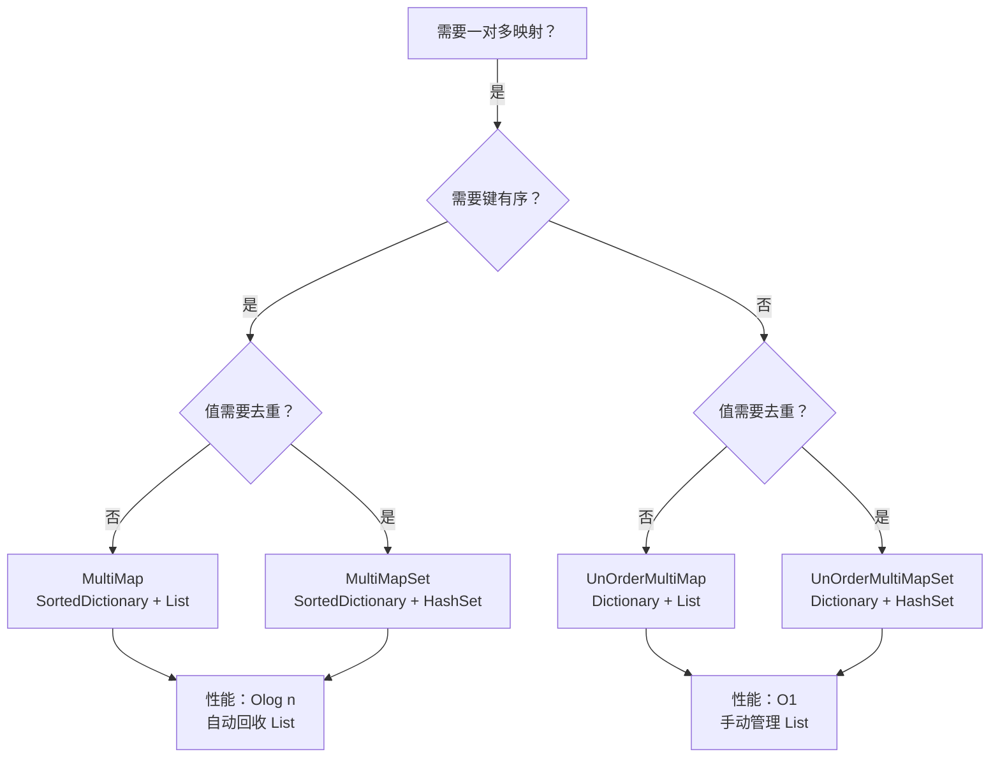

# MultiMap 综合文档

> **覆盖文件**: MultiMap, MultiMapSet, UnOrderMultiMap, UnOrderMultiMapSet  
> **生成时间**: 2026-02-28  
> **命名空间**: `TaoTie`

---

## 📑 目录

1. [概述](#1-概述)
2. [MultiMap](#2-multimap)
3. [MultiMapSet](#3-multimapset)
4. [UnOrderMultiMap](#4-unordermultimap)
5. [UnOrderMultiMapSet](#5-unordermultimapset)
6. [对比总结](#6-对比总结)
7. [使用示例](#7-使用示例)

---

## 1. 概述

### 什么是 MultiMap

**MultiMap** 是一种一对多的映射关系，一个键可以对应多个值。

```
标准 Dictionary:  key1 → value1
MultiMap:         key1 → [value1, value2, value3]
```

### 四种变体

| 类型 | 有序性 | 值集合类型 | 特点 |
|------|--------|-----------|------|
| **MultiMap** | ✅ 有序 (SortedDictionary) | List | 键有序，值可重复 |
| **MultiMapSet** | ✅ 有序 (SortedDictionary) | HashSet | 键有序，值去重 |
| **UnOrderMultiMap** | ❌ 无序 (Dictionary) | List | 键无序，值可重复 |
| **UnOrderMultiMapSet** | ❌ 无序 (Dictionary) | HashSet | 键无序，值去重 |

### 继承关系

```csharp
MultiMap<T, K>        : SortedDictionary<T, List<K>>
MultiMapSet<T, K>     : SortedDictionary<T, HashSet<K>>
UnOrderMultiMap<T, K> : Dictionary<T, List<K>>
UnOrderMultiMapSet<T, K> : Dictionary<T, HashSet<K>>
```

---

## 2. MultiMap

### 类说明

| 属性 | 说明 |
|------|------|
| **定义** | `public class MultiMap<T, K> : SortedDictionary<T, List<K>>` |
| **职责** | 有序一对多映射，值可重复 |
| **泛型参数** | `T` - 键类型, `K` - 值类型 |
| **有序性** | ✅ 键按比较器排序 |

### API

```csharp
// 添加键值对
public void Add(T t, K k)

// 移除指定键值对
public bool Remove(T t, K k)

// 移除整个键
public new bool Remove(T t)

// 获取所有值（copy）
public K[] GetAll(T t)

// 获取内部 List（引用）
public new List<K> this[T t]

// 获取第一个值
public K GetOne(T t)

// 检查是否包含
public bool Contains(T t, K k)
```

### 使用示例

```csharp
var multiMap = new MultiMap<string, int>();

// 添加
multiMap.Add("group1", 1);
multiMap.Add("group1", 2);
multiMap.Add("group1", 3);
multiMap.Add("group2", 10);

// 获取所有值
int[] values = multiMap.GetAll("group1"); // [1, 2, 3]

// 获取第一个值
int first = multiMap.GetOne("group1"); // 1

// 获取内部 List（直接引用，小心修改）
List<int> list = multiMap["group1"];
list.Add(4); // 直接修改内部数据

// 移除单个值
bool removed = multiMap.Remove("group1", 2); // true

// 移除整个键
multiMap.Remove("group2"); // 自动回收内部 List 到对象池

// 检查
bool contains = multiMap.Contains("group1", 3); // true
```

### 对象池集成

```csharp
// MultiMap 在移除键时会自动回收内部 List 到对象池
multiMap.Remove("key");
// ↓ 内部实现
list.Clear();
ObjectPool.Instance.Recycle(list);
```

---

## 3. MultiMapSet

### 类说明

| 属性 | 说明 |
|------|------|
| **定义** | `public class MultiMapSet<T, K> : SortedDictionary<T, HashSet<K>>` |
| **职责** | 有序一对多映射，值自动去重 |
| **泛型参数** | `T` - 键类型, `K` - 值类型 |
| **有序性** | ✅ 键按比较器排序 |

### API

```csharp
// 添加键值对（自动去重）
public void Add(T t, K k)

// 移除指定键值对
public bool Remove(T t, K k)

// 获取所有值（copy）
public K[] GetAll(T t)

// 获取内部 HashSet（引用）
public new HashSet<K> this[T t]

// 获取第一个值
public K GetOne(T t)

// 检查是否包含
public bool Contains(T t, K k)
```

### 使用示例

```csharp
var multiSet = new MultiMapSet<string, int>();

// 添加（自动去重）
multiSet.Add("group1", 1);
multiSet.Add("group1", 1); // 重复，不会添加
multiSet.Add("group1", 2);
multiSet.Add("group1", 3);

// 获取所有值
int[] values = multiSet.GetAll("group1"); // [1, 2, 3]（去重后）

// 获取内部 HashSet
HashSet<int> set = multiSet["group1"];

// 检查
bool contains = multiSet.Contains("group1", 1); // true
bool notContains = multiSet.Contains("group1", 4); // false
```

---

## 4. UnOrderMultiMap

### 类说明

| 属性 | 说明 |
|------|------|
| **定义** | `public class UnOrderMultiMap<T, K> : Dictionary<T, List<K>>` |
| **职责** | 无序一对多映射，值可重复 |
| **泛型参数** | `T` - 键类型, `K` - 值类型 |
| **有序性** | ❌ 无序（哈希表） |

### API

与 MultiMap 相同，但**不自动回收内部 List**（需要手动管理）

```csharp
public void Add(T t, K k)
public bool Remove(T t, K k)
public K[] GetAll(T t)
public new List<K> this[T t]
public K GetOne(T t)
public bool Contains(T t, K k)
```

### 与 MultiMap 的区别

| 特性 | MultiMap | UnOrderMultiMap |
|------|----------|-----------------|
| **有序性** | 键有序 | 键无序 |
| **性能** | O(log n) | O(1) |
| **移除键** | 自动回收 List | 不自动回收 |
| **内存** | 略高（树结构） | 略低（哈希表） |

---

## 5. UnOrderMultiMapSet

### 类说明

| 属性 | 说明 |
|------|------|
| **定义** | `public class UnOrderMultiMapSet<T, K> : Dictionary<T, HashSet<K>>` |
| **职责** | 无序一对多映射，值自动去重 |
| **泛型参数** | `T` - 键类型, `K` - 值类型 |
| **有序性** | ❌ 无序（哈希表） |

### API

```csharp
public void Add(T t, K k)
public bool Remove(T t, K k)
public bool Contains(T t, K k)
public new HashSet<K> this[T t]
public new int Count // 所有值的总数
public Dictionary<T, HashSet<K>> GetDictionary()
```

---

## 6. 对比总结

### 选择指南



### 性能对比

| 类型 | 添加 | 查找 | 移除 | 遍历顺序 |
|------|------|------|------|----------|
| MultiMap | O(log n) | O(log n) | O(log n) | 按键排序 |
| MultiMapSet | O(log n) | O(log n) | O(log n) | 按键排序 |
| UnOrderMultiMap | O(1) | O(1) | O(1) | 无序 |
| UnOrderMultiMapSet | O(1) | O(1) | O(1) | 无序 |

### 功能对比

| 功能 | MultiMap | MultiMapSet | UnOrderMultiMap | UnOrderMultiMapSet |
|------|----------|-------------|-----------------|-------------------|
| 键有序 | ✅ | ✅ | ❌ | ❌ |
| 值可重复 | ✅ | ❌ | ✅ | ❌ |
| 自动回收 List | ✅ | ❌ | ❌ | ❌ |
| GetAll (copy) | ✅ | ✅ | ✅ | ❌ |
| GetOne | ✅ | ✅ | ✅ | ❌ |
| Count (总数) | ❌ | ❌ | ❌ | ✅ |

---

## 7. 使用示例

### 示例 1: 玩家背包分组

```csharp
// 按类型分组物品（有序，值可重复）
public class Inventory
{
    private MultiMap<int, Item> itemsByType = new MultiMap<int, Item>();
    
    public void AddItem(Item item)
    {
        itemsByType.Add(item.TypeId, item);
    }
    
    public List<Item> GetItemsByType(int typeId)
    {
        return itemsByType[typeId]; // 直接返回内部 List
    }
    
    public void RemoveItem(Item item)
    {
        itemsByType.Remove(item.TypeId, item);
    }
    
    public void ClearType(int typeId)
    {
        // 自动回收内部 List 到对象池
        itemsByType.Remove(typeId);
    }
}
```

### 示例 2: 好友系统（去重）

```csharp
// 每个玩家的好友列表（自动去重）
public class FriendSystem
{
    private MultiMapSet<long, long> friends = new MultiMapSet<long, long>();
    
    public void AddFriend(long playerId, long friendId)
    {
        friends.Add(playerId, friendId); // 重复添加会自动忽略
    }
    
    public void RemoveFriend(long playerId, long friendId)
    {
        friends.Remove(playerId, friendId);
    }
    
    public HashSet<long> GetFriends(long playerId)
    {
        return friends[playerId];
    }
    
    public bool AreFriends(long player1, long player2)
    {
        return friends.Contains(player1, player2);
    }
}
```

### 示例 3: 事件系统（无序，高性能）

```csharp
// 事件订阅（无序，高性能）
public class EventSystem
{
    private UnOrderMultiMap<int, Action> listeners = new UnOrderMultiMap<int, Action>();
    
    public void Subscribe(int eventId, Action callback)
    {
        listeners.Add(eventId, callback);
    }
    
    public void Unsubscribe(int eventId, Action callback)
    {
        listeners.Remove(eventId, callback);
    }
    
    public void Trigger(int eventId)
    {
        if (listeners.TryGetValue(eventId, out var callbacks))
        {
            foreach (var callback in callbacks)
            {
                callback?.Invoke();
            }
        }
    }
}
```

### 示例 4: 任务系统（复杂场景）

```csharp
public class QuestSystem
{
    // 按玩家 ID 分组任务（有序，方便遍历）
    private MultiMap<long, Quest> playerQuests = new MultiMap<long, Quest>();
    
    // 按任务类型分组（去重，每个玩家每种类型只关心一个）
    private MultiMapSet<long, int> playerQuestTypes = new MultiMapSet<long, int>();
    
    public void AddQuest(Quest quest)
    {
        playerQuests.Add(quest.PlayerId, quest);
        playerQuestTypes.Add(quest.PlayerId, quest.TypeId);
    }
    
    public List<Quest> GetQuestsByPlayer(long playerId)
    {
        return playerQuests[playerId];
    }
    
    public HashSet<int> GetQuestTypesByPlayer(long playerId)
    {
        return playerQuestTypes[playerId];
    }
    
    public void CompleteQuest(long playerId, int questId)
    {
        var quests = playerQuests[playerId];
        var quest = quests.FirstOrDefault(q => q.Id == questId);
        if (quest != null)
        {
            quests.Remove(quest);
            // 注意：这里不会自动从 playerQuestTypes 移除
        }
    }
}
```

### 示例 5: 聊天频道（无序，高性能）

```csharp
public class ChatChannel
{
    // 频道 ID → 玩家 ID 列表（无序，高性能）
    private UnOrderMultiMapSet<int, long> channelPlayers = new UnOrderMultiMapSet<int, long>();
    
    public void JoinChannel(int channelId, long playerId)
    {
        channelPlayers.Add(channelId, playerId); // 自动去重
    }
    
    public void LeaveChannel(int channelId, long playerId)
    {
        channelPlayers.Remove(channelId, playerId);
    }
    
    public void SendMessage(int channelId, string message)
    {
        if (channelPlayers.TryGetValue(channelId, out var players))
        {
            foreach (var playerId in players)
            {
                SendToPlayer(playerId, message);
            }
        }
    }
    
    public int GetChannelPlayerCount(int channelId)
    {
        if (channelPlayers.TryGetValue(channelId, out var players))
        {
            return players.Count;
        }
        return 0;
    }
    
    // 获取所有频道的总玩家数
    public int GetTotalPlayerCount()
    {
        return channelPlayers.Count; // UnOrderMultiMapSet 特有属性
    }
    
    private void SendToPlayer(long playerId, string message)
    {
        // 发送消息逻辑
    }
}
```

---

## ⚠️ 注意事项

### 1. MultiMap 移除键会回收 List

```csharp
var multiMap = new MultiMap<string, int>();
multiMap.Add("key", 1);
multiMap.Add("key", 2);

// ✅ 正确：移除键会自动回收内部 List
multiMap.Remove("key");

// ❌ 错误：不要继续使用已回收的 List
var list = multiMap["key"]; // 返回 Empty，不是原来的 List
```

### 2. UnOrderMultiMap 不自动回收

```csharp
var unOrderMap = new UnOrderMultiMap<string, int>();
unOrderMap.Add("key", 1);

// ⚠️ 注意：移除键不会自动回收 List
var list = unOrderMap["key"];
unOrderMap.Remove("key");
// list 仍然持有引用，需要手动回收
ObjectPool.Instance.Recycle(list);
```

### 3. 直接修改内部集合

```csharp
var multiMap = new MultiMap<string, int>();
multiMap.Add("key", 1);

// ✅ 可以直接修改内部 List
var list = multiMap["key"];
list.Add(2); // 直接修改

// ⚠️ 但要注意：这会影响 MultiMap 的状态
```

### 4. GetAll 返回 copy

```csharp
var multiMap = new MultiMap<string, int>();
multiMap.Add("key", 1);
multiMap.Add("key", 2);

// GetAll 返回 copy，修改不影响原数据
int[] values = multiMap.GetAll("key"); // [1, 2]
values[0] = 100; // 不影响 multiMap

// 直接索引返回引用
var list = multiMap["key"];
list[0] = 100; // 影响 multiMap
```

---

## 相关文档

- [ObjectPool.cs.md](../ObjectPool.cs.md) - 对象池
- [Component_Collections.cs.md](./Component_Collections.cs.md) - 集合组件
- [UnOrderDoubleKeyMap.cs.md](./UnOrderDoubleKeyMap.cs.md) - 双键映射

---

*文档由 OpenClaw AI 助手自动生成 | 基于静态代码分析*
