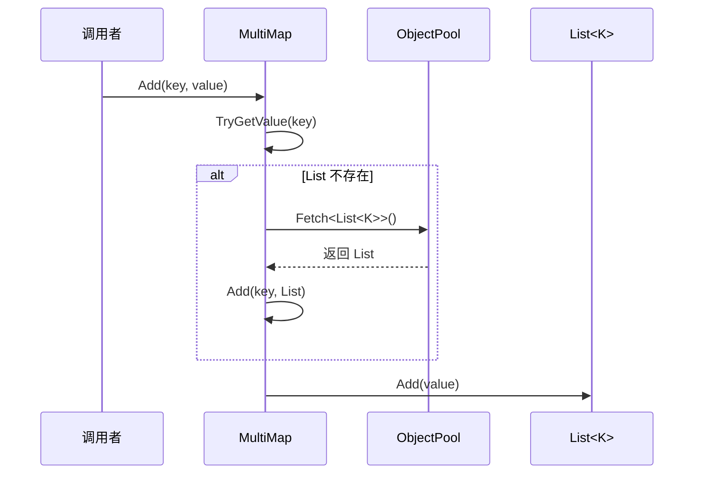
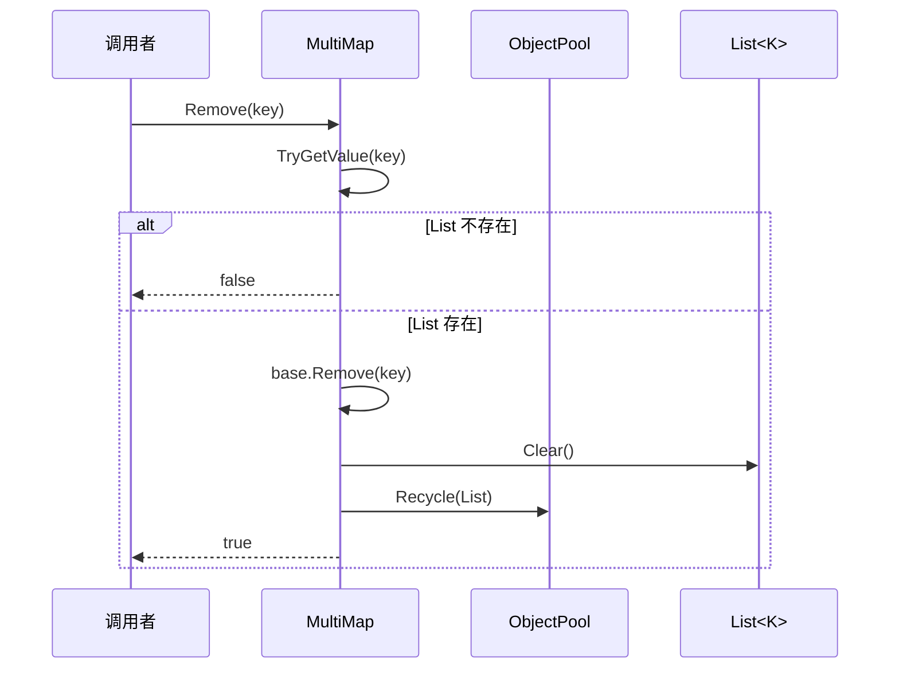

# MultiMap.cs 注解文档

## 文件基本信息

| 属性 | 值 |
|------|-----|
| **文件名** | MultiMap.cs |
| **路径** | Assets/Scripts/Mono/Core/Object/MultiMap.cs |
| **所属模块** | 框架层 → Mono/Core/Object |
| **命名空间** | `TaoTie` |
| **文件职责** | 提供一键多值的有序多重映射集合（内层为 List，支持对象池） |

---

## 类说明

### MultiMap<T, K>

| 属性 | 说明 |
|------|------|
| **职责** | 继承 `SortedDictionary<T, List<K>>`，支持一个键对应多个值（允许重复），内层 List 使用对象池 |
| **泛型参数** | `T` - 键类型（有序）<br>`K` - 值类型（允许重复） |
| **继承关系** | `SortedDictionary<T, List<K>>` |
| **实现的接口** | 无额外接口 |

**设计模式**: 多重映射模式 + 对象池模式

```csharp
// 一个键对应多个值（允许重复）
var multiMap = new MultiMapSet<string, int>();
multiMap.Add("fruits", 1);
multiMap.Add("fruits", 2);
multiMap.Add("fruits", 1); // 重复值也添加
```

---

## 字段与属性

| 名称 | 类型 | 访问级别 | 说明 |
|------|------|----------|------|
| `Empty` | `List<K>` | `private readonly` | 空 List 缓存，避免 null 检查 |
| `this[T t]` | `List<K>` | `public new` | 索引器，返回键对应的 List（支持设置） |

---

## 方法说明

### Add(T t, K k)

**签名**:
```csharp
public void Add(T t, K k)
```

**职责**: 添加键值对，自动创建内层 List（从对象池获取）

**核心逻辑**:
```
1. 尝试获取键对应的 List
2. 如果不存在，从对象池获取新的 List 并添加
3. 将值添加到 List 中
```

**调用者**: 任何需要添加键值对的代码

**使用示例**:
```csharp
var multiMap = new MultiMap<string, int>();
multiMap.Add("category1", 100);
multiMap.Add("category1", 200);
multiMap.Add("category1", 100); // 重复值也添加
```

---

### Remove(T t, K k)

**签名**:
```csharp
public bool Remove(T t, K k)
```

**职责**: 移除指定的键值对

**核心逻辑**:
```
1. 获取键对应的 List
2. 如果不存在，返回 false
3. 从 List 中移除值
4. 如果 List 为空，移除整个键并回收 List
5. 返回是否成功移除
```

**返回值**: `true` - 成功移除；`false` - 键或值不存在

---

### Remove(T t)

**签名**:
```csharp
public new bool Remove(T t)
```

**职责**: 移除整个键及其所有值

**核心逻辑**:
```
1. 获取键对应的 List
2. 如果不存在，返回 false
3. 从基类字典移除键
4. 清空 List 并回收到对象池
5. 返回 true
```

**使用示例**:
```csharp
multiMap.Remove("category1"); // 移除整个分类
```

---

### GetAll(T t)

**签名**:
```csharp
public K[] GetAll(T t)
```

**职责**: 获取键对应的所有值（返回副本）

**核心逻辑**:
```
1. 获取键对应的 List
2. 如果不存在，返回空数组
3. 使用 ToArray() 返回副本
```

**使用示例**:
```csharp
int[] values = multiMap.GetAll("category1");
```

---

### GetOne(T t)

**签名**:
```csharp
public K GetOne(T t)
```

**职责**: 获取键对应的第一个值

**核心逻辑**:
```
1. 获取键对应的 List
2. 如果存在且有元素，返回第一个（索引 0）
3. 否则返回 default(K)
```

**使用示例**:
```csharp
int first = multiMap.GetOne("category1");
```

---

### Contains(T t, K k)

**签名**:
```csharp
public bool Contains(T t, K k)
```

**职责**: 检查是否包含指定的键值对

**核心逻辑**:
```
1. 获取键对应的 List
2. 如果不存在，返回 false
3. 检查 List 是否包含值
```

---

## 核心流程

### 添加流程（带对象池）



### 移除流程（带对象池回收）



---

## 使用示例

### 示例 1: 基础使用

```csharp
var multiMap = new MultiMap<string, int>();

// 添加数据（允许重复）
multiMap.Add("fruits", 1);
multiMap.Add("fruits", 2);
multiMap.Add("fruits", 1); // 重复值也添加

// 获取所有值
int[] fruits = multiMap.GetAll("fruits");
// [1, 2, 1]

// 获取第一个值
int first = multiMap.GetOne("fruits"); // 1

// 检查包含
bool has = multiMap.Contains("fruits", 2); // true

// 移除单个值
multiMap.Remove("fruits", 1); // 只移除一个 1

// 移除整个键
multiMap.Remove("fruits"); // 移除所有
```

### 示例 2: 事件订阅系统（允许重复订阅）

```csharp
// 管理事件 ID 与回调的映射（允许重复订阅）
var eventMap = new MultiMap<int, Action>();

// 订阅事件（同一回调可以订阅多次）
eventMap.Add(MessageId.OnGameStart, OnGameStart);
eventMap.Add(MessageId.OnGameStart, OnGameStart); // 重复订阅

// 触发事件（会调用两次）
foreach (var callback in eventMap.GetAll(MessageId.OnGameStart))
{
    callback.Invoke();
}

// 取消一次订阅
eventMap.Remove(MessageId.OnGameStart, OnGameStart);
```

### 示例 3: 实体组件系统

```csharp
// 管理组件类型与组件实例的映射
var componentMap = new MultiMap<Type, IComponent>();

// 添加组件
componentMap.Add(typeof(MovementComponent), movement1);
componentMap.Add(typeof(MovementComponent), movement2);
componentMap.Add(typeof(RenderComponent), render1);

// 获取所有移动组件
var movements = componentMap.GetAll(typeof(MovementComponent));
foreach (var movement in movements)
{
    movement.Update();
}

// 移除组件
componentMap.Remove(typeof(MovementComponent), movement1);
```

### 示例 4: 任务调度系统

```csharp
// 管理优先级与任务的映射
var priorityMap = new MultiMap<int, Task>();

// 添加任务（同一优先级可以有多个任务）
priorityMap.Add(1, task1);
priorityMap.Add(1, task2);
priorityMap.Add(2, task3);
priorityMap.Add(1, task4); // 优先级 1 的第三个任务

// 按优先级执行
foreach (var priority in priorityMap.Keys)
{
    foreach (var task in priorityMap[priority])
    {
        task.Execute();
    }
}
```

---

## 与 MultiMapSet 的区别

| 特性 | MultiMap | MultiMapSet |
|------|----------|-------------|
| **内层容器** | `List<K>` | `HashSet<K>` |
| **值是否去重** | ❌ 允许重复 | ✅ 自动去重 |
| **键是否有序** | ✅ SortedDictionary | ✅ SortedDictionary |
| **对象池** | ✅ List 使用对象池 | ❌ HashSet 不使用 |
| **性能** | 查找 O(n) | 查找 O(1) |
| **适用场景** | 允许重复订阅 | 需要去重 |

---

## 对象池优化

### List 复用

```csharp
// 添加时从对象池获取 List
list = ObjectPool.Instance.Fetch<List<K>>();

// 移除时回收到对象池
list.Clear();
ObjectPool.Instance.Recycle(list);
```

### GC 优化效果

```csharp
// ❌ 传统方式（每次创建新 List）
var dict = new Dictionary<string, List<int>>();
dict["key"] = new List<int>(); // GC 分配

// ✅ MultiMap 方式（对象池复用）
var multiMap = new MultiMap<string, int>();
multiMap.Add("key", 1); // 从对象池获取 List
multiMap.Remove("key"); // 回收到对象池
```

---

## 相关文档

- [MultiMapSet.cs.md](./MultiMapSet.cs.md) - HashSet 版本的多重映射
- [UnOrderMultiMap.cs.md](./UnOrderMultiMap.cs.md) - 无序版本
- [ObjectPool.cs.md](../ObjectPool.cs.md) - 对象池核心
- [ListComponent.cs.md](./ListComponent.cs.md) - List 组件

---

*文档生成时间：2026-03-02 | OpenClaw AI 助手*
