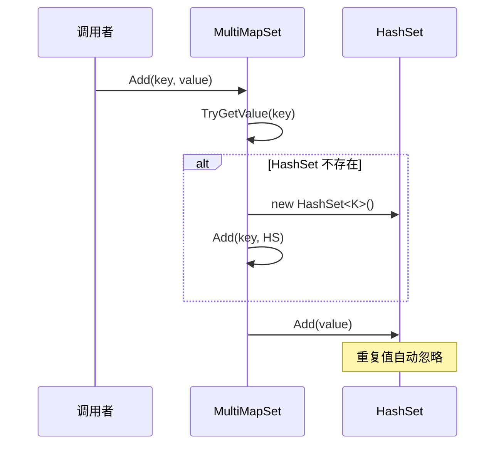
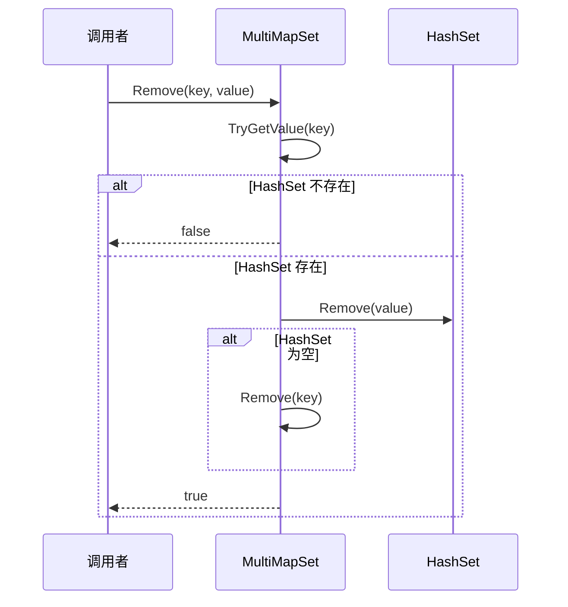

# MultiMapSet.cs 注解文档

## 文件基本信息

| 属性 | 值 |
|------|-----|
| **文件名** | MultiMapSet.cs |
| **路径** | Assets/Scripts/Mono/Core/Object/MultiMapSet.cs |
| **所属模块** | 框架层 → Mono/Core/Object |
| **命名空间** | `TaoTie` |
| **文件职责** | 提供一键多值的有序多重映射集合（内层为 HashSet） |

---

## 类说明

### MultiMapSet<T, K>

| 属性 | 说明 |
|------|------|
| **职责** | 继承 `SortedDictionary<T, HashSet<K>>`，支持一个键对应多个值的集合结构 |
| **泛型参数** | `T` - 键类型（有序）<br>`K` - 值类型（HashSet 去重） |
| **继承关系** | `SortedDictionary<T, HashSet<K>>` |
| **实现的接口** | 无额外接口 |

**设计模式**: 多重映射模式

```csharp
// 一个键对应多个值（自动去重）
var multiMap = new MultiMapSet<string, int>();
multiMap.Add("fruits", 1);
multiMap.Add("fruits", 2);
multiMap.Add("fruits", 1); // 重复值自动忽略
```

---

## 字段与属性

| 名称 | 类型 | 访问级别 | 说明 |
|------|------|----------|------|
| `Empty` | `HashSet<K>` | `private readonly` | 空 HashSet 缓存，避免 null 检查 |
| `this[T t]` | `HashSet<K>` | `public new` | 索引器，返回键对应的 HashSet（不返回 null） |

---

## 方法说明

### Add(T t, K k)

**签名**:
```csharp
public void Add(T t, K k)
```

**职责**: 添加键值对，自动创建内层 HashSet

**核心逻辑**:
```
1. 尝试获取键对应的 HashSet
2. 如果不存在，创建新的 HashSet 并添加
3. 将值添加到 HashSet 中
```

**调用者**: 任何需要添加键值对的代码

**使用示例**:
```csharp
var multiMap = new MultiMapSet<string, int>();
multiMap.Add("category1", 100);
multiMap.Add("category1", 200);
multiMap.Add("category2", 300);
```

---

### Remove(T t, K k)

**签名**:
```csharp
public bool Remove(T t, K k)
```

**职责**: 移除指定的键值对

**核心逻辑**:
```
1. 获取键对应的 HashSet
2. 如果不存在，返回 false
3. 从 HashSet 中移除值
4. 如果 HashSet 为空，移除整个键
5. 返回是否成功移除
```

**返回值**: `true` - 成功移除；`false` - 键或值不存在

**使用示例**:
```csharp
bool removed = multiMap.Remove("category1", 100);
```

---

### GetAll(T t)

**签名**:
```csharp
public K[] GetAll(T t)
```

**职责**: 获取键对应的所有值（返回副本）

**核心逻辑**:
```
1. 获取键对应的 HashSet
2. 如果不存在，返回空数组
3. 使用 ToArray() 返回副本
```

**调用者**: 需要安全获取所有值的代码

**使用示例**:
```csharp
int[] values = multiMap.GetAll("category1");
foreach (var value in values)
{
    Log.Info(value.ToString());
}
```

---

### GetOne(T t)

**签名**:
```csharp
public K GetOne(T t)
```

**职责**: 获取键对应的任意一个值

**核心逻辑**:
```
1. 获取键对应的 HashSet
2. 如果存在且有元素，返回第一个
3. 否则返回 default(K)
```

**使用示例**:
```csharp
int firstValue = multiMap.GetOne("category1");
```

---

### Contains(T t, K k)

**签名**:
```csharp
public bool Contains(T t, K k)
```

**职责**: 检查是否包含指定的键值对

**核心逻辑**:
```
1. 获取键对应的 HashSet
2. 如果不存在，返回 false
3. 检查 HashSet 是否包含值
```

**使用示例**:
```csharp
if (multiMap.Contains("category1", 100))
{
    // 存在该键值对
}
```

---

## 核心流程

### 添加流程



### 移除流程



---

## 使用示例

### 示例 1: 基础使用

```csharp
var multiMap = new MultiMapSet<string, int>();

// 添加数据
multiMap.Add("fruits", 1);
multiMap.Add("fruits", 2);
multiMap.Add("fruits", 3);
multiMap.Add("vegetables", 4);

// 获取所有值
int[] fruits = multiMap.GetAll("fruits");
// [1, 2, 3]

// 获取单个值
int first = multiMap.GetOne("fruits");

// 检查包含
bool has = multiMap.Contains("fruits", 2); // true

// 移除单个值
multiMap.Remove("fruits", 1);

// 遍历
foreach (var kvp in multiMap)
{
    Log.Info($"{kvp.Key}: {string.Join(", ", kvp.Value)}");
}
```

### 示例 2: 实体 - 组件系统

```csharp
// 管理实体类型与实体 ID 的映射
var entityMap = new MultiMapSet<EntityType, long>();

// 添加实体
entityMap.Add(EntityType.Player, playerId);
entityMap.Add(EntityType.Enemy, enemyId1);
entityMap.Add(EntityType.Enemy, enemyId2);

// 获取所有敌人
long[] enemies = entityMap.GetAll(EntityType.Enemy);

// 检查是否有某种实体
if (entityMap.Contains(EntityType.Boss, bossId))
{
    // Boss 存在
}
```

### 示例 3: 事件订阅系统

```csharp
// 管理事件 ID 与回调的映射
var eventMap = new MultiMapSet<int, Action>();

// 订阅事件
eventMap.Add(MessageId.OnGameStart, OnGameStart1);
eventMap.Add(MessageId.OnGameStart, OnGameStart2);

// 触发事件
foreach (var callback in eventMap.GetAll(MessageId.OnGameStart))
{
    callback.Invoke();
}

// 取消订阅
eventMap.Remove(MessageId.OnGameStart, OnGameStart1);
```

---

## 与 MultiMap 的区别

| 特性 | MultiMapSet | MultiMap |
|------|-------------|----------|
| **内层容器** | `HashSet<K>` | `List<K>` |
| **值是否去重** | ✅ 自动去重 | ❌ 允许重复 |
| **键是否有序** | ✅ SortedDictionary | ✅ SortedDictionary |
| **性能** | 查找 O(1) | 查找 O(n) |
| **适用场景** | 需要去重的场景 | 允许重复的场景 |

---

## 相关文档

- [MultiMap.cs.md](./MultiMap.cs.md) - List 版本的多重映射
- [UnOrderMultiMapSet.cs.md](./UnOrderMultiMapSet.cs.md) - 无序版本
- [DictionaryComponent.cs.md](./DictionaryComponent.cs.md) - Dictionary 组件
- [HashSetComponent.cs.md](./HashSetComponent.cs.md) - HashSet 组件

---

*文档生成时间：2026-03-02 | OpenClaw AI 助手*
