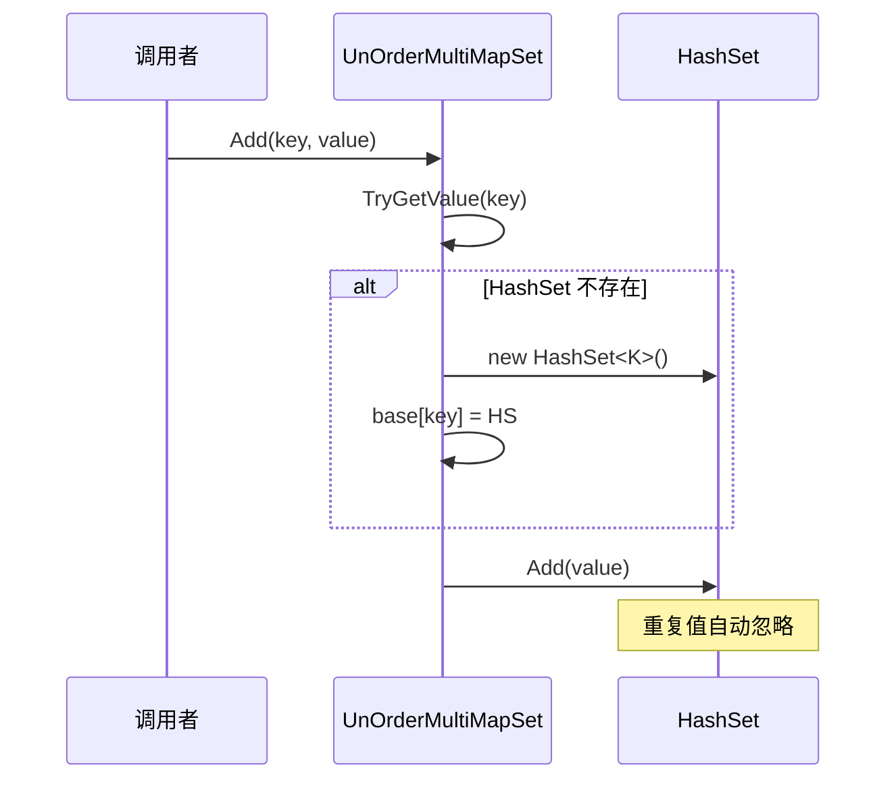

# UnOrderMultiMapSet.cs 注解文档

## 文件基本信息

| 属性 | 值 |
|------|------|
| **文件名** | UnOrderMultiMapSet.cs |
| **路径** | Assets/Scripts/Mono/Core/Object/UnOrderMultiMapSet.cs |
| **所属模块** | 框架层 → Mono/Core/Object |
| **命名空间** | `TaoTie` |
| **文件职责** | 提供一键多值的无序多重映射集合（内层为 HashSet） |

---

## 类说明

### UnOrderMultiMapSet<T, K>

| 属性 | 说明 |
|------|------|
| **职责** | 继承 `Dictionary<T, HashSet<K>>`，支持一个键对应多个值的无序集合结构 |
| **泛型参数** | `T` - 键类型（无序）<br>`K` - 值类型（HashSet 去重） |
| **继承关系** | `Dictionary<T, HashSet<K>>` |
| **实现的接口** | 无额外接口 |

**设计模式**: 多重映射模式

```csharp
// 一个键对应多个值（自动去重，无序）
var multiMap = new UnOrderMultiMapSet<string, int>();
multiMap.Add("fruits", 1);
multiMap.Add("fruits", 2);
multiMap.Add("fruits", 1); // 重复值自动忽略
```

---

## 字段与属性

| 名称 | 类型 | 访问级别 | 说明 |
|------|------|----------|------|
| `this[T t]` | `HashSet<K>` | `public new` | 索引器，返回键对应的 HashSet（可能为空） |

---

## 方法说明

### Add(T t, K k)

**签名**:
```csharp
public void Add(T t, K k)
```

**职责**: 添加键值对，自动创建内层 HashSet

**核心逻辑**:
```
1. 尝试获取键对应的 HashSet
2. 如果不存在，创建新的 HashSet 并添加到基类字典
3. 将值添加到 HashSet 中
```

**调用者**: 任何需要添加键值对的代码

**使用示例**:
```csharp
var multiMap = new UnOrderMultiMapSet<string, int>();
multiMap.Add("category1", 100);
multiMap.Add("category1", 200);
```

---

### Remove(T t, K k)

**签名**:
```csharp
public bool Remove(T t, K k)
```

**职责**: 移除指定的键值对

**核心逻辑**:
```
1. 获取键对应的 HashSet
2. 如果不存在，返回 false
3. 从 HashSet 中移除值
4. 如果 HashSet 为空，移除整个键
5. 返回是否成功移除
```

**返回值**: `true` - 成功移除；`false` - 键或值不存在

---

### Contains(T t, K k)

**签名**:
```csharp
public bool Contains(T t, K k)
```

**职责**: 检查是否包含指定的键值对

**核心逻辑**:
```
1. 获取键对应的 HashSet
2. 如果不存在，返回 false
3. 检查 HashSet 是否包含值
```

---

### GetDictionary()

**签名**:
```csharp
public Dictionary<T, HashSet<K>> GetDictionary()
```

**职责**: 获取内部字典引用

**核心逻辑**:
```
1. 返回 this（自身就是 Dictionary）
```

**使用示例**:
```csharp
var dict = multiMap.GetDictionary();
foreach (var kvp in dict)
{
    // 遍历
}
```

---

### Count

**签名**:
```csharp
public new int Count { get; }
```

**职责**: 获取所有值的总数（不是键的数量）

**核心逻辑**:
```
1. 遍历所有键值对
2. 累加每个 HashSet 的 Count
3. 返回总和
```

**使用示例**:
```csharp
multiMap.Add("cat1", 1);
multiMap.Add("cat1", 2);
multiMap.Add("cat2", 3);
int total = multiMap.Count; // 3（不是 2）
```

---

## 与 MultiMapSet 的区别

| 特性 | UnOrderMultiMapSet | MultiMapSet |
|------|-------------------|-------------|
| **基类** | `Dictionary<T, HashSet<K>>` | `SortedDictionary<T, HashSet<K>>` |
| **键是否有序** | ❌ 无序 | ✅ 有序（按 Comparer） |
| **性能** | 更快（O(1) 查找） | 稍慢（O(log n) 查找） |
| **内存** | 较少 | 稍多 |
| **适用场景** | 不需要排序的场景 | 需要按键排序的场景 |

---

## 核心流程

### 添加流程



---

## 使用示例

### 示例 1: 基础使用

```csharp
var multiMap = new UnOrderMultiMapSet<string, int>();

// 添加数据
multiMap.Add("fruits", 1);
multiMap.Add("fruits", 2);
multiMap.Add("fruits", 3);
multiMap.Add("vegetables", 4);

// 获取 HashSet
HashSet<int> fruits = multiMap["fruits"];
foreach (var value in fruits)
{
    Log.Info(value.ToString());
}

// 检查包含
bool has = multiMap.Contains("fruits", 2); // true

// 移除单个值
multiMap.Remove("fruits", 1);

// 获取总数
int total = multiMap.Count; // 所有值的数量
```

### 示例 2: 事件订阅系统（无序）

```csharp
// 管理事件 ID 与回调的映射（不需要顺序）
var eventMap = new UnOrderMultiMapSet<int, Action>();

// 订阅事件
eventMap.Add(MessageId.OnAttack, OnAttack1);
eventMap.Add(MessageId.OnAttack, OnAttack2);
eventMap.Add(MessageId.OnDefend, OnDefend1);

// 触发事件（顺序不重要）
if (eventMap.TryGetValue(eventId, out var callbacks))
{
    foreach (var callback in callbacks)
    {
        callback.Invoke();
    }
}
```

### 示例 3: 标签系统

```csharp
// 管理标签与实体 ID 的映射
var tagMap = new UnOrderMultiMapSet<string, long>();

// 添加标签
tagMap.Add("enemy", enemyId1);
tagMap.Add("enemy", enemyId2);
tagMap.Add("boss", bossId);
tagMap.Add("enemy", enemyId3);

// 获取所有敌人
if (tagMap.TryGetValue("enemy", out var enemies))
{
    foreach (var enemyId in enemies)
    {
        // 处理敌人
    }
}

// 检查标签
if (tagMap.Contains("boss", bossId))
{
    // 是 Boss
}
```

---

## 性能对比

### Dictionary vs SortedDictionary

| 操作 | Dictionary (UnOrder) | SortedDictionary |
|------|---------------------|------------------|
| **添加** | O(1) | O(log n) |
| **查找** | O(1) | O(log n) |
| **移除** | O(1) | O(log n) |
| **遍历** | 无序 | 有序 |
| **内存** | 较少 | 较多（红黑树节点） |

---

## 相关文档

- [MultiMapSet.cs.md](./MultiMapSet.cs.md) - 有序版本
- [MultiMap.cs.md](./MultiMap.cs.md) - List 版本的多重映射
- [UnOrderMultiMap.cs.md](./UnOrderMultiMap.cs.md) - List 版本的无序映射
- [DictionaryComponent.cs.md](./DictionaryComponent.cs.md) - Dictionary 组件

---

*文档生成时间：2026-03-02 | OpenClaw AI 助手*
