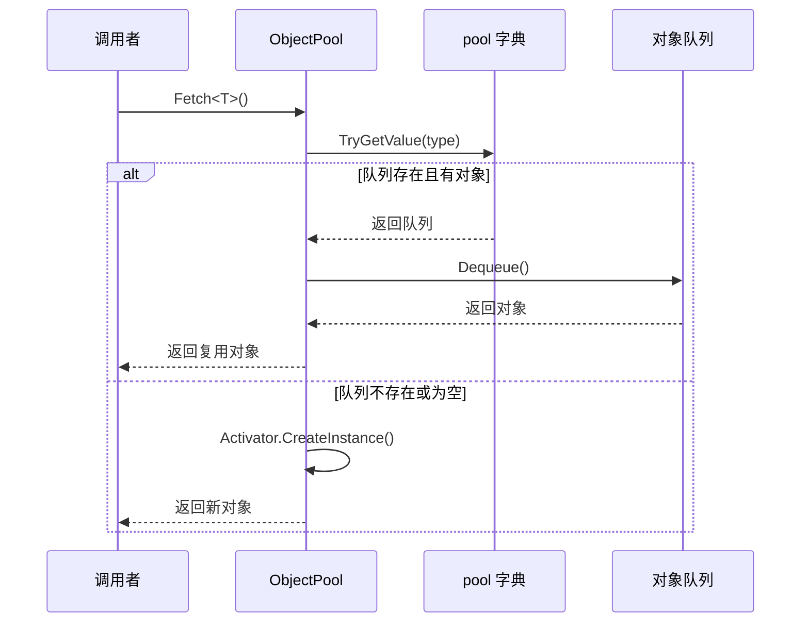
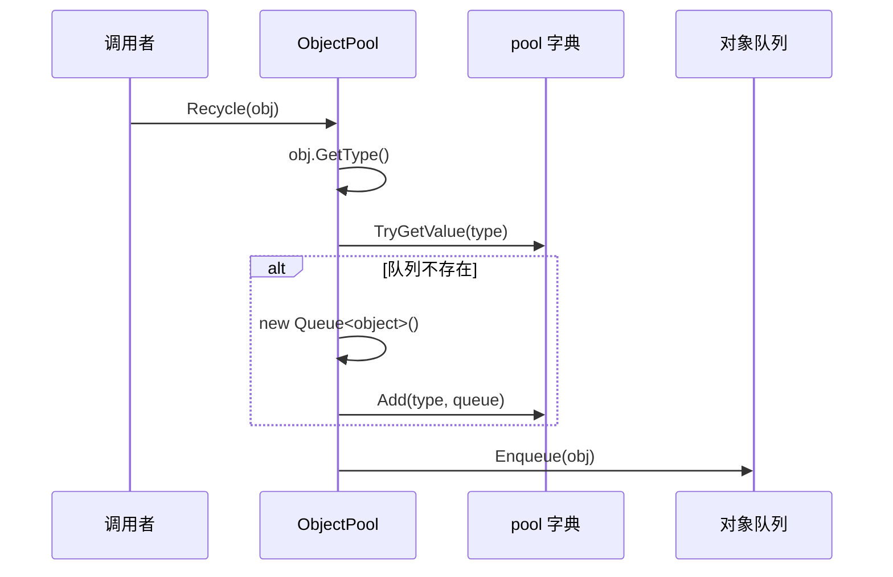

# ObjectPool.cs 注解文档

## 文件基本信息

| 属性 | 值 |
|------|-----|
| **文件名** | ObjectPool.cs |
| **路径** | Assets/Scripts/Mono/Core/ObjectPool.cs |
| **所属模块** | 框架层 → Mono/Core |
| **文件职责** | 通用对象池系统，负责对象的复用、回收和生命周期管理 |

---

## 类/结构体说明

### ObjectPool

| 属性 | 说明 |
|------|------|
| **职责** | 提供基于类型的对象池，减少频繁创建/销毁对象带来的 GC 压力 |
| **泛型参数** | 无 |
| **继承关系** | 实现 `IDisposable` |
| **设计模式** | 单例模式 + 对象池模式 |

```csharp
// 单例实现
public static ObjectPool Instance = new ObjectPool();

// 私有构造函数，防止外部实例化
private ObjectPool()
```

---

## 字段与属性（按重要程度排序）

| 名称 | 类型 | 访问级别 | 说明 |
|------|------|----------|------|
| `Instance` | `ObjectPool` | `public static` | 单例实例，全局访问点 |
| `pool` | `Dictionary<Type, Queue<object>>` | `private readonly` | 按类型分类的对象池字典 |
| `poolCheck` | `HashSet<object>` | `private` | 编辑器模式下用于检测重复取/回收的对象集合 |

---

## 方法说明（按重要程度排序）

### Fetch<T>()

**签名**:
```csharp
public T Fetch<T>() where T : class
```

**职责**: 从对象池获取指定类型的对象

**核心逻辑**:
```
1. 获取类型 TypeInfo<T>.Type
2. 尝试从 pool 字典获取对应队列
3. 如果队列不存在或为空 → 创建新实例 Activator.CreateInstance(type)
4. 否则从队列出队一个对象
5. 编辑器模式下检查重复领取（poolCheck）
6. 返回对象
```

**调用者**: 任何需要复用对象的代码

**使用示例**:
```csharp
// 获取 TimerAction 实例
var timerAction = ObjectPool.Instance.Fetch<TimerAction>();

// 获取任意类实例
var obj = ObjectPool.Instance.Fetch<MyClass>();
```

---

### Fetch(Type)

**签名**:
```csharp
public object Fetch(Type type)
```

**职责**: 从对象池获取指定类型的对象（非泛型版本）

**核心逻辑**: 同 `Fetch<T>()`，但使用运行时类型

**使用示例**:
```csharp
// 使用运行时类型获取
Type type = typeof(MyClass);
var obj = ObjectPool.Instance.Fetch(type);
```

---

### Recycle(object)

**签名**:
```csharp
public void Recycle(object obj)
```

**职责**: 将对象回收到对象池

**核心逻辑**:
```
1. 获取对象类型 obj.GetType()
2. 尝试从 pool 字典获取对应队列
3. 如果队列不存在 → 创建新队列并添加到字典
4. 将对象入队
5. 编辑器模式下检查重复回收（poolCheck）
```

**调用者**: 任何使用完对象需要回收的代码

**使用示例**:
```csharp
// 使用完对象后回收
ObjectPool.Instance.Recycle(timerAction);
```

---

### Dispose()

**签名**:
```csharp
public void Dispose()
```

**职责**: 释放对象池，清空所有缓存对象

**核心逻辑**:
```
1. 清空 pool 字典
```

**调用者**: 程序退出或需要重置对象池时

---

## 对象池工作流程

### 对象获取流程



### 对象回收流程



---

## 编辑器模式检测

在 `UNITY_EDITOR` 定义下，对象池提供额外的检测功能：

### 重复领取检测
```csharp
#if UNITY_EDITOR
if (!poolCheck.Contains(res))
{
    Log.Error("对象池重复取" + res);
}
poolCheck.Remove(res);
#endif
```

### 重复回收检测
```csharp
#if UNITY_EDITOR
if (poolCheck.Contains(obj))
{
    Log.Error("对象池重复回收" + obj);
}
poolCheck.Add(obj);
#endif
```

**作用**: 防止同一个对象被多次领取或多次回收，帮助发现潜在的 bug。

---

## 阅读指引

### 建议的阅读顺序

1. **理解对象池作用** - 为什么需要对象池（减少 GC）
2. **看字段定义** - 了解 pool 字典的结构
3. **重点看 Fetch** - 理解对象获取逻辑
4. **深入 Recycle** - 理解对象回收逻辑
5. **了解编辑器检测** - 理解 poolCheck 的作用

### 最值得学习的技术点

1. **泛型对象池**: 使用 `Dictionary<Type, Queue<object>>` 按类型分类
2. **单例模式**: 全局唯一的对象池实例
3. **惰性创建**: 队列按需创建，不预先分配
4. **编辑器检测**: 使用 `HashSet` 检测重复操作
5. **IDisposable**: 提供清理接口

---

## 使用示例

### 示例 1: 基本使用

```csharp
// 获取对象
var timerAction = ObjectPool.Instance.Fetch<TimerAction>();
timerAction.TimerClass = TimerClass.OnceTimer;
timerAction.Type = 1;

// 使用对象...

// 回收对象
ObjectPool.Instance.Recycle(timerAction);
```

### 示例 2: 配合 Dispose 模式

```csharp
public class TimerAction : IDisposable
{
    public long Id;
    public object Object;
    
    public void Dispose()
    {
        this.Id = 0;
        this.Object = null;
        // 回收到对象池
        ObjectPool.Instance.Recycle(this);
    }
}

// 使用
var action = ObjectPool.Instance.Fetch<TimerAction>();
try
{
    // 使用 action...
}
finally
{
    action.Dispose(); // 自动回收
}
```

### 示例 3: 非泛型版本

```csharp
// 使用运行时类型
Type type = Type.GetType("MyNamespace.MyClass");
var obj = ObjectPool.Instance.Fetch(type);

// 使用后回收
ObjectPool.Instance.Recycle(obj);
```

---

## 性能优化建议

### 适用场景
- ✅ 频繁创建/销毁的小型对象
- ✅ 生命周期短的对象
- ✅ 固定类型的对象（如 TimerAction、ETTask 等）

### 不适用场景
- ❌ 大型对象（占用内存多）
- ❌ 生命周期长的对象（回收意义不大）
- ❌ 类型不确定的对象（无法有效复用）

### 最佳实践
1. **及时回收**: 使用完立即回收，避免内存泄漏
2. **重置状态**: 回收前重置对象状态，避免状态污染
3. **配合 using**: 使用 `using` 语句确保回收
4. **编辑器检测**: 开发阶段利用 poolCheck 发现 bug

---

## 相关文档

- [TimerAction.cs.md](../Module/Timer/TimerAction.cs.md) - 定时器动作（使用对象池）
- [IdGenerater.cs.md](./Object/IdGenerater.cs.md) - ID 生成器
- [ETTask.cs.md](../Module/Async/ETTask.cs.md) - 异步任务（使用对象池）

---

*文档生成时间：2026-03-01 | OpenClaw AI 助手*
