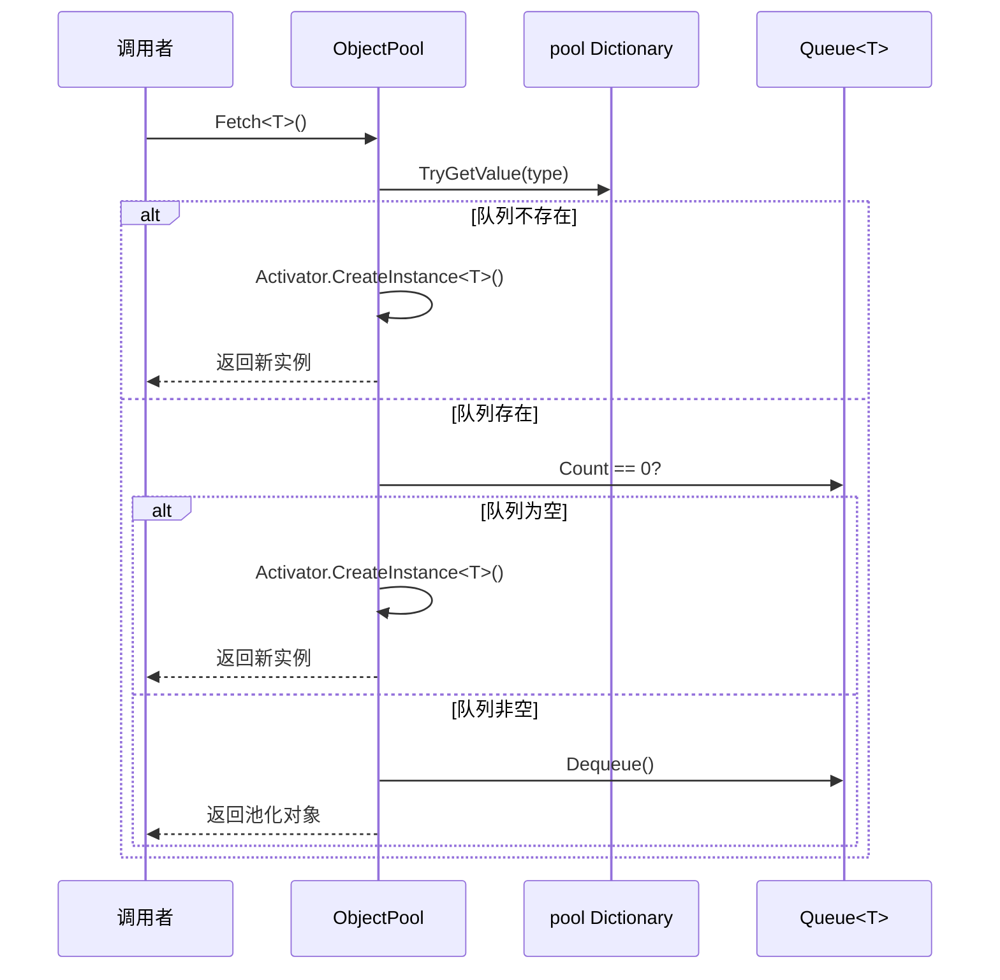
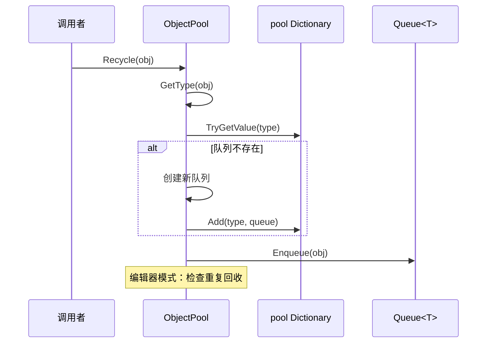

# ObjectPool.cs 注解文档

## 文件基本信息

| 属性 | 值 |
|------|-----|
| **文件名** | ObjectPool.cs |
| **路径** | Assets/Scripts/Mono/Core/ObjectPool.cs |
| **所属模块** | Mono/Core |
| **文件职责** | 通用对象池实现，管理对象复用，减少 GC 压力 |

---

## 类/结构体说明

### ObjectPool

| 属性 | 说明 |
|------|------|
| **职责** | 全局单例对象池，支持按类型 Fetch/Recycle 对象 |
| **泛型参数** | 无 |
| **继承关系** | 无 |
| **实现的接口** | `IDisposable` |

**设计模式**: 单例模式 + 对象池模式

```csharp
// 获取单例
var pool = ObjectPool.Instance;

// 从对象池获取对象
var list = ObjectPool.Instance.Fetch<List<int>>();

// 使用完毕后回收
list.Clear();
ObjectPool.Instance.Recycle(list);
```

---

## 字段与属性

| 名称 | 类型 | 访问级别 | 说明 |
|------|------|----------|------|
| `Instance` | `ObjectPool` | `public static` | 全局单例实例 |
| `pool` | `Dictionary<Type, Queue<object>>` | `private` | 按类型存储对象队列 |
| `poolCheck` | `HashSet<object>` | `private` | 编辑器模式下检测重复取/回收 |

---

## 方法说明

### Fetch<T> ⭐

**签名**:
```csharp
public T Fetch<T>() where T : class
```

**职责**: 从对象池获取指定类型的对象

**核心逻辑**:
```
1. 获取类型 TypeInfo<T>.Type
2. 从 pool 字典查找对应队列
3. 如果队列不存在或为空，创建新实例
4. 否则从队列 dequeue 一个对象
5. 编辑器模式下检查是否重复获取
6. 返回对象
```

**使用示例**:
```csharp
// 获取 List
var list = ObjectPool.Instance.Fetch<List<int>>();
list.Add(1);
list.Add(2);

// 获取 Dictionary
var dict = ObjectPool.Instance.Fetch<Dictionary<string, int>>();
dict["key"] = 100;

// 获取自定义类型
var myObj = ObjectPool.Instance.Fetch<MyClass>();
```

---

### Fetch (非泛型)

**签名**:
```csharp
public object Fetch(Type type)
```

**职责**: 从对象池获取指定类型的对象（非泛型版本）

**核心逻辑**:
```
1. 从 pool 字典查找对应队列
2. 如果队列不存在或为空，创建新实例
3. 否则从队列 dequeue 一个对象
4. 编辑器模式下检查是否重复获取
5. 返回对象
```

**使用示例**:
```csharp
// 运行时动态类型
Type type = GetRuntimeType();
var obj = ObjectPool.Instance.Fetch(type);
```

---

### Recycle ⭐

**签名**:
```csharp
public void Recycle(object obj)
```

**职责**: 回收对象到对象池

**核心逻辑**:
```
1. 获取对象类型 obj.GetType()
2. 从 pool 字典查找对应队列
3. 如果队列不存在，创建新队列并添加
4. 将对象 enqueue 到队列
5. 编辑器模式下检查是否重复回收
```

**使用示例**:
```csharp
// 使用完毕后回收
var list = ObjectPool.Instance.Fetch<List<int>>();
// ... 使用 list ...
list.Clear(); // 重要：回收前清理内容
ObjectPool.Instance.Recycle(list);
```

---

### Dispose

**签名**:
```csharp
public void Dispose()
```

**职责**: 清空对象池

**核心逻辑**:
```
1. 调用 pool.Clear()
```

**说明**: 通常在应用退出时调用，一般不需要手动调用

---

## 流程图

### Fetch 流程



### Recycle 流程



---

## 与其他模块的交互

```mermaid
graph TB
    subgraph Pool["对象池"]
        OP[ObjectPool]
    end
    
    subgraph Components["池化组件"]
        LC[ListComponent]
        DC[DictionaryComponent]
        HC[HashSetComponent]
        LLC[LinkedListComponent]
    end
    
    subgraph Custom["自定义池化对象"]
        DD[DynDictionary]
        Custom1[其他自定义类]
    end
    
    OP --> LC
    OP --> DC
    OP --> HC
    OP --> LLC
    OP --> DD
    OP --> Custom1
    
    note right of OP "ObjectPool 是所有<br/>池化对象的中心"
    
    style Pool fill:#e1f5ff
    style Components fill:#fff4e1
    style Custom fill:#e8f5e9
```

**典型使用者**:
- `ListComponent<T>` - 池化 List
- `DictionaryComponent<T,V>` - 池化 Dictionary
- `HashSetComponent<T>` - 池化 HashSet
- `LinkedListComponent<T>` - 池化 LinkedList
- `DynDictionary` - 动态字典

---

## 学习重点与陷阱

### ✅ 学习重点

1. **必须清理**: 回收前必须调用 `Clear()` 清理内容，避免数据污染
2. **编辑器检测**: 编辑器模式下会检测重复获取/回收，帮助发现 bug
3. **类型隔离**: 不同类型的对象存储在不同的队列中
4. **懒创建**: 队列在首次使用时创建，避免内存浪费

### ⚠️ 陷阱与注意事项

| 问题 | 说明 | 解决方案 |
|------|------|----------|
| **未清理内容** | 回收前未 Clear，下次获取时数据残留 | 始终在 Recycle 前调用 Clear() |
| **重复回收** | 同一对象回收两次 | 编辑器模式会报错，注意逻辑 |
| **引用丢失** | 回收后继续持有引用 | 回收后立即将引用置 null |
| **线程安全** | 对象池不是线程安全的 | 在主线程使用，或加锁保护 |
| **大对象池化** | 大对象池化可能不划算 | 仅池化频繁创建的小对象 |

---

## 最佳实践

### 标准使用模式

```csharp
// ✅ 正确：使用 using 语句自动回收
using (var list = ListComponent<int>.Create())
{
    list.Add(1);
    list.Add(2);
    // 使用 list...
} // 自动调用 Dispose() 回收

// ✅ 正确：手动回收
var dict = ObjectPool.Instance.Fetch<Dictionary<string, int>>();
try
{
    dict["key"] = 100;
    // 使用 dict...
}
finally
{
    dict.Clear();
    ObjectPool.Instance.Recycle(dict);
}
```

### 创建池化组件

```csharp
// 使用 Component 包装类（推荐）
using (var list = ListComponent<int>.Create())
{
    list.Add(1);
    // 自动回收
}

// 直接使用 ObjectPool
var list = ObjectPool.Instance.Fetch<List<int>>();
try
{
    // 使用...
}
finally
{
    list.Clear();
    ObjectPool.Instance.Recycle(list);
}
```

### 池化自定义对象

```csharp
public class MyData : IDisposable
{
    public int Id;
    public string Name;
    public List<int> Values;
    
    public void Init()
    {
        Values = ObjectPool.Instance.Fetch<List<int>>();
    }
    
    public void Dispose()
    {
        // 回收内部对象
        if (Values != null)
        {
            Values.Clear();
            ObjectPool.Instance.Recycle(Values);
            Values = null;
        }
        Id = 0;
        Name = null;
    }
}

// 使用
using (var data = ObjectPool.Instance.Fetch<MyData>())
{
    data.Init();
    data.Id = 1;
    data.Name = "Test";
    data.Values.Add(100);
    // 使用...
} // 自动回收
```

---

## 完整示例：战斗伤害计算

```csharp
public class DamageCalculator
{
    // 计算伤害，使用对象池避免 GC
    public List<int> CalculateDamage(List<int> baseDamages, float multiplier)
    {
        // 从对象池获取临时列表
        var results = ObjectPool.Instance.Fetch<List<int>>();
        
        try
        {
            foreach (var baseDamage in baseDamages)
            {
                int finalDamage = Mathf.FloorToInt(baseDamage * multiplier);
                results.Add(finalDamage);
            }
            
            // 返回结果（调用者负责回收）
            return results;
        }
        catch
        {
            // 异常时也要回收
            results.Clear();
            ObjectPool.Instance.Recycle(results);
            throw;
        }
    }
    
    // 批量处理，使用 using 自动回收
    public void ProcessAllDamages(List<List<int>> allDamages)
    {
        foreach (var damages in allDamages)
        {
            using (var results = ListComponent<int>.Create())
            {
                foreach (var damage in damages)
                {
                    results.Add(CalculateSingleDamage(damage));
                }
                // 使用 results...
                Log.Info($"Total: {results.Count}");
            } // 自动回收
        }
    }
    
    private int CalculateSingleDamage(int baseDamage)
    {
        return baseDamage * 2;
    }
}

// 使用示例
public class BattleSystem : MonoBehaviour
{
    private DamageCalculator calculator = new DamageCalculator();
    
    void Update()
    {
        var baseDamages = new List<int> { 100, 200, 300 };
        
        // 方式 1: 手动回收
        var results = calculator.CalculateDamage(baseDamages, 1.5f);
        try
        {
            foreach (var damage in results)
            {
                ApplyDamage(damage);
            }
        }
        finally
        {
            results.Clear();
            ObjectPool.Instance.Recycle(results);
        }
        
        // 方式 2: 使用 Component 包装
        using (var temp = ListComponent<int>.Create())
        {
            temp.Add(100);
            temp.Add(200);
            // 自动回收
        }
    }
    
    void ApplyDamage(int damage)
    {
        // 应用伤害逻辑
    }
}
```

---

## 性能对比

### 不使用对象池

```csharp
void Update()
{
    // 每帧创建新 List，产生 GC
    var list = new List<int>();
    list.Add(1);
    list.Add(2);
    // ...
} // list 被 GC 回收，产生垃圾
```

**GC 压力**: 每帧产生 1 个 List 垃圾

### 使用对象池

```csharp
void Update()
{
    // 从对象池获取，无 GC
    var list = ObjectPool.Instance.Fetch<List<int>>();
    list.Add(1);
    list.Add(2);
    // ...
    list.Clear();
    ObjectPool.Instance.Recycle(list); // 回收到池中
} // 无 GC
```

**GC 压力**: 0（首次创建后复用）

---

## 相关文档

- [ListComponent.cs.md](./Object/ListComponent.cs.md) - 池化 List
- [DictionaryComponent.cs.md](./Object/DictionaryComponent.cs.md) - 池化 Dictionary
- [HashSetComponent.cs.md](./Object/HashSetComponent.cs.md) - 池化 HashSet
- [LinkedListComponent.cs.md](./Object/LinkedListComponent.cs.md) - 池化 LinkedList
- [DynDictionary.cs.md](./Object/DynDictionary.cs.md) - 动态字典

---

*文档由 OpenClaw AI 助手自动生成 | 基于静态代码分析*
