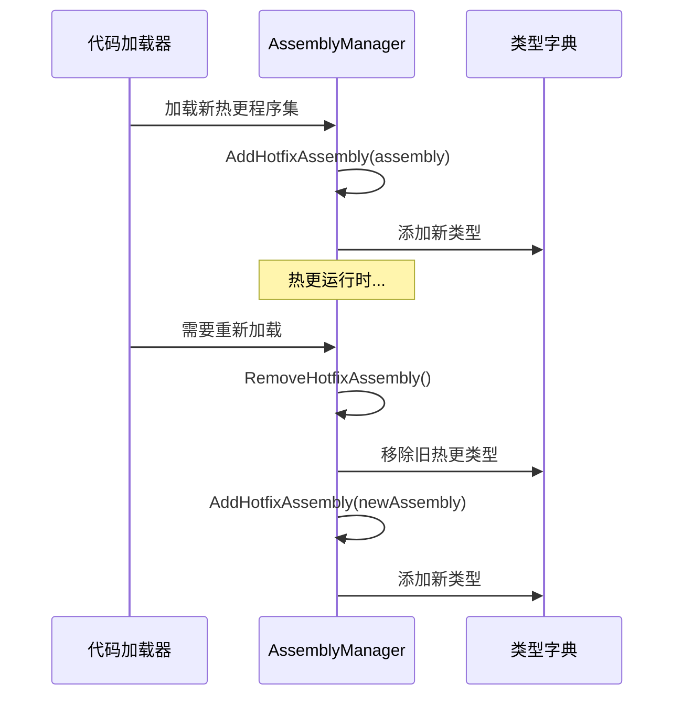

# AssemblyManager.cs 注解文档

## 文件基本信息

| 属性 | 值 |
|------|-----|
| **文件名** | AssemblyManager.cs |
| **路径** | Assets/Scripts/Mono/Module/Assembly/AssemblyManager.cs |
| **所属模块** | 框架层 → Mono/Module/Assembly |
| **命名空间** | `TaoTie` |
| **文件职责** | 管理程序集加载、类型扫描、热更新程序集管理 |

---

## 类说明

### AssemblyManager

| 属性 | 说明 |
|------|------|
| **职责** | 管理所有程序集的加载，维护类型字典，支持热更新程序集的添加和移除 |
| **单例** | `static AssemblyManager Instance` |
| **实现的接口** | `IManager` |

**设计模式**: 单例模式 + 注册表模式

---

## 字段与属性

| 名称 | 类型 | 访问级别 | 说明 |
|------|------|----------|------|
| `Instance` | `AssemblyManager` | `public static` | 全局单例 |
| `temp` | `HashSet<Assembly>` | `private` | 已加载的普通程序集 |
| `hotfixTemp` | `HashSet<Assembly>` | `private` | 已加载的热更新程序集 |
| `allTypes` | `Dictionary<string, Type>` | `private` | 全类型字典（类型全名 → Type） |
| `mapTypes` | `UnOrderMultiMap<Assembly, Type>` | `private` | 程序集 → 类型映射 |

---

## 方法说明

### Init()

**签名**:
```csharp
public void Init()
```

**职责**: 初始化程序集管理器

---

### Destroy()

**签名**:
```csharp
public void Destroy()
```

**职责**: 销毁程序集管理器，清空所有缓存

---

### GetTypes()

**签名**:
```csharp
public Dictionary<string, Type> GetTypes()
```

**职责**: 获取所有类型字典

**返回值**: `Dictionary<string, Type>` - 类型全名到 Type 的映射

**使用示例**:
```csharp
var allTypes = AssemblyManager.Instance.GetTypes();
foreach (var kvp in allTypes)
{
    Log.Info($"{kvp.Key}: {kvp.Value.Name}");
}
```

---

### AddAssembly(Assembly assembly)

**签名**:
```csharp
public void AddAssembly(Assembly assembly)
```

**职责**: 添加普通程序集

**核心逻辑**:
```
1. 检查程序集是否已加载
2. 遍历程序集的所有类型
3. 将类型加入 allTypes 字典
4. 将类型加入 mapTypes 映射
```

---

### AddHotfixAssembly(Assembly assembly)

**签名**:
```csharp
public void AddHotfixAssembly(Assembly assembly)
```

**职责**: 添加热更新程序集

**核心逻辑**:
```
1. 加入 hotfixTemp 集合
2. 调用 AddAssembly 加载类型
```

---

### RemoveHotfixAssembly()

**签名**:
```csharp
public void RemoveHotfixAssembly()
```

**职责**: 移除所有热更新程序集（用于热更重载）

**核心逻辑**:
```
1. 遍历 hotfixTemp 中的所有程序集
2. 从 allTypes 中移除该程序集的所有类型
3. 从 mapTypes 中移除程序集映射
4. 从 temp 中移除程序集
5. 清空 hotfixTemp
```

---

## 核心流程

### 热更新流程



---

## 使用示例

### 示例 1: 获取类型

```csharp
// 获取所有类型
var allTypes = AssemblyManager.Instance.GetTypes();

// 获取特定类型
if (allTypes.TryGetValue("TaoTie.ItemConfig", out var type))
{
    var config = Activator.CreateInstance(type) as ItemConfig;
}
```

### 示例 2: 热更新代码

```csharp
// 加载热更代码
Assembly hotfixAssembly = Assembly.Load(hotfixBytes);
AssemblyManager.Instance.AddHotfixAssembly(hotfixAssembly);

// ... 使用热更代码 ...

// 重新加载热更代码
AssemblyManager.Instance.RemoveHotfixAssembly();
Assembly newHotfixAssembly = Assembly.Load(newHotfixBytes);
AssemblyManager.Instance.AddHotfixAssembly(newHotfixAssembly);
```

---

## 相关文档

- [AttributeManager.cs.md](./AttributeManager.cs.md) - 属性管理器（依赖 AssemblyManager）
- [CodeLoader.cs.md](../CodeLoader/CodeLoader.cs.md) - 代码加载器（使用 AssemblyManager）
- [IManager.cs.md](../../Core/Manager/IManager.cs.md) - 管理器接口

---

*文档生成时间：2026-03-02 | OpenClaw AI 助手*
