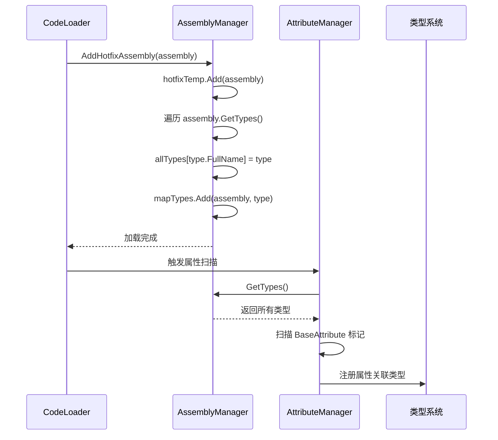
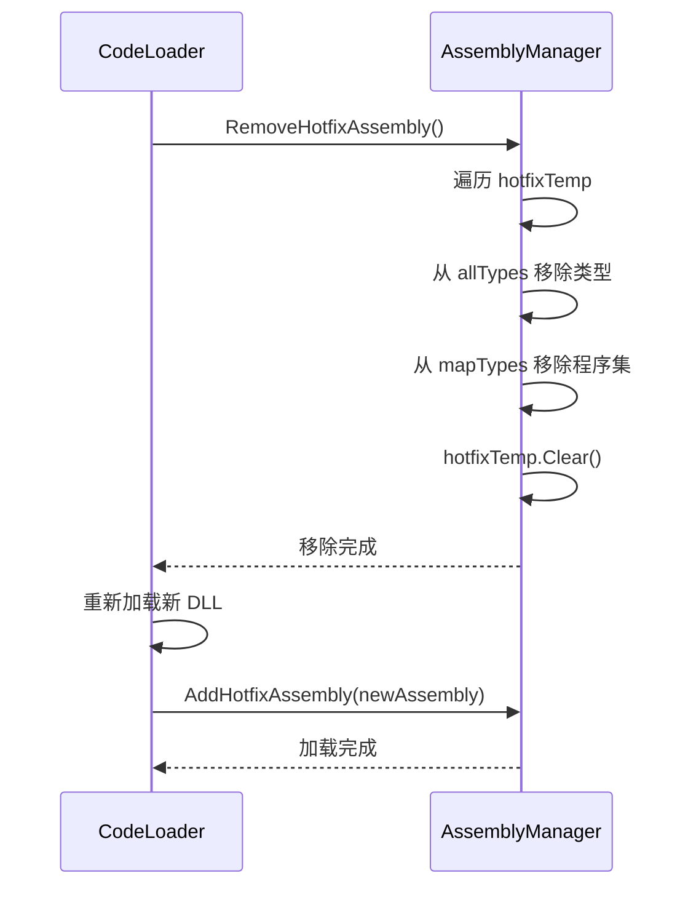

# AssemblyManager.cs 注解文档

## 文件基本信息

| 属性 | 值 |
|------|-----|
| **文件名** | AssemblyManager.cs |
| **路径** | Assets/Scripts/Mono/Module/Assembly/AssemblyManager.cs |
| **所属模块** | Mono 层 → Assembly 程序集管理 |
| **文件职责** | 管理程序集加载、类型注册、热更新程序集管理 |

---

## 类/结构体说明

### AssemblyManager

| 属性 | 说明 |
|------|------|
| **职责** | 管理项目中所有程序集的加载、类型索引和热更新程序集的生命周期 |
| **泛型参数** | 无 |
| **继承关系** | 无继承 |
| **实现的接口** | `IManager` |

**设计模式**: 单例模式 + 管理器模式

```csharp
// 单例实现
public static AssemblyManager Instance;

// 通过 ManagerProvider 注册
ManagerProvider.RegisterManager<AssemblyManager>();
```

---

## 字段与属性（按重要程度排序）

| 名称 | 类型 | 访问级别 | 说明 |
|------|------|----------|------|
| `Instance` | `AssemblyManager` | `public static` | 单例实例，全局访问点 |
| `temp` | `HashSet<Assembly>` | `private` | 已加载的程序集集合（去重） |
| `hotfixTemp` | `HashSet<Assembly>` | `private` | 热更新程序集集合（用于批量移除） |
| `allTypes` | `Dictionary<string, Type>` | `private` | 全类型索引（类型全名 → Type） |
| `mapTypes` | `UnOrderMultiMap<Assembly, Type>` | `private` | 程序集到类型的多重映射 |

---

## 方法说明（按重要程度排序）

### Init()

**签名**:
```csharp
public void Init()
```

**职责**: 初始化程序集管理器

**核心逻辑**:
```
1. 设置单例 Instance = this
2. 初始化 temp HashSet
3. 初始化 hotfixTemp HashSet
4. 初始化 allTypes Dictionary
5. 初始化 mapTypes UnOrderMultiMap
```

**调用者**: ManagerProvider.RegisterManager<AssemblyManager>()

---

### Destroy()

**签名**:
```csharp
public void Destroy()
```

**职责**: 销毁程序集管理器，清理所有缓存

**核心逻辑**:
```
1. 设置 Instance = null
2. 清空 temp
3. 清空 hotfixTemp
4. 清空 allTypes
5. 清空 mapTypes
```

**调用者**: ManagerProvider.RemoveManager<AssemblyManager>()

---

### GetTypes()

**签名**:
```csharp
public Dictionary<string, Type> GetTypes()
```

**职责**: 获取所有已注册类型的字典

**返回值**: `Dictionary<string, Type>` - 类型全名到 Type 的映射

**调用者**: AttributeManager.Init(), CodeLoader, 其他需要反射类型查找的模块

**使用示例**:
```csharp
var allTypes = AssemblyManager.Instance.GetTypes();
foreach (var item in allTypes)
{
    Type type = item.Value;
    // 处理类型
}
```

---

### AddAssembly(Assembly assembly)

**签名**:
```csharp
public void AddAssembly(Assembly assembly)
```

**职责**: 添加普通程序集并索引其所有类型

**核心逻辑**:
```
1. 检查程序集是否已存在于 temp
2. 遍历程序集的所有类型 assembly.GetTypes()
3. 将类型添加到 allTypes[type.FullName] = type
4. 将类型添加到 mapTypes.Add(assembly, type)
```

**调用者**: CodeLoader.Start(), AddHotfixAssembly()

**使用示例**:
```csharp
// 加载 AOT 程序集
Assembly aotAssembly = Assembly.Load(aotBytes, pdbBytes);
AssemblyManager.Instance.AddAssembly(aotAssembly);
```

---

### AddHotfixAssembly(Assembly assembly)

**签名**:
```csharp
public void AddHotfixAssembly(Assembly assembly)
```

**职责**: 添加热更新程序集（支持后续批量移除）

**核心逻辑**:
```
1. 将程序集添加到 hotfixTemp
2. 调用 AddAssembly(assembly) 索引类型
```

**调用者**: CodeLoader.Start()

**使用示例**:
```csharp
// 加载热更新 DLL
Assembly hotfixAssembly = Assembly.Load(hotfixBytes, hotfixPdbBytes);
AssemblyManager.Instance.AddHotfixAssembly(hotfixAssembly);
```

---

### RemoveHotfixAssembly()

**签名**:
```csharp
public void RemoveHotfixAssembly()
```

**职责**: 移除所有热更新程序集及其类型（用于热重载）

**核心逻辑**:
```
1. 遍历 hotfixTemp 中的所有程序集
2. 从 mapTypes 获取该程序集的所有类型
3. 从 allTypes 中移除这些类型
4. 从 mapTypes 移除该程序集
5. 从 temp 移除该程序集
6. 清空 hotfixTemp
```

**调用者**: CodeLoader.ReStart()（热重载时）

**使用示例**:
```csharp
// 热重载前移除旧的热更新程序集
AssemblyManager.Instance.RemoveHotfixAssembly();

// 重新加载新的热更新程序集
Assembly newHotfixAssembly = Assembly.Load(newBytes, newPdbBytes);
AssemblyManager.Instance.AddHotfixAssembly(newHotfixAssembly);
```

---

## 程序集管理流程

### 程序集加载流程



### 热重载流程



---

## 数据结构说明

### allTypes Dictionary

```csharp
private Dictionary<string, Type> allTypes;
```

**结构**:
```
{
    "TaoTie.Player": typeof(Player),
    "TaoTie.NPC": typeof(NPC),
    "TaoTie.UIManager": typeof(UIManager),
    ...
}
```

**用途**: 快速通过类型全名查找 Type 对象，用于反射创建实例。

### mapTypes UnOrderMultiMap

```csharp
private UnOrderMultiMap<Assembly, Type> mapTypes;
```

**结构**:
```
{
    Assembly_A: [Type1, Type2, Type3],
    Assembly_B: [Type4, Type5],
    ...
}
```

**用途**: 按程序集分组管理类型，支持批量移除某个程序集的所有类型。

---

## 使用示例

### 示例 1: 获取类型并创建实例

```csharp
var allTypes = AssemblyManager.Instance.GetTypes();
if (allTypes.TryGetValue("TaoTie.Player", out Type playerType))
{
    Player player = Activator.CreateInstance(playerType) as Player;
}
```

### 示例 2: 根据属性查找类型

```csharp
// 查找所有带有 ConfigAttribute 标记的类型
var allTypes = AssemblyManager.Instance.GetTypes();
foreach (var item in allTypes)
{
    Type type = item.Value;
    if (type.GetCustomAttributes(typeof(ConfigAttribute), true).Length > 0)
    {
        // 处理配置类
        LoadConfig(type);
    }
}
```

### 示例 3: 热重载场景

```csharp
// 监听文件变化，热重载代码
void OnHotfixFileChanged()
{
    // 移除旧的热更新程序集
    AssemblyManager.Instance.RemoveHotfixAssembly();
    
    // 重新加载新的 DLL
    byte[] newBytes = File.ReadAllBytes(hotfixPath);
    Assembly newAssembly = Assembly.Load(newBytes);
    AssemblyManager.Instance.AddHotfixAssembly(newAssembly);
    
    // 重新初始化
    Entry.Start();
}
```

---

## 相关文档

- [IManager.cs.md](../../Core/Manager/IManager.cs.md) - 管理器接口定义
- [ManagerProvider.cs.md](../../Core/Manager/ManagerProvider.cs.md) - 管理器注册容器
- [AttributeManager.cs.md](./AttributeManager.cs.md) - 属性管理器（依赖 AssemblyManager）
- [CodeLoader.cs.md](../CodeLoader/CodeLoader.cs.md) - 代码加载器（调用 AddHotfixAssembly）
- [UnOrderMultiMap.cs.md](../../Core/Object/UnOrderMultiMap.cs.md) - 无序多重映射数据结构

---

*文档生成时间：2026-03-02 | OpenClaw AI 助手*
