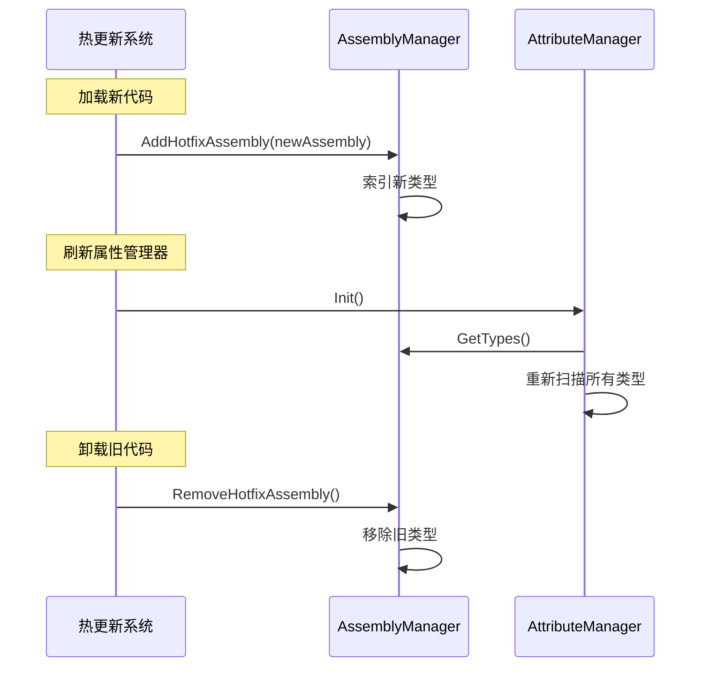

# AssemblyManager.cs 注解文档

## 文件基本信息

| 属性 | 值 |
|------|------|
| **文件名** | AssemblyManager.cs |
| **路径** | Assets/Scripts/Mono/Module/Assembly/AssemblyManager.cs |
| **所属模块** | 框架层 → Mono/Module/Assembly |
| **文件职责** | 管理程序集加载和类型索引，支持热更新程序集的添加和移除 |

---

## 类/结构体说明

### AssemblyManager

| 属性 | 说明 |
|------|------|
| **职责** | 单例模式的管理器，管理所有程序集和类型索引，支持热更新 |
| **泛型参数** | 无 |
| **继承关系** | 实现 `IManager` |
| **实现的接口** | `IManager` |

**设计模式**: 单例模式 + 管理器模式

```csharp
// 获取实例
var assemblyManager = AssemblyManager.Instance;

// 获取所有类型
var allTypes = AssemblyManager.Instance.GetTypes();

// 添加程序集
AssemblyManager.Instance.AddAssembly(hotfixAssembly);
```

---

## 字段与属性

### Instance

| 属性 | 值 |
|------|------|
| **类型** | `AssemblyManager` |
| **访问级别** | `public static` |
| **说明** | 单例实例，全局访问点 |

---

### allTypes

| 属性 | 值 |
|------|------|
| **类型** | `Dictionary<string, Type>` |
| **访问级别** | `private` |
| **说明** | 所有类型的字典，键为类型全名 |

**用途**: 快速查找类型

---

### mapTypes

| 属性 | 值 |
|------|------|
| **类型** | `UnOrderMultiMap<Assembly, Type>` |
| **访问级别** | `private` |
| **说明** | 程序集到类型的多对多映射 |

**用途**: 按程序集查找类型，支持热更新移除

---

### hotfixTemp

| 属性 | 值 |
|------|------|
| **类型** | `HashSet<Assembly>` |
| **访问级别** | `private` |
| **说明** | 热更新程序集集合 |

**用途**: 跟踪热更新程序集，便于卸载

---

## 方法说明

### Init

**签名**:
```csharp
public void Init()
```

**职责**: 初始化程序集管理器

**核心逻辑**:
```
1. 设置单例 Instance = this
2. 初始化所有集合
```

**调用者**: ManagerProvider.RegisterManager<AssemblyManager>()

---

### Destroy

**签名**:
```csharp
public void Destroy()
```

**职责**: 销毁管理器，清空所有集合

**核心逻辑**:
```
1. 设置 Instance = null
2. 清空所有集合
```

**调用者**: ManagerProvider.RemoveManager<AssemblyManager>()

---

### GetTypes

**签名**:
```csharp
public Dictionary<string, Type> GetTypes()
```

**职责**: 获取所有类型的字典

**返回值**: `Dictionary<string, Type>` - 类型字典

**调用者**: AttributeManager.Init(), 其他需要扫描类型的代码

---

### AddAssembly

**签名**:
```csharp
public void AddAssembly(Assembly assembly)
```

**职责**: 添加程序集并索引其所有类型

**核心逻辑**:
```
1. 检查程序集是否已添加
2. 遍历程序集的所有类型
3. 添加到 allTypes 字典（类型全名 → 类型）
4. 添加到 mapTypes 多对多映射（程序集 → 类型）
```

**参数**:
| 参数名 | 类型 | 说明 |
|--------|------|------|
| `assembly` | `Assembly` | 要添加的程序集 |

**调用者**: 代码加载逻辑、热更新系统

---

### AddHotfixAssembly

**签名**:
```csharp
public void AddHotfixAssembly(Assembly assembly)
```

**职责**: 添加热更新程序集（可卸载）

**核心逻辑**:
```
1. 添加到 hotfixTemp 集合
2. 调用 AddAssembly 索引类型
```

**调用者**: 热更新代码加载逻辑

---

### RemoveHotfixAssembly

**签名**:
```csharp
public void RemoveHotfixAssembly()
```

**职责**: 移除所有热更新程序集及其类型

**核心逻辑**:
```
1. 遍历 hotfixTemp 中的所有程序集
2. 从 mapTypes 获取该程序集的所有类型
3. 从 allTypes 中移除这些类型
4. 从 mapTypes 中移除程序集
5. 从 temp 中移除程序集
6. 清空 hotfixTemp
```

**调用者**: 热更新代码卸载逻辑

**用途**: 热更新时卸载旧代码，加载新代码

---

## 热更新流程



---

## 使用示例

### 示例 1: 加载程序集

```csharp
// 加载 DLL
byte[] dllBytes = LoadDllFile("Hotfix.dll");
Assembly assembly = Assembly.Load(dllBytes);

// 添加到管理器
AssemblyManager.Instance.AddAssembly(assembly);
```

### 示例 2: 热更新流程

```csharp
public async ETTask HotfixCode()
{
    // 1. 下载新代码
    byte[] newDllBytes = await DownloadHotfixDll();
    
    // 2. 卸载旧代码
    AssemblyManager.Instance.RemoveHotfixAssembly();
    
    // 3. 加载新代码
    Assembly newAssembly = Assembly.Load(newDllBytes);
    AssemblyManager.Instance.AddHotfixAssembly(newAssembly);
    
    // 4. 重新初始化属性管理器
    AttributeManager.Instance.Init();
    
    // 5. 重新初始化其他管理器
    TimerManager.Instance.InitAction();
    
    Log.Info("热更新完成");
}
```

### 示例 3: 查找类型

```csharp
// 获取所有类型
var allTypes = AssemblyManager.Instance.GetTypes();

// 查找特定类型
if (allTypes.TryGetValue("TaoTie.Player", out Type playerType))
{
    // 创建实例
    object player = Activator.CreateInstance(playerType);
}
```

---

## 设计要点

### 为什么需要 allTypes 和 mapTypes？

**allTypes** (Dictionary<string, Type>):
- 快速查找：O(1) 时间复杂度
- 通过类型全名查找

**mapTypes** (UnOrderMultiMap<Assembly, Type>):
- 按程序集查找类型
- 支持热更新时批量移除

### 为什么需要 hotfixTemp？

```csharp
private HashSet<Assembly> hotfixTemp;
```

**用途**:
- 跟踪哪些程序集是热更新的
- 卸载时只移除热更新程序集
- 保留核心程序集（不被卸载）

### 类型索引的时机

```csharp
public void AddAssembly(Assembly assembly)
{
    foreach (Type type in assembly.GetTypes())
    {
        allTypes[type.FullName] = type;  // 索引类型
        mapTypes.Add(assembly, type);     // 建立程序集关联
    }
}
```

**时机**:
- 游戏启动时：加载核心程序集
- 热更新时：加载/卸载热更新程序集

---

## 相关文档

- [AttributeManager.cs.md](./AttributeManager.cs.md) - 属性管理器（依赖 AssemblyManager）
- [BaseAttribute.cs.md](./BaseAttribute.cs.md) - 基础特性类
- [热更新文档](../../../../GITHUB_DOCS_WORKFLOW.md)

---

*文档生成时间：2026-02-28 | OpenClaw AI 助手*
