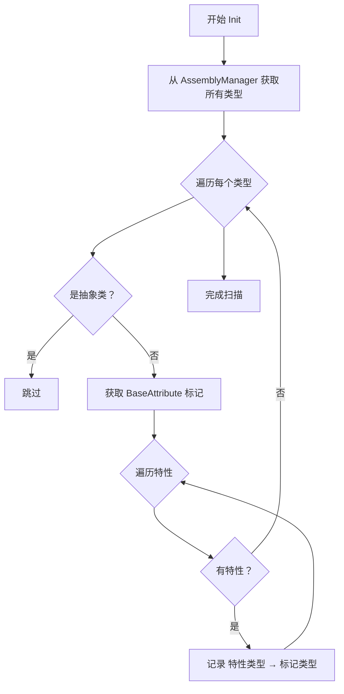

# AttributeManager.cs 注解文档

## 文件基本信息

| 属性 | 值 |
|------|------|
| **文件名** | AttributeManager.cs |
| **路径** | Assets/Scripts/Mono/Module/Assembly/AttributeManager.cs |
| **所属模块** | 框架层 → Mono/Module/Assembly |
| **文件职责** | 管理特性标记的类型，提供按特性类型查找类的功能 |

---

## 类/结构体说明

### AttributeManager

| 属性 | 说明 |
|------|------|
| **职责** | 单例模式的管理器，扫描并索引所有标记了 BaseAttribute 子类的类型 |
| **泛型参数** | 无 |
| **继承关系** | 实现 `IManager` |
| **实现的接口** | `IManager` |

**设计模式**: 单例模式 + 管理器模式 + 注册表模式

```csharp
// 获取所有标记了 [Timer] 的类
var timerTypes = AttributeManager.Instance.GetTypes(TypeInfo<TimerAttribute>.Type);

// 获取所有标记了 [Config] 的类
var configTypes = AttributeManager.Instance.GetTypes(TypeInfo<ConfigAttribute>.Type);
```

---

## 字段与属性

### Instance

| 属性 | 值 |
|------|------|
| **类型** | `AttributeManager` |
| **访问级别** | `public static` |
| **说明** | 单例实例，全局访问点 |

---

### types

| 属性 | 值 |
|------|------|
| **类型** | `UnOrderMultiMap<Type, Type>` |
| **访问级别** | `private readonly` |
| **说明** | 特性类型到标记类型的多对多映射 |

**结构**:
- Key: 特性类型（如 TimerAttribute）
- Value: 标记了该特性的类型（如 ResetTimeScale, HeartbeatTimer 等）

---

### Empty

| 属性 | 值 |
|------|------|
| **类型** | `List<Type>` |
| **访问级别** | `private readonly` |
| **说明** | 空列表，用于找不到时返回 |

**用途**: 避免返回 null，减少空检查

---

## 方法说明

### Init

**签名**:
```csharp
public void Init()
```

**职责**: 初始化，扫描所有程序集并索引特性标记的类型

**核心逻辑**:
```
1. 设置单例 Instance = this
2. 清空 types 字典
3. 从 AssemblyManager 获取所有类型
4. 遍历所有类型：
   - 跳过抽象类
   - 获取所有 BaseAttribute 标记
   - 记录特性类型和标记类型的关系
```

**调用者**: ManagerProvider.RegisterManager<AttributeManager>(), 热更新后重新初始化

---

### Destroy

**签名**:
```csharp
public void Destroy()
```

**职责**: 销毁管理器，清空索引

**核心逻辑**:
```
1. 设置 Instance = null
2. 清空 types 字典
```

**调用者**: ManagerProvider.RemoveManager<AttributeManager>()

---

### GetTypes

**签名**:
```csharp
public List<Type> GetTypes(Type systemAttributeType)
```

**职责**: 根据特性类型获取所有标记了该特性的类

**核心逻辑**:
```
1. 从 types 字典查找
2. 如果找到，返回对应的类型列表
3. 否则返回空列表
```

**参数**:
| 参数名 | 类型 | 说明 |
|--------|------|------|
| `systemAttributeType` | `Type` | 特性类型（如 typeof(TimerAttribute)） |

**返回值**: `List<Type>` - 标记了该特性的所有类型

**调用者**: TimerManager.InitAction(), ConfigManager.LoadAsync() 等

**使用示例**:
```csharp
// 获取所有定时器类
var timerTypes = AttributeManager.Instance.GetTypes(TypeInfo<TimerAttribute>.Type);

foreach (var type in timerTypes)
{
    // 创建定时器实例
    var timer = Activator.CreateInstance(type);
}
```

---

## 扫描流程



---

## 使用示例

### 示例 1: 获取定时器类型

```csharp
// TimerManager.InitAction()
var timerTypes = AttributeManager.Instance.GetTypes(TypeInfo<TimerAttribute>.Type);

foreach (var type in timerTypes)
{
    // 获取 Timer 特性的 Type 参数
    var attr = type.GetCustomAttribute<TimerAttribute>();
    
    // 注册定时器
    RegisterTimer(attr.Type, type);
}
```

### 示例 2: 获取配置类型

```csharp
// ConfigManager.LoadAsync()
var configTypes = AttributeManager.Instance.GetTypes(TypeInfo<ConfigAttribute>.Type);

foreach (var type in configTypes)
{
    // 加载配置
    LoadConfig(type);
}
```

### 示例 3: 热更新后重新扫描

```csharp
public async ETTask HotfixCode()
{
    // 1. 卸载旧代码
    AssemblyManager.Instance.RemoveHotfixAssembly();
    
    // 2. 加载新代码
    Assembly newAssembly = Assembly.Load(newDllBytes);
    AssemblyManager.Instance.AddHotfixAssembly(newAssembly);
    
    // 3. 重新扫描特性
    AttributeManager.Instance.Init();
    
    // 4. 重新注册定时器
    TimerManager.Instance.InitAction();
    
    Log.Info("热更新完成");
}
```

---

## 设计要点

### 为什么使用 UnOrderMultiMap？

```csharp
private readonly UnOrderMultiMap<Type, Type> types;
```

**原因**:
- 一个特性类型可以对应多个标记类型
- 无序，性能更好
- 支持快速查找和添加

### 为什么返回空列表而非 null？

```csharp
private readonly List<Type> Empty = new List<Type>();

public List<Type> GetTypes(Type systemAttributeType)
{
    if (this.types.TryGetValue(systemAttributeType, out var res))
        return res;
    return Empty;  // 返回空列表而非 null
}
```

**优势**:
- 调用者无需空检查
- 可以直接遍历
- 代码更简洁

### 为什么要跳过抽象类？

```csharp
if (type.IsAbstract)
{
    continue;
}
```

**原因**:
- 抽象类不能被实例化
- 特性通常标记具体实现类
- 减少不必要的扫描

---

## 相关文档

- [AssemblyManager.cs.md](./AssemblyManager.cs.md) - 程序集管理器（提供类型来源）
- [BaseAttribute.cs.md](./BaseAttribute.cs.md) - 基础特性类
- [TimerAttribute.cs.md](../Timer/TimerAttribute.cs.md) - 定时器特性
- [ConfigAttribute.cs.md](../../Code/Module/Config/ConfigAttribute.cs.md) - 配置特性

---

*文档生成时间：2026-02-28 | OpenClaw AI 助手*
