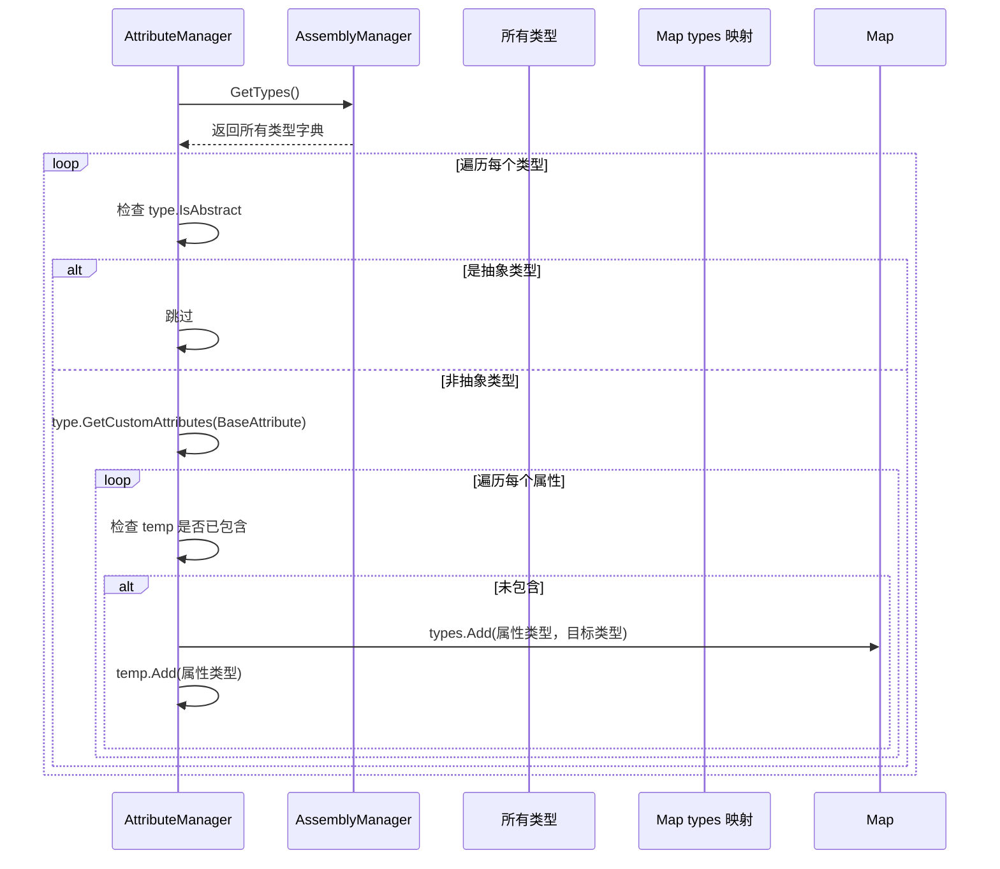
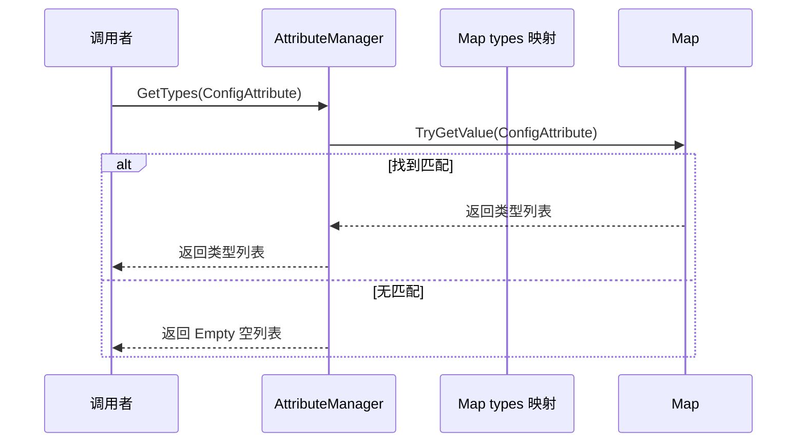
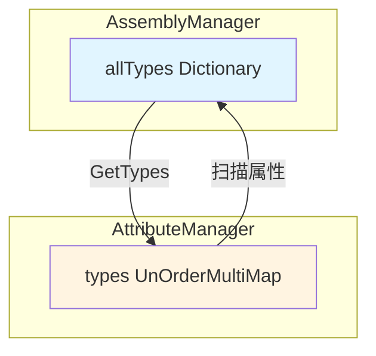

# AttributeManager.cs 注解文档

## 文件基本信息

| 属性 | 值 |
|------|-----|
| **文件名** | AttributeManager.cs |
| **路径** | Assets/Scripts/Mono/Module/Assembly/AttributeManager.cs |
| **所属模块** | Mono 层 → Assembly 程序集管理 |
| **文件职责** | 扫描并索引所有带有 BaseAttribute 标记的类型，提供按属性类型查询类型的功能 |

---

## 类/结构体说明

### AttributeManager

| 属性 | 说明 |
|------|------|
| **职责** | 扫描程序集中所有带有 BaseAttribute 标记的类型，建立属性类型到目标类型的映射关系 |
| **泛型参数** | 无 |
| **继承关系** | 无继承 |
| **实现的接口** | `IManager` |

**设计模式**: 单例模式 + 管理器模式 + 反射扫描

```csharp
// 单例实现
public static AttributeManager Instance { get; private set; }

// 通过 ManagerProvider 注册
ManagerProvider.RegisterManager<AttributeManager>();
```

---

## 字段与属性（按重要程度排序）

| 名称 | 类型 | 访问级别 | 说明 |
|------|------|----------|------|
| `Instance` | `AttributeManager` | `public static` | 单例实例，全局访问点 |
| `types` | `UnOrderMultiMap<Type, Type>` | `private readonly` | 属性类型到目标类型的多重映射 |
| `Empty` | `List<Type>` | `private readonly` | 空列表（用于无匹配时返回，避免 null 检查） |

---

## 方法说明（按重要程度排序）

### Init()

**签名**:
```csharp
public void Init()
```

**职责**: 初始化属性管理器，扫描所有程序集并建立属性 - 类型映射

**核心逻辑**:
```
1. 设置单例 Instance = this
2. 清空 types 映射
3. 创建临时 HashSet temp（用于去重）
4. 从 AssemblyManager 获取所有类型
5. 遍历所有类型：
   - 跳过抽象类型 type.IsAbstract
   - 获取类型上所有 BaseAttribute 标记
   - 对每个属性类型，将目标类型添加到 types 映射
   - 使用 temp 避免同一属性类型重复添加
```

**调用者**: ManagerProvider.RegisterManager<AttributeManager>()

**依赖**: AssemblyManager.Instance.GetTypes()

---

### Destroy()

**签名**:
```csharp
public void Destroy()
```

**职责**: 销毁属性管理器，清理映射

**核心逻辑**:
```
1. 设置 Instance = null
2. 清空 types 映射
```

**调用者**: ManagerProvider.RemoveManager<AttributeManager>()

---

### GetTypes(Type systemAttributeType)

**签名**:
```csharp
public List<Type> GetTypes(Type systemAttributeType)
```

**职责**: 根据属性类型获取所有标记了该属性的类型列表

**参数**:
- `systemAttributeType`: 要查询的属性类型（如 ConfigAttribute）

**返回值**: `List<Type>` - 所有标记了该属性的类型列表，无匹配时返回空列表

**调用者**: 配置加载器、系统初始化代码

**使用示例**:
```csharp
// 获取所有带有 ConfigAttribute 标记的配置类
List<Type> configTypes = AttributeManager.Instance.GetTypes(typeof(ConfigAttribute));
foreach (Type configType in configTypes)
{
    // 加载配置
    LoadConfig(configType);
}
```

---

## 属性扫描流程

### 初始化扫描流程



### 查询流程



---

## 数据结构说明

### types UnOrderMultiMap

```csharp
private readonly UnOrderMultiMap<Type, Type> types;
```

**结构**:
```
{
    typeof(ConfigAttribute): [typeof(PlayerConfig), typeof(ItemConfig), ...],
    typeof(SystemAttribute): [typeof(PlayerSystem), typeof(ItemSystem), ...],
    typeof(ObjectAttribute): [typeof(Player), typeof(Item), ...],
    ...
}
```

**用途**: 支持一个属性类型对应多个目标类型，用于 ECS 架构中的系统注册、配置注册等场景。

### Empty 空列表

```csharp
private readonly List<Type> Empty = new List<Type>();
```

**用途**: 避免返回 null，调用方无需进行 null 检查，直接遍历即可。

---

## 使用示例

### 示例 1: 加载所有配置类

```csharp
// 定义配置属性
[AttributeUsage(AttributeTargets.Class)]
public class ConfigAttribute : BaseAttribute { }

// 标记配置类
[Config]
public class PlayerConfig : AConfigCategory<PlayerConfig, Player> { }

[Config]
public class ItemConfig : AConfigCategory<ItemConfig, Item> { }

// 初始化时加载所有配置
List<Type> configTypes = AttributeManager.Instance.GetTypes(typeof(ConfigAttribute));
foreach (Type configType in configTypes)
{
    // 通过反射创建配置实例并加载
    object config = Activator.CreateInstance(configType);
    LoadConfig(config);
}
```

### 示例 2: 注册所有系统类

```csharp
// 定义系统属性
[AttributeUsage(AttributeTargets.Class)]
public class ObjectSystemAttribute : BaseAttribute { }

// 标记系统类
[ObjectSystem]
public class PlayerSystem : ASystem<Player, PlayerComponent> { }

[ObjectSystem]
public class ItemSystem : ASystem<Item, ItemComponent> { }

// 初始化时注册所有系统
List<Type> systemTypes = AttributeManager.Instance.GetTypes(typeof(ObjectSystemAttribute));
foreach (Type systemType in systemTypes)
{
    // 注册系统到系统管理器
    SystemManager.Register(systemType);
}
```

### 示例 3: 查找实体类型

```csharp
// 定义实体属性
[AttributeUsage(AttributeTargets.Class)]
public class EntityAttribute : BaseAttribute { }

// 获取所有实体类型
List<Type> entityTypes = AttributeManager.Instance.GetTypes(typeof(EntityAttribute));

// 创建实体工厂映射
foreach (Type entityType in entityTypes)
{
    EntityFactory.Register(entityType);
}
```

---

## 与 AssemblyManager 的关系



**说明**:
- AssemblyManager 负责加载程序集并索引所有类型
- AttributeManager 依赖 AssemblyManager 获取所有类型
- AttributeManager 扫描这些类型的属性标记并建立映射
- 两者配合实现基于属性的类型发现和注册机制

---

## 相关文档

- [IManager.cs.md](../../Core/Manager/IManager.cs.md) - 管理器接口定义
- [ManagerProvider.cs.md](../../Core/Manager/ManagerProvider.cs.md) - 管理器注册容器
- [AssemblyManager.cs.md](./AssemblyManager.cs.md) - 程序集管理器（提供类型来源）
- [BaseAttribute.cs.md](./BaseAttribute.cs.md) - 基础属性定义
- [UnOrderMultiMap.cs.md](../../Core/Object/UnOrderMultiMap.cs.md) - 无序多重映射数据结构

---

*文档生成时间：2026-03-02 | OpenClaw AI 助手*
