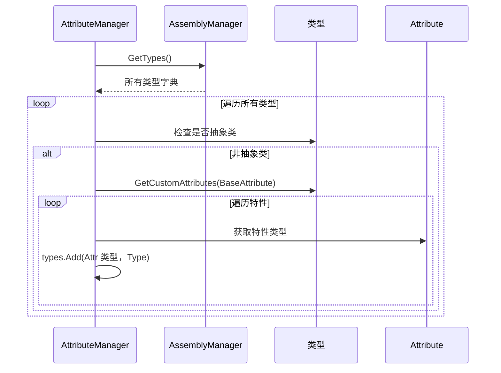

# AttributeManager.cs 注解文档

## 文件基本信息

| 属性 | 值 |
|------|-----|
| **文件名** | AttributeManager.cs |
| **路径** | Assets/Scripts/Mono/Module/Assembly/AttributeManager.cs |
| **所属模块** | 框架层 → Mono/Module/Assembly |
| **命名空间** | `TaoTie` |
| **文件职责** | 管理带有特定 Attribute 标记的类型，支持反射扫描和查询 |

---

## 类说明

### AttributeManager

| 属性 | 说明 |
|------|------|
| **职责** | 扫描所有程序集，收集带有 `BaseAttribute` 标记的类型，提供按 Attribute 类型查询的功能 |
| **单例** | `static AttributeManager Instance` |
| **实现的接口** | `IManager` |

**设计模式**: 单例模式 + 注册表模式

---

## 字段与属性

| 名称 | 类型 | 访问级别 | 说明 |
|------|------|----------|------|
| `Instance` | `AttributeManager` | `public static` | 全局单例 |
| `types` | `UnOrderMultiMap<Type, Type>` | `private readonly` | Attribute 类型 → 被标记类型的映射 |
| `Empty` | `List<Type>` | `private readonly` | 空列表缓存，避免 null 返回 |

---

## 方法说明

### Init()

**签名**:
```csharp
public void Init()
```

**职责**: 初始化属性管理器，扫描所有程序集

**核心逻辑**:
```
1. 设置单例 Instance = this
2. 清空 types 映射
3. 从 AssemblyManager 获取所有类型
4. 遍历所有类型：
   - 跳过抽象类
   - 获取类型上的所有 BaseAttribute 派生特性
   - 将特性类型 → 被标记类型 加入映射
```

**调用者**: ManagerProvider.RegisterManager<AttributeManager>()

---

### Destroy()

**签名**:
```csharp
public void Destroy()
```

**职责**: 销毁属性管理器

**核心逻辑**:
```
1. 设置 Instance = null
2. 清空 types 映射
```

---

### GetTypes(Type systemAttributeType)

**签名**:
```csharp
public List<Type> GetTypes(Type systemAttributeType)
```

**职责**: 获取带有指定 Attribute 标记的所有类型

**参数**: `systemAttributeType` - Attribute 类型

**返回值**: 类型列表，如果未找到返回空列表

**使用示例**:
```csharp
// 获取所有带有 ConfigAttribute 标记的类型
var configTypes = AttributeManager.Instance.GetTypes(typeof(ConfigAttribute));

// 获取所有带有 TimerAttribute 标记的类型
var timerTypes = AttributeManager.Instance.GetTypes(typeof(TimerAttribute));
```

---

## 核心流程

### 初始化扫描流程



---

## 使用示例

### 示例 1: 获取配置类型

```csharp
// 定义配置特性
public class ConfigAttribute : BaseAttribute
{
}

// 标记配置类
[Config]
public class ItemConfig : IConfig
{
}

[Config]
public class SkillConfig : IConfig
{
}

// 获取所有配置类型
var configTypes = AttributeManager.Instance.GetTypes(typeof(ConfigAttribute));
foreach (var type in configTypes)
{
    Log.Info($"配置类：{type.Name}");
}
```

### 示例 2: 获取定时器类型

```csharp
// 定义定时器特性
[AttributeUsage(AttributeTargets.Class)]
public class TimerAttribute : BaseAttribute
{
    public int Type;
}

// 标记定时器类
[Timer(Type = 1001)]
public class MyTimer : ITimer
{
    public void Handle(object obj) { }
}

// 获取所有定时器类型
var timerTypes = AttributeManager.Instance.GetTypes(typeof(TimerAttribute));
foreach (var type in timerTypes)
{
    var attr = type.GetCustomAttribute<TimerAttribute>();
    Log.Info($"定时器类型：{attr.Type} - {type.Name}");
}
```

### 示例 3: 实体组件注册

```csharp
// 定义组件特性
[AttributeUsage(AttributeTargets.Class)]
public class ComponentAttribute : BaseAttribute
{
}

// 标记组件类
[Component]
public class MovementComponent : IComponent { }

[Component]
public class RenderComponent : IComponent { }

// 获取所有组件类型并注册
var componentTypes = AttributeManager.Instance.GetTypes(typeof(ComponentAttribute));
foreach (var type in componentTypes)
{
    var component = Activator.CreateInstance(type) as IComponent;
    entityManager.RegisterComponent(component);
}
```

---

## 应用场景

| 场景 | 说明 |
|------|------|
| **配置系统** | 扫描所有配置类，自动加载 |
| **定时器系统** | 扫描所有定时器类，注册到 TimerManager |
| **实体组件** | 扫描所有组件类，自动注册 |
| **消息处理器** | 扫描所有消息处理类，注册到 Messager |
| **AI 决策** | 扫描所有决策节点类，构建决策树 |

---

## 相关文档

- [AssemblyManager.cs.md](./AssemblyManager.cs.md) - 程序集管理器
- [BaseAttribute.cs.md](./BaseAttribute.cs.md) - 基础特性类
- [ManagerProvider.cs.md](../../Core/Manager/ManagerProvider.cs.md) - 管理器注册

---

*文档生成时间：2026-03-02 | OpenClaw AI 助手*
