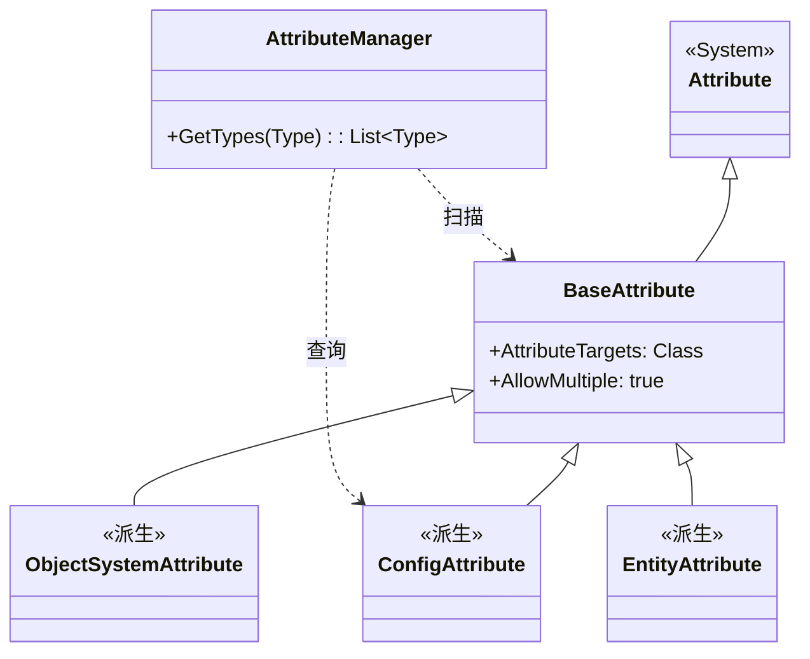

# BaseAttribute.cs 注解文档

## 文件基本信息

| 属性 | 值 |
|------|-----|
| **文件名** | BaseAttribute.cs |
| **路径** | Assets/Scripts/Mono/Module/Assembly/BaseAttribute.cs |
| **所属模块** | Mono 层 → Assembly 程序集管理 |
| **文件职责** | 定义所有自定义属性的基类，用于类型标记和反射扫描 |

---

## 类/结构体说明

### BaseAttribute

| 属性 | 说明 |
|------|------|
| **职责** | 作为所有自定义属性的基类，提供统一的类型标记机制 |
| **泛型参数** | 无 |
| **继承关系** | 继承自 `System.Attribute` |
| **实现的接口** | 无 |

**设计模式**: 标记属性（Marker Attribute）

```csharp
// 使用方式
[AttributeUsage(AttributeTargets.Class, AllowMultiple = true)]
public class BaseAttribute : Attribute { }

// 派生属性
public class ConfigAttribute : BaseAttribute { }
public class ObjectSystemAttribute : BaseAttribute { }
```

---

## 属性定义

### AttributeUsage 特性

```csharp
[AttributeUsage(AttributeTargets.Class, AllowMultiple = true)]
```

| 参数 | 值 | 说明 |
|------|-----|------|
| `AttributeTargets` | `Class` | 只能应用于类（不能用于方法、字段等） |
| `AllowMultiple` | `true` | 允许一个类上有多个相同的属性标记 |

**示例**:
```csharp
// 合法：一个类可以有多个相同属性
[Config]
[Config]
public class PlayerConfig { }

// 非法：不能用于方法
public class Test {
    [Config]  // 编译错误
    public void Method() { }
}
```

---

## 派生属性示例

### 配置类属性

```csharp
[AttributeUsage(AttributeTargets.Class)]
public class ConfigAttribute : BaseAttribute
{
}

// 使用
[Config]
public class PlayerConfig : AConfigCategory<PlayerConfig, Player> { }
```

### 系统类属性

```csharp
[AttributeUsage(AttributeTargets.Class)]
public class ObjectSystemAttribute : BaseAttribute
{
}

// 使用
[ObjectSystem]
public class PlayerSystem : ASystem<Player, PlayerComponent> { }
```

### 实体类属性

```csharp
[AttributeUsage(AttributeTargets.Class)]
public class EntityAttribute : BaseAttribute
{
}

// 使用
[Entity]
public class Player : Entity { }
```

---

## 反射扫描机制

### AttributeManager 扫描流程

```csharp
// AttributeManager.Init() 中的扫描逻辑
foreach (var item in allTypes)
{
    Type type = item.Value;
    
    if (type.IsAbstract) continue; // 跳过抽象类型
    
    // 获取所有 BaseAttribute 标记
    object[] objects = type.GetCustomAttributes(
        TypeInfo<BaseAttribute>.Type, 
        true
    );
    
    foreach (object o in objects)
    {
        Type attrType = o.GetType();
        // 建立属性类型到目标类型的映射
        this.types.Add(attrType, type);
    }
}
```

**说明**:
- 通过反射获取类上所有的 BaseAttribute 派生属性
- 建立 `属性类型 → 目标类型列表` 的映射
- 支持后续通过 `AttributeManager.GetTypes(typeof(ConfigAttribute))` 查询

---

## 使用示例

### 示例 1: 定义自定义属性

```csharp
// 定义服务注册属性
[AttributeUsage(AttributeTargets.Class)]
public class ServiceAttribute : BaseAttribute
{
    public string Name { get; set; }
    
    public ServiceAttribute(string name)
    {
        Name = name;
    }
}

// 使用属性标记服务类
[Service("PlayerService")]
public class PlayerService : IService
{
    public void Init() { }
}
```

### 示例 2: 扫描并注册服务

```csharp
// 初始化时扫描所有服务
List<Type> serviceTypes = AttributeManager.Instance.GetTypes(typeof(ServiceAttribute));

foreach (Type serviceType in serviceTypes)
{
    // 获取属性实例以读取 Name 参数
    ServiceAttribute attr = serviceType.GetCustomAttribute<ServiceAttribute>();
    
    // 创建服务实例并注册
    IService service = Activator.CreateInstance(serviceType) as IService;
    ServiceProvider.Register(attr.Name, service);
}
```

### 示例 3: 多属性标记

```csharp
// 一个类可以标记多个属性
[Config]
[Singleton]
[ThreadSafe]
public class GlobalConfig : BaseConfig
{
    // 配置内容
}

// 扫描时可以分别查询
var configs = AttributeManager.Instance.GetTypes(typeof(ConfigAttribute));
var singletons = AttributeManager.Instance.GetTypes(typeof(SingletonAttribute));
var threadSafe = AttributeManager.Instance.GetTypes(typeof(ThreadSafeAttribute));
```

---

## 设计优势

### 1. 统一的类型标记机制

所有自定义属性都继承自 BaseAttribute，AttributeManager 只需扫描一种基类即可发现所有标记类型。

### 2. 解耦声明与使用

属性标记在类定义时声明，实际注册/使用时通过反射扫描，避免了硬编码的依赖关系。

### 3. 支持批量操作

通过 `GetTypes(typeof(ConfigAttribute))` 可以一次性获取所有配置类，便于批量加载和管理。

### 4. 扩展性强

新增属性类型只需继承 BaseAttribute，无需修改扫描逻辑。

---

## 与相关类的关系



---

## 相关文档

- [AttributeManager.cs.md](./AttributeManager.cs.md) - 属性管理器（扫描和使用 BaseAttribute）
- [AssemblyManager.cs.md](./AssemblyManager.cs.md) - 程序集管理器（提供类型来源）
- [ManagerProvider.cs.md](../../Core/Manager/ManagerProvider.cs.md) - 管理器注册容器

---

*文档生成时间：2026-03-02 | OpenClaw AI 助手*
