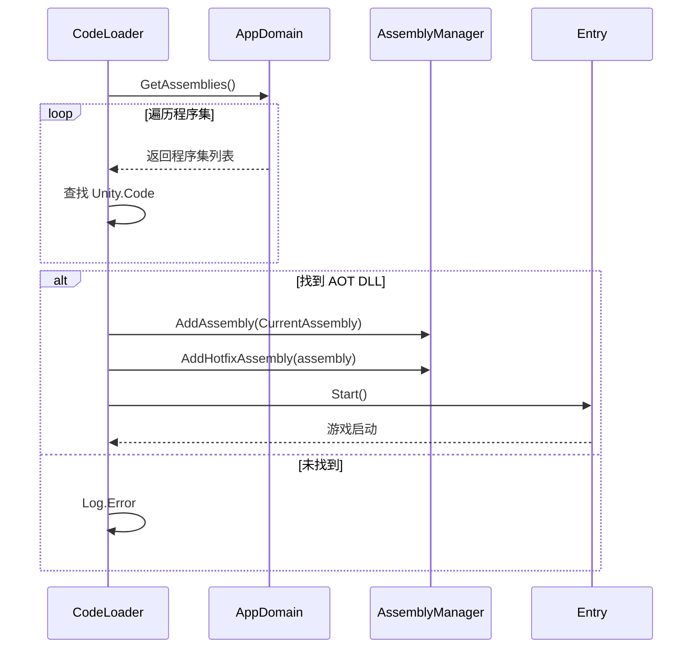
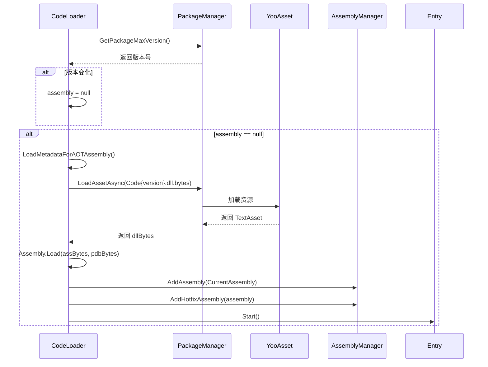
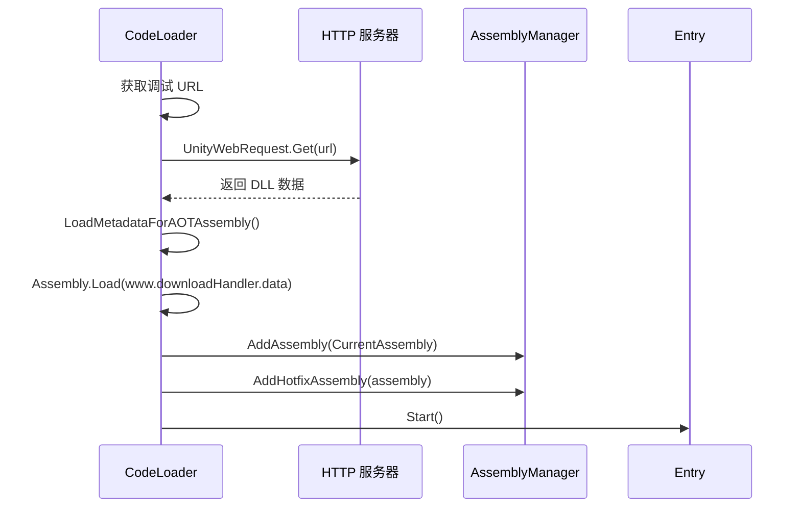
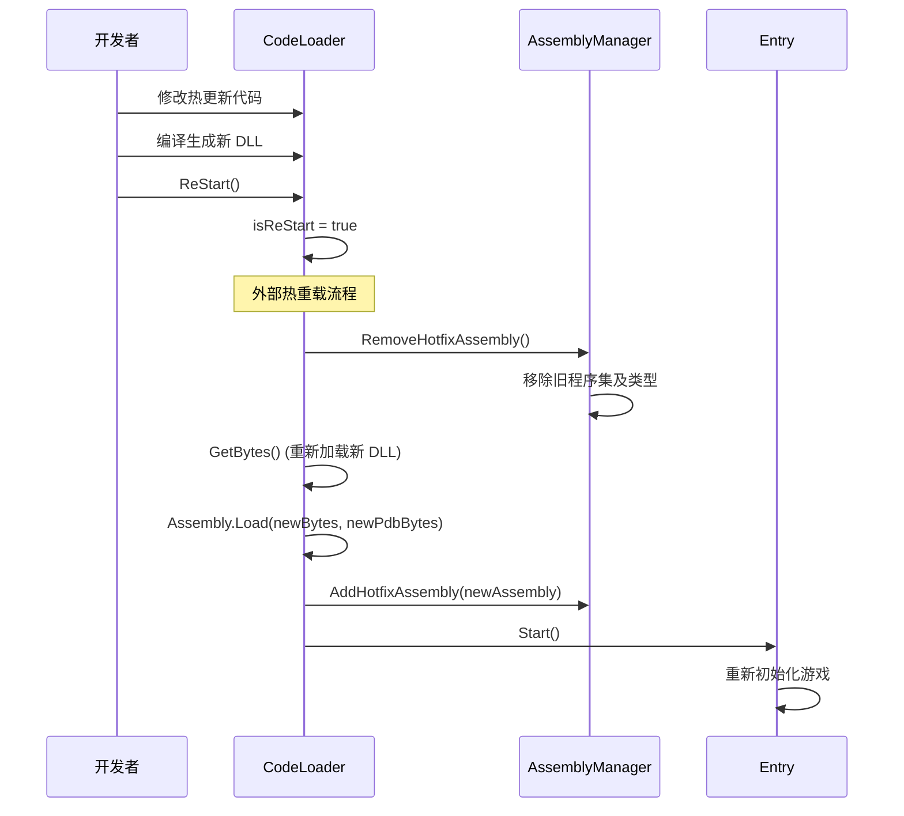

# CodeLoader.cs 注解文档

## 文件基本信息

| 属性 | 值 |
|------|-----|
| **文件名** | CodeLoader.cs |
| **路径** | Assets/Scripts/Mono/Module/CodeLoader/CodeLoader.cs |
| **所属模块** | Mono 层 → CodeLoader 代码加载 |
| **文件职责** | 负责热更新代码的加载、AOT 元数据补充、程序集加载和热重载功能 |

---

## 类/结构体说明

### CodeLoader

| 属性 | 说明 |
|------|------|
| **职责** | 管理热更新 DLL 的加载，支持多种代码模式（BuildIn/Wolong/LoadDll/LoadFromUrl），处理 AOT 泛型元数据补充 |
| **泛型参数** | 无 |
| **继承关系** | 无继承 |
| **实现的接口** | 无 |

**设计模式**: 单例模式 + 策略模式（多种加载模式）

```csharp
// 单例实现
public static CodeLoader Instance = new CodeLoader();

// 使用方式
await CodeLoader.Instance.Start();
```

---

## 字段与属性（按重要程度排序）

| 名称 | 类型 | 访问级别 | 说明 |
|------|------|----------|------|
| `Instance` | `CodeLoader` | `public static` | 单例实例，全局访问点 |
| `Update` | `Action` | `public` | Update 回调（热更新代码调用） |
| `LateUpdate` | `Action` | `public` | LateUpdate 回调 |
| `FixedUpdate` | `Action` | `public` | FixedUpdate 回调 |
| `OnApplicationQuit` | `Action` | `public` | 应用退出回调 |
| `OnApplicationFocus` | `Action<bool>` | `public` | 应用焦点变化回调 |
| `loadAOT` | `bool` | `private` | AOT 元数据是否已加载 |
| `assemblyVer` | `int` | `private` | 当前程序集版本号 |
| `assembly` | `Assembly` | `private` | 加载的热更新程序集 |
| `CodeMode` | `CodeMode` | `public` | 代码加载模式 |
| `isReStart` | `bool` | `public` | 是否热重载标志 |

---

## 代码加载模式

### CodeMode 枚举

```csharp
public enum CodeMode
{
    BuildIn,        // 内置模式：使用打包时打入 AOT 的代码
    Wolong,         // 卧龙模式：使用 HybridCLR 热更新
    LoadDll,        // 加载 DLL 模式：从资源包加载热更新 DLL
    LoadFromUrl     // 从 URL 加载：调试用，从 HTTP 加载 DLL
}
```

### 模式选择逻辑

```csharp
// 调试模式下可通过 PlayerPrefs 强制使用 LoadFromUrl
if ((Define.Debug || Debug.isDebugBuild) && 
    UnityEngine.PlayerPrefs.GetInt("DEBUG_LoadFromUrl", 0) == 1)
{
    CodeMode = CodeMode.LoadFromUrl;
}
```

---

## 方法说明（按重要程度排序）

### LoadMetadataForAOTAssembly()

**签名**:
```csharp
public async ETTask LoadMetadataForAOTAssembly(EPlayMode mode)
```

**职责**: 为 AOT 程序集补充泛型元数据（HybridCLR 特性）

**参数**:
- `mode`: YooAsset 播放模式

**核心逻辑**:
```
1. 检查是否已加载（loadAOT 标志）
2. 检查代码模式（仅 Wolong 和 LoadFromUrl 需要）
3. 遍历所有 AOT DLL 列表（System + User）
4. 加载 DLL 字节码
5. 调用 RuntimeApi.LoadMetadataForAOTAssembly()
6. 设置 loadAOT = true
```

**AOT DLL 列表**:
```csharp
public static string[] SystemAotDllList =
{
    "mscorlib.dll",
    "System.dll",
    "System.Core.dll",
    "UnityEngine.CoreModule.dll"
};

public static string[] UserAotDllList =
{
    "Unity.ThirdParty.dll",
    "Unity.Mono.dll"
};
```

**说明**: HybridCLR 需要为 AOT 程序集补充元数据，以便热更新代码可以调用 AOT 程序集中的泛型方法。

---

### Start()

**签名**:
```csharp
public async ETTask Start()
```

**职责**: 启动代码加载流程，根据 CodeMode 加载对应的程序集

**核心逻辑**:
```
1. 检查调试模式，可能强制使用 LoadFromUrl
2. 根据 CodeMode 分支处理：
   
   BuildIn 模式:
   - 从 AppDomain.CurrentDomain.GetAssemblies() 查找 Unity.Code 程序集
   - 直接使用该程序集
   
   Wolong/LoadDll 模式:
   - 检查 DLL 版本是否变化
   - 可能需要加载 AOT 元数据
   - 从资源包加载 DLL 和 PDB
   - Assembly.Load(assBytes, pdbBytes)
   
   LoadFromUrl 模式:
   - 从调试 URL 下载 DLL
   - 加载 AOT 元数据
   - Assembly.Load(www.downloadHandler.data)
   
3. 如果 assembly 加载成功：
   - 记录版本号
   - 注册程序集到 AssemblyManager
   - 调用 Entry.Start() 启动游戏
4. 如果失败：记录错误日志
```

**调用者**: 游戏启动流程

---

### GetBytes()

**签名**:
```csharp
private async ETTask<(byte[], byte[])> GetBytes()
```

**职责**: 从资源包获取热更新 DLL 和 PDB 字节码

**返回值**: `(byte[] assBytes, byte[] pdbBytes)` - DLL 和 PDB 的字节数组

**核心逻辑**:
```
1. 获取当前资源包版本号
2. 根据 PlayMode 分支：
   
   非编辑器模拟模式:
   - 从 YooAsset 加载 Code{version}.dll.bytes
   - 调试模式下同时加载 Code{version}.pdb.bytes
   
   编辑器模拟模式:
   - 从 AssetDatabase 直接加载文件
   
3. 返回 (dllBytes, pdbBytes)
```

---

### ReStart()

**签名**:
```csharp
public void ReStart()
```

**职责**: 标记需要热重载

**核心逻辑**:
```
1. 设置 isReStart = true
```

**说明**: 外部调用此方法标记热重载请求，实际重载逻辑在外部流程中处理（移除旧程序集 → 重新加载新程序集 → 重新调用 Start()）。

---

## 代码加载流程

### BuildIn 模式流程



### Wolong/LoadDll 模式流程



### LoadFromUrl 模式流程



---

## 热重载机制

### 热重载流程



### 编辑器热重载设置

```csharp
// 在 Unity 编辑器中启用热重载调试
// 设置 PlayerPrefs
PlayerPrefs.SetInt("DEBUG_LoadFromUrl", 1);
PlayerPrefs.SetString("DEBUG_LoadFromUrlPath", "http://localhost:8080/cdn/");
```

---

## 使用示例

### 示例 1: 标准启动流程

```csharp
// 游戏入口
async ETTask StartGame()
{
    // 初始化资源管理器
    await PackageManager.Instance.Initialize();
    
    // 启动代码加载
    await CodeLoader.Instance.Start();
    
    // CodeLoader 会调用 Entry.Start() 启动游戏
}
```

### 示例 2: 使用 LoadFromUrl 调试

```csharp
// 编辑器下设置调试参数
#if UNITY_EDITOR
[MenuItem("Tools/Set LoadFromUrl")]
static void SetLoadFromUrl()
{
    UnityEngine.PlayerPrefs.SetInt("DEBUG_LoadFromUrl", 1);
    UnityEngine.PlayerPrefs.SetString("DEBUG_LoadFromUrlPath", 
        "http://127.0.0.1:8081/cdn/");
    UnityEngine.PlayerPrefs.Save();
    Log.Info("已设置 LoadFromUrl 模式");
}

[MenuItem("Tools/Clear LoadFromUrl")]
static void ClearLoadFromUrl()
{
    UnityEngine.PlayerPrefs.SetInt("DEBUG_LoadFromUrl", 0);
    UnityEngine.PlayerPrefs.Save();
    Log.Info("已清除 LoadFromUrl 设置");
}
#endif
```

### 示例 3: 监听生命周期回调

```csharp
// 在热更新代码中注册生命周期回调
void RegisterCallbacks()
{
    CodeLoader.Instance.Update += OnUpdate;
    CodeLoader.Instance.LateUpdate += OnLateUpdate;
    CodeLoader.Instance.FixedUpdate += OnFixedUpdate;
    CodeLoader.Instance.OnApplicationQuit += OnQuit;
    CodeLoader.Instance.OnApplicationFocus += OnFocus;
}

void OnUpdate()
{
    // 每帧更新逻辑
}

void OnQuit()
{
    // 保存数据等清理工作
}
```

---

## AOT 泛型支持

### 为什么需要 LoadMetadataForAOTAssembly

**问题**: 在 IL2CPP 构建中，AOT 程序集的泛型方法只有被 AOT 代码使用时才会生成原生实现。热更新代码（热更 DLL）中使用 AOT 泛型方法会导致运行时错误。

**解决方案**: HybridCLR 提供 `LoadMetadataForAOTAssembly` 方法，为 AOT 程序集补充完整的泛型元数据。当热更新代码调用 AOT 泛型方法时，如果原生实现不存在，HybridCLR 会自动使用解释模式执行。

**示例**:
```csharp
// AOT 程序集中的泛型方法
public class AOTClass
{
    public static void GenericMethod<T>() { }
}

// 热更新代码调用
// 如果没有补充元数据，会报错
// 调用 LoadMetadataForAOTAssembly 后可以正常执行
AOTClass.GenericMethod<HotfixType>();
```

---

## 相关文档

- [AssemblyManager.cs.md](../Assembly/AssemblyManager.cs.md) - 程序集管理器
- [IStaticMethod.cs.md](./IStaticMethod.cs.md) - 静态方法接口
- [MonoStaticMethod.cs.md](./MonoStaticMethod.cs.md) - Mono 反射实现
- [PackageManager.cs.md](../YooAssets/PackageManager.cs.md) - 资源包管理器
- [Define.cs.md](../../Define.cs.md) - 全局配置（AOTLoadDir 等）

---

*文档生成时间：2026-03-02 | OpenClaw AI 助手*
