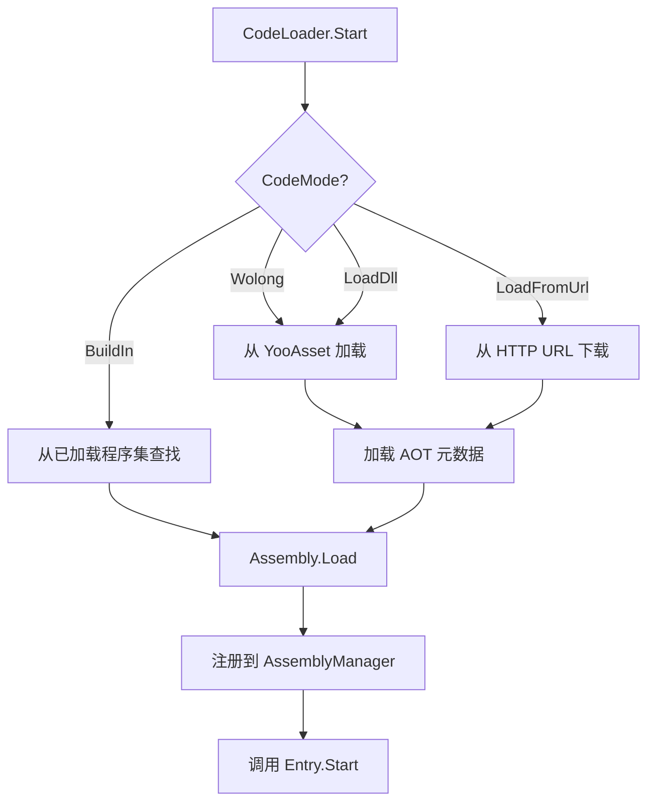
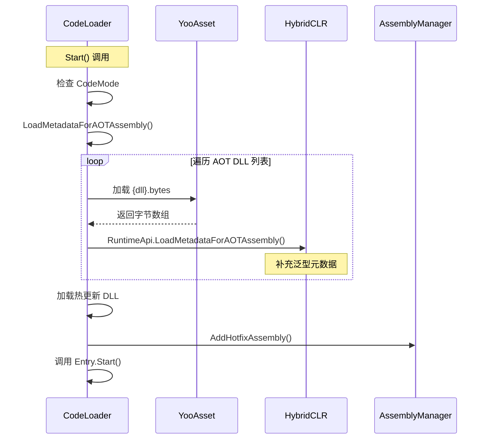

# CodeLoader.cs 注解文档

## 文件基本信息

| 属性 | 值 |
|------|------|
| **文件名** | CodeLoader.cs |
| **路径** | Assets/Scripts/Mono/Module/CodeLoader/CodeLoader.cs |
| **所属模块** | 框架层 → Mono/Module/CodeLoader |
| **文件职责** | 热更新代码加载器，支持 AOT 元数据补充、多种代码加载模式 |

---

## 类/结构体说明

### CodeLoader

| 属性 | 说明 |
|------|------|
| **职责** | 负责热更新 DLL 的加载、AOT 元数据补充、程序集管理 |
| **泛型参数** | 无 |
| **继承关系** | 无 |
| **实现的接口** | 无 |

**设计模式**: 单例模式 + 策略模式（多种加载模式）

```csharp
// 获取实例
var codeLoader = CodeLoader.Instance;

// 设置加载模式
codeLoader.CodeMode = CodeMode.LoadDll;

// 启动加载
await codeLoader.Start();
```

---

## 字段与属性

### Instance

| 属性 | 值 |
|------|------|
| **类型** | `CodeLoader` |
| **访问级别** | `public static` |
| **说明** | 单例实例，全局访问点 |

---

### Update / LateUpdate / FixedUpdate

| 属性 | 值 |
|------|------|
| **类型** | `Action` |
| **访问级别** | `public` |
| **说明** | 生命周期回调委托，由热更新代码设置 |

**用途**: 热更新代码注册自己的 Update 循环

---

### OnApplicationQuit / OnApplicationFocus

| 属性 | 值 |
|------|------|
| **类型** | `Action` / `Action<bool>` |
| **访问级别** | `public` |
| **说明** | 应用生命周期事件回调 |

---

### CodeMode

| 属性 | 值 |
|------|------|
| **类型** | `CodeMode` |
| **访问级别** | `public` |
| **说明** | 代码加载模式（BuildIn/Wolong/LoadDll/LoadFromUrl） |

**用途**: 决定使用哪种方式加载热更新代码

---

### assembly

| 属性 | 值 |
|------|------|
| **类型** | `Assembly` |
| **访问级别** | `private` |
| **说明** | 已加载的热更新程序集 |

---

### AllAotDllList / SystemAotDllList / UserAotDllList

| 属性 | 值 |
|------|------|
| **类型** | `List<string>` / `string[]` |
| **访问级别** | `public static` |
| **说明** | AOT DLL 列表，用于元数据补充 |

**系统 AOT DLL**:
- `mscorlib.dll`
- `System.dll`
- `System.Core.dll`
- `UnityEngine.CoreModule.dll`

**用户 AOT DLL**:
- `Unity.ThirdParty.dll`
- `Unity.Mono.dll`

---

## 方法说明

### LoadMetadataForAOTAssembly

**签名**:
```csharp
public async ETTask LoadMetadataForAOTAssembly(EPlayMode mode)
```

**职责**: 为 AOT 程序集加载原始 metadata，使 AOT 泛型函数可以自动替换为解释模式执行

**核心逻辑**:
```
1. 检查是否已加载（loadAOT 标志）
2. 检查 CodeMode 是否支持（Wolong 或 LoadFromUrl）
3. 遍历所有 AOT DLL 列表
4. 加载 DLL 字节（编辑器模式从 AssetDatabase，其他模式从 YooAsset）
5. 调用 RuntimeApi.LoadMetadataForAOTAssembly 补充元数据
6. 设置 loadAOT = true
```

**参数**:
| 参数名 | 类型 | 说明 |
|--------|------|------|
| `mode` | `EPlayMode` | 游戏运行模式 |

**调用者**: Start()

**用途**: HybridCLR 热更新必需步骤，补充 AOT 程序集的泛型元数据

---

### Start

**签名**:
```csharp
public async ETTask Start()
```

**职责**: 启动代码加载流程，根据 CodeMode 加载热更新 DLL

**核心逻辑**:
```
1. 检查调试模式（DEBUG_LoadFromUrl）
2. 根据 CodeMode 选择加载策略：
   - BuildIn: 从已加载的程序集中查找 Unity.Code
   - Wolong/LoadDll: 从 YooAsset 加载 DLL 和 PDB
   - LoadFromUrl: 从 HTTP URL 下载 DLL
3. 加载 AOT 元数据
4. 加载程序集（Assembly.Load）
5. 注册到 AssemblyManager
6. 调用 Entry.Start 启动热更新代码
```

**调用者**: Init.cs 或游戏入口

---

### GetBytes

**签名**:
```csharp
private async ETTask<(byte[], byte[])> GetBytes()
```

**职责**: 从 YooAsset 或编辑器资源目录加载 DLL 和 PDB 字节

**返回值**: `(byte[] assBytes, byte[] pdbBytes)` - DLL 和 PDB 字节数组

**核心逻辑**:
```
1. 获取当前包版本
2. 非编辑器模式：从 YooAsset 加载 Code{version}.dll.bytes 和 .pdb.bytes
3. 编辑器模式：从 AssetDatabase 加载
4. 返回字节数组元组
```

**调用者**: Start()

---

### ReStart

**签名**:
```csharp
public void ReStart()
```

**职责**: 标记需要重启热更新代码

**核心逻辑**:
```
1. 设置 isReStart = true
```

**调用者**: 热更新触发逻辑

**用途**: 代码热更新后，通知系统重新初始化

---

## 代码加载模式



### CodeMode 枚举说明

| 模式 | 说明 | 使用场景 |
|------|------|----------|
| **BuildIn** | 使用内置 AOT 程序集 | 开发调试、无热更新需求 |
| **Wolong** | 卧隆平台热更新模式 | 卧隆平台发布 |
| **LoadDll** | 从 YooAsset 加载 DLL | 标准热更新流程 |
| **LoadFromUrl** | 从 HTTP URL 下载 | 开发调试、灰度测试 |

---

## 使用示例

### 示例 1: 标准热更新启动

```csharp
// 在 Init.cs 或游戏入口
public async ETTask Start()
{
    // 设置加载模式
    CodeLoader.Instance.CodeMode = CodeMode.LoadDll;
    
    // 启动代码加载
    await CodeLoader.Instance.Start();
    
    // 热更新代码已加载，Entry.Start 已调用
}
```

### 示例 2: 调试模式从 URL 加载

```csharp
// 设置调试参数
PlayerPrefs.SetInt("DEBUG_LoadFromUrl", 1);
PlayerPrefs.SetString("DEBUG_LoadFromUrlPath", "http://127.0.0.1:8081/cdn/");

// CodeLoader 会自动检测并使用 LoadFromUrl 模式
await CodeLoader.Instance.Start();
```

### 示例 3: 卧隆平台热更新

```csharp
// 设置卧隆模式
CodeLoader.Instance.CodeMode = CodeMode.Wolong;

// 启动（会自动加载 AOT 元数据）
await CodeLoader.Instance.Start();
```

### 示例 4: 热更新代码重启

```csharp
// 下载新代码后
if (newVersion > currentVersion)
{
    // 标记重启
    CodeLoader.Instance.ReStart();
    
    // 在 Update 中检测 isReStart 并重新加载
}
```

---

## AOT 元数据补充流程



---

## 设计要点

### 为什么需要 AOT 元数据补充？

**问题**: HybridCLR 热更新中，AOT 程序集（如 mscorlib）的泛型函数如果没有 native 实现，会导致运行时错误。

**解决方案**:
```csharp
var err = RuntimeApi.LoadMetadataForAOTAssembly(dllBytes, HomologousImageMode.SuperSet);
```

**作用**: 
- 为 AOT 程序集补充完整的 metadata
- 泛型函数缺失 native 实现时，自动使用解释模式执行
- 确保热更新代码可以正常使用所有泛型

### 为什么支持多种加载模式？

**BuildIn**: 
- 开发调试快速启动
- 无需热更新的场景

**Wolong/LoadDll**: 
- 生产环境标准流程
- 从 YooAsset 资源管理系统加载

**LoadFromUrl**:
- 开发调试（本地服务器）
- 灰度测试（特定用户群）
- 紧急热修复

### 版本管理

```csharp
int version = PackageManager.Instance.Config.GetPackageMaxVersion(Define.DefaultName);
if (this.assemblyVer != version) // DLL 版本不同
{
    assembly = null; // 强制重新加载
}
```

**用途**: 
- 检测资源版本变化
- 版本不同时重新加载 DLL
- 避免缓存旧代码

---

## 相关文档

- [IStaticMethod.cs.md](./IStaticMethod.cs.md) - 静态方法接口定义
- [MonoStaticMethod.cs.md](./MonoStaticMethod.cs.md) - 反射静态方法实现
- [AssemblyManager.cs.md](../Assembly/AssemblyManager.cs.md) - 程序集管理器
- [PackageManager.cs.md](../YooAssets/PackageManager.cs.md) - 资源包管理器

---

*文档生成时间：2026-03-01 | OpenClaw AI 助手*
