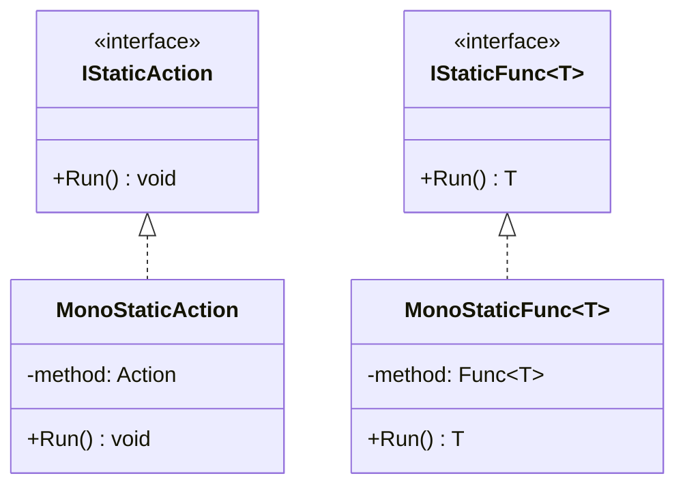

# IStaticMethod.cs 注解文档

## 文件基本信息

| 属性 | 值 |
|------|-----|
| **文件名** | IStaticMethod.cs |
| **路径** | Assets/Scripts/Mono/Module/CodeLoader/IStaticMethod.cs |
| **所属模块** | Mono 层 → CodeLoader 代码加载 |
| **文件职责** | 定义静态方法调用的接口，用于通过反射调用热更新程序集中的静态方法 |

---

## 接口说明

### IStaticAction

| 属性 | 说明 |
|------|------|
| **职责** | 无参数无返回值的静态方法接口 |
| **泛型参数** | 无 |
| **继承关系** | 无继承 |

**方法**:
```csharp
public interface IStaticAction
{
    public void Run();
}
```

**用途**: 用于调用热更新程序集中的静态无参无返回值方法，如 `Entry.Start()`。

---

### IStaticFunc<T>

| 属性 | 说明 |
|------|------|
| **职责** | 无参数有返回值的静态方法接口 |
| **泛型参数** | `T` - 返回值类型 |
| **继承关系** | 无继承 |

**方法**:
```csharp
public interface IStaticFunc<T>
{
    public T Run();
}
```

**用途**: 用于调用热更新程序集中的静态无参有返回值方法。

---

## 设计目的

### 解耦反射调用

通过接口抽象，将反射创建和调用分离：

```csharp
// 创建阶段（使用反射）
IStaticAction start = new MonoStaticAction(assembly, "TaoTie.Entry", "Start");

// 调用阶段（无需反射）
start.Run();
```

**优势**:
- 反射只在创建时发生一次
- 后续调用直接使用委托，性能更高
- 接口统一，便于扩展

---

## 使用示例

### 示例 1: 调用 Entry.Start()

```csharp
// CodeLoader.Start() 中
if (assembly != null)
{
    // 创建静态方法调用包装
    IStaticAction start = new MonoStaticAction(
        assembly,           // 程序集
        "TaoTie.Entry",     // 类型全名
        "Start"             // 方法名
    );
    
    // 调用方法
    start.Run();
}
```

### 示例 2: 调用有返回值的静态方法

```csharp
// 假设热更新程序集中有：
// public static int GetVersion() { return 100; }

IStaticFunc<int> getVersion = new MonoStaticFunc<int>(
    assembly,
    "TaoTie.VersionInfo",
    "GetVersion"
);

int version = getVersion.Run();  // 返回 100
```

### 示例 3: 扩展自定义接口

```csharp
// 定义带参数的接口
public interface IStaticAction<T1>
{
    public void Run(T1 arg1);
}

// 实现
public class MonoStaticAction<T1> : IStaticAction<T1>
{
    private Action<T1> method;
    
    public MonoStaticAction(Assembly assembly, string typeName, string methodName)
    {
        var methodInfo = assembly.GetType(typeName).GetMethod(methodName);
        this.method = (Action<T1>)Delegate.CreateDelegate(
            typeof(Action<T1>), 
            null, 
            methodInfo
        );
    }
    
    public void Run(T1 arg1)
    {
        this.method(arg1);
    }
}

// 使用
IStaticAction<string> log = new MonoStaticAction<string>(
    assembly,
    "TaoTie.Log",
    "Info"
);
log.Run("Hello World");
```

---

## 与 MonoStaticMethod 的关系



**说明**:
- `IStaticAction` / `IStaticFunc<T>` 是接口定义
- `MonoStaticAction` / `MonoStaticFunc<T>` 是具体实现
- 通过反射创建实现类实例，后续调用无需反射

---

## 性能优势

### 反射 vs 委托

```csharp
// 方式 1: 每次调用都反射（慢）
void CallStart(Assembly assembly)
{
    for (int i = 0; i < 1000; i++)
    {
        var method = assembly.GetType("TaoTie.Entry").GetMethod("Start");
        method.Invoke(null, null);  // 每次都反射
    }
}

// 方式 2: 反射一次，委托调用多次（快）
IStaticAction start = new MonoStaticAction(assembly, "TaoTie.Entry", "Start");
for (int i = 0; i < 1000; i++)
{
    start.Run();  // 直接委托调用
}
```

**性能差异**: 委托调用比反射调用快约 10-100 倍。

---

## 相关文档

- [MonoStaticMethod.cs.md](./MonoStaticMethod.cs.md) - Mono 反射实现
- [CodeLoader.cs.md](./CodeLoader.cs.md) - 代码加载器（使用 IStaticAction）
- [AssemblyManager.cs.md](../Assembly/AssemblyManager.cs.md) - 程序集管理器

---

*文档生成时间：2026-03-02 | OpenClaw AI 助手*
