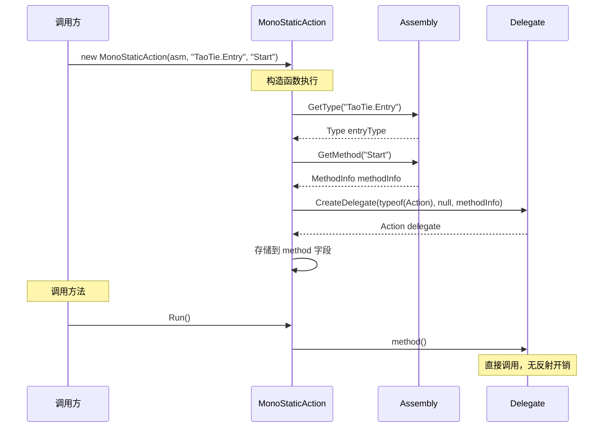

# MonoStaticMethod.cs 注解文档

## 文件基本信息

| 属性 | 值 |
|------|------|
| **文件名** | MonoStaticMethod.cs |
| **路径** | Assets/Scripts/Mono/Module/CodeLoader/MonoStaticMethod.cs |
| **所属模块** | 框架层 → Mono/Module/CodeLoader |
| **文件职责** | 实现 IStaticAction 和 IStaticFunc<T> 接口，通过反射调用热更新代码的静态方法 |

---

## 类/结构体说明

### MonoStaticAction

| 属性 | 说明 |
|------|------|
| **职责** | 实现 IStaticAction，调用无参数无返回值的静态方法 |
| **泛型参数** | 无 |
| **继承关系** | 实现 `IStaticAction` |
| **实现的接口** | `IStaticAction` |

**设计模式**: 适配器模式 + 委托模式

```csharp
// 使用示例
IStaticAction start = new MonoStaticAction(assembly, "TaoTie.Entry", "Start");
start.Run();
```

---

### MonoStaticFunc<T>

| 属性 | 说明 |
|------|------|
| **职责** | 实现 IStaticFunc<T>，调用无参数有返回值的静态方法 |
| **泛型参数** | `T` - 返回值类型 |
| **继承关系** | 实现 `IStaticFunc<T>` |
| **实现的接口** | `IStaticFunc<T>` |

```csharp
// 使用示例
IStaticFunc<int> getVersion = new MonoStaticFunc<int>(assembly, "TaoTie.Version", "GetVersion");
int version = getVersion.Run();
```

---

## 字段与属性

### MonoStaticAction.method

| 属性 | 值 |
|------|------|
| **类型** | `Action` |
| **访问级别** | `private` |
| **说明** | 绑定的静态方法委托 |

**用途**: 存储反射创建的方法委托，Run() 时直接调用

---

### MonoStaticFunc<T>.method

| 属性 | 值 |
|------|------|
| **类型** | `Func<T>` |
| **访问级别** | `private` |
| **说明** | 绑定的静态方法委托 |

**用途**: 存储反射创建的方法委托，Run() 时直接调用并返回结果

---

## 方法说明

### MonoStaticAction 构造函数

**签名**:
```csharp
public MonoStaticAction(Assembly assembly, string typeName, string methodName)
```

**职责**: 通过反射获取静态方法并创建委托

**核心逻辑**:
```
1. 通过 assembly.GetType(typeName) 获取类型
2. 通过 GetMethod(methodName) 获取方法信息
3. 通过 Delegate.CreateDelegate 创建委托
4. 存储到 method 字段
```

**参数**:
| 参数名 | 类型 | 说明 |
|--------|------|------|
| `assembly` | `Assembly` | 程序集（热更新 DLL） |
| `typeName` | `string` | 类型全名（如 "TaoTie.Entry"） |
| `methodName` | `string` | 方法名（如 "Start"） |

**调用者**: CodeLoader.Start()

---

### MonoStaticAction.Run

**签名**:
```csharp
public void Run()
```

**职责**: 执行绑定的静态方法

**核心逻辑**:
```
1. 调用 method() 委托
```

**调用者**: CodeLoader.Start()

**用途**: 启动热更新代码入口

---

### MonoStaticFunc<T> 构造函数

**签名**:
```csharp
public MonoStaticFunc(Assembly assembly, string typeName, string methodName)
```

**职责**: 通过反射获取静态方法并创建委托

**核心逻辑**:
```
1. 通过 assembly.GetType(typeName) 获取类型
2. 通过 GetMethod(methodName) 获取方法信息
3. 通过 Delegate.CreateDelegate 创建 Func<T> 委托
4. 存储到 method 字段
```

**参数**:
| 参数名 | 类型 | 说明 |
|--------|------|------|
| `assembly` | `Assembly` | 程序集 |
| `typeName` | `string` | 类型全名 |
| `methodName` | `string` | 方法名 |

---

### MonoStaticFunc<T>.Run

**签名**:
```csharp
public T Run()
```

**职责**: 执行绑定的静态方法并返回结果

**返回值**: `T` - 方法返回值

**核心逻辑**:
```
1. 调用 method() 委托
2. 返回结果
```

---

## 反射绑定流程



---

## 使用示例

### 示例 1: 调用 Entry.Start（CodeLoader 中）

```csharp
// CodeLoader.Start() 中
if (assembly != null)
{
    this.assemblyVer = PackageManager.Instance.Config.GetPackageMaxVersion(Define.DefaultName);
    AssemblyManager.Instance.AddAssembly(GetType().Assembly);
    AssemblyManager.Instance.AddHotfixAssembly(assembly);
    
    // 创建静态方法调用器
    IStaticAction start = new MonoStaticAction(assembly, "TaoTie.Entry", "Start");
    start.Run(); // 调用热更新入口
}
```

### 示例 2: 调用静态工厂方法

```csharp
// 假设热更新代码中有：
// public class PlayerFactory { public static Player Create() { ... } }

IStaticFunc<Player> factory = new MonoStaticFunc<Player>(
    assembly, 
    "TaoTie.PlayerFactory", 
    "Create"
);
Player player = factory.Run();
```

### 示例 3: 调用静态配置加载方法

```csharp
// 假设热更新代码中有：
// public class ConfigLoader { public static Config Load(string path) { ... } }

// 注意：当前实现只支持无参方法，带参方法需要扩展接口
IStaticFunc<Config> loadConfig = new MonoStaticFunc<Config>(
    assembly,
    "TaoTie.ConfigLoader",
    "LoadDefault"  // 无参版本
);
Config config = loadConfig.Run();
```

---

## 设计要点

### 为什么使用 Delegate.CreateDelegate？

```csharp
// 方式 1: 每次调用都反射（慢）
var method = type.GetMethod("Start");
method.Invoke(null, null);  // 每次都要反射查找

// 方式 2: 预先创建委托（快）
var method = type.GetMethod("Start");
var del = (Action)Delegate.CreateDelegate(typeof(Action), null, method);
del();  // 直接调用，无反射开销
```

**性能对比**:
- 反射调用：~1000ns/次
- 委托调用：~5ns/次
- **性能提升约 200 倍**

### 为什么需要静态方法？

**热更新入口必须是静态方法**:
```csharp
public class Entry
{
    public static void Start()  // ✅ 静态方法
    {
        // 热更新代码入口
    }
}
```

**原因**:
1. 无法创建实例（类型在运行时才加载）
2. 静态方法可以直接调用，无需实例
3. 符合热更新框架的设计模式

### 类型安全

```csharp
// MonoStaticFunc<T> 确保返回值类型正确
IStaticFunc<int> func = new MonoStaticFunc<int>(assembly, "TaoTie.Math", "GetAnswer");
int answer = func.Run();  // 类型安全

// 如果实际返回值不是 int，会在创建委托时抛出异常
```

---

## 扩展建议

### 添加带参数的实现

```csharp
// 接口
public interface IStaticAction<T1>
{
    void Run(T1 arg1);
}

// 实现
public class MonoStaticAction<T1> : IStaticAction<T1>
{
    private Action<T1> method;
    
    public MonoStaticAction(Assembly assembly, string typeName, string methodName)
    {
        var methodInfo = assembly.GetType(typeName).GetMethod(methodName);
        this.method = (Action<T1>)Delegate.CreateDelegate(typeof(Action<T1>), null, methodInfo);
    }
    
    public void Run(T1 arg1)
    {
        this.method(arg1);
    }
}
```

### 添加实例方法调用

```csharp
public interface IInstanceAction
{
    void Run(object instance);
}

public class MonoInstanceAction : IInstanceAction
{
    private Action<object> method;
    
    public MonoInstanceAction(Assembly assembly, string typeName, string methodName)
    {
        var methodInfo = assembly.GetType(typeName).GetMethod(methodName);
        this.method = (Action<object>)Delegate.CreateDelegate(
            typeof(Action<object>), 
            null, 
            methodInfo
        );
    }
    
    public void Run(object instance)
    {
        this.method(instance);
    }
}
```

---

## 相关文档

- [CodeLoader.cs.md](./CodeLoader.cs.md) - 代码加载器（使用这些类）
- [IStaticMethod.cs.md](./IStaticMethod.cs.md) - 接口定义
- [AssemblyManager.cs.md](../Assembly/AssemblyManager.cs.md) - 程序集管理器

---

*文档生成时间：2026-03-01 | OpenClaw AI 助手*
