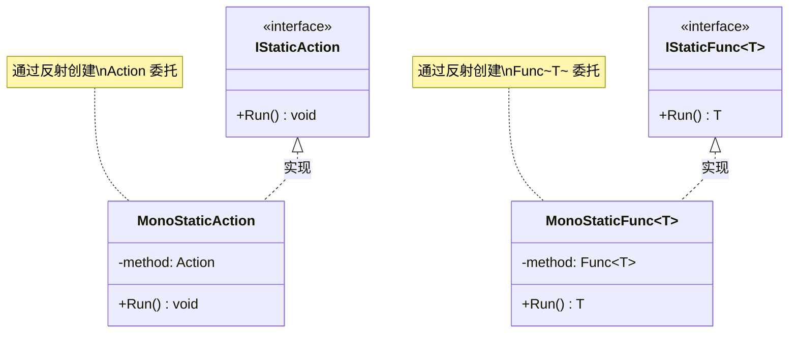

# MonoStaticMethod.cs 注解文档

## 文件基本信息

| 属性 | 值 |
|------|-----|
| **文件名** | MonoStaticMethod.cs |
| **路径** | Assets/Scripts/Mono/Module/CodeLoader/MonoStaticMethod.cs |
| **所属模块** | Mono 层 → CodeLoader 代码加载 |
| **文件职责** | 实现 IStaticAction 和 IStaticFunc 接口，通过反射创建委托来调用热更新程序集的静态方法 |

---

## 类/结构体说明

### MonoStaticAction

| 属性 | 说明 |
|------|------|
| **职责** | 实现 IStaticAction 接口，通过反射创建 Action 委托调用静态无参无返回值方法 |
| **泛型参数** | 无 |
| **继承关系** | 实现 `IStaticAction` |
| **实现的接口** | `IStaticAction` |

**字段**:
```csharp
private Action method;
```

**构造函数**:
```csharp
public MonoStaticAction(Assembly assembly, string typeName, string methodName)
```

**参数**:
- `assembly`: 程序集对象
- `typeName`: 类型全名（如 "TaoTie.Entry"）
- `methodName`: 方法名（如 "Start"）

**核心逻辑**:
```
1. 通过 assembly.GetType(typeName) 获取类型
2. 通过 type.GetMethod(methodName) 获取方法信息
3. 使用 Delegate.CreateDelegate 创建 Action 委托
4. 存储委托到 method 字段
```

**Run() 方法**:
```csharp
public void Run()
{
    this.method();
}
```

---

### MonoStaticFunc<T>

| 属性 | 说明 |
|------|------|
| **职责** | 实现 IStaticFunc<T> 接口，通过反射创建 Func<T> 委托调用静态无参有返回值方法 |
| **泛型参数** | `T` - 返回值类型 |
| **继承关系** | 实现 `IStaticFunc<T>` |
| **实现的接口** | `IStaticFunc<T>` |

**字段**:
```csharp
private Func<T> method;
```

**构造函数**:
```csharp
public MonoStaticFunc(Assembly assembly, string typeName, string methodName)
```

**核心逻辑**:
```
1. 通过 assembly.GetType(typeName) 获取类型
2. 通过 type.GetMethod(methodName) 获取方法信息
3. 使用 Delegate.CreateDelegate 创建 Func<T> 委托
4. 存储委托到 method 字段
```

**Run() 方法**:
```csharp
public T Run()
{
    return this.method();
}
```

---

## 反射委托创建流程

```mermaid
sequenceDiagram
    participant Caller as 调用者
    participant MSA as MonoStaticAction
    participant ASM as Assembly
    participant Type as Type
    participant MI as MethodInfo
    delegate Delegate

    Caller->>MSA: new MonoStaticAction(asm, "TaoTie.Entry", "Start")
    MSA->>ASM: GetType("TaoTie.Entry")
    ASM-->>MSA: 返回 Type 对象
    MSA->>Type: GetMethod("Start")
    Type-->>MSA: 返回 MethodInfo
    MSA->>Delegate: CreateDelegate(Action, null, MethodInfo)
    Delegate-->>MSA: 返回 Action 委托
    MSA->>MSA: 存储到 method 字段
    MSA-->>Caller: 创建完成

    Note over Caller,MSA: 后续调用

    Caller->>MSA: Run()
    MSA->>MSA: method()
    MSA-->>Caller: 执行完成
```

---

## 使用示例

### 示例 1: 调用 Entry.Start()

```csharp
// CodeLoader.Start() 中
if (assembly != null)
{
    // 创建静态方法调用
    IStaticAction start = new MonoStaticAction(
        assembly,           // 热更新程序集
        "TaoTie.Entry",     // 类型全名
        "Start"             // 方法名
    );
    
    // 调用（委托调用，非反射）
    start.Run();
}
```

### 示例 2: 调用有返回值的方法

```csharp
// 假设热更新程序集中有：
// public static string GetServerAddress() { return "https://api.example.com"; }

IStaticFunc<string> getAddr = new MonoStaticFunc<string>(
    assembly,
    "TaoTie.Config",
    "GetServerAddress"
);

string serverAddr = getAddr.Run();  // 返回 "https://api.example.com"
```

### 示例 3: 错误处理

```csharp
try
{
    IStaticAction start = new MonoStaticAction(
        assembly,
        "TaoTie.Entry",
        "Start"
    );
    start.Run();
}
catch (TypeLoadException e)
{
    Log.Error($"类型加载失败：{e.Message}");
}
catch (MissingMethodException e)
{
    Log.Error($"方法不存在：{e.Message}");
}
catch (Exception e)
{
    Log.Error($"调用失败：{e.Message}");
}
```

---

## Delegate.CreateDelegate 说明

### 方法签名

```csharp
public static Delegate CreateDelegate(
    Type type,      // 委托类型（如 typeof(Action)）
    object first,   // 目标对象（静态方法为 null）
    MethodInfo method // 方法信息
)
```

### 静态方法 vs 实例方法

```csharp
// 静态方法：first = null
Action staticAction = (Action)Delegate.CreateDelegate(
    typeof(Action),
    null,  // 静态方法不需要目标对象
    methodInfo
);

// 实例方法：first = 实例对象
var instance = Activator.CreateInstance(type);
Action instanceAction = (Action)Delegate.CreateDelegate(
    typeof(Action),
    instance,  // 实例方法需要目标对象
    methodInfo
);
```

---

## 性能对比

### 三种调用方式性能对比

```csharp
// 方式 1: 每次反射（最慢）
void CallWithReflection(Assembly asm)
{
    for (int i = 0; i < 10000; i++)
    {
        asm.GetType("TaoTie.Entry")
           .GetMethod("Start")
           .Invoke(null, null);
    }
}
// 耗时：~100ms

// 方式 2: 缓存 MethodInfo（中等）
MethodInfo method = asm.GetType("TaoTie.Entry").GetMethod("Start");
void CallWithCachedMethod()
{
    for (int i = 0; i < 10000; i++)
    {
        method.Invoke(null, null);
    }
}
// 耗时：~50ms

// 方式 3: 委托调用（最快）
Action action = (Action)Delegate.CreateDelegate(typeof(Action), null, method);
void CallWithDelegate()
{
    for (int i = 0; i < 10000; i++)
    {
        action();
    }
}
// 耗时：~5ms
```

**结论**: MonoStaticMethod 使用委托调用，性能最优。

---

## 与 IStaticMethod 的关系



---

## 扩展建议

### 带参数的静态方法

```csharp
// 定义带参数的接口
public interface IStaticAction<T1, T2>
{
    void Run(T1 arg1, T2 arg2);
}

// 实现
public class MonoStaticAction<T1, T2> : IStaticAction<T1, T2>
{
    private Action<T1, T2> method;
    
    public MonoStaticAction(Assembly assembly, string typeName, string methodName)
    {
        var methodInfo = assembly.GetType(typeName).GetMethod(methodName);
        this.method = (Action<T1, T2>)Delegate.CreateDelegate(
            typeof(Action<T1, T2>), 
            null, 
            methodInfo
        );
    }
    
    public void Run(T1 arg1, T2 arg2)
    {
        this.method(arg1, arg2);
    }
}

// 使用
// 假设：public static void Log(string level, string message)
IStaticAction<string, string> log = new MonoStaticAction<string, string>(
    assembly,
    "TaoTie.Log",
    "Write"
);
log.Run("INFO", "Hello World");
```

---

## 相关文档

- [IStaticMethod.cs.md](./IStaticMethod.cs.md) - 静态方法接口定义
- [CodeLoader.cs.md](./CodeLoader.cs.md) - 代码加载器（使用 MonoStaticAction）
- [AssemblyManager.cs.md](../Assembly/AssemblyManager.cs.md) - 程序集管理器

---

*文档生成时间：2026-03-02 | OpenClaw AI 助手*
