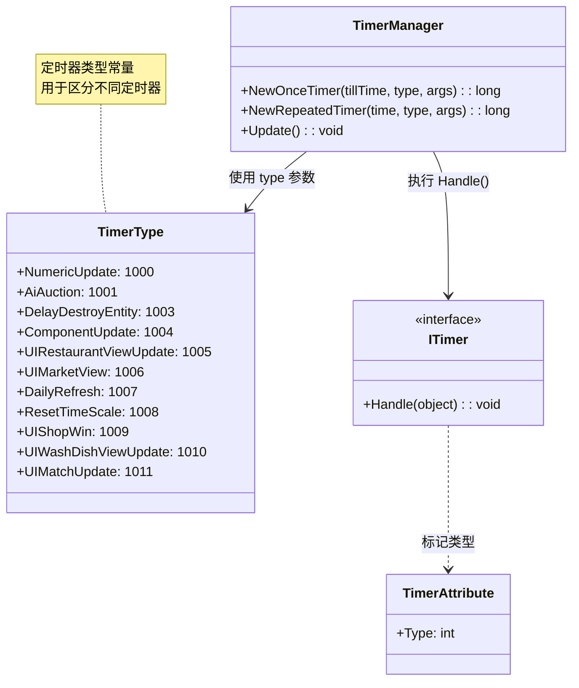

# TimerType.cs 注解文档

## 文件基本信息

| 属性 | 值 |
|------|-----|
| **文件名** | TimerType.cs |
| **路径** | Assets/Scripts/Mono/Module/Const/TimerType.cs |
| **所属模块** | Mono/Module/Const (常量定义) |
| **命名空间** | `TaoTie` |
| **文件职责** | 定时器类型常量定义，用于 TimerManager 的定时器分类 |

---

## 类/结构体说明

### TimerType

| 属性 | 说明 |
|------|------|
| **职责** | 定义系统中所有定时器的类型常量，用于 TimerManager 的定时器分类和回调 |
| **类型** | `static class` |
| **继承关系** | 无继承 |

**设计模式**: 常量工具类

---

## 定时器类型常量

| 常量名 | 值 | 说明 | 使用场景 |
|--------|-----|------|----------|
| `NumericUpdate` | 1000 | 数值更新 | 数值组件定时刷新 |
| `AiAuction` | 1001 | AI 竞拍 | AI 竞拍者定时决策 |
| `DelayDestroyEntity` | 1003 | 延迟销毁 Entity | Entity 延迟销毁 |
| `ComponentUpdate` | 1004 | 组件 Update | 组件定时更新 |
| `UIRestaurantViewUpdate` | 1005 | 餐厅视图更新 | 餐厅 UI 定时刷新 |
| `UIMarketView` | 1006 | 市场视图 | 市场 UI 定时刷新 |
| `DailyRefresh` | 1007 | 每日刷新 | 每日任务/数据刷新 |
| `ResetTimeScale` | 1008 | 重置时间缩放 | 恢复游戏时间速度 |
| `UIShopWin` | 1009 | 商店窗口 | 商店 UI 定时刷新 |
| `UIWashDishViewUpdate` | 1010 | 洗碗视图更新 | 洗碗小游戏 UI 刷新 |
| `UIMatchUpdate` | 1011 | 匹配视图更新 | 匹配界面定时刷新 |

---

## 使用示例

### 创建一次性定时器

```csharp
// 创建数值更新定时器
long timerId = TimerManager.Instance.NewOnceTimer(
    tillTime: TimeInfo.Instance.FrameTime + 1000,
    type: TimerType.NumericUpdate,
    args: null
);
```

### 创建重复定时器

```csharp
// 创建 AI 竞拍定时器 (每 2 秒执行一次)
long timerId = TimerManager.Instance.NewRepeatedTimer(
    time: 2000,
    type: TimerType.AiAuction,
    args: auctionData
);
```

### 实现 ITimer 接口

```csharp
[Timer(Type = TimerType.NumericUpdate)]
public class NumericUpdateTimer : ITimer
{
    public void Handle(object obj)
    {
        // 数值更新逻辑
        var numericComponent = obj as NumericComponent;
        numericComponent?.Update();
    }
}

[Timer(Type = TimerType.AiAuction)]
public class AiAuctionTimer : ITimer
{
    public void Handle(object obj)
    {
        // AI 竞拍决策逻辑
        var auctionData = obj as AuctionData;
        auctionData?.MakeDecision();
    }
}
```

### 移除定时器

```csharp
// 移除定时器
TimerManager.Instance.Remove(ref timerId);

// timerId 会被清零
```

---

## 定时器类型分类

### 系统级定时器

| 类型 | 说明 |
|------|------|
| `NumericUpdate` (1000) | 数值系统核心定时器 |
| `ComponentUpdate` (1004) | 组件系统通用更新 |
| `DelayDestroyEntity` (1003) | Entity 生命周期管理 |

### UI 定时器

| 类型 | 说明 |
|------|------|
| `UIRestaurantViewUpdate` (1005) | 餐厅视图刷新 |
| `UIMarketView` (1006) | 市场视图刷新 |
| `UIShopWin` (1009) | 商店窗口刷新 |
| `UIWashDishViewUpdate` (1010) | 洗碗视图刷新 |
| `UIMatchUpdate` (1011) | 匹配视图刷新 |

### 游戏逻辑定时器

| 类型 | 说明 |
|------|------|
| `AiAuction` (1001) | AI 竞拍决策 |
| `DailyRefresh` (1007) | 每日数据刷新 |
| `ResetTimeScale` (1008) | 时间缩放恢复 |

---

## 流程图

### 定时器注册与执行流程

```mermaid
sequenceDiagram
    participant Caller as 调用者
    participant TM as TimerManager
    participant Timer as ITimer 实现
    participant Handler as Handle()

    Caller->>TM: NewRepeatedTimer(time, type, args)
    TM->>TM: 创建 TimerAction
    TM->>TM: 加入 TimeId 队列
    
    loop 每帧 Update
        TM->>TM: 检查超时
        alt 时间到
            TM->>TM: 根据 type 查找 Timer
            TM->>Timer: 获取 [Timer(Type)] 特性
            TM->>Handler: timer.Handle(args)
            alt OnceTimer
                TM->>TM: 移除定时器
            alt RepeatedTimer
                TM->>TM: 重新计算下次时间
            end
        end
    end
```

---

## 与 TimerManager 的关系



---

## 扩展指南

### 添加新的定时器类型

1. 在 `TimerType.cs` 中添加新常量：

```csharp
public class TimerType
{
    // ... 现有类型 ...
    
    /// <summary> 新定时器说明 </summary>
    public const int MyNewTimer = 1012;
}
```

2. 创建对应的 `ITimer` 实现：

```csharp
[Timer(Type = TimerType.MyNewTimer)]
public class MyNewTimer : ITimer
{
    public void Handle(object obj)
    {
        // 定时器逻辑
    }
}
```

3. 使用定时器：

```csharp
TimerManager.Instance.NewRepeatedTimer(
    time: 1000,
    type: TimerType.MyNewTimer,
    args: data
);
```

---

## 注意事项

### ⚠️ 类型唯一性

确保每个定时器类型 ID 唯一，避免冲突：

```csharp
// ✅ 正确 - 使用连续 ID
public const int TimerA = 1012;
public const int TimerB = 1013;

// ❌ 错误 - ID 重复
public const int TimerA = 1012;
public const int TimerB = 1012; // 冲突!
```

### ⚠️ 热更新支持

使用 `TimerType` + `ITimer` 方式创建的定时器支持热更新：

```csharp
// ✅ 热更新支持
TimerManager.Instance.NewOnceTimer(time, TimerType.NumericUpdate, args);

// ❌ WaitAsync 不支持热更新
await TimerManager.Instance.WaitAsync(1000);
```

### ⚠️ 内存管理

定时器使用完毕后及时移除：

```csharp
// ✅ 正确
long timerId = TimerManager.Instance.NewRepeatedTimer(...);
// ... 使用 ...
TimerManager.Instance.Remove(ref timerId);

// ❌ 错误 - 定时器泄漏
long timerId = TimerManager.Instance.NewRepeatedTimer(...);
// 忘记移除
```

---

## 相关文档

- [TimerManager.cs.md](../Timer/TimerManager.cs.md) - 定时器管理器
- [ITimer.cs.md](../Timer/ITimer.cs.md) - 定时器接口
- [TimerAttribute.cs.md](../Timer/TimerAttribute.cs.md) - 定时器特性
- [TimeInfo.cs.md](../Timer/TimeInfo.cs.md) - 时间信息服务

---

*文档生成时间：2026-03-02 | OpenClaw AI 助手*
