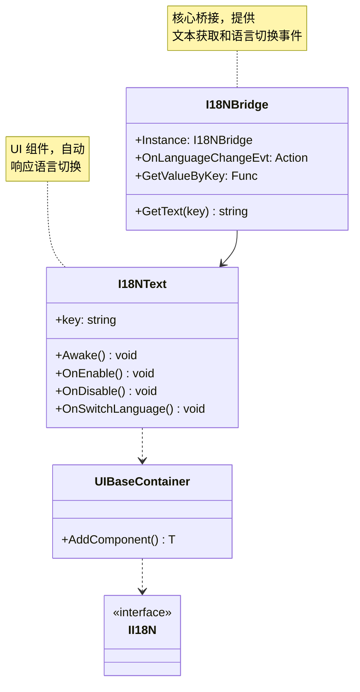

# 核心框架综合文档 (二)

> **覆盖文件**: AssemblyManager, AttributeManager, BaseAttribute, I18NBridge, I18NText, EntityComponent, EntityType, IUpdate/IFixedUpdate/ILateUpdate, UpdateTimer, MessageId, GameInfoType  
> **生成时间**: 2026-02-28  
> **命名空间**: `TaoTie`

---

## 📑 目录

1. [AssemblyManager - 程序集管理](#1-assemblymanager---程序集管理)
2. [AttributeManager - 特性管理](#2-attributemanager---特性管理)
3. [I18N - 国际化系统](#3-i18n---国际化系统)
4. [Entity - 实体系统](#4-entity---实体系统)
5. [Update - 更新系统](#5-update---更新系统)
6. [Const - 常量定义](#6-const---常量定义)

---

## 1. AssemblyManager - 程序集管理

### 类说明

| 属性 | 说明 |
|------|------|
| **职责** | 管理所有程序集的加载、类型注册、热更新程序集管理 |
| **单例** | `AssemblyManager.Instance` |
| **实现的接口** | `IManager` |

### 核心 API

#### 添加程序集

```csharp
// 添加普通程序集
AssemblyManager.Instance.AddAssembly(assembly);

// 添加热更新程序集（可移除）
AssemblyManager.Instance.AddHotfixAssembly(assembly);
```

#### 移除热更新程序集

```csharp
// 移除所有热更新程序集（用于热更重载）
AssemblyManager.Instance.RemoveHotfixAssembly();
```

#### 获取所有类型

```csharp
// 获取所有注册的类型（FullName → Type）
Dictionary<string, Type> allTypes = AssemblyManager.Instance.GetTypes();

// 遍历所有类型
foreach (var kvp in AssemblyManager.Instance.GetTypes())
{
    string fullName = kvp.Key;
    Type type = kvp.Value;
    Log.Info($"Type: {fullName}");
}
```

### 使用示例

#### 热更新流程

```csharp
public class HotfixLoader
{
    public async ETTask ReloadHotfix()
    {
        // 1. 加载新的热更新程序集
        Assembly newAssembly = await LoadHotfixAssembly();
        
        // 2. 移除旧的热更新程序集
        AssemblyManager.Instance.RemoveHotfixAssembly();
        
        // 3. 添加新的热更新程序集
        AssemblyManager.Instance.AddHotfixAssembly(newAssembly);
        
        // 4. 重新初始化依赖系统
        await AttributeManager.Instance.Init();
        await TimerManager.Instance.Init();
        
        Log.Info("Hotfix reloaded");
    }
    
    private async ETTask<Assembly> LoadHotfixAssembly()
    {
        // 加载热更新 DLL
        byte[] dllBytes = await FileHelper.ReadAllBytes("Hotfix.dll");
        byte[] pdbBytes = await FileHelper.ReadAllBytes("Hotfix.pdb");
        return Assembly.Load(dllBytes, pdbBytes);
    }
}
```

---

## 2. AttributeManager - 特性管理

### 类说明

| 属性 | 说明 |
|------|------|
| **职责** | 管理所有带有 BaseAttribute 标记的类型，用于反射注册 |
| **单例** | `AttributeManager.Instance` |
| **实现的接口** | `IManager` |
| **依赖** | AssemblyManager |

### 核心 API

#### 获取标记类型

```csharp
// 获取所有带有指定 Attribute 标记的类型
List<Type> types = AttributeManager.Instance.GetTypes(typeof(TimerAttribute));

// 遍历
foreach (Type type in types)
{
    Log.Info($"Timer: {type.Name}");
}
```

### 使用示例

#### 自定义特性

```csharp
// 1. 定义特性
[AttributeUsage(AttributeTargets.Class, AllowMultiple = true)]
public class MyCustomAttribute : BaseAttribute
{
    public string Name { get; }
    
    public MyCustomAttribute(string name)
    {
        Name = name;
    }
}

// 2. 标记类
[MyCustom("MyService")]
public class MyService : IManager
{
    public void Init() { }
    public void Destroy() { }
}

// 3. 获取标记类型
List<Type> services = AttributeManager.Instance.GetTypes(typeof(MyCustomAttribute));

foreach (Type type in services)
{
    var service = Activator.CreateInstance(type) as IManager;
    service?.Init();
}
```

#### Timer 系统注册

```csharp
// TimerManager 内部使用
public void InitAction()
{
    this.timerActions = new ITimer[TimeTypeMax];
    
    // 获取所有带有 TimerAttribute 标记的类型
    List<Type> types = AttributeManager.Instance.GetTypes(typeof(TimerAttribute));
    
    foreach (Type type in types)
    {
        ITimer timer = Activator.CreateInstance(type) as ITimer;
        
        // 获取 TimerAttribute
        object[] attrs = type.GetCustomAttributes(typeof(TimerAttribute), false);
        foreach (object attr in attrs)
        {
            TimerAttribute timerAttr = attr as TimerAttribute;
            this.timerActions[timerAttr.Type] = timer;
        }
    }
}
```

---

## 3. I18N - 国际化系统

### 架构设计



### I18NBridge

| 属性 | 说明 |
|------|------|
| **职责** | 国际化核心桥接，提供文本获取和语言切换通知 |
| **单例** | `I18NBridge.Instance` |

#### API

```csharp
// 设置文本获取回调
I18NBridge.Instance.GetValueByKey = (key) => 
{
    // 从配置表/文件读取多语言文本
    return LocalizationTable.GetText(key, currentLanguage);
};

// 获取文本
string text = I18NBridge.Instance.GetText("hello_world");

// 监听语言切换
I18NBridge.Instance.OnLanguageChangeEvt += () => 
{
    Log.Info("Language changed");
};

// 切换语言（触发事件）
void SwitchLanguage(string newLanguage)
{
    currentLanguage = newLanguage;
    I18NBridge.Instance.OnLanguageChangeEvt?.Invoke();
}
```

### I18NText

| 属性 | 说明 |
|------|------|
| **职责** | UI 文本组件，自动响应语言切换 |
| **支持** | `Text` (UGUI) 和 `TMP_Text` (TextMeshPro) |

#### 使用示例

```csharp
// 1. 在 Unity 中给 Text 组件添加 I18NText 脚本
// 2. 设置 key 属性

// 代码中动态创建
public class LocalizedUI : UIBaseView, IOnCreate
{
    private I18NText titleText;
    
    public void OnCreate()
    {
        titleText = AddComponent<I18NText>("txtTitle");
        titleText.key = "main_title";
    }
}
```

### 完整示例

```csharp
// 多语言配置表
public class LocalizationTable
{
    private Dictionary<string, Dictionary<string, string>> texts = new();
    
    public void Load(string language)
    {
        // 从文件加载
        string json = File.ReadAllText($"Localization/{language}.json");
        texts[language] = JsonHelper.FromJson<Dictionary<string, string>>(json);
    }
    
    public string GetText(string key, string language)
    {
        if (texts.TryGetValue(language, out var langDict))
        {
            if (langDict.TryGetValue(key, out var text))
            {
                return text;
            }
        }
        return $"[{key}]"; // 未找到返回 key
    }
}

// 初始化
public class Game : MonoBehaviour
{
    private LocalizationTable localizationTable = new();
    private string currentLanguage = "zh-CN";
    
    void Start()
    {
        // 加载语言
        localizationTable.Load("zh-CN");
        localizationTable.Load("en-US");
        
        // 设置 I18NBridge 回调
        I18NBridge.Instance.GetValueByKey = (key) => 
        {
            return localizationTable.GetText(key, currentLanguage);
        };
        
        // 切换语言按钮
        FindObjectOfType<LanguageButton>().onClick += () => 
        {
            currentLanguage = currentLanguage == "zh-CN" ? "en-US" : "zh-CN";
            I18NBridge.Instance.OnLanguageChangeEvt?.Invoke();
        };
    }
}
```

---

## 4. Entity - 实体系统

### EntityComponent

| 属性 | 说明 |
|------|------|
| **职责** | Unity 端的 Entity 组件，关联 GameObject 与 Entity 逻辑 |
| **继承** | `MonoBehaviour` |

#### 字段

```csharp
public class EntityComponent : MonoBehaviour
{
    public long Id;           // Entity ID
    public EntityType EntityType; // 实体类型
    public uint CampId;       // 阵营 ID
    public int HolderIndex;   // 持有者索引
}
```

#### 使用示例

```csharp
// 获取 Entity 组件
EntityComponent entityComp = collider.GetComponentInParent<EntityComponent>();

if (entityComp != null)
{
    long entityId = entityComp.Id;
    EntityType type = entityComp.EntityType;
    
    // 获取逻辑 Entity
    var entity = EntityManager.Instance.Get(entityId);
}
```

### EntityType 枚举

```csharp
public enum EntityType : byte
{
    Bidder = 1,    // 竞拍者
    Host = 2,      // 主持人
    Npc = 3,       // NPC
    Player = 4,    // 玩家
    Box = 5,       // 箱子
    Animal = 6,    // 动物
    MAX,
    ALL,           // 全部（用于过滤）
}
```

#### 使用示例

```csharp
// 物理检测过滤
int count = PhysicsHelper.OverlapSphereNonAllocEntity(
    center: transform.position,
    radius: 10f,
    filter: new[] { EntityType.Enemy, EntityType.Player },
    out long[] entityIds
);
```

---

## 5. Update - 更新系统

### IUpdate / IFixedUpdate / ILateUpdate

```csharp
public interface IUpdate
{
    void Update();
}

public interface IFixedUpdate
{
    void FixedUpdate();
}

public interface ILateUpdate
{
    void LateUpdate();
}
```

### UpdateTimer

```csharp
[Timer(TimerType.ComponentUpdate)]
public class UpdateTimer : ATimer<IUpdate>
{
    public override void Run(IUpdate t)
    {
        try
        {
            t.Update();
        }
        catch (Exception ex)
        {
            Log.Error(ex);
        }
    }
}
```

### 使用示例

```csharp
// 实现 IUpdate 接口
public class RotatorComponent : IUpdate, IOnCreate, IOnDisable
{
    private Transform transform;
    private float speed = 90f;
    private long timerId;
    
    public void OnCreate()
    {
        // 注册每帧更新
        timerId = TimerManager.Instance.NewFrameTimer(
            TimerType.ComponentUpdate,
            this
        );
    }
    
    public void Update()
    {
        transform.Rotate(Vector3.up, speed * Time.deltaTime);
    }
    
    public void OnDisable()
    {
        // 移除定时器
        TimerManager.Instance.Remove(ref timerId);
    }
}
```

---

## 6. Const - 常量定义

### MessageId

**职责**: 全局消息 ID 定义，用于 Messager 事件系统

```csharp
public static class MessageId
{
    // 系统消息
    public const int TimeScaleChange = -1;      // 时间缩放改变
    public const int NumericChangeEvt = 1;      // 数值变化
    public const int ChangePositionEvt = 4;     // 位置变化
    public const int ChangeRotationEvt = 5;     // 旋转变化
    public const int ChangeScaleEvt = 6;        // 缩放变化
    
    // 游戏消息
    public const int RefreshAuctionState = 7;   // 刷新拍卖状态
    public const int ChangeMoney = 8;           // 金币刷新
    public const int UnlockTreeNode = 10;       // 解锁科技树
    public const int UpdateTaskStep = 11;       // 更新任务进度
    public const int AssistantTalk = 13;        // 小助理讲话
    public const int OnKeyInput = 19;           // 按键输入
    
    // 时间线消息
    public const int ClipStartPlay = 20;        // 开始播放
    public const int ClipProcess = 21;          // 播放进度
}
```

#### 使用示例

```csharp
// 发送消息
Messager.Instance.Broadcast(0, MessageId.ChangeMoney, newMoney);

// 监听消息
Messager.Instance.AddListener(0, MessageId.ChangeMoney, OnMoneyChange);

void OnMoneyChange(int newMoney)
{
    Log.Info($"Money changed to: {newMoney}");
}
```

### GameInfoType

**职责**: 游戏信息类型定义，用于事件/ Buff 系统

```csharp
// 目标类型
public enum GameInfoTargetType
{
    Random = -1,        // 随机（debug）
    Container = 0,      // 指定集装箱
    Items = 1,          // 指定物品
    RandItems = 2,      // 集装箱随机物品
    Raise = 3,          // 抬价收益
    PlayType = 4,       // 指定玩法
}

// 条件类型
public enum GameInfoConditionType
{
    None = 0,               // 无条件
    MinRaiseCount = 1,      // 最少抬价次数
    MaxAuctionCount = 2,    // 最高出价次数
}

// 玩法结果
public enum PlayableResult
{
    None = 0,       // 无
    Success = 1,    // 必成功
    Fail = 2,       // 必失败
}
```

---

## ⚠️ 注意事项

| 问题 | 说明 | 解决方案 |
|------|------|----------|
| **Assembly 加载顺序** | 先加载的 Assembly 类型先注册 | 确保依赖的 Assembly 先加载 |
| **Attribute 重复** | 同一类型多次标记同一 Attribute | AttributeManager 会去重 |
| **I18N 回调未设置** | GetText 返回 null | 初始化时设置 GetValueByKey |
| **I18NText 内存泄漏** | 未正确移除事件监听 | I18NText 已自动处理 OnDisable |
| **EntityComponent 为空** | 碰撞体无 EntityComponent | 检查层级和组件配置 |
| **Update 未调用** | 未注册 FrameTimer | 确保调用 NewFrameTimer |

---

## 相关文档

- [Timer_System.cs.md](./Timer/Timer_System.cs.md) - Timer 系统
- [Helper_System.cs.md](../Helper/Helper_System.cs.md) - Helper 工具类
- [ObjectPool.cs.md](../Core/Object/ObjectPool.cs.md) - 对象池

---

*文档由 OpenClaw AI 助手自动生成 | 基于静态代码分析*
