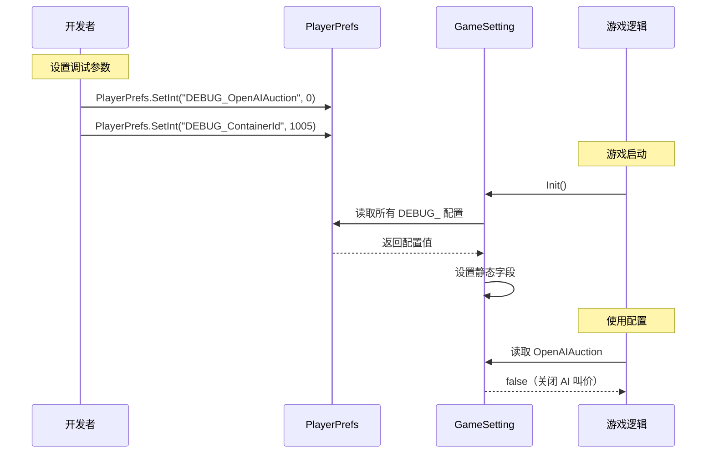

# GameSetting.cs 注解文档

## 文件基本信息

| 属性 | 值 |
|------|------|
| **文件名** | GameSetting.cs |
| **路径** | Assets/Scripts/Mono/Module/GameSetting.cs |
| **所属模块** | 框架层 → Mono/Module |
| **文件职责** | 游戏调试设置，通过 PlayerPrefs 存储和读取调试开关 |

---

## 类/结构体说明

### GameSetting

| 属性 | 说明 |
|------|------|
| **职责** | 静态工具类，管理游戏调试配置 |
| **泛型参数** | 无 |
| **继承关系** | 无 |
| **实现的接口** | 无 |

**设计模式**: 工具类模式（全静态成员）

```csharp
// 初始化（游戏启动时调用）
GameSetting.Init();

// 读取配置
if (GameSetting.OpenAIAuction)
{
    // 开启 AI 叫价
}
```

---

### ContainerRandType 枚举

| 属性 | 值 |
|------|------|
| **类型** | `enum` |
| **说明** | 集装箱随机类型配置 |

| 枚举值 | 说明 |
|--------|------|
| `All` | 所有类型都可能 |
| `OnlyNormal` | 仅普通类型 |
| `OnlySp` | 仅 SP 类型 |
| `Target` | 指定类型 |

---

## 字段与属性

### OpenAIAuction

| 属性 | 值 |
|------|------|
| **类型** | `bool` |
| **默认值** | `true` |
| **PlayerPrefs Key** | `DEBUG_OpenAIAuction` |
| **说明** | 是否开启 AI 叫价功能 |

**用途**: 调试拍卖系统时，开启/关闭 AI 自动叫价

---

### ContainerRandType

| 属性 | 值 |
|------|------|
| **类型** | `ContainerRandType` |
| **默认值** | `ContainerRandType.All` |
| **PlayerPrefs Key** | `DEBUG_ContainerRandType` |
| **说明** | 集装箱随机类型控制 |

**用途**: 测试不同类型的集装箱掉落

---

### ContainerId

| 属性 | 值 |
|------|------|
| **类型** | `int` |
| **默认值** | `0` |
| **PlayerPrefs Key** | `DEBUG_ContainerId` |
| **说明** | 指定集装箱 ID |

**用途**: 强制使用特定集装箱进行测试

---

### AlwaysPlayType

| 属性 | 值 |
|------|------|
| **类型** | `bool` |
| **默认值** | `false` |
| **PlayerPrefs Key** | `DEBUG_AlwaysPlayType` |
| **说明** | 必出玩法物品 |

**用途**: 测试玩法物品相关逻辑

---

### GameInfoTargetType

| 属性 | 值 |
|------|------|
| **类型** | `GameInfoTargetType` |
| **默认值** | `GameInfoTargetType.Random` |
| **PlayerPrefs Key** | `DEBUG_GameInfoTargetType` |
| **说明** | 随机的情报类型控制 |

**用途**: 测试特定类型的情报事件

---

### RaiseCount

| 属性 | 值 |
|------|------|
| **类型** | `int` |
| **默认值** | `0` |
| **PlayerPrefs Key** | `DEBUG_RaiseCount` |
| **说明** | 玩家抬价必定成功次数 |

**用途**: 测试抬价机制

---

### PlayableResult

| 属性 | 值 |
|------|------|
| **类型** | `PlayableResult` |
| **默认值** | `PlayableResult.None` |
| **PlayerPrefs Key** | `DEBUG_PlayableResult` |
| **说明** | 玩法结果预设 |

**用途**: 预设玩法结果进行测试

---

### AlwaysTurnTable

| 属性 | 值 |
|------|------|
| **类型** | `bool` |
| **默认值** | `false` |
| **PlayerPrefs Key** | `DEBUG_AlwaysTurnTable` |
| **说明** | 必出大转盘事件 |

**用途**: 测试大转盘玩法

---

### AlwaysStoryEvent

| 属性 | 值 |
|------|------|
| **类型** | `bool` |
| **默认值** | `false` |
| **PlayerPrefs Key** | `DEBUG_AlwaysStoryEvent` |
| **说明** | 必出开箱剧情事件 |

**用途**: 测试开箱剧情

---

## 方法说明

### Init

**签名**:
```csharp
public static void Init()
```

**职责**: 从 PlayerPrefs 加载所有调试配置

**核心逻辑**:
```
1. 读取 DEBUG_OpenAIAuction，默认 1（开启）
2. 读取 DEBUG_ContainerRandType，默认 0（All）
3. 读取 DEBUG_AlwaysPlayType，默认 0（false）
4. 读取 DEBUG_GameInfoTargetType，默认 -1（Random）
5. 读取 DEBUG_RaiseCount，默认 0
6. 读取 DEBUG_PlayableResult，默认 0（None）
7. 读取 DEBUG_ContainerId，默认 1001
8. 读取 DEBUG_AlwaysTurnTable，默认 0（false）
9. 读取 DEBUG_AlwaysStoryEvent，默认 0（false）
```

**调用者**: Init.cs 或游戏启动入口

**用途**: 游戏启动时初始化调试配置

---

## 调试配置使用流程



---

## 使用示例

### 示例 1: 关闭 AI 叫价进行测试

```csharp
// 在 Unity 编辑器控制台或代码中
PlayerPrefs.SetInt("DEBUG_OpenAIAuction", 0);
PlayerPrefs.Save();

// 重启游戏后，AI 叫价将关闭
```

### 示例 2: 强制使用特定集装箱

```csharp
// 设置集装箱 ID
PlayerPrefs.SetInt("DEBUG_ContainerId", 1005);
PlayerPrefs.SetInt("DEBUG_ContainerRandType", (int)ContainerRandType.Target);
PlayerPrefs.Save();

// 重启游戏后，将始终使用 ID 为 1005 的集装箱
```

### 示例 3: 测试大转盘玩法

```csharp
// 设置必出大转盘
PlayerPrefs.SetInt("DEBUG_AlwaysTurnTable", 1);
PlayerPrefs.Save();

// 重启游戏后，开箱必定触发大转盘事件
```

### 示例 4: 代码中读取配置

```csharp
// 游戏逻辑中使用配置
public void OnOpenContainer()
{
    if (GameSetting.OpenAIAuction)
    {
        // 启动 AI 叫价逻辑
        StartAIAuction();
    }
    
    if (GameSetting.AlwaysTurnTable)
    {
        // 强制触发大转盘
        TriggerTurnTable();
    }
}
```

---

## 调试场景

### 场景 1: 拍卖系统测试

```csharp
// 测试 AI 叫价逻辑
PlayerPrefs.SetInt("DEBUG_OpenAIAuction", 1);  // 开启 AI
PlayerPrefs.SetInt("DEBUG_RaiseCount", 5);     // 抬价 5 次必成功

// 测试玩家叫价逻辑
PlayerPrefs.SetInt("DEBUG_OpenAIAuction", 0);  // 关闭 AI
```

### 场景 2: 集装箱掉落测试

```csharp
// 测试普通掉落
PlayerPrefs.SetInt("DEBUG_ContainerRandType", (int)ContainerRandType.OnlyNormal);

// 测试 SP 掉落
PlayerPrefs.SetInt("DEBUG_ContainerRandType", (int)ContainerRandType.OnlySp);

// 测试指定集装箱
PlayerPrefs.SetInt("DEBUG_ContainerRandType", (int)ContainerRandType.Target);
PlayerPrefs.SetInt("DEBUG_ContainerId", 1005);
```

### 场景 3: 玩法事件测试

```csharp
// 测试大转盘
PlayerPrefs.SetInt("DEBUG_AlwaysTurnTable", 1);

// 测试开箱剧情
PlayerPrefs.SetInt("DEBUG_AlwaysStoryEvent", 1);

// 测试玩法物品
PlayerPrefs.SetInt("DEBUG_AlwaysPlayType", 1);
```

---

## 设计要点

### 为什么使用 PlayerPrefs？

**优势**:
1. **持久化**: 设置后重启游戏仍然有效
2. **易用**: 可通过代码或修改注册表/文件修改
3. **跨平台**: Unity 原生支持，各平台一致

**替代方案**:
- 配置文件（需要重新打包）
- 命令行参数（部分平台不支持）
- 远程配置（需要网络）

### 为什么使用静态类？

```csharp
public static class GameSetting
{
    public static bool OpenAIAuction = true;
    // ...
}
```

**优势**:
1. **全局访问**: 任何地方都可以直接读取
2. **无需实例**: 减少内存占用
3. **简单直接**: 代码清晰易懂

### 默认值设计

```csharp
OpenAIAuction = PlayerPrefs.GetInt("DEBUG_OpenAIAuction", 1) == 1;
//                                                    ↑ 默认值为 1（true）
```

**设计原则**:
- 生产环境友好的默认值（如开启 AI 叫价）
- 调试功能默认关闭（如 AlwaysTurnTable）
- 随机功能默认随机（如 GameInfoTargetType.Random）

---

## 扩展建议

### 添加运行时修改支持

```csharp
public static class GameSetting
{
    // 添加属性而不是字段
    public static bool OpenAIAuction
    {
        get => PlayerPrefs.GetInt("DEBUG_OpenAIAuction", 1) == 1;
        set => PlayerPrefs.SetInt("DEBUG_OpenAIAuction", value ? 1 : 0);
    }
    
    // 运行时修改立即生效
    public static void SetOpenAIAuction(bool value)
    {
        OpenAIAuction = value;
    }
}
```

### 添加配置导出功能

```csharp
public static void ExportConfig()
{
    var config = new
    {
        OpenAIAuction,
        ContainerRandType,
        ContainerId,
        AlwaysPlayType,
        // ...
    };
    
    string json = JsonUtility.ToJson(config, true);
    File.WriteAllText("debug_config.json", json);
}
```

---

## 相关文档

- [Init.cs.md](../../Init.cs.md) - 游戏入口（调用 GameSetting.Init）
- [Define.cs.md](../../Define.cs.md) - 全局常量定义

---

*文档生成时间：2026-03-01 | OpenClaw AI 助手*
