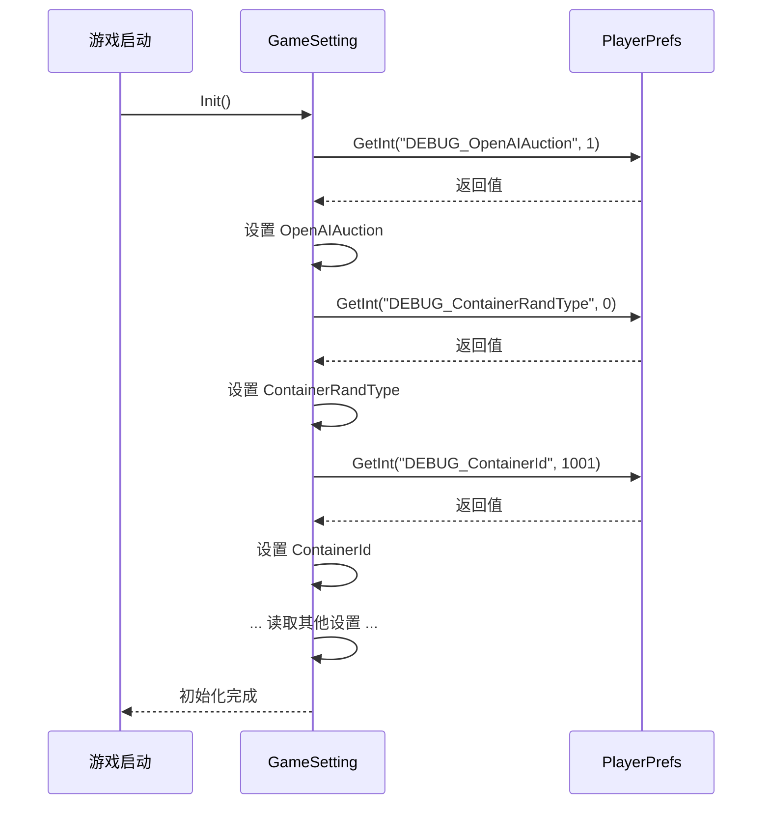

# GameSetting.cs 注解文档

## 文件基本信息

| 属性 | 值 |
|------|-----|
| **文件名** | GameSetting.cs |
| **路径** | Assets/Scripts/Mono/Module/GameSetting.cs |
| **所属模块** | Mono/Module (游戏设置) |
| **命名空间** | `TaoTie` |
| **文件职责** | 游戏调试设置管理，提供运行时调试开关和配置 |

---

## 类/结构体说明

### GameSetting

| 属性 | 说明 |
|------|------|
| **职责** | 管理游戏调试设置，支持通过 PlayerPrefs 持久化配置 |
| **类型** | `static class` |
| **继承关系** | 无继承 |

**设计模式**: 静态工具类 + 配置模式

---

## 枚举类型

### ContainerRandType

| 值 | 说明 |
|------|------|
| `All` | 全部类型 (默认) |
| `OnlyNormal` | 仅普通类型 |
| `OnlySp` | 仅 SP 类型 |
| `Target` | 指定类型 |

### GameInfoTargetType

| 值 | 说明 |
|------|------|
| `Random` | 随机 (-1) |
| 其他值 | 指定类型 |

### PlayableResult

| 值 | 说明 |
|------|------|
| `None` | 无 (默认 0) |
| 其他值 | 指定结果 |

---

## 字段与属性（按重要程度排序）

| 名称 | 类型 | 访问级别 | 说明 | 默认值 |
|------|------|----------|------|--------|
| `OpenAIAuction` | `bool` | `public static` | 是否开启 AI 叫价 | `true` |
| `ContainerRandType` | `ContainerRandType` | `public static` | 集装箱随机类型 | `All` |
| `ContainerId` | `int` | `public static` | 指定集装箱 ID | `0` |
| `AlwaysPlayType` | `bool` | `public static` | 必出玩法物品 | `false` |
| `GameInfoTargetType` | `GameInfoTargetType` | `public static` | 指定情报类型 | `Random` |
| `RaiseCount` | `int` | `public static` | 玩家抬价必定成功次数 | `0` |
| `PlayableResult` | `PlayableResult` | `public static` | 玩法结果 | `None` |
| `AlwaysTurnTable` | `bool` | `public static` | 必出大转盘 | `false` |
| `AlwaysStoryEvent` | `bool` | `public static` | 必出开箱剧情 | `false` |
| `AlwaysPlayType` | `bool` | `public static` | 必出玩法物品 | `false` |

---

## 方法说明

### Init()

**签名**:
```csharp
public static void Init()
```

**职责**: 从 PlayerPrefs 加载调试设置

**核心逻辑**:
```
1. 读取 OpenAIAuction (默认 1=true)
2. 读取 ContainerRandType (默认 0=All)
3. 读取 AlwaysPlayType (默认 0=false)
4. 读取 GameInfoTargetType (默认 -1=Random)
5. 读取 RaiseCount (默认 0)
6. 读取 PlayableResult (默认 0=None)
7. 读取 ContainerId (默认 1001)
8. 读取 AlwaysTurnTable (默认 0=false)
9. 读取 AlwaysStoryEvent (默认 0=false)
```

**调用者**: 游戏启动时 (Entry.cs 或类似入口)

**存储键名**:
| 字段 | PlayerPrefs Key |
|------|----------------|
| `OpenAIAuction` | `DEBUG_OpenAIAuction` |
| `ContainerRandType` | `DEBUG_ContainerRandType` |
| `AlwaysPlayType` | `DEBUG_AlwaysPlayType` |
| `GameInfoTargetType` | `DEBUG_GameInfoTargetType` |
| `RaiseCount` | `DEBUG_RaiseCount` |
| `PlayableResult` | `DEBUG_PlayableResult` |
| `ContainerId` | `DEBUG_ContainerId` |
| `AlwaysTurnTable` | `DEBUG_AlwaysTurnTable` |
| `AlwaysStoryEvent` | `DEBUG_AlwaysStoryEvent` |

---

## 使用示例

### 初始化设置

```csharp
// 在游戏启动时调用
GameSetting.Init();
```

### 读取设置

```csharp
// 检查 AI 叫价是否开启
if (GameSetting.OpenAIAuction)
{
    // 启用 AI 竞拍逻辑
    auctionManager.EnableAI();
}

// 检查集装箱类型
switch (GameSetting.ContainerRandType)
{
    case ContainerRandType.All:
        // 随机所有类型
        break;
    case ContainerRandType.OnlyNormal:
        // 仅普通类型
        break;
    case ContainerRandType.OnlySp:
        // 仅 SP 类型
        break;
    case ContainerRandType.Target:
        // 使用指定 ID
        var container = GetContainer(GameSetting.ContainerId);
        break;
}
```

### 修改设置 (调试用)

```csharp
// 开启 AI 叫价
GameSetting.OpenAIAuction = true;
PlayerPrefs.SetInt("DEBUG_OpenAIAuction", 1);

// 设置必出大转盘
GameSetting.AlwaysTurnTable = true;
PlayerPrefs.SetInt("DEBUG_AlwaysTurnTable", 1);

// 设置抬价必定成功次数
GameSetting.RaiseCount = 3;
PlayerPrefs.SetInt("DEBUG_RaiseCount", 3);

// 保存
PlayerPrefs.Save();
```

### 重置设置

```csharp
// 清除所有调试设置
PlayerPrefs.DeleteKey("DEBUG_OpenAIAuction");
PlayerPrefs.DeleteKey("DEBUG_ContainerRandType");
PlayerPrefs.DeleteKey("DEBUG_AlwaysPlayType");
PlayerPrefs.DeleteKey("DEBUG_GameInfoTargetType");
PlayerPrefs.DeleteKey("DEBUG_RaiseCount");
PlayerPrefs.DeleteKey("DEBUG_PlayableResult");
PlayerPrefs.DeleteKey("DEBUG_ContainerId");
PlayerPrefs.DeleteKey("DEBUG_AlwaysTurnTable");
PlayerPrefs.DeleteKey("DEBUG_AlwaysStoryEvent");
PlayerPrefs.Save();

// 重新初始化
GameSetting.Init();
```

---

## 调试功能说明

### AI 叫价控制

```csharp
/// <summary>
/// 开启 AI 叫价
/// </summary>
public static bool OpenAIAuction = true;
```

**用途**: 关闭 AI 叫价用于测试纯手动竞拍流程

### 集装箱类型控制

```csharp
/// <summary>
/// 集装箱随机类型
/// </summary>
public static ContainerRandType ContainerRandType = ContainerRandType.All;

/// <summary>
/// 集装箱 Id
/// </summary>
public static int ContainerId = 0;
```

**用途**: 指定集装箱类型，用于测试特定集装箱逻辑

### 玩法物品控制

```csharp
/// <summary>
/// 必出玩法物品
/// </summary>
public static bool AlwaysPlayType = false;
```

**用途**: 强制出玩法物品，用于测试小游戏流程

### 情报类型控制

```csharp
/// <summary>
/// 随机的情报类型
/// </summary>
public static GameInfoTargetType GameInfoTargetType = GameInfoTargetType.Random;
```

**用途**: 指定情报类型，用于测试特定情报逻辑

### 抬价成功率控制

```csharp
/// <summary>
/// 玩家抬价必定成功次数
/// </summary>
public static int RaiseCount;
```

**用途**: 设置玩家抬价必定成功的次数，用于测试抬价流程

### 大转盘控制

```csharp
/// <summary>
/// 必出大转盘
/// </summary>
public static bool AlwaysTurnTable = false;
```

**用途**: 强制触发大转盘事件，用于测试转盘逻辑

### 剧情事件控制

```csharp
/// <summary>
/// 必出开箱剧情
/// </summary>
public static bool AlwaysStoryEvent = false;
```

**用途**: 强制触发开箱剧情，用于测试剧情流程

---

## 流程图

### 设置加载流程


```mermaid
sequenceDiagram
    participant Game as 游戏启动
    participant GS as GameSetting
    participant PP as PlayerPrefs

    Game->>GS: Init()
    GS->>PP: GetInt("DEBUG_OpenAIAuction", 1)
    PP-->>GS: 返回值
    GS->>GS: 设置 OpenAIAuction
    
    GS->>PP: GetInt("DEBUG_ContainerRandType", 0)
    PP-->>GS: 返回值
    GS->>GS: 设置 ContainerRandType
    
    GS->>PP: GetInt("DEBUG_ContainerId", 1001)
    PP-->>GS: 返回值
    GS->>GS: 设置 ContainerId
    
    GS->>GS: ... 读取其他设置 ...
    
    GS-->>Game: 初始化完成
```

### 设置使用流程

```mermaid
graph TD
    subgraph GameLogic["游戏逻辑"]
        Auction[拍卖系统]
        Container[集装箱系统]
        MiniGame[小游戏系统]
        Story[剧情系统]
    end
    
    subgraph Settings["GameSetting"]
        S1[OpenAIAuction]
        S2[ContainerRandType]
        S3[AlwaysTurnTable]
        S4[AlwaysStoryEvent]
    end
    
    Auction --> S1
    Container --> S2
    MiniGame --> S3
    Story --> S4
    
    note right of Settings "调试设置影响<br/>游戏逻辑行为"
    
    style GameLogic fill:#e8f5e9
    style Settings fill:#e1f5ff
```

---

## 注意事项

### ⚠️ 仅用于调试

`GameSetting` 中的所有设置都用于调试和测试，**不应在生产环境使用**：

```csharp
// ✅ 调试时修改
#if UNITY_EDITOR
GameSetting.OpenAIAuction = false;
#endif

// ❌ 生产环境不应修改
// GameSetting.OpenAIAuction = false; // 会影响真实玩家体验
```

### ⚠️ PlayerPrefs 持久化

修改设置后需要保存到 PlayerPrefs：

```csharp
// ✅ 正确
GameSetting.OpenAIAuction = true;
PlayerPrefs.SetInt("DEBUG_OpenAIAuction", 1);
PlayerPrefs.Save();

// ❌ 错误 - 重启后会丢失
GameSetting.OpenAIAuction = true;
// 忘记保存
```

### ⚠️ 类型转换

枚举类型需要正确转换：

```csharp
// ✅ 正确
GameSetting.ContainerRandType = (ContainerRandType)PlayerPrefs.GetInt("DEBUG_ContainerRandType", 0);

// ❌ 错误 - 类型不匹配
GameSetting.ContainerRandType = PlayerPrefs.GetInt("DEBUG_ContainerRandType", 0);
```

---

## 扩展建议

### 添加调试面板

```csharp
public class DebugPanel : MonoBehaviour
{
    void OnGUI()
    {
        GUILayout.BeginVertical();
        
        GameSetting.OpenAIAuction = GUILayout.Toggle(
            GameSetting.OpenAIAuction, 
            "开启 AI 叫价"
        );
        
        GameSetting.AlwaysTurnTable = GUILayout.Toggle(
            GameSetting.AlwaysTurnTable, 
            "必出大转盘"
        );
        
        GUILayout.Label("抬价成功次数:");
        string input = GUILayout.TextField(GameSetting.RaiseCount.ToString());
        int.TryParse(input, out GameSetting.RaiseCount);
        
        if (GUILayout.Button("保存设置"))
        {
            SaveSettings();
        }
        
        if (GUILayout.Button("重置设置"))
        {
            ResetSettings();
        }
        
        GUILayout.EndVertical();
    }
    
    void SaveSettings()
    {
        PlayerPrefs.SetInt("DEBUG_OpenAIAuction", GameSetting.OpenAIAuction ? 1 : 0);
        PlayerPrefs.SetInt("DEBUG_RaiseCount", GameSetting.RaiseCount);
        PlayerPrefs.Save();
    }
    
    void ResetSettings()
    {
        PlayerPrefs.DeleteAll();
        GameSetting.Init();
    }
}
```

---

## 相关文档

- [Define.cs.md](../Define.cs.md) - 全局常量定义
- [AuctionManager.cs.md](../../Code/Game/System/Auction/AuctionManager.cs.md) - 拍卖管理器
- [ContainerSystem.cs.md](../../Code/Game/System/Container/ContainerSystem.cs.md) - 集装箱系统

---

*文档生成时间：2026-03-02 | OpenClaw AI 助手*
