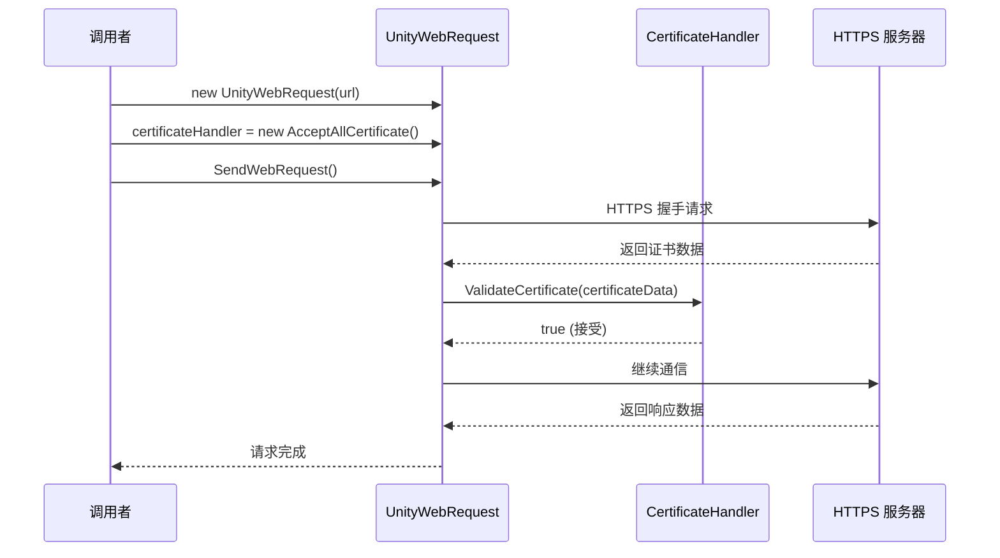

# AcceptAllCertificate.cs 注解文档

## 文件基本信息

| 属性 | 值 |
|------|-----|
| **文件名** | AcceptAllCertificate.cs |
| **路径** | Assets/Scripts/Mono/Module/Http/AcceptAllCertificate.cs |
| **所属模块** | Mono 层 → Http HTTP 请求 |
| **文件职责** | 实现证书处理器，接受所有 SSL/TLS 证书（用于开发环境和自签名证书场景） |

---

## 类/结构体说明

### AcceptAllCertificate

| 属性 | 说明 |
|------|------|
| **职责** | 继承自 CertificateHandler，重写证书验证逻辑以接受所有证书 |
| **泛型参数** | 无 |
| **继承关系** | 继承自 `UnityEngine.Networking.CertificateHandler` |
| **实现的接口** | 无 |

**设计模式**: 证书处理器（Certificate Handler）

```csharp
// 使用方式
var request = UnityWebRequest.Get(url);
request.certificateHandler = new AcceptAllCertificate();
request.SendWebRequest();
```

---

## 方法说明

### ValidateCertificate()

**签名**:
```csharp
protected override bool ValidateCertificate(byte[] certificateData)
```

**职责**: 验证服务器提供的 SSL/TLS 证书

**参数**:
- `certificateData`: 证书的二进制数据（字节数组）

**返回值**: `bool` - 始终返回 `true`（接受所有证书）

**核心逻辑**:
```
1. 忽略 certificateData 参数
2. 直接返回 true
```

**调用者**: UnityWebRequest 内部 SSL 握手流程

---

## 安全说明

### ⚠️ 安全警告

**此实现会接受任何证书，包括：**
- 过期的证书
- 自签名证书
- 伪造的证书
- 中间人攻击的证书

**仅适用于以下场景：**
- ✅ 开发/调试环境
- ✅ 内部测试服务器
- ✅ 已知安全的自签名证书服务

**不建议用于：**
- ❌ 生产环境
- ❌ 涉及敏感数据的请求
- ❌ 公共网络请求

### 生产环境建议

```csharp
// 生产环境应使用默认证书验证
var request = UnityWebRequest.Get(url);
// 不设置 certificateHandler，使用系统默认验证
request.SendWebRequest();

// 或者实现严格的证书验证
public class StrictCertificateHandler : CertificateHandler
{
    protected override bool ValidateCertificate(byte[] certificateData)
    {
        // 实现严格的证书验证逻辑
        // 如：验证证书颁发机构、有效期、域名匹配等
        return ValidateCertificateStrict(certificateData);
    }
}
```

---

## 使用示例

### 示例 1: HttpManager 中的使用

```csharp
public class HttpManager
{
    private AcceptAllCertificate certificateHandler = new AcceptAllCertificate();
    
    public UnityWebRequest HttpGet(string url, ...)
    {
        var request = UnityWebRequest.Get(url);
        request.certificateHandler = certificateHandler; // 接受所有证书
        request.SendWebRequest();
        return request;
    }
}
```

### 示例 2: 开发环境专用

```csharp
#if UNITY_EDITOR || DEVELOPMENT_BUILD
    // 开发环境：接受所有证书
    request.certificateHandler = new AcceptAllCertificate();
#else
    // 生产环境：使用默认证书验证
    // 不设置 certificateHandler
#endif
```

### 示例 3: 测试自签名 HTTPS 服务

```csharp
// 测试本地 HTTPS 服务（自签名证书）
async ETTask TestLocalHttps()
{
    string url = "https://localhost:8443/api/test";
    var request = UnityWebRequest.Get(url);
    request.certificateHandler = new AcceptAllCertificate();
    
    await request.SendWebRequest();
    
    if (request.result == UnityWebRequest.Result.Success)
    {
        Log.Info("请求成功：" + request.downloadHandler.text);
    }
    
    request.Dispose();
}
```

---

## UnityWebRequest 证书处理流程



---

## 相关文档

- [HttpManager.cs.md](./HttpManager.cs.md) - HTTP 管理器（使用 AcceptAllCertificate）
- [UnityWebRequest API](https://docs.unity3d.com/ScriptReference/Networking.UnityWebRequest.html) - Unity 官方文档

---

*文档生成时间：2026-03-02 | OpenClaw AI 助手*
