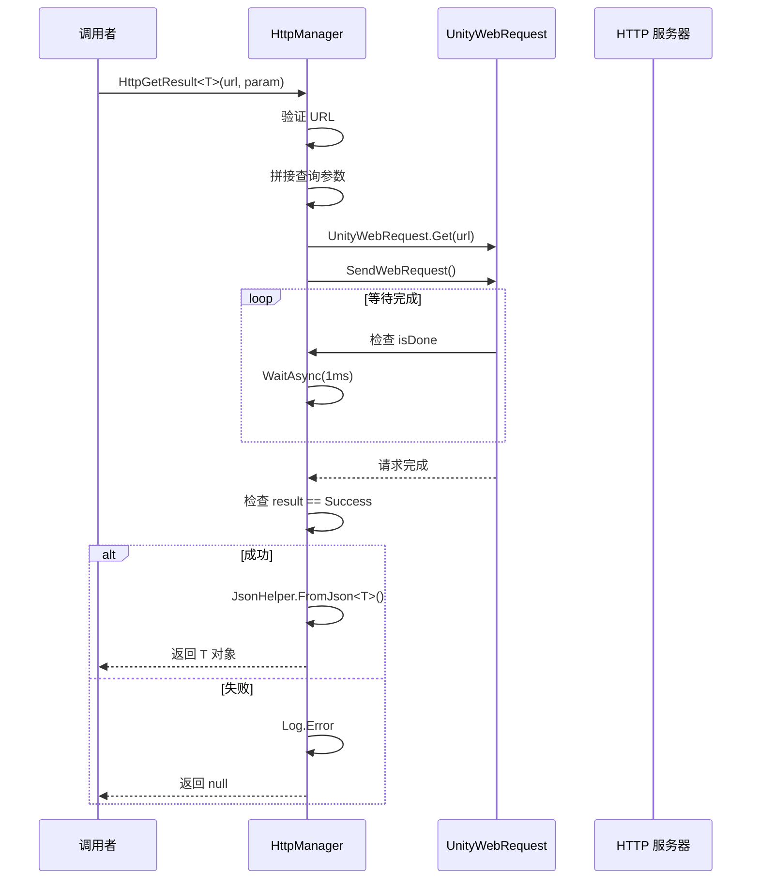
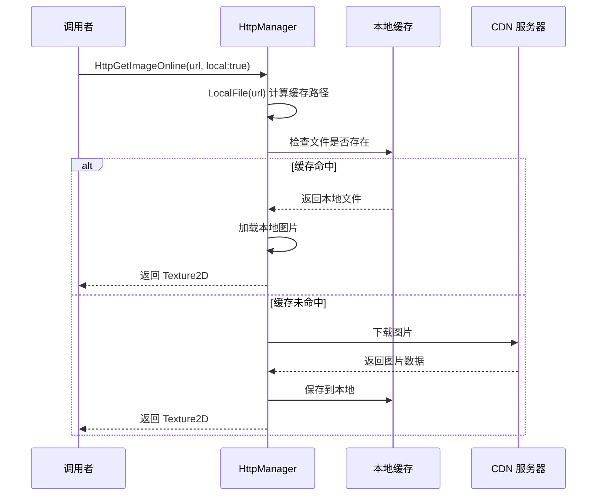

# HttpManager.cs 注解文档

## 文件基本信息

| 属性 | 值 |
|------|-----|
| **文件名** | HttpManager.cs |
| **路径** | Assets/Scripts/Mono/Module/Http/HttpManager.cs |
| **所属模块** | Mono 层 → Http HTTP 请求 |
| **文件职责** | 封装 UnityWebRequest，提供 HTTP GET/POST 请求、图片/音频下载、本地缓存等功能 |

---

## 类/结构体说明

### HttpManager

| 属性 | 说明 |
|------|------|
| **职责** | 统一管理 HTTP 请求，支持 GET/POST/PUT 方法，提供图片和音频下载及本地缓存功能 |
| **泛型参数** | 无 |
| **继承关系** | 无继承 |
| **实现的接口** | 无 |

**设计模式**: 单例模式

```csharp
// 单例实现
public static HttpManager Instance { get; } = new HttpManager();

// 使用方式
await HttpManager.Instance.HttpGetResult<Data>(url);
```

---

## 字段与属性（按重要程度排序）

| 名称 | 类型 | 访问级别 | 说明 |
|------|------|----------|------|
| `Instance` | `HttpManager` | `public static` | 单例实例，全局访问点 |
| `certificateHandler` | `AcceptAllCertificate` | `private` | 证书处理器（接受所有证书） |
| `persistentDataPath` | `string` | `private` | 持久化数据路径（Application.persistentDataPath） |
| `DEFAULT_TIMEOUT` | `const int` | `private` | 默认超时时间（10 秒） |

---

## 方法说明（按重要程度排序）

### HttpGet()

**签名**:
```csharp
public UnityWebRequest HttpGet(
    string url, 
    Dictionary<string, string> headers = null,
    Dictionary<string, string> param = null, 
    int timeout = DEFAULT_TIMEOUT
)
```

**职责**: 发送 HTTP GET 请求

**参数**:
- `url`: 请求 URL
- `headers`: 请求头字典（可选）
- `param`: URL 查询参数字典（可选，自动拼接到 URL）
- `timeout`: 超时时间（秒），默认 10 秒

**返回值**: `UnityWebRequest` - 请求对象（需手动处理响应）

**核心逻辑**:
```
1. 将 param 转换为查询字符串 "?key1=value1&key2=value2"
2. 拼接到 URL 后面
3. 创建 UnityWebRequest.Get(url)
4. 设置 certificateHandler
5. 设置 timeout
6. 设置 headers
7. 发送请求 SendWebRequest()
8. 返回请求对象
```

**使用示例**:
```csharp
var request = HttpManager.Instance.HttpGet("https://api.example.com/data", 
    headers: new Dictionary<string, string> { { "Authorization", "Bearer token" } },
    param: new Dictionary<string, string> { { "page", "1" }, { "size", "20" } }
);
```

---

### HttpPost()

**签名**:
```csharp
public UnityWebRequest HttpPost(
    string url, 
    Dictionary<string, string> headers = null,
    Dictionary<string, object> param = null, 
    int timeout = DEFAULT_TIMEOUT
)
```

**职责**: 发送 HTTP POST 请求（JSON 格式）

**参数**:
- `url`: 请求 URL
- `headers`: 请求头字典（可选）
- `param`: 请求体参数（自动序列化为 JSON）
- `timeout`: 超时时间（秒）

**返回值**: `UnityWebRequest` - 请求对象

**核心逻辑**:
```
1. 将 param 序列化为 JSON 字符串
2. 转换为字节数组
3. 创建 UnityWebRequest(url, "POST")
4. 设置 UploadHandlerRaw（请求体）
5. 设置 DownloadHandlerBuffer（响应体）
6. 设置 Content-Type: application/json
7. 设置 headers
8. 发送请求
```

**使用示例**:
```csharp
var request = HttpManager.Instance.HttpPost("https://api.example.com/login",
    param: new Dictionary<string, object> 
    { 
        { "username", "player1" }, 
        { "password", "123456" } 
    }
);
```

---

### HttpGetResult<T>()

**签名**:
```csharp
public async ETTask<T> HttpGetResult<T>(
    string url, 
    Dictionary<string, string> headers = null,
    Dictionary<string, string> param = null, 
    int timeout = DEFAULT_TIMEOUT,
    ETCancellationToken cancelToken = null
) where T : class
```

**职责**: 发送 HTTP GET 请求并解析 JSON 响应

**参数**:
- `url`: 请求 URL
- `headers`: 请求头
- `param`: URL 查询参数
- `timeout`: 超时时间
- `cancelToken`: 取消令牌（可选）

**返回值**: `ETTask<T>` - 异步任务，返回解析后的对象

**核心逻辑**:
```
1. 验证 URL 有效性
2. 发送 GET 请求
3. 等待请求完成（支持取消）
4. 检查请求结果
5. 解析 JSON 响应为 T 类型
6. 返回对象或 null
```

**使用示例**:
```csharp
// 获取玩家数据
PlayerData data = await HttpManager.Instance.HttpGetResult<PlayerData>(
    "https://api.example.com/player/info",
    param: new Dictionary<string, string> { { "playerId", "12345" } }
);

if (data != null)
{
    Log.Info($"玩家名称：{data.Name}");
}
```

---

### HttpPostResult<T>()

**签名**:
```csharp
public async ETTask<T> HttpPostResult<T>(
    string url, 
    Dictionary<string, string> headers = null,
    Dictionary<string, object> param = null, 
    int timeout = DEFAULT_TIMEOUT,
    ETCancellationToken cancelToken = null
) where T : class
```

**职责**: 发送 HTTP POST 请求并解析 JSON 响应

**使用示例**:
```csharp
// 提交订单
OrderResult result = await HttpManager.Instance.HttpPostResult<OrderResult>(
    "https://api.example.com/order/create",
    param: new Dictionary<string, object>
    {
        { "itemId", 1001 },
        { "count", 5 },
        { "playerId", "12345" }
    }
);
```

---

### HttpGetImageOnline()

**签名**:
```csharp
public async ETTask<Texture2D> HttpGetImageOnline(
    string url, 
    bool local, 
    Dictionary<string, string> headers = null,
    int timeout = DEFAULT_TIMEOUT,
    ETCancellationToken cancelToken = null
)
```

**职责**: 下载在线图片，支持本地缓存

**参数**:
- `url`: 图片 URL
- `local`: 是否使用本地缓存
- `headers`: 请求头
- `timeout`: 超时时间
- `cancelToken`: 取消令牌

**返回值**: `ETTask<Texture2D>` - 下载的图片纹理

**核心逻辑**:
```
1. 验证 URL 有效性
2. 如果 local=true，检查本地缓存
3. 发送图片下载请求
4. 等待下载完成（支持取消）
5. 获取 Texture2D
6. 返回纹理或 null
```

**使用示例**:
```csharp
// 下载头像（使用缓存）
Texture2D avatar = await HttpManager.Instance.HttpGetImageOnline(
    "https://cdn.example.com/avatars/12345.png",
    local: true
);

if (avatar != null)
{
    rawImage.texture = avatar;
}
```

---

### HttpGetSoundOnline()

**签名**:
```csharp
public async ETTask<AudioClip> HttpGetSoundOnline(
    string url, 
    bool local, 
    Dictionary<string, string> headers = null,
    int timeout = DEFAULT_TIMEOUT,
    ETCancellationToken cancelToken = null
)
```

**职责**: 下载在线音频，支持本地缓存

**参数**:
- `url`: 音频 URL
- `local`: 是否使用本地缓存
- `headers`: 请求头
- `timeout`: 超时时间
- `cancelToken`: 取消令牌

**返回值**: `ETTask<AudioClip>` - 下载的音频片段

**支持格式**:
- .mp3, .mp2 → MPEG
- .wav → WAV
- .ogg → OGGVORBIS
- .aiff → AIFF
- 其他 → UNKNOWN

**使用示例**:
```csharp
// 下载背景音乐
AudioClip bgm = await HttpManager.Instance.HttpGetSoundOnline(
    "https://cdn.example.com/music/bgm.mp3",
    local: true
);

if (bgm != null)
{
    audioSource.clip = bgm;
    audioSource.Play();
}
```

---

### LocalFile()

**签名**:
```csharp
public string LocalFile(
    string url,
    string dir = "downloadimage",
    string extends = ".png"
)
```

**职责**: 根据 URL 生成本地缓存文件路径（使用 MD5 哈希）

**参数**:
- `url`: 原始 URL
- `dir`: 缓存目录名
- `extends`: 文件扩展名

**返回值**: `string` - 本地文件完整路径

**核心逻辑**:
```
1. 计算 URL 的 MD5 哈希值
2. 拼接路径：persistentDataPath/dir/md5Hash.extends
3. 创建目录（如果不存在）
4. 返回完整路径
```

**使用示例**:
```csharp
string url = "https://cdn.example.com/images/avatar.png";
string cachePath = HttpManager.Instance.LocalFile(url, "avatars", ".png");
// 返回：/var/mobile/Containers/.../avatars/a1b2c3d4e5f6.png
```

---

## HTTP 请求流程

### GET 请求流程



### 图片下载流程（带缓存）



---

## 使用示例

### 示例 1: 获取配置数据

```csharp
// 定义响应数据结构
public class GameConfig
{
    public int version;
    public string公告;
    public List<EventInfo> events;
}

// 获取配置
GameConfig config = await HttpManager.Instance.HttpGetResult<GameConfig>(
    "https://api.example.com/config",
    param: new Dictionary<string, string> { { "platform", "iOS" } }
);

if (config != null)
{
    Log.Info($"当前版本：{config.version}");
}
```

### 示例 2: 提交玩家数据

```csharp
public class PlayerSubmit
{
    public string playerId;
    public int level;
    public long score;
}

public class SubmitResult
{
    public bool success;
    public string message;
}

// 提交数据
SubmitResult result = await HttpManager.Instance.HttpPostResult<SubmitResult>(
    "https://api.example.com/player/submit",
    headers: new Dictionary<string, string> { { "Authorization", "Bearer " + token } },
    param: new Dictionary<string, object>
    {
        { "playerId", player.Id },
        { "level", player.Level },
        { "score", player.Score }
    }
);
```

### 示例 3: 批量下载图片

```csharp
// 下载多个头像
List<string> avatarUrls = GetAvatarUrls();
List<Texture2D> avatars = new List<Texture2D>();

foreach (string url in avatarUrls)
{
    Texture2D avatar = await HttpManager.Instance.HttpGetImageOnline(url, local: true);
    if (avatar != null)
    {
        avatars.Add(avatar);
    }
}

// 显示头像
DisplayAvatars(avatars);
```

### 示例 4: 带取消的请求

```csharp
// 创建取消令牌
ETCancellationToken cancelToken = new ETCancellationToken();

// 开始下载
ETTask<Texture2D> downloadTask = HttpManager.Instance.HttpGetImageOnline(
    "https://cdn.example.com/large_image.png",
    local: true,
    cancelToken: cancelToken
);

// 用户点击取消按钮
void OnCancelDownload()
{
    cancelToken.Cancel();
}

// 等待完成
Texture2D image = await downloadTask;
```

---

## 错误处理

### 常见错误及处理

```csharp
try
{
    var result = await HttpManager.Instance.HttpGetResult<Data>(url);
    if (result == null)
    {
        // 请求失败或解析失败
        Log.Error("请求失败");
    }
}
catch (Exception e)
{
    Log.Error("HTTP 请求异常：" + e.Message);
}
```

### 超时处理

```csharp
// 设置较短的超时时间
var result = await HttpManager.Instance.HttpGetResult<Data>(
    url,
    timeout: 5  // 5 秒超时
);

if (result == null)
{
    // 可能是超时或网络错误
    ShowRetryButton();
}
```

---

## 相关文档

- [AcceptAllCertificate.cs.md](./AcceptAllCertificate.cs.md) - 证书处理器
- [JsonHelper.cs.md](../Helper/JsonHelper.cs.md) - JSON 序列化工具
- [TimerManager.cs.md](../Timer/TimerManager.cs.md) - 定时器（用于 WaitAsync）
- [Define.cs.md](../../Define.cs.md) - 全局配置（Networked 网络状态）

---

*文档生成时间：2026-03-02 | OpenClaw AI 助手*
