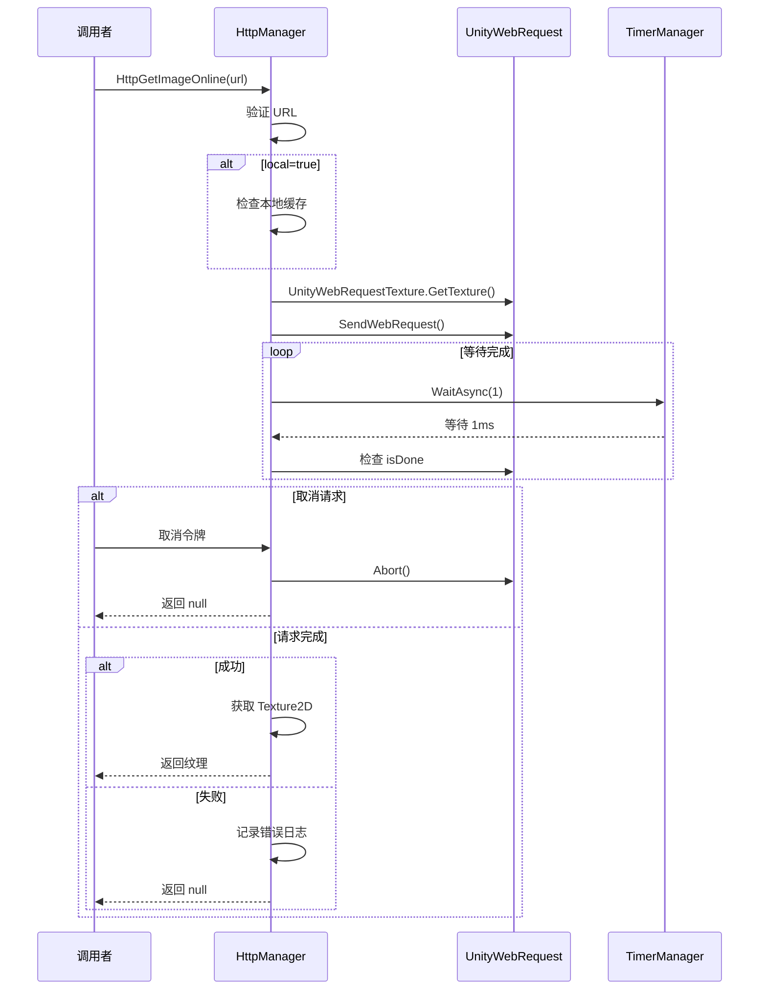

# HttpManager.cs 注解文档

## 文件基本信息

| 属性 | 值 |
|------|-----|
| **文件名** | HttpManager.cs |
| **路径** | Assets/Scripts/Mono/Module/Http/HttpManager.cs |
| **所属模块** | 框架层 → Mono/Module/Http |
| **命名空间** | `TaoTie` |
| **文件职责** | 提供 HTTP 请求封装，支持 GET/POST/PUT、图片/音频下载、本地缓存 |

---

## 类说明

### HttpManager

| 属性 | 说明 |
|------|------|
| **职责** | 封装 UnityWebRequest，提供异步 HTTP 请求、资源下载、本地缓存功能 |
| **单例** | `static HttpManager Instance` |
| **依赖** | `AcceptAllCertificate` - SSL 证书处理器 |

**设计模式**: 单例模式 + 外观模式

---

## 字段与属性

| 名称 | 类型 | 访问级别 | 说明 |
|------|------|----------|------|
| `Instance` | `HttpManager` | `public static` | 全局单例 |
| `DEFAULT_TIMEOUT` | `int` | `const` | 默认超时时间 10 秒 |
| `certificateHandler` | `AcceptAllCertificate` | `private` | SSL 证书处理器 |
| `persistentDataPath` | `string` | `private` | 持久化数据路径 |

---

## 方法说明

### HttpGet()

**签名**:
```csharp
public UnityWebRequest HttpGet(string url, Dictionary<string, string> headers = null,
    Dictionary<string, string> param = null, int timeout = DEFAULT_TIMEOUT)
```

**职责**: 发送 HTTP GET 请求

**参数**:
- `url` - 请求 URL
- `headers` - 请求头
- `param` - 查询参数（自动拼接到 URL）
- `timeout` - 超时时间（秒）

**返回值**: `UnityWebRequest` - 请求对象

---

### HttpPost()

**签名**:
```csharp
public UnityWebRequest HttpPost(string url, Dictionary<string, string> headers = null,
    Dictionary<string, object> param = null, int timeout = DEFAULT_TIMEOUT)
```

**职责**: 发送 HTTP POST 请求（JSON 格式）

**参数**:
- `param` - 请求体（自动序列化为 JSON）

---

### HttpPostUrl()

**签名**:
```csharp
public UnityWebRequest HttpPostUrl(string url, ...)
```

**职责**: 发送 HTTP POST 请求（参数拼接到 URL）

---

### HttpPutUrl()

**签名**:
```csharp
public UnityWebRequest HttpPutUrl(string url, ...)
```

**职责**: 发送 HTTP PUT 请求

---

### HttpGetImageOnline()

**签名**:
```csharp
public async ETTask<Texture2D> HttpGetImageOnline(string url, bool local, 
    Dictionary<string, string> headers = null, int timeout = DEFAULT_TIMEOUT,
    ETCancellationToken cancelToken = null)
```

**职责**: 异步下载图片，支持本地缓存

**参数**:
- `url` - 图片 URL
- `local` - 是否使用本地缓存
- `cancelToken` - 取消令牌

**返回值**: `Texture2D` - 下载的纹理，失败返回 null

**核心逻辑**:
```
1. 验证 URL 有效性
2. 如果 local=true，检查本地缓存
3. 发送 HTTP 请求下载图片
4. 等待请求完成（支持取消）
5. 返回 Texture2D 或 null
```

---

### HttpGetSoundOnline()

**签名**:
```csharp
public async ETTask<AudioClip> HttpGetSoundOnline(string url, bool local, ...)
```

**职责**: 异步下载音频，支持本地缓存

**返回值**: `AudioClip` - 下载的音频片段

---

### HttpGetResult()

**签名**:
```csharp
public async ETTask<string> HttpGetResult(string url, ...)
public async ETTask<T> HttpGetResult<T>(string url, ...)
```

**职责**: 异步 GET 请求并返回结果（支持 JSON 反序列化）

**泛型版本**: 自动将响应 JSON 反序列化为指定类型

---

### HttpPostResult<T>()

**签名**:
```csharp
public async ETTask<T> HttpPostResult<T>(string url, ...)
```

**职责**: 异步 POST 请求并返回结果（JSON 反序列化）

---

### LocalFile()

**签名**:
```csharp
public string LocalFile(string url, string dir = "downloadimage", string extends = ".png")
```

**职责**: 根据 URL 生成本地文件路径（使用 MD5 哈希）

**核心逻辑**:
```
1. 计算 URL 的 MD5 哈希
2. 生成路径：persistentDataPath/dir/md5Hash.extends
3. 确保目录存在
4. 返回完整路径
```

---

## 核心流程

### 异步请求流程



---

## 使用示例

### 示例 1: GET 请求

```csharp
// 简单 GET
var request = HttpManager.Instance.HttpGet("https://api.example.com/data");
while (!request.isDone)
{
    await TimerManager.Instance.WaitAsync(1);
}
string result = request.downloadHandler.text;
```

### 示例 2: GET 请求带参数

```csharp
var param = new Dictionary<string, string>
{
    { "page", "1" },
    { "size", "10" }
};

var result = await HttpManager.Instance.HttpGetResult("https://api.example.com/items",
    param: param);
```

### 示例 3: POST 请求

```csharp
var data = new Dictionary<string, object>
{
    { "username", "player1" },
    { "password", "secret" }
};

var result = await HttpManager.Instance.HttpPostResult<LoginResponse>(
    "https://api.example.com/login",
    param: data
);
```

### 示例 4: 下载图片

```csharp
// 下载图片（带本地缓存）
Texture2D texture = await HttpManager.Instance.HttpGetImageOnline(
    "https://cdn.example.com/icon.png",
    local: true, // 启用本地缓存
    timeout: 30
);

if (texture != null)
{
    // 使用纹理
    rawImage.texture = texture;
}
```

### 示例 5: 下载音频

```csharp
// 下载音频
AudioClip clip = await HttpManager.Instance.HttpGetSoundOnline(
    "https://cdn.example.com/bgm.mp3",
    local: true
);

if (clip != null)
{
    audioSource.clip = clip;
    audioSource.Play();
}
```

### 示例 6: 带取消令牌

```csharp
var cts = new ETCancellationToken();

// 启动下载
var task = HttpManager.Instance.HttpGetImageOnline(url, local: false, cancelToken: cts);

// 需要取消时
cts.Cancel();

// 等待完成
Texture2D texture = await task; // 返回 null
```

---

## 支持的音频格式

| 扩展名 | 音频类型 |
|--------|----------|
| .mp3, .mp2 | MPEG |
| .wav | WAV |
| .ogg | OGG Vorbis |
| .aiff | AIFF |
| .it | IT |
| .mod | MOD |
| .s3m | S3M |
| .xm | XM |
| .xma | XMA |
| .vag | VAG |
| .acc | AAC |

---

## 相关文档

- [AcceptAllCertificate.cs.md](./AcceptAllCertificate.cs.md) - SSL 证书处理器
- [TimerManager.cs.md](../Timer/TimerManager.cs.md) - 定时器（用于异步等待）
- [JsonHelper.cs.md](../../Helper/JsonHelper.cs.md) - JSON 序列化工具

---

*文档生成时间：2026-03-02 | OpenClaw AI 助手*
