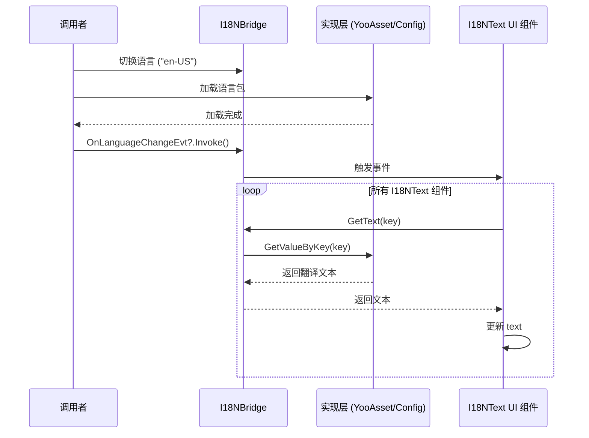

# I18NBridge.cs 注解文档

## 文件基本信息

| 属性 | 值 |
|------|-----|
| **文件名** | I18NBridge.cs |
| **路径** | Assets/Scripts/Mono/Module/I18N/I18NBridge.cs |
| **所属模块** | Mono 层 → I18N 国际化 |
| **文件职责** | 提供多语言文本获取的统一接口，作为国际化系统的桥接层 |

---

## 类/结构体说明

### I18NBridge

| 属性 | 说明 |
|------|------|
| **职责** | 提供多语言文本获取的静态接口，委托实际的文本查找逻辑给外部实现 |
| **泛型参数** | 无 |
| **继承关系** | 无继承 |
| **实现的接口** | 无 |

**设计模式**: 单例模式 + 桥接模式 + 策略模式

```csharp
// 单例实现
public static I18NBridge Instance { get; private set; } = new I18NBridge();

// 使用方式
string text = I18NBridge.Instance.GetText("common.confirm");
```

---

## 字段与属性（按重要程度排序）

| 名称 | 类型 | 访问级别 | 说明 |
|------|------|----------|------|
| `Instance` | `I18NBridge` | `public static` | 单例实例，全局访问点 |
| `OnLanguageChangeEvt` | `Action` | `public` | 语言切换事件（通知 UI 更新文本） |
| `GetValueByKey` | `Func<string, string>` | `public` | 文本查找委托（由外部实现注入） |

---

## 方法说明

### GetText()

**签名**:
```csharp
public string GetText(string i18NKey)
```

**职责**: 通过国际化键获取对应语言的文本

**参数**:
- `i18NKey`: 国际化键（如 "common.confirm", "ui.title.home"）

**返回值**: `string` - 对应语言的文本，查找失败时返回 null 或空字符串

**核心逻辑**:
```
1. 调用 GetValueByKey?.Invoke(i18NKey)
2. 返回查找结果
```

**调用者**: I18NText.OnSwitchLanguage(), 任何需要多语言文本的代码

**使用示例**:
```csharp
// 获取按钮文本
string confirmText = I18NBridge.Instance.GetText("common.confirm");
button.text = confirmText;

// 获取标题文本
string title = I18NBridge.Instance.GetText("ui.title.home");
titleLabel.text = title;
```

---

## 语言切换机制

### 切换流程



### 事件订阅

```csharp
// I18NText 组件订阅语言切换事件
private void OnEnable()
{
    OnSwitchLanguage(); // 立即更新一次
    I18NBridge.Instance.OnLanguageChangeEvt += OnSwitchLanguage;
}

private void OnDisable()
{
    I18NBridge.Instance.OnLanguageChangeEvt -= OnSwitchLanguage;
}

private void OnSwitchLanguage()
{
    m_Text.text = I18NBridge.Instance.GetText(key);
}
```

---

## 外部实现注入

### GetValueByKey 委托设置

```csharp
// 在游戏初始化时设置实际的文本查找实现
void InitializeI18N()
{
    // 方式 1: 使用配置表实现
    I18NBridge.Instance.GetValueByKey = (key) =>
    {
        return I18NConfigCategory.Instance.Get(key).Text;
    };
    
    // 方式 2: 使用 JSON 语言包
    I18NBridge.Instance.GetValueByKey = (key) =>
    {
        if (languageData.TryGetValue(key, out string value))
        {
            return value;
        }
        return key; // 找不到时返回 key 本身
    };
    
    // 方式 3: 使用 YooAsset 资源包
    I18NBridge.Instance.GetValueByKey = async (key) =>
    {
        var op = PackageManager.Instance.LoadAssetAsync<TextAsset>($"I18N/{currentLanguage}");
        await op.Task;
        // 解析并返回文本
    };
}
```

---

## 使用示例

### 示例 1: 直接获取文本

```csharp
// 在代码中直接使用
string welcomeText = I18NBridge.Instance.GetText("ui.welcome");
Log.Info(welcomeText);

// 设置 UI 文本
titleLabel.text = I18NBridge.Instance.GetText("ui.title.home");
confirmButton.text = I18NBridge.Instance.GetText("common.confirm");
cancelButton.text = I18NBridge.Instance.GetText("common.cancel");
```

### 示例 2: 切换语言

```csharp
// 定义支持的语言
public enum LanguageType
{
    zh_CN,  // 简体中文
    en_US,  // 英文
    ja_JP,  // 日文
    ko_KR,  // 韩文
}

// 切换语言函数
async ETTask SwitchLanguage(LanguageType newLanguage)
{
    // 保存用户选择
    PlayerPrefs.SetInt("Language", (int)newLanguage);
    
    // 加载新的语言包
    await LoadLanguagePack(newLanguage);
    
    // 触发语言切换事件（所有 I18NText 组件会自动更新）
    I18NBridge.Instance.OnLanguageChangeEvt?.Invoke();
}
```

### 示例 3: 动态文本插值

```csharp
// 语言包中定义模板
// "ui.player.level": "玩家等级：{0}"
// "ui.player.exp": "经验值：{0}/{1}"

string levelText = string.Format(
    I18NBridge.Instance.GetText("ui.player.level"),
    player.Level
);

string expText = string.Format(
    I18NBridge.Instance.GetText("ui.player.exp"),
    player.CurrentExp,
    player.MaxExp
);
```

### 示例 4: 复数形式处理

```csharp
// 语言包中定义复数规则
// "ui.item.count.one": "{0} 个项目"
// "ui.item.count.other": "{0} 个项目"

string GetItemCountText(int count)
{
    string key = count == 1 ? "ui.item.count.one" : "ui.item.count.other";
    return string.Format(I18NBridge.Instance.GetText(key), count);
}
```

---

## 国际化键命名规范

### 推荐命名结构

```
<模块>.<子模块>.<具体项>

示例:
- common.confirm          // 通用确认按钮
- common.cancel           // 通用取消按钮
- ui.title.home           // 主页标题
- ui.button.submit        // 提交按钮
- item.weapon.sword       // 武器 - 剑
- skill.fire.ball         // 技能 - 火球术
- npc.merchant.greeting   // NPC-商人 - 问候语
```

### 键值对示例

```json
{
    "common.confirm": "确认",
    "common.cancel": "取消",
    "common.ok": "确定",
    "common.yes": "是",
    "common.no": "否",
    
    "ui.title.home": "家园",
    "ui.title.shop": "商店",
    "ui.title.bag": "背包",
    
    "ui.button.submit": "提交",
    "ui.button.back": "返回",
    "ui.button.close": "关闭",
    
    "item.weapon.sword": "铁剑",
    "item.weapon.axe": "斧头",
    "item.armor.helmet": "头盔"
}
```

---

## 相关文档

- [I18NText.cs.md](./I18NText.cs.md) - 国际化文本 UI 组件（使用 I18NBridge）
- [TextMeshFontAssetManager.cs.md](./TextMeshFontAssetManager.cs.md) - TextMesh 字体资产管理
- [UIManager.cs.md](../../Code/Module/UI/UIManager.cs.md) - UI 管理器

---

*文档生成时间：2026-03-02 | OpenClaw AI 助手*
