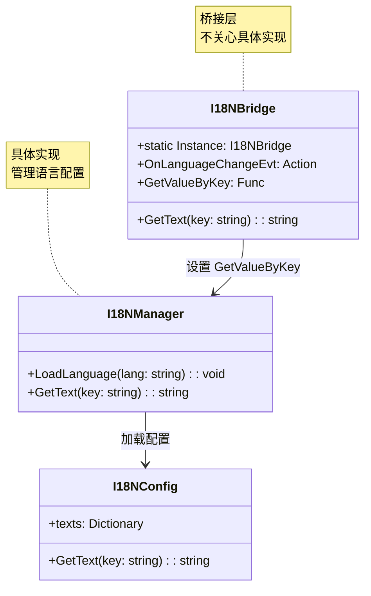

# I18NBridge.cs 注解文档

## 文件基本信息

| 属性 | 值 |
|------|-----|
| **文件名** | I18NBridge.cs |
| **路径** | Assets/Scripts/Mono/Module/I18N/I18NBridge.cs |
| **所属模块** | Mono/Module/I18N (国际化) |
| **命名空间** | `TaoTie` |
| **文件职责** | 国际化桥接器，提供多语言文本获取接口 |

---

## 类/结构体说明

### I18NBridge

| 属性 | 说明 |
|------|------|
| **职责** | 提供统一的国际化文本获取接口，桥接具体实现 |
| **类型** | `class` |
| **继承关系** | 无继承 |
| **设计模式** | 单例模式 + 桥接模式 |

```csharp
// 单例实现
public static I18NBridge Instance { get; private set; } = new I18NBridge();
```

---

## 字段与属性（按重要程度排序）

| 名称 | 类型 | 访问级别 | 说明 |
|------|------|----------|------|
| `Instance` | `I18NBridge` | `public static` | 单例实例，全局访问点 |
| `OnLanguageChangeEvt` | `Action` | `public` | 语言切换事件 |
| `GetValueByKey` | `Func<string, string>` | `public` | 通过 Key 获取文本的委托函数 |

---

## 方法说明（按重要程度排序）

### GetText(string i18NKey)

**签名**:
```csharp
public string GetText(string i18NKey)
```

**职责**: 通过国际化 Key 获取多语言文本

**参数**:
| 参数 | 类型 | 说明 |
|------|------|------|
| `i18NKey` | `string` | 国际化 Key (如 "ui.confirm", "game.start") |

**返回值**: `string` - 对应语言的文本，Key 不存在时返回 null

**核心逻辑**:
```
1. 调用 GetValueByKey 委托
2. 返回查询结果
```

**使用示例**:
```csharp
// 获取确认按钮文本
string confirmText = I18NBridge.Instance.GetText("ui.confirm");

// 获取游戏开始文本
string startText = I18NBridge.Instance.GetText("game.start");

// 安全获取 (带默认值)
string text = I18NBridge.Instance.GetText(key) ?? key;
```

---

## 事件说明

### OnLanguageChangeEvt

**签名**: `public Action OnLanguageChangeEvt`

**触发时机**: 当用户切换游戏语言时

**订阅示例**:
```csharp
// 订阅语言切换事件
I18NBridge.Instance.OnLanguageChangeEvt += OnLanguageChanged;

void OnLanguageChanged()
{
    // 刷新 UI 文本
    RefreshAllUIText();
}

// 取消订阅 (在 Destroy 中)
I18NBridge.Instance.OnLanguageChangeEvt -= OnLanguageChanged;
```

---

## 委托说明

### GetValueByKey

**签名**: `public Func<string, string> GetValueByKey`

**职责**: 设置具体的文本查询实现

**说明**: 
- 这是一个委托属性，需要外部设置具体实现
- 通常由配置管理器或专门的 I18N 管理器设置
- 实现应该从配置表中查询对应 Key 的文本

**设置示例**:
```csharp
// 在初始化时设置实现
I18NBridge.Instance.GetValueByKey = (key) =>
{
    var config = I18NConfigManager.Instance.GetTextConfig(key);
    return config?.GetText(currentLanguage);
};
```

---

## 架构设计

### 桥接模式


```mermaid
classDiagram
    class I18NBridge {
        +static Instance: I18NBridge
        +OnLanguageChangeEvt: Action
        +GetValueByKey: Func<string, string>
        +GetText(key: string): string
    }

    class I18NManager {
        +LoadLanguage(lang: string): void
        +GetText(key: string): string
    }

    class I18NConfig {
        +texts: Dictionary<string, string>
        +GetText(key: string): string
    }

    I18NBridge --> I18NManager : 设置 GetValueByKey
    I18NManager --> I18NConfig : 加载配置
    
    note for I18NBridge "桥接层<br/>不关心具体实现"
    note for I18NManager "具体实现<br/>管理语言配置"
```

**优势**:
- `I18NBridge` 不依赖具体实现，便于替换
- UI 代码只需依赖 `I18NBridge`，降低耦合
- 支持热切换语言实现

---

## 使用示例

### 基础使用

```csharp
// 在 UI 脚本中获取文本
public class UIButton : MonoBehaviour
{
    public string i18nKey;
    private Text textComponent;
    
    void Start()
    {
        textComponent = GetComponent<Text>();
        UpdateText();
        
        // 订阅语言切换事件
        I18NBridge.Instance.OnLanguageChangeEvt += UpdateText;
    }
    
    void UpdateText()
    {
        textComponent.text = I18NBridge.Instance.GetText(i18nKey);
    }
    
    void OnDestroy()
    {
        I18NBridge.Instance.OnLanguageChangeEvt -= UpdateText;
    }
}
```

### 带默认值的安全获取

```csharp
public static class I18NHelper
{
    /// <summary>
    /// 安全获取文本，Key 不存在时返回 Key 本身
    /// </summary>
    public static string GetTextOrDefault(string key)
    {
        return I18NBridge.Instance.GetText(key) ?? key;
    }
}

// 使用
textComponent.text = I18NHelper.GetTextOrDefault("ui.unknown_key");
```

### 批量刷新 UI

```csharp
public class UIManager : IManager
{
    private List<UIText> textComponents = new List<UIText>();
    
    public void Init()
    {
        I18NBridge.Instance.OnLanguageChangeEvt += RefreshAllText;
    }
    
    public void Destroy()
    {
        I18NBridge.Instance.OnLanguageChangeEvt -= RefreshAllText;
    }
    
    private void RefreshAllText()
    {
        foreach (var text in textComponents)
        {
            text.Refresh();
        }
    }
}
```

---

## 扩展建议

### 添加语言枚举

```csharp
public enum LanguageType
{
    Chinese,
    English,
    Japanese,
    Korean,
}
```

### 添加语言切换方法

```csharp
public static class I18NManager
{
    private static LanguageType currentLanguage = LanguageType.Chinese;
    
    public static void SetLanguage(LanguageType lang)
    {
        currentLanguage = lang;
        // 加载对应语言配置
        LoadLanguageConfig(lang);
        // 触发事件
        I18NBridge.Instance.OnLanguageChangeEvt?.Invoke();
    }
    
    public static LanguageType GetCurrentLanguage()
    {
        return currentLanguage;
    }
}
```

---

## 注意事项

### ⚠️ 内存泄漏

订阅 `OnLanguageChangeEvt` 后务必在 `Destroy()` 中取消订阅：

```csharp
// ✅ 正确
void OnDestroy()
{
    I18NBridge.Instance.OnLanguageChangeEvt -= OnLanguageChanged;
}

// ❌ 错误 - 会导致内存泄漏
// 忘记取消订阅
```

### ⚠️ 空引用

`GetValueByKey` 未设置时，`GetText()` 会返回 null：

```csharp
// ✅ 安全做法
string text = I18NBridge.Instance.GetText(key) ?? key;

// ❌ 危险做法
string text = I18NBridge.Instance.GetText(key); // 可能为 null
```

---

## 相关文档

- [I18NText.cs.md](./I18NText.cs.md) - 国际化文本组件
- [TextMeshFontAssetManager.cs.md](./TextMeshFontAssetManager.cs.md) - TextMesh 字体资产管理
- [ConfigManager.cs.md](../../Code/Module/Config/ConfigManager.cs.md) - 配置管理器

---

*文档生成时间：2026-03-02 | OpenClaw AI 助手*
