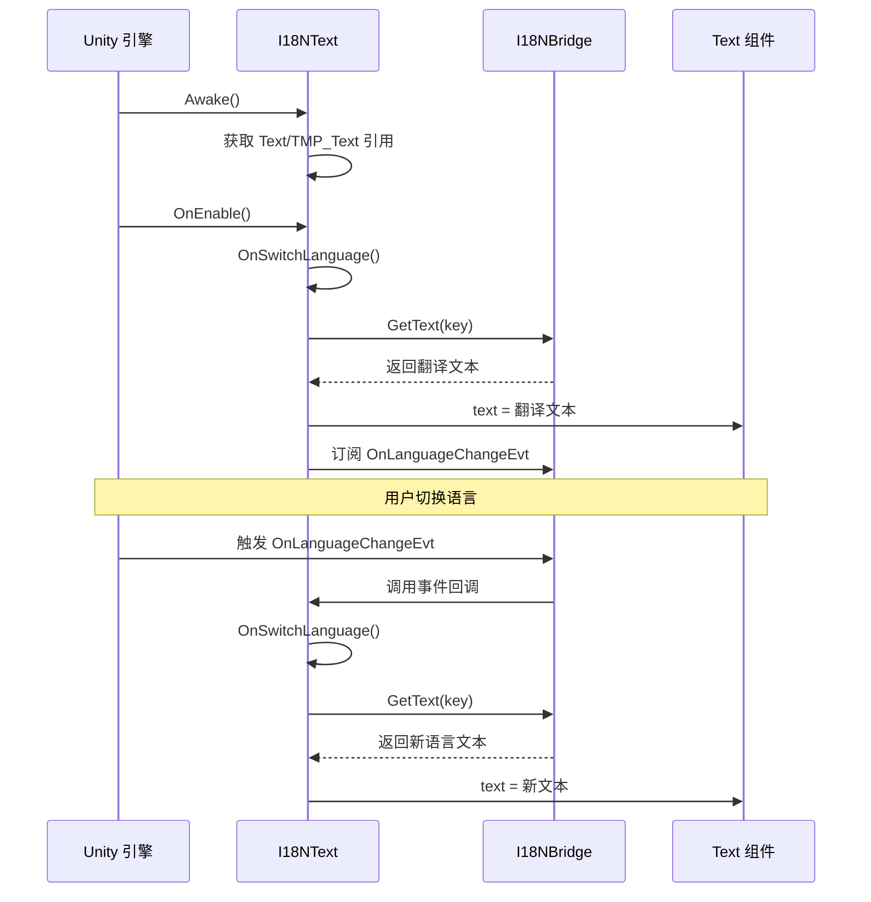

# I18NText.cs 注解文档

## 文件基本信息

| 属性 | 值 |
|------|-----|
| **文件名** | I18NText.cs |
| **路径** | Assets/Scripts/Mono/Module/I18N/I18NText.cs |
| **所属模块** | Mono 层 → I18N 国际化 |
| **文件职责** | Unity UI 组件，自动根据国际化键更新文本内容，支持语言切换自动刷新 |

---

## 类/结构体说明

### I18NText

| 属性 | 说明 |
|------|------|
| **职责** | 挂载到 GameObject 上，自动获取并显示多语言文本，监听语言切换事件自动更新 |
| **泛型参数** | 无 |
| **继承关系** | 继承自 `MonoBehaviour` |
| **实现的接口** | 无 |

**设计模式**: 观察者模式（监听语言切换事件）

```csharp
// 使用方式（Inspector 中设置 key）
// 1. 在 GameObject 上添加 I18NText 组件
// 2. 在 Inspector 中设置 Key 字段
// 3. 运行时自动显示对应语言的文本
```

---

## 字段与属性（按重要程度排序）

| 名称 | 类型 | 访问级别 | 说明 |
|------|------|----------|------|
| `key` | `string` | `public` | 国际化键（在 Inspector 中设置，如 "common.confirm"） |
| `m_Text` | `Text` | `private` | Unity UI Text 组件引用 |
| `m_MeshText` | `TMPro.TMP_Text` | `private` | TextMesh Pro 文本组件引用 |

---

## Unity 生命周期方法

### Awake()

**签名**:
```csharp
void Awake()
```

**职责**: 初始化组件，获取文本组件引用

**核心逻辑**:
```
1. 获取 GameObject 上的 Text 组件
2. 获取 GameObject 上的 TMPro.TMP_Text 组件
```

**说明**: 支持 Unity UI Text 和 TextMesh Pro 两种文本组件。

---

### OnEnable()

**签名**:
```csharp
private void OnEnable()
```

**职责**: 组件启用时更新文本并订阅语言切换事件

**核心逻辑**:
```
1. 调用 OnSwitchLanguage() 立即更新一次文本
2. 订阅 I18NBridge.Instance.OnLanguageChangeEvt 事件
```

**调用者**: Unity 引擎（组件启用时自动调用）

---

### OnDisable()

**签名**:
```csharp
private void OnDisable()
```

**职责**: 组件禁用时取消订阅语言切换事件

**核心逻辑**:
```
1. 取消订阅 I18NBridge.Instance.OnLanguageChangeEvt 事件
```

**说明**: 避免内存泄漏，确保事件正确清理。

---

### OnSwitchLanguage()

**签名**:
```csharp
private void OnSwitchLanguage()
```

**职责**: 根据 key 获取多语言文本并更新显示

**核心逻辑**:
```
1. 如果 m_Text 不为空：m_Text.text = I18NBridge.Instance.GetText(key)
2. 如果 m_MeshText 不为空：m_MeshText.text = I18NBridge.Instance.GetText(key)
```

**调用者**: OnEnable(), I18NBridge.OnLanguageChangeEvt

---

## 组件使用流程

### Inspector 配置

```
GameObject: ConfirmButton
├── RectTransform
├── Image (Button 背景)
├── Text (子对象)
│   └── I18NText 组件
│       └── Key: "common.confirm"
```

### 运行时行为



---

## 使用示例

### 示例 1: 基础使用（Unity UI Text）

```
1. 在 Hierarchy 中创建 UI 文本对象
2. 添加 Text 组件（或已有）
3. 添加 I18NText 组件
4. 在 Inspector 中设置 Key 字段

Key: "ui.title.home"
```

**效果**: 运行时自动显示对应语言的文本，切换语言时自动更新。

### 示例 2: TextMesh Pro 支持

```
1. 创建 TextMeshPro - Text 对象
2. 添加 I18NText 组件
3. 设置 Key 字段

Key: "common.confirm"
```

**说明**: I18NText 同时支持 Unity UI Text 和 TextMesh Pro TMP_Text。

### 示例 3: 动态设置 Key

```csharp
// 在代码中动态设置 key
I18NText i18nText = GetComponent<I18NText>();
i18nText.key = "item.weapon.sword";

// 立即刷新文本
// 需要手动调用（因为 key 是 public 字段）
// 可以通过反射或添加公共方法来刷新
```

### 示例 4: 批量设置

```csharp
// 为所有 I18NText 组件设置 key
I18NText[] allI18NTexts = FindObjectsOfType<I18NText>();

Dictionary<string, string> keyMap = new Dictionary<string, string>
{
    { "ConfirmButton", "common.confirm" },
    { "CancelButton", "common.cancel" },
    { "TitleText", "ui.title.home" }
};

foreach (I18NText i18n in allI18NTexts)
{
    if (keyMap.TryGetValue(i18n.gameObject.name, out string key))
    {
        i18n.key = key;
    }
}
```

---

## 支持的语言切换

### 切换流程

```csharp
// 1. 加载新的语言包
await LoadLanguagePack(LanguageType.en_US);

// 2. 触发语言切换事件
I18NBridge.Instance.OnLanguageChangeEvt?.Invoke();

// 3. 所有 I18NText 组件自动更新文本
// （通过事件回调 OnSwitchLanguage()）
```

### 内存管理

```csharp
// OnDisable 时正确取消订阅
private void OnDisable()
{
    I18NBridge.Instance.OnLanguageChangeEvt -= OnSwitchLanguage;
}
```

**说明**: 避免组件销毁后仍然接收事件导致内存泄漏或空引用异常。

---

## 扩展建议

### 添加默认文本

```csharp
public class I18NText : MonoBehaviour
{
    public string key;
    public string defaultText = ""; // 默认文本（找不到 key 时显示）
    
    private void OnSwitchLanguage()
    {
        string text = I18NBridge.Instance.GetText(key);
        if (string.IsNullOrEmpty(text))
        {
            text = defaultText;
        }
        
        if (m_Text != null) m_Text.text = text;
        if (m_MeshText != null) m_MeshText.text = text;
    }
}
```

### 添加富文本支持

```csharp
public class I18NText : MonoBehaviour
{
    public string key;
    public bool supportRichText = true;
    
    private void OnSwitchLanguage()
    {
        string text = I18NBridge.Instance.GetText(key);
        
        if (m_Text != null)
        {
            m_Text.supportRichText = supportRichText;
            m_Text.text = text;
        }
        if (m_MeshText != null)
        {
            m_MeshText.text = text;
        }
    }
}
```

---

## 常见问题

### Q: 文本不更新？

**检查项**:
1. key 字段是否正确设置
2. I18NBridge.Instance.GetValueByKey 是否已设置
3. 语言包是否正确加载
4. 组件是否已启用（OnEnable 被调用）

### Q: 切换语言后部分文本未更新？

**检查项**:
1. 组件是否正确订阅事件（OnEnable 被调用）
2. 是否有组件在 OnDisable 时未取消订阅
3. I18NBridge.Instance.OnLanguageChangeEvt 是否正确触发

### Q: 支持动态文本吗？

**方案**: I18NText 仅支持静态 key，动态文本需要在代码中处理：

```csharp
// 语言包： "ui.player.level": "等级：{0}"
string levelText = string.Format(
    I18NBridge.Instance.GetText("ui.player.level"),
    player.Level
);
textComponent.text = levelText;
```

---

## 相关文档

- [I18NBridge.cs.md](./I18NBridge.cs.md) - 国际化桥接（提供文本获取接口）
- [TextMeshFontAssetManager.cs.md](./TextMeshFontAssetManager.cs.md) - TextMesh 字体资产管理
- [UIManager.cs.md](../../Code/Module/UI/UIManager.cs.md) - UI 管理器

---

*文档生成时间：2026-03-02 | OpenClaw AI 助手*
