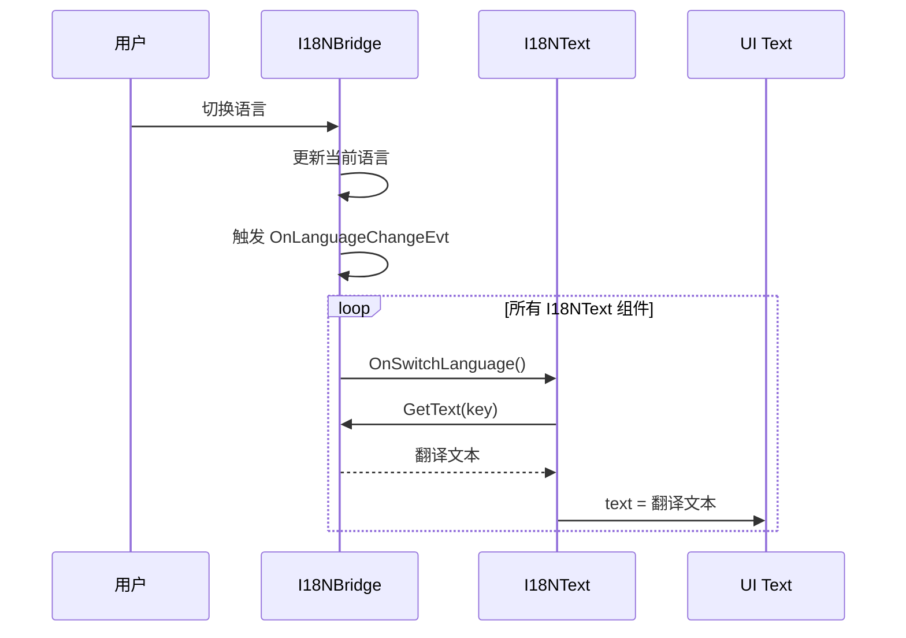

# I18NText.cs 注解文档

## 文件基本信息

| 属性 | 值 |
|------|-----|
| **文件名** | I18NText.cs |
| **路径** | Assets/Scripts/Mono/Module/I18N/I18NText.cs |
| **所属模块** | 框架层 → Mono/Module/I18N |
| **命名空间** | `TaoTie` |
| **文件职责** | 提供自动国际化文本组件，支持语言切换时自动更新 |

---

## 类说明

### I18NText

| 属性 | 说明 |
|------|------|
| **职责** | MonoBehaviour 组件，自动从 I18NBridge 获取翻译文本并应用到 Text/TMP_Text 组件 |
| **继承关系** | `MonoBehaviour` |
| **依赖组件** | `Text` 或 `TMPro.TMP_Text` |

**设计模式**: 观察者模式（监听语言切换事件）

---

## 字段与属性

| 名称 | 类型 | 访问级别 | 说明 |
|------|------|----------|------|
| `key` | `string` | `public` | 国际化文本的键（在翻译表中的标识） |
| `m_Text` | `Text` | `private` | Unity UI Text 组件引用 |
| `m_MeshText` | `TMPro.TMP_Text` | `private` | TextMeshPro 文本组件引用 |

---

## 方法说明

### Awake()

**签名**:
```csharp
void Awake()
```

**职责**: 初始化，获取 Text/TMP_Text 组件引用

---

### OnEnable()

**签名**:
```csharp
void OnEnable()
```

**职责**: 启用时应用翻译并订阅语言切换事件

**核心逻辑**:
```
1. 调用 OnSwitchLanguage() 应用当前语言翻译
2. 订阅 I18NBridge.OnLanguageChangeEvt 事件
```

---

### OnDisable()

**签名**:
```csharp
void OnDisable()
```

**职责**: 禁用时取消订阅语言切换事件

**核心逻辑**:
```
1. 取消订阅 I18NBridge.OnLanguageChangeEvt 事件
```

---

### OnSwitchLanguage()

**签名**:
```csharp
void OnSwitchLanguage()
```

**职责**: 应用当前语言的翻译

**核心逻辑**:
```
1. 从 I18NBridge 获取翻译文本
2. 应用到 Text 或 TMP_Text 组件
```

**调用者**: OnEnable(), I18NBridge.OnLanguageChangeEvt 事件

---

## 核心流程

### 语言切换流程



---

## 使用示例

### 示例 1: Unity 编辑器配置

1. 在 GameObject 上添加 `I18NText` 组件
2. 添加 `Text` 或 `TextMeshProUGUI` 组件
3. 在 Inspector 中设置 `key` 字段（如："menu.start"）

```
GameObject
├─ I18NText (Component)
│   └─ key: "menu.start"
└─ Text (Component)
    └─ text: "Start" (初始值)
```

### 示例 2: 代码动态设置

```csharp
// 获取组件
var i18nText = gameObject.GetComponent<I18NText>();

// 设置翻译键
i18nText.key = "settings.volume";

// 手动刷新（可选）
// 组件会在 OnEnable 时自动刷新
```

### 示例 3: 翻译表配置

```csharp
// 在 I18NBridge 中配置翻译
var translations = new Dictionary<string, Dictionary<string, string>>
{
    ["zh-CN"] = new Dictionary<string, string>
    {
        ["menu.start"] = "开始游戏",
        ["settings.volume"] = "音量"
    },
    ["en-US"] = new Dictionary<string, string>
    {
        ["menu.start"] = "Start Game",
        ["settings.volume"] = "Volume"
    }
};

I18NBridge.Instance.LoadTranslations(translations);
```

### 示例 4: 切换语言

```csharp
// 切换到英文
I18NBridge.Instance.SetLanguage("en-US");

// 所有 I18NText 组件会自动更新文本
```

---

## 支持的语言

通过 I18NBridge 配置，支持任意语言：

| 语言代码 | 语言 |
|----------|------|
| zh-CN | 简体中文 |
| zh-TW | 繁体中文 |
| en-US | 英语 |
| ja-JP | 日语 |
| ko-KR | 韩语 |
| ... | 其他语言 |

---

## 注意事项

| 问题 | 说明 | 解决方案 |
|------|------|----------|
| **组件未更新** | GameObject 未激活 | 确保 GameObject 激活以触发 OnEnable |
| **文本为空** | 翻译键不存在 | 检查 key 是否正确，翻译表是否加载 |
| **字体缺失** | 某些语言字符无法显示 | 使用支持多语言的字体（如 Noto Sans） |

---

## 相关文档

- [I18NBridge.cs.md](./I18NBridge.cs.md) - 国际化桥接（翻译管理）
- [TextMeshFontAssetManager.cs.md](./TextMeshFontAssetManager.cs.md) - 字体资产管理

---

*文档生成时间：2026-03-02 | OpenClaw AI 助手*
