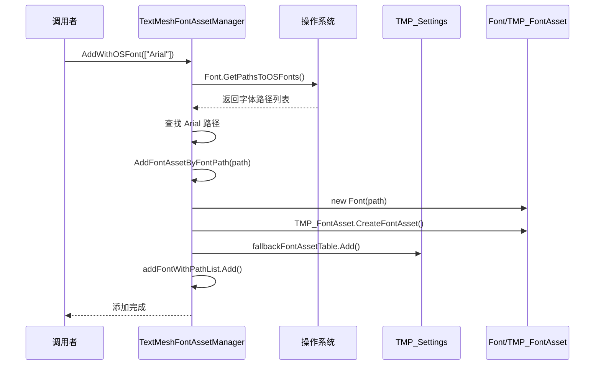

# TextMeshFontAssetManager.cs 注解文档

## 文件基本信息

| 属性 | 值 |
|------|-----|
| **文件名** | TextMeshFontAssetManager.cs |
| **路径** | Assets/Scripts/Mono/Module/I18N/TextMeshFontAssetManager.cs |
| **所属模块** | Mono 层 → I18N 国际化 |
| **文件职责** | 管理 TextMesh Pro 字体资源，支持动态添加/移除系统字体和自定义字体 |

---

## 类/结构体说明

### TextMeshFontAssetManager

| 属性 | 说明 |
|------|------|
| **职责** | 管理 TMP_FontAsset 字体资源，支持从系统加载字体、动态添加/移除字体到 TMP 设置 |
| **泛型参数** | 无 |
| **继承关系** | 无继承 |
| **实现的接口** | 无 |

**设计模式**: 单例模式

```csharp
// 单例实现
public static TextMeshFontAssetManager Instance { get; } = new TextMeshFontAssetManager();

// 使用方式
TextMeshFontAssetManager.Instance.AddWithOSFont(new string[] { "Arial", "SimHei" });
```

---

## 字段与属性（按重要程度排序）

| 名称 | 类型 | 访问级别 | 说明 |
|------|------|----------|------|
| `Instance` | `TextMeshFontAssetManager` | `public static` | 单例实例，全局访问点 |
| `addFontWithPathList` | `Dictionary<string, TMP_FontAsset>` | `private` | 按路径索引的已添加字体（用于去重） |
| `addFontList` | `Dictionary<Font, TMP_FontAsset>` | `private` | 按 Font 对象索引的已添加字体 |

---

## 方法说明（按重要程度排序）

### AddWithOSFont()

**签名**:
```csharp
public void AddWithOSFont(string[] tb)
```

**职责**: 从系统字体中添加指定字体到 TMP 字体库

**参数**:
- `tb`: 字体名称数组（如 `["Arial", "SimHei", "Microsoft YaHei"]`）

**核心逻辑**:
```
1. 获取系统所有字体路径 Font.GetPathsToOSFonts()
2. 建立 字体名（小写）→ 路径 的映射
3. 遍历传入的字体名称数组
4. 如果系统存在该字体，调用 AddFontAssetByFontPath() 添加
```

**使用示例**:
```csharp
// 添加中文字体
TextMeshFontAssetManager.Instance.AddWithOSFont(new string[] 
{ 
    "SimHei",      // 黑体
    "Microsoft YaHei",  // 微软雅黑
    "SimSun"       // 宋体
});
```

---

### RemoveWithOSFont()

**签名**:
```csharp
public void RemoveWithOSFont(string[] tb)
```

**职责**: 从 TMP 字体库中移除指定系统字体

**参数**:
- `tb`: 字体名称数组

**核心逻辑**:
```
1. 获取系统所有字体路径
2. 建立字体名到路径的映射
3. 遍历传入的字体名称
4. 如果存在，调用 RemoveFontAssetByFontPath() 移除
```

**使用示例**:
```csharp
// 移除之前添加的字体
TextMeshFontAssetManager.Instance.RemoveWithOSFont(new string[] 
{ 
    "SimHei" 
});
```

---

### AddFontAssetByFontPath()

**签名**:
```csharp
public void AddFontAssetByFontPath(string fontPath)
```

**职责**: 根据字体文件路径添加字体到 TMP 字体库

**参数**:
- `fontPath`: 字体文件的完整路径

**核心逻辑**:
```
1. 检查是否已添加（通过路径去重）
2. 创建 Font 对象 new Font(fontPath)
3. 使用 TMP_FontAsset.CreateFontAsset() 创建 TMP 字体资源
4. 启用多图集 isMultiAtlasTexturesEnabled = true
5. 调用 AddFontAsset() 添加到 TMP 设置
6. 记录到 addFontWithPathList
```

**字体参数**:
```csharp
TMP_FontAsset.CreateFontAsset(
    font,           // Font 对象
    40,             // 采样点大小
    2,              // 面片数
    GlyphRenderMode.SDFAA,  // 渲染模式（SDF + 抗锯齿）
    512, 512        // 图集分辨率
)
```

---

### AddFontAssetByFont()

**签名**:
```csharp
public void AddFontAssetByFont(Font font)
```

**职责**: 根据 Font 对象添加字体到 TMP 字体库

**参数**:
- `font`: Unity Font 对象

**核心逻辑**:
```
1. 检查是否已添加（通过 Font 对象去重）
2. 创建 TMP_FontAsset
3. 添加到 TMP 设置
4. 记录到 addFontList
```

**使用示例**:
```csharp
// 从 Resources 加载字体
Font customFont = Resources.Load<Font>("Fonts/CustomFont");
TextMeshFontAssetManager.Instance.AddFontAssetByFont(customFont);
```

---

### RemoveFontAssetByFontPath()

**签名**:
```csharp
public void RemoveFontAssetByFontPath(string fontPath)
```

**职责**: 根据路径移除已添加的字体

**参数**:
- `fontPath`: 字体文件路径

**核心逻辑**:
```
1. 检查是否存在
2. 从 TMP_Settings.defaultFontAsset.fallbackFontAssetTable 移除
3. 调用 RemoveFontAsset() 销毁资源
4. 从 addFontWithPathList 移除记录
```

---

### RemoveAllAddFont()

**签名**:
```csharp
public void RemoveAllAddFont()
```

**职责**: 移除所有动态添加的字体

**核心逻辑**:
```
1. 遍历 addFontList
2. 从 TMP_Settings 的 fallbackFontAssetTable 移除
3. 调用 RemoveFontAsset() 销毁
4. 清空 addFontList
```

**使用场景**: 切换语言包时清理旧字体，或游戏退出时清理资源。

---

## 内部方法

### AddFontAsset()

**签名**:
```csharp
private void AddFontAsset(ScriptableObject fontAsset)
```

**职责**: 将 TMP_FontAsset 添加到 TMP 设置的备用字体表

**核心逻辑**:
```
1. 检查是否已存在（CheckFontAsset）
2. 添加到 TMP_Settings.defaultFontAsset.fallbackFontAssetTable
```

### RemoveFontAsset()

**签名**:
```csharp
private void RemoveFontAsset(ScriptableObject fontAsset)
```

**职责**: 从 TMP 设置移除并销毁字体资源

**核心逻辑**:
```
1. 检查是否存在
2. 从 fallbackFontAssetTable 移除
3. 销毁 sourceFontFile
4. 销毁字体资源本身
```

### CheckFontAsset()

**签名**:
```csharp
private bool CheckFontAsset(ScriptableObject fontAsset)
```

**职责**: 检查字体是否已在 TMP 设置的备用字体表中

**返回值**: `bool` - 已存在返回 true，否则返回 false

---

## 字体管理流程

### 添加字体流程



### 字体回退机制

```
当 TMP_Text 渲染文本时：
1. 首先尝试使用 defaultFontAsset（默认字体）
2. 如果默认字体缺少某些字符（如中文）
3. 依次尝试 fallbackFontAssetTable 中的字体
4. 找到包含该字符的字体并渲染

因此，添加中文字体到 fallbackFontAssetTable 后：
- 英文字符使用默认字体（如 Arial）
- 中文字符自动使用中文字体（如 SimHei）
```

---

## 使用示例

### 示例 1: 初始化中文字体

```csharp
// 游戏启动时添加中文字体
void InitializeFonts()
{
    TextMeshFontAssetManager.Instance.AddWithOSFont(new string[]
    {
        "Microsoft YaHei",  // 微软雅黑（Windows）
        "PingFang SC",      // 苹方（macOS/iOS）
        "Noto Sans CJK SC", // 思源黑体（Android/Linux）
        "SimHei",           // 黑体（备用）
    });
    
    Log.Info("中文字体加载完成");
}
```

### 示例 2: 加载自定义字体

```csharp
// 从 Resources 加载自定义字体
async ETTask LoadCustomFont()
{
    // 方式 1: 从 Resources 加载
    Font customFont = Resources.Load<Font>("Fonts/CustomFont");
    TextMeshFontAssetManager.Instance.AddFontAssetByFont(customFont);
    
    // 方式 2: 从远程下载
    byte[] fontBytes = await DownloadFontFromCDN();
    Font dynamicFont = new Font(fontBytes);
    TextMeshFontAssetManager.Instance.AddFontAssetByFont(dynamicFont);
}
```

### 示例 3: 切换语言时切换字体

```csharp
async ETTask SwitchLanguage(LanguageType language)
{
    // 清理旧字体
    TextMeshFontAssetManager.Instance.RemoveAllAddFont();
    
    // 根据语言添加对应字体
    switch (language)
    {
        case LanguageType.zh_CN:
            TextMeshFontAssetManager.Instance.AddWithOSFont(new string[]
            {
                "Microsoft YaHei", "SimHei"
            });
            break;
        case LanguageType.ja_JP:
            TextMeshFontAssetManager.Instance.AddWithOSFont(new string[]
            {
                "Yu Gothic", "MS PGothic"
            });
            break;
        case LanguageType.ko_KR:
            TextMeshFontAssetManager.Instance.AddWithOSFont(new string[]
            {
                "Malgun Gothic", "Gulim"
            });
            break;
    }
    
    // 触发语言切换事件
    I18NBridge.Instance.OnLanguageChangeEvt?.Invoke();
}
```

### 示例 4: 检查字体是否可用

```csharp
bool IsFontAvailable(string fontName)
{
    string[] osFonts = Font.GetPathsToOSFonts();
    foreach (string path in osFonts)
    {
        string name = System.IO.Path.GetFileNameWithoutExtension(path);
        if (name.ToLower() == fontName.ToLower())
        {
            return true;
        }
    }
    return false;
}

// 使用
if (IsFontAvailable("Microsoft YaHei"))
{
    TextMeshFontAssetManager.Instance.AddWithOSFont(new string[] { "Microsoft YaHei" });
}
else
{
    Log.Warning("微软雅黑字体不可用，使用备用字体");
    TextMeshFontAssetManager.Instance.AddWithOSFont(new string[] { "SimHei" });
}
```

---

## 多图集支持

### isMultiAtlasTexturesEnabled

```csharp
tp_font.isMultiAtlasTexturesEnabled = true;
```

**说明**: 启用多图集模式，当单个 512x512 图集无法容纳所有字符时，自动创建多个图集。

**优势**:
- 支持大量字符（如中日韩文字）
- 避免字符缺失
- 内存按需分配

---

## 相关文档

- [I18NBridge.cs.md](./I18NBridge.cs.md) - 国际化桥接
- [I18NText.cs.md](./I18NText.cs.md) - 国际化文本组件
- [TextMesh Pro 官方文档](https://docs.unity3d.com/Packages/com.unity.textmeshpro@latest)

---

*文档生成时间：2026-03-02 | OpenClaw AI 助手*
