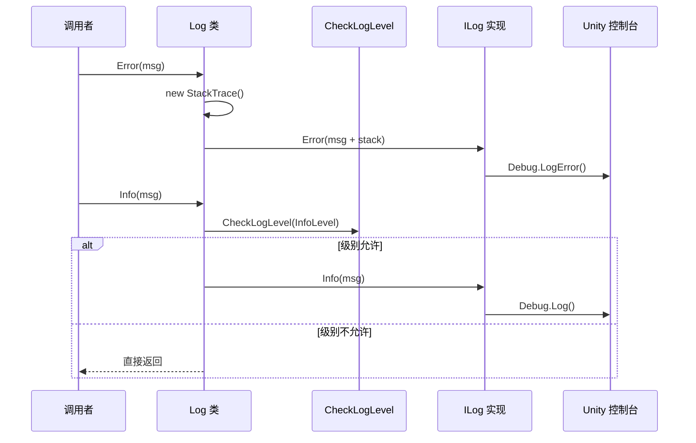

# Log.cs 注解文档

## 文件基本信息

| 属性 | 值 |
|------|-----|
| **文件名** | Log.cs |
| **路径** | Assets/Scripts/Mono/Module/Log/Log.cs |
| **所属模块** | 框架层 → Mono/Module/Log |
| **文件职责** | 日志系统入口，提供统一的日志记录接口，支持多种日志级别和格式化输出 |

---

## 类说明

### Log

| 属性 | 说明 |
|------|------|
| **职责** | 提供全局日志记录功能，支持 Trace/Debug/Info/Warning/Error 级别 |
| **泛型参数** | 无 |
| **继承关系** | 静态类，无继承 |
| **设计模式** | 外观模式 + 策略模式（通过 ILog 接口） |

```csharp
// 设置日志实现（通常在程序启动时）
Log.ILog = new UnityLogger();

// 使用日志
Log.Info("游戏启动");
Log.Error(ex);
```

---

## 常量定义

```csharp
private const int TraceLevel = 1;    // 跟踪日志级别
private const int DebugLevel = 2;    // 调试日志级别
private const int InfoLevel = 3;     // 信息日志级别
private const int WarningLevel = 4;  // 警告日志级别
```

**日志级别说明**:
- **Trace (1)**: 最详细的日志，包含堆栈跟踪，用于深度调试
- **Debug (2)**: 调试信息，用于开发阶段
- **Info (3)**: 一般信息，记录程序正常运行状态
- **Warning (4)**: 警告信息，记录潜在问题
- **Error**: 错误信息，始终输出，包含堆栈跟踪

---

## 字段与属性

| 名称 | 类型 | 访问级别 | 说明 |
|------|------|----------|------|
| `ILog` | `ILog` | `public static` | 日志实现接口，可替换为不同的日志后端 |

---

## 方法说明（按重要程度排序）

### Error(string) / Error(Exception)

**签名**:
```csharp
public static void Error(string msg)
public static void Error(Exception e)
public static void Error(string message, params object[] args)
```

**职责**: 记录错误日志（始终输出）

**核心逻辑**:
```
1. 创建堆栈跟踪 StackTrace(1, true)
2. 将消息和堆栈拼接
3. 调用 ILog.Error()
```

**调用者**: 任何需要记录错误的代码

**使用示例**:
```csharp
// 记录错误消息
Log.Error("加载资源失败");

// 记录异常
try
{
    LoadResource();
}
catch (Exception ex)
{
    Log.Error(ex);
}

// 格式化错误消息
Log.Error("加载资源 {0} 失败，原因：{1}", resourceName, reason);
```

---

### Warning(string)

**签名**:
```csharp
public static void Warning(string msg)
public static void Warning(string message, params object[] args)
```

**职责**: 记录警告日志（受 LogLevel 控制）

**核心逻辑**:
```
1. 检查日志级别 CheckLogLevel(WarningLevel)
2. 如果级别允许 → 调用 ILog.Warning()
```

**使用示例**:
```csharp
// 记录警告
Log.Warning("资源未找到，使用默认值");

// 格式化警告
Log.Warning("玩家 {0} 生命值过低：{1}", playerName, hp);
```

---

### Info(string) / Info(object)

**签名**:
```csharp
public static void Info(string msg)
public static void Info(object msg)
public static void Info(string message, params object[] args)
```

**职责**: 记录信息日志（受 LogLevel 控制）

**核心逻辑**:
```
1. 检查日志级别 CheckLogLevel(InfoLevel)
2. 如果级别允许 → 调用 ILog.Info()
```

**使用示例**:
```csharp
// 记录信息
Log.Info("游戏启动成功");

// 记录对象（调用 ToString()）
Log.Info(playerInfo);

// 格式化信息
Log.Info("玩家 {0} 进入场景 {1}", playerName, sceneName);
```

---

### Debug(string)

**签名**:
```csharp
public static void Debug(string msg)
public static void Debug(string message, params object[] args)
```

**职责**: 记录调试日志（受 LogLevel 控制）

**核心逻辑**:
```
1. 检查日志级别 CheckLogLevel(DebugLevel)
2. 如果级别允许 → 调用 ILog.Debug()
```

**使用示例**:
```csharp
// 记录调试信息
Log.Debug("开始加载场景");

// 格式化调试信息
Log.Debug("加载进度：{0:F2}%", progress);
```

---

### Trace(string)

**签名**:
```csharp
public static void Trace(string msg)
public static void Trace(string message, params object[] args)
```

**职责**: 记录跟踪日志（包含堆栈跟踪，受 LogLevel 控制）

**核心逻辑**:
```
1. 检查日志级别 CheckLogLevel(DebugLevel)
2. 创建堆栈跟踪 StackTrace(1, true)
3. 将消息和堆栈拼接
4. 调用 ILog.Trace()
```

**使用示例**:
```csharp
// 记录跟踪信息（带堆栈）
Log.Trace("进入方法 ProcessData");

// 格式化跟踪信息
Log.Trace("处理数据：{0}", data);
```

---

### TraceInfo(string)

**签名**:
```csharp
public static void TraceInfo(string msg)
```

**职责**: 记录带堆栈跟踪的信息日志

**核心逻辑**:
```
1. 检查日志级别 CheckLogLevel(InfoLevel)
2. 创建堆栈跟踪 StackTrace(1, true)
3. 将消息和堆栈拼接
4. 调用 ILog.Trace()
```

**使用示例**:
```csharp
// 记录重要操作的调用栈
TraceInfo("玩家触发购买操作");
```

---

### CheckLogLevel(int level)

**签名**:
```csharp
private static bool CheckLogLevel(int level)
```

**职责**: 检查日志级别是否允许输出

**核心逻辑**:
```
1. 返回 Define.LogLevel <= level
```

**说明**: 通过 `Define.LogLevel` 控制日志输出级别

---

## 日志级别控制

### Define.LogLevel

```csharp
// 在 Define.cs 中设置
public static class Define
{
    public static int LogLevel = DebugLevel; // 输出 Debug 及以上级别
}
```

**级别效果**:
```
LogLevel = 1 (Trace)   → 输出所有日志
LogLevel = 2 (Debug)   → 输出 Debug/Info/Warning/Error
LogLevel = 3 (Info)    → 输出 Info/Warning/Error
LogLevel = 4 (Warning) → 输出 Warning/Error
LogLevel = 5+          → 只输出 Error
```

---

## 日志输出流程



---

## 阅读指引

### 建议的阅读顺序

1. **理解日志系统作用** - 为什么需要统一的日志接口
2. **看日志级别** - 了解 Trace/Debug/Info/Warning/Error
3. **重点看 Error** - 理解错误日志始终输出
4. **深入 CheckLogLevel** - 理解日志级别控制
5. **了解 ILog 接口** - 理解可替换的日志后端

### 最值得学习的技术点

1. **外观模式**: Log 类作为统一入口，隐藏 ILog 实现细节
2. **策略模式**: 通过 ILog 接口支持不同的日志后端
3. **级别控制**: 通过 Define.LogLevel 动态控制日志输出
4. **堆栈跟踪**: Error 和 Trace 自动包含调用栈
5. **格式化支持**: 所有方法支持 `params object[] args` 格式化

---

## 使用示例

### 示例 1: 基础日志

```csharp
// 信息日志
Log.Info("游戏启动");

// 警告日志
Log.Warning("资源未找到");

// 错误日志
Log.Error("加载失败");
```

### 示例 2: 格式化日志

```csharp
// 格式化信息
Log.Info("玩家 {0} 等级 {1}", playerName, level);

// 格式化警告
Log.Warning("帧率过低：{0:F1} FPS", fps);

// 格式化错误
Log.Error("加载资源 {0} 失败：{1}", resourceName, errorMsg);
```

### 示例 3: 异常日志

```csharp
try
{
    LoadResource();
}
catch (Exception ex)
{
    // 记录异常（包含堆栈）
    Log.Error(ex);
    
    // 或者记录异常消息
    Log.Error($"加载失败：{ex.Message}");
}
```

### 示例 4: 调试日志

```csharp
// 开发阶段输出详细日志
#if UNITY_EDITOR
Log.Debug($"加载进度：{progress:P2}");
Log.Trace($"调用栈：{new StackTrace()}");
#endif
```

### 示例 5: 条件日志

```csharp
// 只在 Debug 模式下输出
if (Define.LogLevel <= Log.DebugLevel)
{
    Log.Debug($"详细数据：{data}");
}

// 只在特定条件下输出
if (isDebugMode)
{
    Log.Info($"调试模式：{debugInfo}");
}
```

### 示例 6: 性能关键代码的日志

```csharp
// 避免在性能关键代码中使用格式化日志
void Update()
{
    // ❌ 不好：即使不输出也会格式化字符串
    Log.Debug($"帧时间：{Time.deltaTime}");
    
    // ✅ 好：先检查级别
    if (Define.LogLevel <= Log.DebugLevel)
    {
        Log.Debug($"帧时间：{Time.deltaTime}");
    }
}
```

---

## 最佳实践

### 1. 选择合适的日志级别

```csharp
// Trace - 最详细，用于深度调试
Log.Trace($"进入方法，参数：{param}");

// Debug - 开发调试信息
Log.Debug($"加载进度：{progress}");

// Info - 一般信息
Log.Info("场景加载完成");

// Warning - 潜在问题
Log.Warning("资源未找到，使用默认值");

// Error - 错误（始终输出）
Log.Error("加载失败");
Log.Error(ex);
```

### 2. 避免性能陷阱

```csharp
// ❌ 不好：即使不输出也会执行字符串格式化
void Update()
{
    Log.Debug($"Position: {transform.position}");
}

// ✅ 好：先检查级别
void Update()
{
    if (Define.LogLevel <= Log.DebugLevel)
    {
        Log.Debug($"Position: {transform.position}");
    }
}
```

### 3. 记录有意义的上下文

```csharp
// ❌ 不好：信息不完整
Log.Error("加载失败");

// ✅ 好：包含上下文
Log.Error($"加载资源 {resourceName} 失败：{errorMsg}");
```

### 4. 异常处理

```csharp
try
{
    RiskyOperation();
}
catch (Exception ex)
{
    // 记录完整异常（包含堆栈）
    Log.Error(ex);
    
    // 或者添加上下文
    Log.Error($"执行 {operationName} 时出错：{ex.Message}");
}
```

---

## 相关文档

- [ILog.cs.md](./ILog.cs.md) - 日志接口定义
- [UnityLogger.cs.md](./UnityLogger.cs.md) - Unity 日志实现
- [Define.cs.md](../../Define.cs.md) - 全局定义（包含 LogLevel）

---

*文档生成时间：2026-03-01 | OpenClaw AI 助手*
