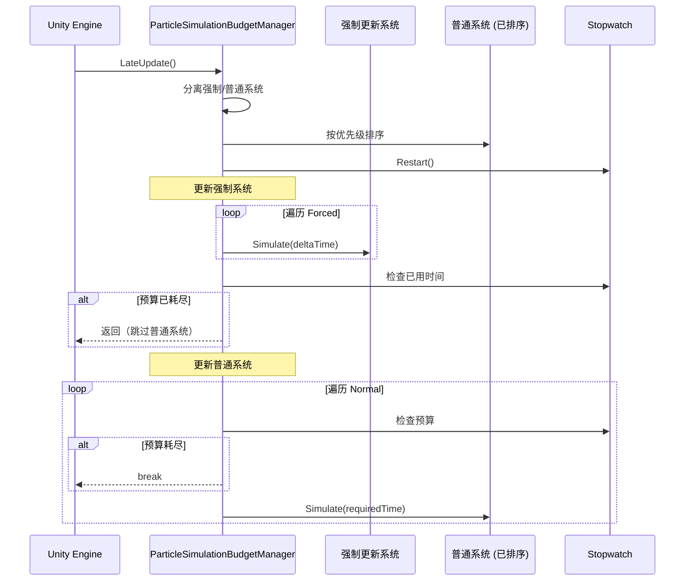

# ParticleSimulationBudgetManager.cs 注解文档

## 文件基本信息

| 属性 | 值 |
|------|------|
| **文件名** | ParticleSimulationBudgetManager.cs |
| **路径** | Assets/Scripts/Mono/Module/Particle/ParticleSimulationBudgetManager.cs |
| **所属模块** | 框架层 → Mono/Module/Particle |
| **文件职责** | 粒子系统性能管理器，基于时间预算控制每帧粒子更新数量 |

---

## 类/结构体说明

### ParticleSimulationBudgetManager

| 属性 | 说明 |
|------|------|
| **职责** | 单例模式管理器，控制每帧粒子系统的模拟时间预算 |
| **泛型参数** | 无 |
| **继承关系** | 继承 `MonoBehaviour` |
| **实现的接口** | 无 |

**设计模式**: 单例模式 + 预算调度模式

```csharp
// 获取实例
var manager = ParticleSimulationBudgetManager.Instance;

// 注册粒子系统
manager.RegisterSystem(particleController);

// 设置预算
manager._maxFrameBudgetMS = 2.5f; // 每帧最多 2.5ms 用于粒子更新
```

---

## 字段与属性

### Instance

| 属性 | 值 |
|------|------|
| **类型** | `ParticleSimulationBudgetManager` |
| **访问级别** | `public static` |
| **说明** | 单例实例，全局访问点 |

---

### _maxFrameBudgetMS

| 属性 | 值 |
|------|------|
| **类型** | `float` |
| **默认值** | `2.5f` (毫秒) |
| **访问级别** | `private` (Inspector 可配置) |
| **说明** | 每帧粒子模拟的最大时间预算 |

**用途**: 控制粒子系统性能开销，避免卡顿

---

### _managedSystems

| 属性 | 值 |
|------|------|
| **类型** | `List<ParticleSystemController>` |
| **访问级别** | `private` |
| **说明** | 所有已注册的粒子系统控制器 |

---

### UpdatedNormalParticles

| 属性 | 值 |
|------|------|
| **类型** | `int` |
| **访问级别** | `public` |
| **说明** | 本帧更新的普通粒子系统数量 |

**用途**: 性能监控和调试

---

### stopwatch

| 属性 | 值 |
|------|------|
| **类型** | `System.Diagnostics.Stopwatch` |
| **访问级别** | `private static` |
| **说明** | 高精度计时器，用于测量更新时间 |

---

## 方法说明

### Awake

**签名**:
```csharp
void Awake()
```

**职责**: 初始化单例

**核心逻辑**:
```
1. 检查是否已存在实例
2. 如果存在且不是当前实例，销毁当前 GameObject
3. 否则设置 Instance = this
```

**调用者**: Unity 生命周期

---

### RegisterSystem

**签名**:
```csharp
public void RegisterSystem(ParticleSystemController controller)
```

**职责**: 注册粒子系统控制器到管理器

**核心逻辑**:
```
1. 检查是否已注册（避免重复）
2. 添加到 _managedSystems 列表
```

**参数**:
| 参数名 | 类型 | 说明 |
|--------|------|------|
| `controller` | `ParticleSystemController` | 粒子系统控制器 |

**调用者**: ParticleSystemController.OnEnable()

---

### UnregisterSystem

**签名**:
```csharp
public void UnregisterSystem(ParticleSystemController controller)
```

**职责**: 从管理器注销粒子系统控制器

**核心逻辑**:
```
1. 从 _managedSystems 列表移除
```

**调用者**: ParticleSystemController.OnDisable()

---

### LateUpdate

**签名**:
```csharp
void LateUpdate()
```

**职责**: 每帧更新所有粒子系统，基于时间预算调度

**核心逻辑**:
```
1. 设置剩余预算 = _maxFrameBudgetMS
2. 分离强制更新系统和普通系统
3. 普通系统按优先级排序
4. 更新所有强制更新系统（无论预算）
5. 检查预算是否耗尽
6. 按优先级更新普通系统，直到预算耗尽
7. 记录更新的普通粒子数量
```

**调用者**: Unity 生命周期

**用途**: 核心性能控制逻辑

---

### CreateInstanceIfNeeded

**签名**:
```csharp
public static void CreateInstanceIfNeeded()
```

**职责**: 确保单例实例存在

**核心逻辑**:
```
1. 检查 Instance 是否为 null
2. 如果为 null，创建新的 GameObject 并添加组件
```

**调用者**: ParticleSystemController.Start()

---

## 粒子更新调度流程



---

## 优先级计算

### 系统分类

| 类型 | 优先级 | 更新策略 |
|------|--------|----------|
| **ForceUpdate** | `float.MaxValue` | 每帧必更新，不受预算限制 |
| **High** | 高 | 优先更新，距离补偿 x2 |
| **Normal** | 基础 | 按计算优先级排序 |

### 优先级公式

```csharp
float unsimulatedTime = Time.time - _lastSimulatedTime;
float compensation = Mathf.Log(1 + unsimulatedTime) * (preset == High ? 2f : 1f);

float distanceFactor = 1.0f / (sqrDistance * 0.1f + 1);
distanceFactor *= _distanceFactor;

CalculatedPriority = _basePriority + compensation * distanceFactor;

// 不可见惩罚
if (!_isVisible) CalculatedPriority *= 0.3f;
```

**说明**:
- `unsimulatedTime`: 未模拟时间越长，优先级越高（避免粒子跳变）
- `distanceFactor`: 距离相机越近，优先级越高
- `isVisible`: 不可见的粒子优先级降低 70%

---

## 使用示例

### 示例 1: 配置粒子预算

```csharp
// 在 Unity Inspector 中设置
// ParticleSimulationBudgetManager → Max Frame Budget MS = 2.5

// 或通过代码设置
ParticleSimulationBudgetManager.Instance._maxFrameBudgetMS = 3.0f;
```

### 示例 2: 创建粒子系统

```csharp
// 创建粒子 GameObject
GameObject particleObj = new GameObject("Effect", typeof(ParticleSystem), typeof(ParticleSystemController));

// 配置控制器
var controller = particleObj.GetComponent<ParticleSystemController>();
controller._priorityPreset = ParticlePriorityPreset.High;
controller._basePriority = 3.0f;
controller._distanceFactor = 1.5f;
```

### 示例 3: 强制更新重要粒子

```csharp
// 重要特效（如任务目标标记）设置为 ForceUpdate
controller._priorityPreset = ParticlePriorityPreset.ForceUpdate;

// 无论性能预算如何，都会每帧更新
```

### 示例 4: 性能监控

```csharp
// 在调试界面显示
int updatedParticles = ParticleSimulationBudgetManager.Instance.UpdatedNormalParticles;
Debug.Log($"本帧更新了 {updatedParticles} 个普通粒子系统");
```

---

## 设计要点

### 为什么使用预算控制？

**问题**: 大量粒子系统同时更新会导致帧率下降

**解决方案**:
```
每帧时间预算 = 2.5ms
├─ 强制更新系统（必须更新）
└─ 普通系统（按优先级，直到预算耗尽）
```

**优势**:
- 稳定的帧率
- 重要特效不受影响
- 次要特效自动降级

### 为什么使用 LateUpdate？

```csharp
void LateUpdate()
{
    // 粒子更新
}
```

**原因**:
1. 在所有 Update 之后执行
2. 确保粒子位置基于最新的游戏逻辑
3. 避免视觉延迟

### 为什么分离强制更新系统？

```csharp
// 分离强制和普通系统
var forcedSystems = ...;
var normalSystems = ...;

// 强制系统必须更新
foreach (var controller in forcedSystems)
{
    controller.Simulate(deltaTime);
}
```

**原因**:
- 关键特效（如任务目标、玩家标记）必须流畅
- 不能因为性能预算而跳过
- 确保核心体验

### 优先级补偿机制

```csharp
float compensation = Mathf.Log(1 + unsimulatedTime) * 2f;
```

**作用**:
- 长时间未更新的粒子优先级提升
- 避免粒子"跳变"（突然更新大量时间）
- 对数增长避免优先级爆炸

---

## 性能优化建议

### 1. 合理设置预算

```csharp
// 移动端：1.5-2.0ms
_maxFrameBudgetMS = 1.5f;

// PC 端：3.0-5.0ms
_maxFrameBudgetMS = 4.0f;
```

### 2. 谨慎使用 ForceUpdate

```csharp
// ❌ 避免：所有粒子都设为 ForceUpdate
// ✅ 推荐：仅关键特效使用 ForceUpdate
controller._priorityPreset = ParticlePriorityPreset.ForceUpdate; // 仅重要特效
```

### 3. 调整距离因子

```csharp
// 远距离粒子降低优先级
controller._distanceFactor = 0.5f;

// 近距离粒子提高优先级
controller._distanceFactor = 2.0f;
```

---

## 相关文档

- [ParticleSystemController.cs.md](./ParticleSystemController.cs.md) - 粒子系统控制器
- [PerformanceManager.cs.md](../Performance/PerformanceManager.cs.md) - 性能管理器

---

*文档生成时间：2026-03-01 | OpenClaw AI 助手*
