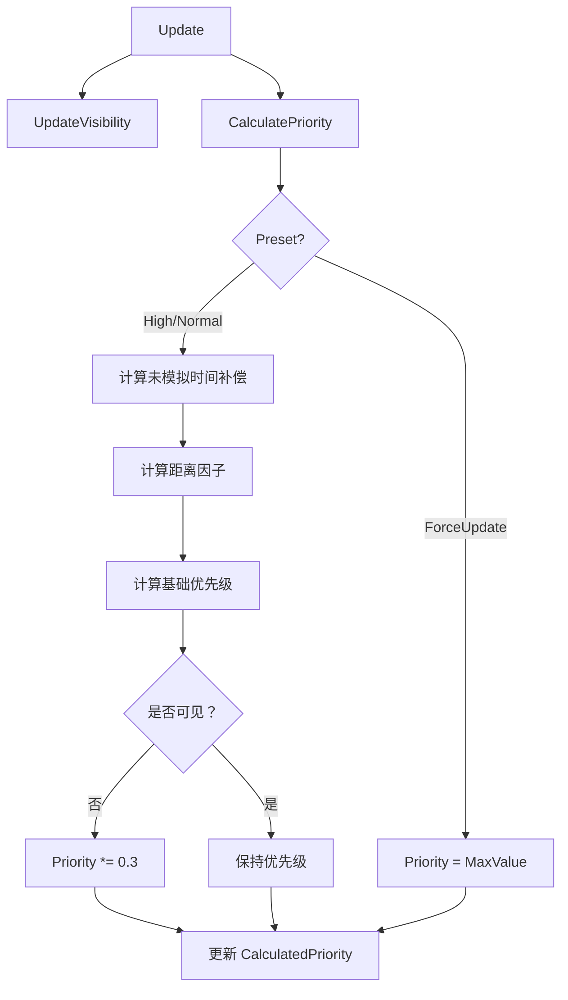

# ParticleSystemController.cs 注解文档

## 文件基本信息

| 属性 | 值 |
|------|------|
| **文件名** | ParticleSystemController.cs |
| **路径** | Assets/Scripts/Mono/Module/Particle/ParticleSystemController.cs |
| **所属模块** | 框架层 → Mono/Module/Particle |
| **文件职责** | 粒子系统控制器，管理单个粒子系统的优先级和模拟 |

---

## 类/结构体说明

### ParticleSystemController

| 属性 | 说明 |
|------|------|
| **职责** | 附加到粒子系统 GameObject 上，管理优先级计算和模拟调度 |
| **泛型参数** | 无 |
| **继承关系** | 继承 `MonoBehaviour` |
| **实现的接口** | 无 |

**设计模式**: 组件模式

```csharp
// 添加到粒子系统 GameObject
// [RequireComponent(typeof(ParticleSystem))] 自动添加 ParticleSystem

// 配置优先级
controller._priorityPreset = ParticlePriorityPreset.High;
controller._basePriority = 3.0f;
controller._distanceFactor = 1.5f;
```

---

### ParticlePriorityPreset 枚举

| 属性 | 值 |
|------|------|
| **类型** | `enum` |
| **说明** | 粒子优先级预设 |

| 枚举值 | 说明 | 优先级 |
|--------|------|--------|
| `ForceUpdate` | 强制更新 | `float.MaxValue` |
| `High` | 高优先级 | 基础值 + 距离补偿 x2 |
| `Normal` | 普通优先级 | 基础值 + 距离补偿 |

---

## 字段与属性

### PriorityPreset

| 属性 | 值 |
|------|------|
| **类型** | `ParticlePriorityPreset` |
| **访问级别** | `public` |
| **说明** | 优先级预设（只读） |

---

### CalculatedPriority

| 属性 | 值 |
|------|------|
| **类型** | `float` |
| **访问级别** | `public` |
| **说明** | 计算后的实际优先级 |

**用途**: 用于排序，值越大优先级越高

---

### RequiredSimulationTime

| 属性 | 值 |
|------|------|
| **类型** | `float` |
| **访问级别** | `public` |
| **说明** | 需要模拟的时间（秒） |

**计算**: `Time.time - _lastSimulatedTime`

---

### _priorityPreset

| 属性 | 值 |
|------|------|
| **类型** | `ParticlePriorityPreset` |
| **默认值** | `Normal` |
| **访问级别** | `private` (Inspector 可配置) |
| **说明** | 优先级预设配置 |

---

### _basePriority

| 属性 | 值 |
|------|------|
| **类型** | `float` |
| **范围** | `0-5` |
| **默认值** | `1.0f` |
| **访问级别** | `private` (Inspector 可配置) |
| **说明** | 基础优先级值 |

---

### _distanceFactor

| 属性 | 值 |
|------|------|
| **类型** | `float` |
| **范围** | `0-5` |
| **默认值** | `1.0f` |
| **访问级别** | `private` (Inspector 可配置) |
| **说明** | 距离因子，影响距离衰减程度 |

---

### _ps / _renderer

| 属性 | 值 |
|------|------|
| **类型** | `ParticleSystem` / `Renderer` |
| **访问级别** | `private` |
| **说明** | 缓存的组件引用 |

---

### _lastSimulatedTime

| 属性 | 值 |
|------|------|
| **类型** | `float` |
| **访问级别** | `private` |
| **说明** | 上次模拟的时间 |

---

### _isVisible

| 属性 | 值 |
|------|------|
| **类型** | `bool` |
| **访问级别** | `private` |
| **说明** | 粒子系统是否可见 |

---

## 方法说明

### Awake

**签名**:
```csharp
void Awake()
```

**职责**: 缓存组件引用

**核心逻辑**:
```
1. 获取 ParticleSystem 组件
2. 获取 Renderer 组件
```

**调用者**: Unity 生命周期

---

### Start

**签名**:
```csharp
void Start()
```

**职责**: 确保 ParticleSimulationBudgetManager 实例存在

**核心逻辑**:
```
1. 调用 ParticleSimulationBudgetManager.CreateInstanceIfNeeded()
```

**调用者**: Unity 生命周期

---

### OnEnable

**签名**:
```csharp
void OnEnable()
```

**职责**: 启用时注册到管理器

**核心逻辑**:
```
1. 注册到 ParticleSimulationBudgetManager
2. 暂停粒子系统（等待管理器调度）
```

**调用者**: Unity 生命周期

---

### OnDisable

**签名**:
```csharp
void OnDisable()
```

**职责**: 禁用时从管理器注销

**核心逻辑**:
```
1. 从 ParticleSimulationBudgetManager 注销
```

**调用者**: Unity 生命周期

---

### Update

**签名**:
```csharp
void Update()
```

**职责**: 每帧更新可见性和优先级

**核心逻辑**:
```
1. 调用 UpdateVisibility() 更新可见性
2. 调用 CalculatePriority() 计算优先级
```

**调用者**: Unity 生命周期

---

### UpdateVisibility

**签名**:
```csharp
private void UpdateVisibility()
```

**职责**: 更新粒子系统可见性状态

**核心逻辑**:
```
1. 检查 _renderer 是否存在
2. 读取 _renderer.isVisible
```

**用途**: 不可见的粒子降低优先级

---

### CalculatePriority

**签名**:
```csharp
private void CalculatePriority()
```

**职责**: 计算当前优先级

**核心逻辑**:
```
1. 如果是 ForceUpdate，设置优先级为 float.MaxValue
2. 计算未模拟时间补偿：log(1 + unsimulatedTime)
3. 计算距离因子：1 / (sqrDistance * 0.1 + 1)
4. 计算最终优先级：basePriority + compensation * distanceFactor
5. 如果不可见，优先级 x 0.3
```

**公式**:
```csharp
float unsimulatedTime = Time.time - _lastSimulatedTime;
float compensation = Mathf.Log(1 + unsimulatedTime) * (preset == High ? 2f : 1f);

float distanceFactor = 1.0f / (sqrDistance * 0.1f + 1);
distanceFactor *= _distanceFactor;

CalculatedPriority = _basePriority + compensation * distanceFactor;

if (!_isVisible) CalculatedPriority *= 0.3f;
```

---

### Simulate

**签名**:
```csharp
public void Simulate(float deltaTime)
```

**职责**: 模拟粒子系统

**核心逻辑**:
```
1. 检查 deltaTime 是否 > 0
2. 调用 ParticleSystem.Simulate(deltaTime, true, false, false)
3. 更新 _lastSimulatedTime
```

**参数**:
| 参数名 | 类型 | 说明 |
|--------|------|------|
| `deltaTime` | `float` | 模拟时间增量 |

**调用者**: ParticleSimulationBudgetManager.LateUpdate()

---

## 优先级计算流程



---

## 使用示例

### 示例 1: 配置重要特效

```csharp
// 创建粒子系统
GameObject effect = new GameObject("ImportantEffect", 
    typeof(ParticleSystem), 
    typeof(ParticleSystemController));

var controller = effect.GetComponent<ParticleSystemController>();

// 设置为强制更新（重要特效）
controller._priorityPreset = ParticlePriorityPreset.ForceUpdate;
```

### 示例 2: 配置远距离特效

```csharp
// 远距离特效，降低距离因子
controller._priorityPreset = ParticlePriorityPreset.Normal;
controller._basePriority = 0.5f;  // 低基础优先级
controller._distanceFactor = 0.3f; // 距离衰减更快
```

### 示例 3: 配置近距离特效

```csharp
// 玩家附近特效，提高优先级
controller._priorityPreset = ParticlePriorityPreset.High;
controller._basePriority = 4.0f;  // 高基础优先级
controller._distanceFactor = 2.0f; // 距离影响更大
```

### 示例 4: 调试可视化

```csharp
// 在 Unity 编辑器中选择粒子 GameObject
// 会显示优先级信息和包围盒
// Gizmos.color = Color.cyan
// "Prio: 3.5, Preset: High"
```

---

## 设计要点

### 为什么暂停粒子系统？

```csharp
void OnEnable()
{
    _ps.Pause(true);  // 暂停
}
```

**原因**:
- 粒子系统默认每帧自动更新
- 暂停后由 ParticleSimulationBudgetManager 统一调度
- 避免重复更新和性能浪费

### 为什么使用 isVisible？

```csharp
_isVisible = _renderer.isVisible;

if (!_isVisible) CalculatedPriority *= 0.3f;
```

**原因**:
- 屏幕外的粒子对玩家不可见
- 降低优先级，延后更新
- 节省性能给可见粒子

### 为什么使用对数补偿？

```csharp
float compensation = Mathf.Log(1 + unsimulatedTime) * 2f;
```

**原因**:
- 未模拟时间越长，粒子"跳变"越明显
- 对数增长：初期快速增长，后期平缓
- 避免优先级爆炸（线性增长会无限增大）

### 为什么使用平方距离？

```csharp
float sqrDistance = offset.sqrMagnitude;
float distanceFactor = 1.0f / (sqrDistance * 0.1f + 1);
```

**原因**:
- 避免开方运算（性能优化）
- 平方距离已经能反映远近关系
- +1 防止除零

---

## Inspector 配置示例

```
ParticleSystemController (Script)
├─ Priority Settings
│  ├─ Priority Preset: High ▼
│  ├─ Base Priority: 3.0 [0 ━━━━●━━━━ 5]
│  └─ Distance Factor: 1.5 [0 ━━━━●━━━━ 5]
└─ (自动缓存)
   ├─ _ps: ParticleSystem
   └─ _renderer: Renderer
```

---

## 性能优化建议

### 1. 合理设置优先级预设

| 场景 | 推荐预设 |
|------|----------|
| 玩家标记、任务目标 | ForceUpdate |
| 战斗特效、技能效果 | High |
| 环境粒子、背景特效 | Normal |

### 2. 调整基础优先级

```csharp
// 核心特效：3.0-5.0
controller._basePriority = 4.0f;

// 次要特效：1.0-2.0
controller._basePriority = 1.5f;

// 背景特效：0.0-0.5
controller._basePriority = 0.3f;
```

### 3. 距离因子调优

```csharp
// 只影响近距离：2.0-3.0
controller._distanceFactor = 2.5f;

// 均匀影响：1.0
controller._distanceFactor = 1.0f;

// 只影响远距离：0.3-0.5
controller._distanceFactor = 0.4f;
```

---

## 相关文档

- [ParticleSimulationBudgetManager.cs.md](./ParticleSimulationBudgetManager.cs.md) - 粒子预算管理
- [PerformanceManager.cs.md](../Performance/PerformanceManager.cs.md) - 性能管理器

---

*文档生成时间：2026-03-01 | OpenClaw AI 助手*
