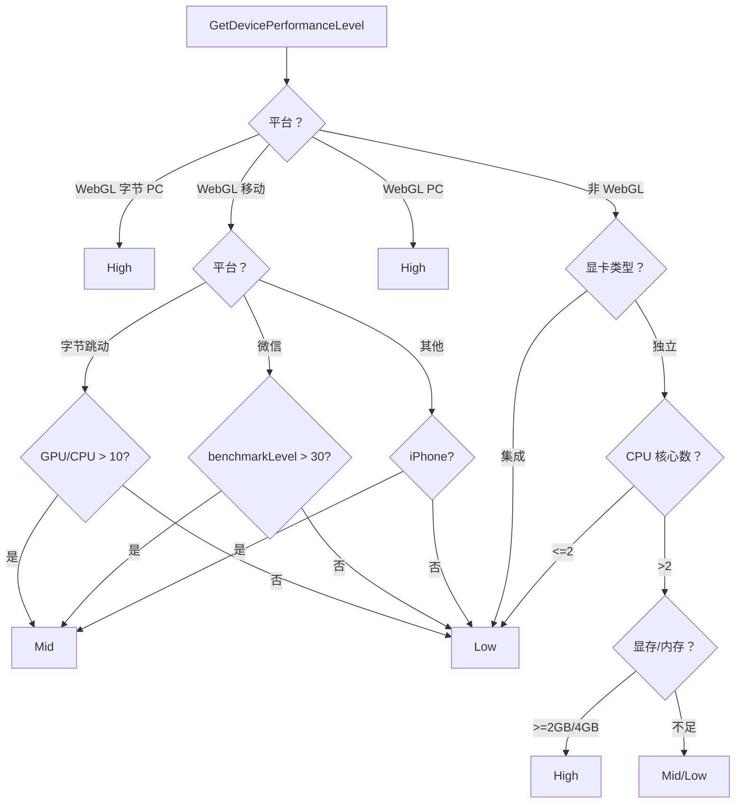

# PerformanceManager.cs 注解文档

## 文件基本信息

| 属性 | 值 |
|------|------|
| **文件名** | PerformanceManager.cs |
| **路径** | Assets/Scripts/Mono/Module/Performance/PerformanceManager.cs |
| **所属模块** | 框架层 → Mono/Module/Performance |
| **文件职责** | 设备性能评估与渲染设置自动调整 |

---

## 类/结构体说明

### PerformanceManager

| 属性 | 说明 |
|------|------|
| **职责** | 评估设备性能等级，自动调整渲染质量和帧率 |
| **泛型参数** | 无 |
| **继承关系** | 实现 `IManager` |
| **实现的接口** | `IManager` |

**设计模式**: 单例模式 + 策略模式

```csharp
// 获取实例
var perfManager = PerformanceManager.Instance;

// 获取性能等级
var level = perfManager.Level;

// 设置帧率
perfManager.SetFrame(60);
```

---

### DevicePerformanceLevel 枚举

| 属性 | 值 |
|------|------|
| **类型** | `enum` |
| **说明** | 设备性能等级 |

| 枚举值 | 说明 | 渲染比例 | 颜色精度 |
|--------|------|----------|----------|
| `Low` | 低端设备 | 55% | 32 位 |
| `Mid` | 中端设备 | 70% | 32 位 |
| `High` | 高端设备 | 85-100% | 64 位 |

---

## 字段与属性

### Instance

| 属性 | 值 |
|------|------|
| **类型** | `PerformanceManager` |
| **访问级别** | `public static` |
| **说明** | 单例实例，全局访问点 |

---

### Level

| 属性 | 值 |
|------|------|
| **类型** | `DevicePerformanceLevel` |
| **访问级别** | `public` |
| **说明** | 当前设备性能等级（只读） |

---

## 方法说明

### Init

**签名**:
```csharp
public void Init()
```

**职责**: 初始化性能管理器，评估设备并调整渲染设置

**核心逻辑**:
```
1. 设置单例 Instance = this
2. 调用 GetDevicePerformanceLevel() 评估设备
3. 获取 UniversalRenderPipelineAsset
4. 根据性能等级调整渲染设置：
   - High: renderScale=0.85(移动)/1(PC), HDR, 32 LUT
   - Mid/Low: renderScale=0.7/0.55, LDR, 16 LUT
5. 设置目标帧率为 60
```

**调用者**: ManagerProvider.RegisterManager<PerformanceManager>()

---

### Destroy

**签名**:
```csharp
public void Destroy()
```

**职责**: 销毁管理器

**核心逻辑**:
```
1. 设置 Instance = null
```

**调用者**: ManagerProvider.RemoveManager<PerformanceManager>()

---

### SetFrame

**签名**:
```csharp
public void SetFrame(int val)
```

**职责**: 设置目标帧率

**核心逻辑**:
```
1. WebGL 字节跳动平台：调用 TTSDK.TT.SetPreferredFramesPerSecond
2. WebGL 微信/字节平台：调用 WeChatWASM.WX.SetPreferredFramesPerSecond
3. 其他平台：设置 Application.targetFrameRate
```

**参数**:
| 参数名 | 类型 | 说明 |
|--------|------|------|
| `val` | `int` | 目标帧率 |

**调用者**: Init(), 其他需要调整帧率的逻辑

---

### SetHighFrame / SetLowFrame

**签名**:
```csharp
public void SetHighFrame()
public void SetLowFrame()
```

**职责**: 设置高/低帧率模式（当前未实现）

**说明**: 代码被注释，预留功能

---

### GetDevicePerformanceLevel

**签名**:
```csharp
public DevicePerformanceLevel GetDevicePerformanceLevel()
```

**职责**: 评估设备性能等级

**核心逻辑**:
```
WebGL 平台:
├─ 字节跳动 PC 直播伴侣 → High
├─ 移动端:
│  ├─ 字节跳动：GPU/CPU 评分 > 10 → Mid，否则 Low
│  ├─ 微信：benchmarkLevel > 30 → Mid，否则 Low
│  └─ 其他：iPhone → Mid，其他 → Low
└─ PC → High

非 WebGL 平台:
├─ 集成显卡 (vendorID=32902) → Low
└─ 独立显卡:
   ├─ CPU 核心数 <= 2 → Low
   └─ CPU 核心数 > 2:
      ├─ 显存 >= 2GB 且 内存 >= 4GB → High
      └─ 否则 → Mid (Android 为 Low)
```

**返回值**: `DevicePerformanceLevel` - 性能等级

**调用者**: Init()

---

## 设备性能评估流程



---

## 渲染设置调整

### 高端设备 (High)

```csharp
render.renderScale = PlatformUtil.IsMobile() ? 0.85f : 1f;
render.supportsCameraDepthTexture = !PlatformUtil.IsWebGl1();
render.colorGradingMode = ColorGradingMode.HighDynamicRange;
render.colorGradingLutSize = 32;
render.hdrColorBufferPrecision = HDRColorBufferPrecision._64Bits;
```

| 设置 | 值 | 说明 |
|------|-----|------|
| 渲染比例 | 85% (移动) / 100% (PC) | 保持高质量 |
| 深度纹理 | 支持 (非 WebGL1) | 支持后处理效果 |
| 颜色分级 | HDR | 高动态范围 |
| LUT 尺寸 | 32 | 高精度颜色查找表 |
| HDR 精度 | 64 位 | 最高颜色精度 |

### 中低端设备 (Mid/Low)

```csharp
render.renderScale = Level == DevicePerformanceLevel.Mid ? 0.7f : 0.55f;
render.supportsCameraDepthTexture = false;
render.colorGradingMode = ColorGradingMode.LowDynamicRange;
render.colorGradingLutSize = 16;
render.hdrColorBufferPrecision = HDRColorBufferPrecision._32Bits;
```

| 设置 | Mid | Low | 说明 |
|------|-----|-----|------|
| 渲染比例 | 70% | 55% | 降低渲染分辨率 |
| 深度纹理 | 不支持 | 不支持 | 关闭后处理 |
| 颜色分级 | LDR | LDR | 低动态范围 |
| LUT 尺寸 | 16 | 16 | 低精度颜色查找表 |
| HDR 精度 | 32 位 | 32 位 | 标准颜色精度 |

---

## 使用示例

### 示例 1: 初始化性能管理器

```csharp
// 在 Init.cs 或游戏入口
ManagerProvider.RegisterManager<PerformanceManager>();

// 性能管理器自动评估设备并调整设置
// Log.Info("Level: High") 或 "Mid" 或 "Low"
```

### 示例 2: 根据性能等级调整游戏逻辑

```csharp
// 根据性能等级调整粒子数量
if (PerformanceManager.Instance.Level == PerformanceManager.DevicePerformanceLevel.Low)
{
    // 低端设备减少粒子
    particleSystem.maxParticles = 100;
}
else if (PerformanceManager.Instance.Level == PerformanceManager.DevicePerformanceLevel.High)
{
    // 高端设备增加粒子
    particleSystem.maxParticles = 1000;
}
```

### 示例 3: 动态调整帧率

```csharp
// 战斗场景降低帧率以保证稳定
void EnterBattle()
{
    PerformanceManager.Instance.SetFrame(30);
}

// 大厅场景恢复高帧率
void EnterLobby()
{
    PerformanceManager.Instance.SetFrame(60);
}
```

### 示例 4: 检查设备等级

```csharp
// 根据设备等级启用/禁用功能
if (PerformanceManager.Instance.Level >= PerformanceManager.DevicePerformanceLevel.Mid)
{
    // 中端以上设备启用阴影
    EnableShadows();
}
else
{
    // 低端设备禁用阴影
    DisableShadows();
}
```

---

## 设计要点

### 为什么需要性能评估？

**问题**: 不同设备性能差异巨大，统一设置会导致：
- 低端设备卡顿、发热
- 高端设备性能浪费

**解决方案**:
```
设备评估 → 性能分级 → 自动调整
├─ CPU 核心数
├─ GPU 型号/显存
├─ 系统内存
└─ 平台特定 API（字节/微信）
```

### 为什么 WebGL 平台特殊处理？

```csharp
#if UNITY_WEBGL_TT
    if (TTSDK.TT.GetSystemInfo().platform == "windows")
        return DevicePerformanceLevel.High;
#endif
```

**原因**:
- WebGL 运行在浏览器中，性能受限
- 字节跳动、微信等平台有特定 API
- PC 直播伴侣性能较好，可视为高端

### 为什么调整渲染比例？

```csharp
// 高端移动设备：85%
// 中端设备：70%
// 低端设备：55%
render.renderScale = 0.55f;
```

**效果**:
- 1080p 屏幕 × 55% = 594p 渲染
- 像素数量减少到约 30%
- **性能提升约 3 倍**

### 为什么使用 LDR vs HDR？

```csharp
// 高端：HDR + 64 位精度
render.colorGradingMode = ColorGradingMode.HighDynamicRange;
render.hdrColorBufferPrecision = HDRColorBufferPrecision._64Bits;

// 中低端：LDR + 32 位精度
render.colorGradingMode = ColorGradingMode.LowDynamicRange;
render.hdrColorBufferPrecision = HDRColorBufferPrecision._32Bits;
```

**区别**:
- HDR: 更宽亮度范围，更真实
- LDR: 性能更好，兼容性更好
- 64 位：更高颜色精度
- 32 位：标准精度

---

## 平台特定评估标准

### CPU 核心数阈值

| 平台 | Low 阈值 | 说明 |
|------|----------|------|
| 编辑器/PC | < 1 | 几乎不会触发 |
| iOS | ≤ 1 | 老款 iPhone |
| Android | ≤ 2 | 低端安卓 |
| macOS | ≤ 2 | 老款 Mac |

### 内存阈值

| 平台 | High 要求 | Mid 要求 |
|------|-----------|----------|
| PC | 显存≥2GB 且 内存≥4GB | 不满足 High |
| iOS | 内存≥4GB | 不满足 High |
| macOS | 显存≥2GB 且 内存≥4GB | 不满足 High |
| Android | 显存≥2GB 且 内存≥4GB | Low |

---

## 扩展建议

### 添加更多性能等级

```csharp
public enum DevicePerformanceLevel
{
    VeryLow,   // 新增
    Low,
    Mid,
    High,
    Ultra      // 新增
}
```

### 添加更多渲染设置

```csharp
// 根据性能等级调整阴影质量
if (Level == DevicePerformanceLevel.Low)
{
    render.supportsMainLightShadows = false;
    render.supportsAdditionalLightShadows = false;
}
else if (Level == DevicePerformanceLevel.High)
{
    render.supportsMainLightShadows = true;
    render.supportsAdditionalLightShadows = true;
}
```

### 添加运行时重评估

```csharp
public void Reevaluate()
{
    Level = GetDevicePerformanceLevel();
    Init(); // 重新应用设置
}
```

---

## 相关文档

- [SystemInfoHelper.cs.md](../../Helper/SystemInfoHelper.cs.md) - 系统信息助手
- [PlatformUtil.cs.md](../../Helper/PlatformUtil.cs.md) - 平台工具类

---

*文档生成时间：2026-03-01 | OpenClaw AI 助手*
