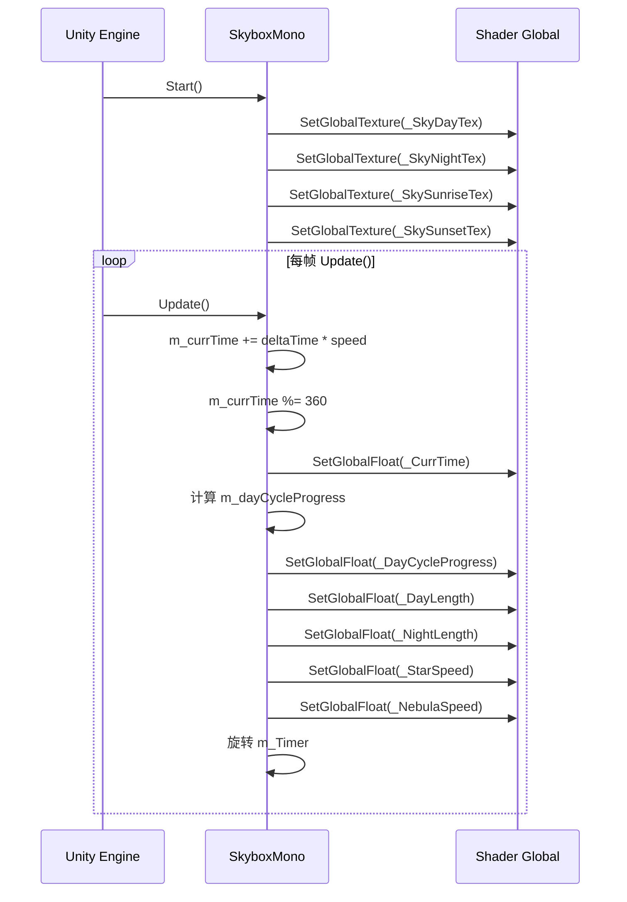
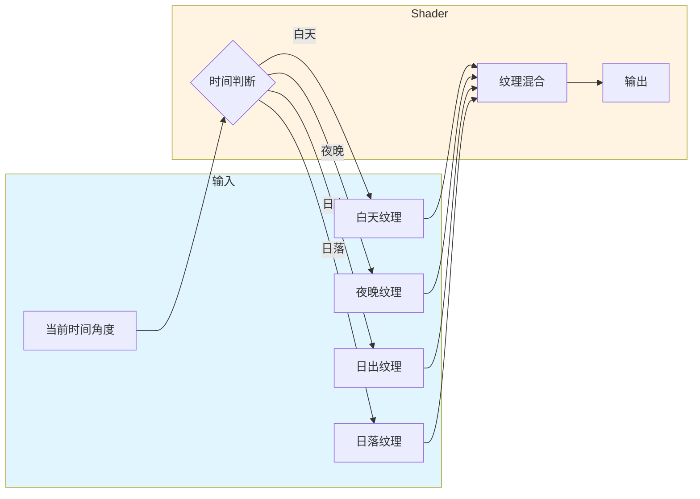

# Skybox.cs 注解文档

## 文件基本信息

| 属性 | 值 |
|------|-----|
| **文件名** | Skybox.cs |
| **路径** | Assets/Scripts/Mono/Module/Skybox/Skybox.cs |
| **所属模块** | Mono/Module/Skybox (天空盒) |
| **命名空间** | 全局 (无命名空间) |
| **文件职责** | 天空盒昼夜循环系统，控制天空盒纹理切换和全局 Shader 参数 |

---

## 类/结构体说明

### SkyboxMono

| 属性 | 说明 |
|------|------|
| **职责** | 控制天空盒昼夜循环，管理天空盒纹理和 Shader 全局参数 |
| **类型** | `MonoBehaviour` |
| **继承关系** | 继承自 `MonoBehaviour` |
| **特性** | `[ExecuteAlways]` (编辑器中始终执行) |

**设计模式**: 组件模式

---

## 字段与属性（按重要程度排序）

| 名称 | 类型 | 访问级别 | 说明 |
|------|------|----------|------|
| `m_dayCycleProgress` | `float` | `public` | 昼夜循环进度 (0-1) |
| `m_dayCycleSpeed` | `float` | `public` | 昼夜循环速度 (默认 1) |
| `m_dayLength` | `float` | `public` | 白天时长 (秒，默认 180) |
| `m_nightLength` | `float` | `public` | 夜晚时长 (秒，默认 180) |
| `m_currTime` | `float` | `public` | 当前时间 (角度 0-360，默认 45) |
| `m_starNebulaSpeed` | `float` | `public` | 星空/星云动画速度 |
| `m_Timer` | `GameObject` | `public` | 计时器可视化对象 |
| `m_skyDayTex` | `Texture2D` | `public` | 白天天空盒纹理 |
| `m_skyNightTex` | `Texture2D` | `public` | 夜晚天空盒纹理 |
| `m_skySunsetTex` | `Texture2D` | `public` | 日落天空盒纹理 |
| `m_skySunriseTex` | `Texture2D` | `public` | 日出天空盒纹理 |

---

## 方法说明

### Start()

**签名**:
```csharp
void Start()
```

**职责**: 初始化天空盒系统，设置 Shader 全局纹理

**核心逻辑**:
```
1. 设置初始时间 m_currTime = 45
2. 设置 Shader 全局纹理:
   - _SkyDayTex → m_skyDayTex
   - _SkyNightTex → m_skyNightTex
   - _SkySunriseTex → m_skySunriseTex
   - _SkySunsetTex → m_skySunsetTex
```

**调用者**: Unity 生命周期 (场景启动时)

---

### Update()

**签名**:
```csharp
void Update()
```

**职责**: 每帧更新天空盒状态，计算昼夜循环

**核心逻辑**:
```
1. 更新时间：m_currTime += Time.deltaTime * m_dayCycleSpeed
2. 角度取模：m_currTime %= 360
3. 设置 Shader 全局参数:
   - _CurrTime → m_currTime
   - _DayCycleProgress → m_dayCycleProgress
   - _DayLength → m_dayLength
   - _NightLength → m_nightLength
   - _StarSpeed → m_starNebulaSpeed
   - _NebulaSpeed → m_starNebulaSpeed
4. 计算昼夜进度：m_dayCycleProgress = m_currTime / (m_dayLength + m_nightLength)
5. 旋转计时器：m_Timer.transform.Rotate(Time.deltaTime * m_dayCycleSpeed, 0f, 0f)
```

**调用者**: Unity 生命周期 (每帧)

---

## Shader 全局参数

### 纹理参数

| 参数名 | 类型 | 说明 |
|--------|------|------|
| `_SkyDayTex` | `Texture2D` | 白天天空盒纹理 |
| `_SkyNightTex` | `Texture2D` | 夜晚天空盒纹理 |
| `_SkySunriseTex` | `Texture2D` | 日出天空盒纹理 |
| `_SkySunsetTex` | `Texture2D` | 日落天空盒纹理 |

### 浮点参数

| 参数名 | 类型 | 说明 |
|--------|------|------|
| `_CurrTime` | `float` | 当前时间角度 (0-360) |
| `_DayCycleProgress` | `float` | 昼夜循环进度 (0-1) |
| `_DayLength` | `float` | 白天时长 (秒) |
| `_NightLength` | `float` | 夜晚时长 (秒) |
| `_StarSpeed` | `float` | 星空动画速度 |
| `_NebulaSpeed` | `float` | 星云动画速度 |

---

## 昼夜循环逻辑

### 时间计算

```csharp
// 每帧累加时间
m_currTime += Time.deltaTime * m_dayCycleSpeed;

// 角度循环 (0-360 度)
m_currTime %= 360;
```

**说明**: 
- 0° = 午夜
- 90° = 日出
- 180° = 正午
- 270° = 日落
- 360° = 午夜 (循环)

### 进度计算

```csharp
m_dayCycleProgress = m_currTime / (m_dayLength + m_nightLength);
```

**说明**: 
- 进度 0.0 = 循环开始
- 进度 0.5 = 白天结束
- 进度 1.0 = 循环结束

---

## 流程图

### 昼夜循环流程



### 天空盒混合逻辑 (Shader 侧)



---

## 使用示例

### Inspector 配置

```
SkyboxMono 组件:
├─ m_dayCycleSpeed: 1.0          # 循环速度 (1=正常速度)
├─ m_dayLength: 180              # 白天时长 (秒)
├─ m_nightLength: 180            # 夜晚时长 (秒)
├─ m_currTime: 45                # 初始时间角度
├─ m_starNebulaSpeed: 1.0        # 星空动画速度
├─ m_Timer: [GameObject]         # 可视化计时器
├─ m_skyDayTex: [Texture2D]      # 白天天空盒
├─ m_skyNightTex: [Texture2D]    # 夜晚天空盒
├─ m_skySunriseTex: [Texture2D]  # 日出天空盒
└─ m_skySunsetTex: [Texture2D]   # 日落天空盒
```

### 代码控制

```csharp
// 获取 SkyboxMono 实例
var skybox = FindObjectOfType<SkyboxMono>();

// 加速时间 (10 倍速)
skybox.m_dayCycleSpeed = 10f;

// 设置到特定时间 (正午)
skybox.m_currTime = 180f;

// 暂停时间
skybox.m_dayCycleSpeed = 0f;

// 切换为长白天短夜晚
skybox.m_dayLength = 300f;
skybox.m_nightLength = 60f;
```

### 获取当前昼夜进度

```csharp
var skybox = FindObjectOfType<SkyboxMono>();
float progress = skybox.m_dayCycleProgress;

if (progress < 0.25f)
{
    // 夜晚
}
else if (progress < 0.5f)
{
    // 早晨
}
else if (progress < 0.75f)
{
    // 白天
}
else
{
    // 黄昏
}
```

---

## 与其他模块的交互

```mermaid
graph TD
    subgraph Skybox["SkyboxMono"]
        SM[SkyboxMono 组件]
    end
    
    subgraph Shader["Shader 全局参数"]
        T1[_SkyDayTex]
        T2[_SkyNightTex]
        T3[_SkySunriseTex]
        T4[_SkySunsetTex]
        F1[_CurrTime]
        F2[_DayCycleProgress]
    end
    
    subgraph Users["使用模块"]
        Env[EnvironmentManager<br/>环境系统]
        Light[Lighting System<br/>光照系统]
    end
    
    SM --> T1
    SM --> T2
    SM --> T3
    SM --> T4
    SM --> F1
    SM --> F2
    
    Env --> SM
    Light --> SM
    
    note right of SM "SkyboxMono 控制全局<br/>Shader 参数，其他系统<br/>通过 Shader 读取"
    
    style Skybox fill:#e1f5ff
    style Shader fill:#fff4e1
    style Users fill:#e8f5e9
```

---

## 注意事项

### ⚠️ 性能考虑

- `[ExecuteAlways]` 特性会在编辑器中每帧执行，可能影响编辑器性能
- 建议开发时禁用，需要预览时再启用

```csharp
// 开发时注释掉
// [ExecuteAlways]
public class SkyboxMono : MonoBehaviour
```

### ⚠️ Shader 兼容性

- 确保使用的 Shader 支持这些全局参数
- 全局参数会影响所有使用该 Shader 的对象

### ⚠️ 内存管理

- 天空盒纹理较大，注意内存占用
- 使用纹理压缩格式 (如 ASTC)

---

## 扩展建议

### 添加时间控制 API

```csharp
public class SkyboxMono : MonoBehaviour
{
    /// <summary>
    /// 设置当前时间 (小时 0-24)
    /// </summary>
    public void SetTimeOfDay(float hour)
    {
        m_currTime = (hour / 24f) * 360f;
    }
    
    /// <summary>
    /// 获取当前小时 (0-24)
    /// </summary>
    public float GetTimeOfDay()
    {
        return (m_currTime / 360f) * 24f;
    }
    
    /// <summary>
    /// 是否是白天
    /// </summary>
    public bool IsDaytime()
    {
        return m_currTime >= 90 && m_currTime <= 270;
    }
}
```

---

## 相关文档

- [EnvironmentManager.cs.md](../../../Code/Game/System/Environment/EnvironmentManager.cs.md) - 环境管理器
- [EnvironmentInfo.cs.md](../../../Code/Game/System/Environment/EnvironmentInfo.cs.md) - 环境配置数据
- [DayEnvironmentRunner.cs.md](../../../Code/Game/System/Environment/Runner/DayEnvironmentRunner.cs.md) - 昼夜环境运行器

---

*文档生成时间：2026-03-02 | OpenClaw AI 助手*
