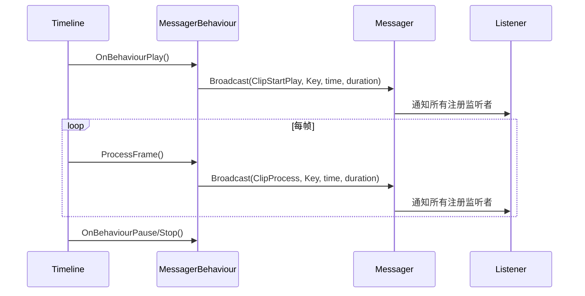

# MessagerBehaviour.cs 注解文档

## 文件基本信息

| 属性 | 值 |
|------|-----|
| **文件名** | MessagerBehaviour.cs |
| **路径** | Assets/Scripts/Mono/Module/TimeLine/MessagerBehaviour.cs |
| **所属模块** | 框架层 → Mono/Module/TimeLine |
| **文件职责** | Unity Timeline 剪辑行为实现，在播放时通过 Messager 系统广播消息 |

---

## 类说明

### MessagerBehaviour

| 属性 | 说明 |
|------|------|
| **职责** | PlayableBehaviour 实现，处理 Timeline 剪辑播放时的消息广播 |
| **继承关系** | 继承自 `PlayableBehaviour` |
| **关联剪辑** | `MessagerClip` |
| **关联轨道** | `MessagerTrack` |

**Unity 特性**:
```csharp
[Serializable]
public class MessagerBehaviour: PlayableBehaviour
```

---

## 字段与属性

### Key

**签名**:
```csharp
public string Key;
```

**说明**: 消息键，由 MessagerClip 传递

**来源**:
```csharp
// MessagerClip.CreatePlayable() 中设置
var behaviour = playable.GetBehaviour();
behaviour.Key = Key;
```

**用途**: 标识触发的事件类型，监听者根据 Key 区分不同事件

---

## 方法说明

### OnBehaviourPlay(Playable playable, FrameData info)

**签名**:
```csharp
public override void OnBehaviourPlay(Playable playable, FrameData info)
```

**职责**: 剪辑开始播放时触发，广播 ClipStartPlay 消息

**调用时机**: Timeline 播放到剪辑起点

**核心逻辑**:
```
1. 检查 Messager.Instance 是否存在
2. 广播 ClipStartPlay 消息
   - Key: 消息键
   - Time: 当前播放时间
   - Duration: 剪辑总时长
3. 调用基类方法
```

**代码实现**:
```csharp
public override void OnBehaviourPlay(Playable playable, FrameData info)
{
    Messager.Instance?.Broadcast(0, MessageId.ClipStartPlay, Key, playable.GetTime(),
        playable.GetDuration());
    base.OnBehaviourPlay(playable, info);
}
```

**参数说明**:
| 参数 | 类型 | 说明 |
|------|------|------|
| `0` | int | 消息类型/优先级 |
| `MessageId.ClipStartPlay` | int | 消息 ID（值：20） |
| `Key` | string | 消息键 |
| `playable.GetTime()` | double | 当前播放时间（秒） |
| `playable.GetDuration()` | double | 剪辑总时长（秒） |

---

### ProcessFrame(Playable playable, FrameData info, object playerData)

**签名**:
```csharp
public override void ProcessFrame(Playable playable, FrameData info, object playerData)
```

**职责**: 剪辑播放中每帧调用，广播 ClipProcess 消息

**调用时机**: Timeline 播放中，每帧调用

**核心逻辑**:
```
1. 检查 Messager.Instance 是否存在
2. 广播 ClipProcess 消息
   - Key: 消息键
   - Time: 当前播放时间
   - Duration: 剪辑总时长
3. 调用基类方法
```

**代码实现**:
```csharp
public override void ProcessFrame(Playable playable, FrameData info, object playerData)
{
    Messager.Instance?.Broadcast(0, MessageId.ClipProcess, Key, playable.GetTime(),
        playable.GetDuration());
    base.ProcessFrame(playable, info, playerData);
}
```

**参数说明**:
| 参数 | 类型 | 说明 |
|------|------|------|
| `0` | int | 消息类型/优先级 |
| `MessageId.ClipProcess` | int | 消息 ID（值：21） |
| `Key` | string | 消息键 |
| `playable.GetTime()` | double | 当前播放时间（秒） |
| `playable.GetDuration()` | double | 剪辑总时长（秒） |

---

## 消息广播流程

### 时序图



### 消息内容

**ClipStartPlay 消息**:
```csharp
// 监听者接收到的参数
object[] args = [Key, time, duration];
// Key: string - 消息键
// time: double - 开始时间（通常为 0）
// duration: double - 剪辑时长
```

**ClipProcess 消息**:
```csharp
// 监听者接收到的参数
object[] args = [Key, time, duration];
// Key: string - 消息键
// time: double - 当前播放时间（0 到 duration）
// duration: double - 剪辑总时长
```

---

## 使用示例

### Timeline 配置

```
Timeline: BossFight
├── MessagerTrack
│   ├── Clip: "BossEnter" (0s - 3s)
│   ├── Clip: "BossRoar" (3s - 5s)
│   └── Clip: "BossAttack" (5s - 10s)
└── AnimationTrack
    └── BossAnimation
```

### 监听实现

```csharp
public class BossFightController: MonoBehaviour
{
    void OnEnable()
    {
        Messager.Instance.Register(MessageId.ClipStartPlay, OnClipStart);
        Messager.Instance.Register(MessageId.ClipProcess, OnClipProcess);
    }
    
    void OnDisable()
    {
        Messager.Instance.Unregister(MessageId.ClipStartPlay, OnClipStart);
        Messager.Instance.Unregister(MessageId.ClipProcess, OnClipProcess);
    }
    
    void OnClipStart(object key, object time, object duration)
    {
        string keyStr = key as string;
        
        switch (keyStr)
        {
            case "BossEnter":
                boss.gameObject.SetActive(true);
                boss.PlayEnterAnimation();
                break;
            case "BossRoar":
                boss.PlayRoarAnimation();
                CameraShake.Instance.Shake(2f, 1f);
                break;
            case "BossAttack":
                boss.StartAttackPattern();
                break;
        }
    }
    
    void OnClipProcess(object key, object time, object duration)
    {
        string keyStr = key as string;
        float timeVal = (float)(double)time;
        float durationVal = (float)(double)duration;
        float progress = timeVal / durationVal;
        
        if (keyStr == "BossRoar")
        {
            // 咆哮声音渐强
            audioSource.volume = progress;
        }
    }
}
```

---

## PlayableBehaviour 生命周期

| 方法 | 调用时机 | 用途 |
|------|----------|------|
| `OnBehaviourPlay` | 剪辑开始播放 | 初始化、触发开始事件 |
| `ProcessFrame` | 每帧 | 更新逻辑、触发进度事件 |
| `OnBehaviourPause` | 剪辑暂停 | 暂停处理 |
| `OnBehaviourStop` | 剪辑停止 | 清理资源 |

MessagerBehaviour 仅实现了前两个方法，满足消息广播需求。

---

## 相关文档

- [MessagerTrack.cs.md](./MessagerTrack.cs.md) - Timeline 轨道定义
- [MessagerClip.cs.md](./MessagerClip.cs.md) - Timeline 剪辑定义
- [MessageId.cs.md](../Const/MessageId.cs.md) - 消息 ID 定义
- [Messager.cs.md](../Messager/Messager.cs.md) - 消息系统

---

*文档生成时间：2026-03-01 | OpenClaw AI 助手*
