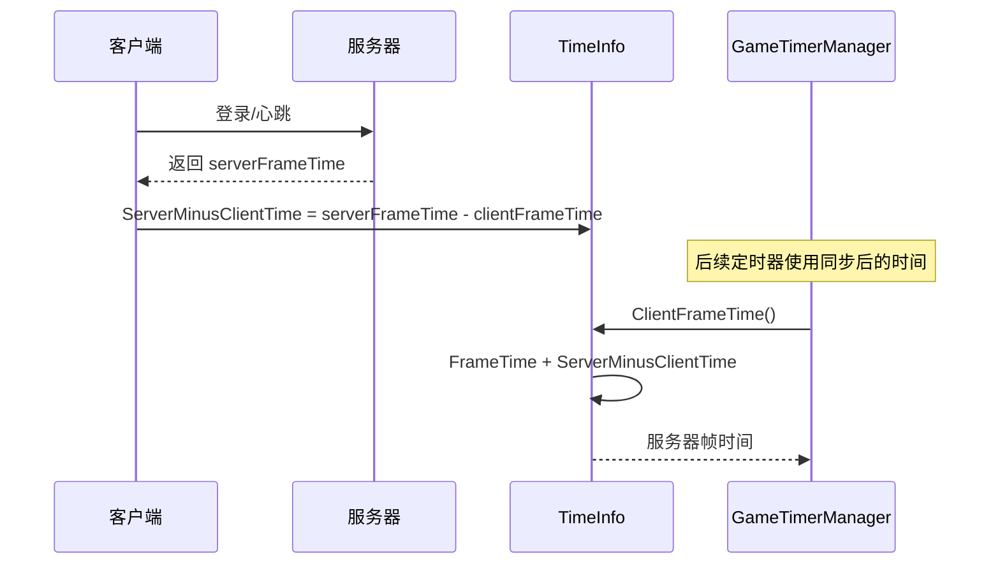

# GameTimerManager.cs 注解文档

## 文件基本信息

| 属性 | 值 |
|------|-----|
| **文件名** | GameTimerManager.cs |
| **路径** | Assets/Scripts/Mono/Module/Timer/GameTimerManager.cs |
| **所属模块** | Mono 层 → Timer 定时器 |
| **文件职责** | 游戏时间管理器，基于 TimeInfo 的游戏帧时间管理，提供游戏逻辑专用的定时器功能 |

---

## 类/结构体说明

### GameTimerManager

| 属性 | 说明 |
|------|------|
| **职责** | 继承自 TimerManager，使用游戏帧时间（TimeInfo.FrameTime）代替系统时间，确保游戏逻辑时间的一致性 |
| **泛型参数** | 无 |
| **继承关系** | 继承自 `TimerManager` |
| **实现的接口** | `IUpdate`, `IManager` |

**设计模式**: 单例模式 + 继承扩展

```csharp
// 单例实现
public static new GameTimerManager Instance { get; private set; }

// 通过 ManagerProvider 注册
ManagerProvider.RegisterManager<GameTimerManager>();
```

---

## 与 TimerManager 的区别

| 特性 | TimerManager | GameTimerManager |
|------|-------------|------------------|
| 时间源 | 系统时间（DateTime.UtcNow） | 游戏帧时间（TimeInfo.FrameTime） |
| 用途 | 通用定时器、异步等待 | 游戏逻辑定时器 |
| 时间同步 | 无 | 支持服务器时间同步 |
| 网络预测 | 不支持 | 支持（使用服务器帧时间） |

---

## 核心方法重写

### GetTimeNow()

**签名**:
```csharp
protected override long GetTimeNow()
```

**职责**: 获取当前游戏时间

**返回值**: `long` - 当前游戏帧时间戳

**核心逻辑**:
```
return TimeInfo.Instance.ClientFrameTime()
```

**说明**: 使用 TimeInfo.FrameTime 而不是系统时间，确保游戏逻辑时间的一致性。

---

## 使用场景

### 为什么需要 GameTimerManager

**问题**: 在网络游戏中，客户端系统时间可能与服务器时间不同步，导致：
- 技能冷却时间不一致
- Buff 持续时间计算错误
- 定时任务触发时间偏差

**解决方案**: 使用服务器同步的游戏帧时间（TimeInfo.FrameTime），确保所有客户端使用统一的时间基准。

---

## 使用示例

### 示例 1: 技能冷却

```csharp
// 技能冷却定时器
[TimerType(TimerType.SkillCooldown)]
public class SkillCooldownTimer : ITimer
{
    public void Handle(object obj)
    {
        SkillComponent skill = obj as SkillComponent;
        skill.OnCooldownEnd();
    }
}

// 使用
long timerId = GameTimerManager.Instance.NewOnceTimer(
    skillConfig.CooldownTime,  // 冷却时间（毫秒）
    TimerType.SkillCooldown,
    skillComponent
);
```

### 示例 2: Buff 持续时间

```csharp
// Buff 到期处理
[TimerType(TimerType.BuffDuration)]
public class BuffDurationTimer : ITimer
{
    public void Handle(object obj)
    {
        BuffComponent buff = obj as BuffComponent;
        buff.Remove();
    }
}

// 使用
long timerId = GameTimerManager.Instance.NewOnceTimer(
    buffConfig.DurationTime,
    TimerType.BuffDuration,
    buffComponent
);
```

### 示例 3: 游戏逻辑异步等待

```csharp
// 等待游戏时间 3 秒（不是真实时间 3 秒）
await GameTimerManager.Instance.WaitAsync(3000);

// 在慢动作模式下，这可能需要真实时间 6 秒
// 但游戏逻辑认为只过了 3 秒
```

---

## 时间同步

### 服务器时间同步流程



### 同步代码

```csharp
// 登录响应
void OnLoginResponse(LoginResponse response)
{
    long serverFrameTime = response.ServerFrameTime;
    long clientFrameTime = TimeInfo.Instance.ClientFrameTime();
    
    TimeInfo.Instance.ServerMinusClientTime = serverFrameTime - clientFrameTime;
    
    Log.Info($"游戏时间同步完成");
}
```

---

## 相关文档

- [TimerManager.cs.md](./TimerManager.cs.md) - 基础定时器管理器
- [TimeInfo.cs.md](./TimeInfo.cs.md) - 时间信息服务
- [ITimer.cs.md](./ITimer.cs.md) - 定时器处理器接口

---

*文档生成时间：2026-03-02 | OpenClaw AI 助手*
