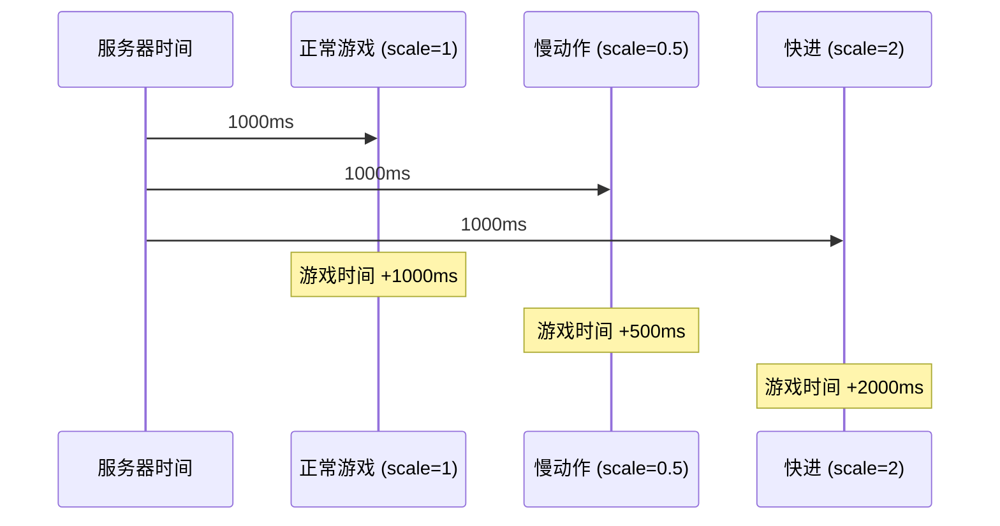

# GameTimerManager.cs 注解文档

## 文件基本信息

| 属性 | 值 |
|------|------|
| **文件名** | GameTimerManager.cs |
| **路径** | Assets/Scripts/Mono/Module/Timer/GameTimerManager.cs |
| **所属模块** | 框架层 → Mono/Module/Timer |
| **文件职责** | 游戏定时器管理器，支持时间缩放的游戏时间系统 |

---

## 类/结构体说明

### GameTimerManager

| 属性 | 说明 |
|------|------|
| **职责** | 继承 TimerManager，提供受时间缩放影响的游戏时间系统 |
| **泛型参数** | 无 |
| **继承关系** | 继承 `TimerManager` |
| **实现的接口** | 无 |

**设计模式**: 单例模式 + 时间缩放模式

```csharp
// 获取实例
var gameTimer = GameTimerManager.Instance;

// 设置时间缩放（慢动作）
gameTimer.SetTimeScale(0.5f);  // 半速

// 获取当前游戏时间
long currentTime = gameTimer.GetTimeNow();
```

---

## 内部类

### ResetTimeScale

| 属性 | 说明 |
|------|------|
| **职责** | 定时器回调类，用于在指定时间后重置时间缩放 |
| **继承关系** | 继承 `ATimer<GameTimerManager>` |
| **触发类型** | `TimerType.ResetTimeScale` |

**使用场景**: 设置临时时间缩放后自动恢复

```csharp
// 设置 2 秒的子弹时间，然后自动恢复
gameTimer.SetTimeScale(0.3f, during: 2000);
```

---

## 字段与属性

### Instance

| 属性 | 值 |
|------|------|
| **类型** | `GameTimerManager` |
| **访问级别** | `public static` |
| **说明** | 单例实例，全局访问点 |

---

### timeScale

| 属性 | 值 |
|------|------|
| **类型** | `float` |
| **访问级别** | `private` |
| **默认值** | `1` |
| **说明** | 时间缩放比例，标准值为 1 |

**取值范围**:
- `0`: 时间停止
- `0.5`: 半速（子弹时间）
- `1`: 正常速度
- `2`: 双倍速（快进）

---

### lastUpdateTime

| 属性 | 值 |
|------|------|
| **类型** | `long` |
| **访问级别** | `private` |
| **说明** | 上次更新的时间戳（服务器时间） |

---

### deltaTime

| 属性 | 值 |
|------|------|
| **类型** | `long` |
| **访问级别** | `private` |
| **说明** | 当前帧的游戏时间增量（受 timeScale 影响） |

---

### timeNow

| 属性 | 值 |
|------|------|
| **类型** | `long` |
| **访问级别** | `private` |
| **说明** | 当前游戏时间（毫秒） |

---

### resetTimeScaleId

| 属性 | 值 |
|------|------|
| **类型** | `long` |
| **访问级别** | `private` |
| **说明** | 重置时间缩放的定时器 ID |

---

## 方法说明

### Init

**签名**:
```csharp
public override void Init()
```

**职责**: 初始化游戏定时器

**核心逻辑**:
```
1. 设置单例 Instance = this
2. 初始化 timeNow = 0（可从存档读取）
3. 记录 lastUpdateTime
4. 调用 InitAction() 初始化
```

**调用者**: ManagerProvider.RegisterManager<GameTimerManager>()

---

### Destroy

**签名**:
```csharp
public override void Destroy()
```

**职责**: 销毁游戏定时器，清理所有子定时器

**核心逻辑**:
```
1. 设置 Instance = null
2. 遍历并 Dispose 所有子定时器
3. 清空 childs 字典
```

**调用者**: ManagerProvider.RemoveManager<GameTimerManager>()

---

### Update

**签名**:
```csharp
public override void Update()
```

**职责**: 每帧更新游戏时间和定时器

**核心逻辑**:
```
1. 获取服务器当前时间
2. 计算时间差 changeTime
3. 应用时间缩放：deltaTime = changeTime * timeScale
4. 如果 timeScale <= 0，更新时间但不推进游戏时间
5. 更新 lastUpdateTime 和 timeNow
6. 处理每帧定时器（everyFrameTimer）
7. 处理超时定时器（TimeId）
8. 运行到期的定时器动作
```

**调用者**: 游戏主循环（每帧调用）

---

### SetTimeScale

**签名**:
```csharp
public void SetTimeScale(float scale, int during = -1)
```

**职责**: 设置时间缩放比例

**核心逻辑**:
```
1. 检查 scale >= 0
2. 设置 timeScale = scale
3. 移除之前的重置定时器
4. 如果 during >= 0，创建一次性定时器在指定时间后重置
5. 广播 TimeScaleChange 消息
```

**调用者**: 子弹时间技能、暂停功能、过场动画

**参数**:
| 参数名 | 类型 | 默认值 | 说明 |
|--------|------|--------|------|
| `scale` | `float` | - | 时间缩放比例（0-∞） |
| `during` | `int` | -1 | 持续时间（毫秒），-1 表示永久 |

**使用示例**:
```csharp
// 子弹时间（半速）
GameTimerManager.Instance.SetTimeScale(0.5f);

// 暂停游戏
GameTimerManager.Instance.SetTimeScale(0f);

// 2 秒慢动作后自动恢复
GameTimerManager.Instance.SetTimeScale(0.3f, during: 2000);

// 双倍速（快进）
GameTimerManager.Instance.SetTimeScale(2f);
```

---

### GetTimeScale

**签名**:
```csharp
public float GetTimeScale()
```

**职责**: 获取当前时间缩放比例

**返回值**: `float` - 当前 timeScale 值

---

### GetTimeNow

**签名**:
```csharp
public override long GetTimeNow()
```

**职责**: 获取当前游戏时间（受时间缩放影响）

**返回值**: `long` - 当前游戏时间（毫秒）

**对比**:
- `GameTimerManager.GetTimeNow()`: 游戏时间（受缩放影响）
- `TimerManager.Instance.GetTimeNow()`: 服务器时间（不受影响）

---

### GetDeltaTime

**签名**:
```csharp
public long GetDeltaTime()
```

**职责**: 获取当前帧的游戏时间增量

**返回值**: `long` - deltaTime（毫秒，受缩放影响）

**使用示例**:
```csharp
// 在 Update 中使用
void Update()
{
    long dt = GameTimerManager.Instance.GetDeltaTime();
    // 基于游戏时间的移动
    transform.position += speed * dt * 0.001f;
}
```

---

## 时间缩放机制

### 计算公式

```csharp
// 服务器时间差
long changeTime = serverNow - lastUpdateTime;

// 游戏时间增量（受缩放影响）
deltaTime = (int)(changeTime * timeScale);

// 更新游戏时间
timeNow += deltaTime;
```

### 时间线对比



---

## 使用示例

### 示例 1: 子弹时间技能

```csharp
public class BulletTimeSkill : MonoBehaviour
{
    public void Activate()
    {
        // 进入子弹时间（30% 速度，持续 5 秒）
        GameTimerManager.Instance.SetTimeScale(0.3f, during: 5000);
        
        // 播放音效
        AudioManager.Instance.Play("BulletTime");
    }
}
```

### 示例 2: 游戏暂停

```csharp
public class PauseMenu : MonoBehaviour
{
    public void OpenPauseMenu()
    {
        // 暂停游戏
        GameTimerManager.Instance.SetTimeScale(0f);
        
        // 显示暂停菜单
        pauseMenu.SetActive(true);
    }
    
    public void ResumeGame()
    {
        // 恢复游戏
        GameTimerManager.Instance.SetTimeScale(1f);
        
        // 隐藏暂停菜单
        pauseMenu.SetActive(false);
    }
}
```

### 示例 3: 基于游戏时间的冷却

```csharp
public class SkillCooldown : MonoBehaviour
{
    private long skillTime;
    private const int CooldownMs = 10000;  // 10 秒冷却
    
    public void UseSkill()
    {
        skillTime = GameTimerManager.Instance.GetTimeNow();
        // 释放技能
    }
    
    public bool IsCooldownReady()
    {
        long elapsed = GameTimerManager.Instance.GetTimeNow() - skillTime;
        return elapsed >= CooldownMs;
    }
    
    public float GetCooldownProgress()
    {
        long elapsed = GameTimerManager.Instance.GetTimeNow() - skillTime;
        return Mathf.Clamp01((float)elapsed / CooldownMs);
    }
}
```

---

## 设计要点

### 为什么需要游戏时间？

1. **时间缩放**: 支持子弹时间、暂停、快进等功能
2. **网络同步**: 游戏时间可以用于确定性模拟
3. **存档兼容**: 存档中保存游戏时间而非真实时间
4. **逻辑独立**: 游戏逻辑不受帧率影响

### 与 Unity Time.timeScale 对比

| 特性 | GameTimerManager | Unity Time.timeScale |
|------|------------------|---------------------|
| **影响范围** | 仅游戏逻辑 | 整个 Unity 引擎 |
| **精度** | 毫秒级 | 浮点秒 |
| **可控性** | 完全可控 | 影响物理/动画等 |
| **推荐用途** | 游戏逻辑计时 | 动画/物理时间缩放 |

### 每帧定时器优化

```csharp
// 避免 foreach 产生 GC
int count = this.everyFrameTimer.Count;
for (int i = 0; i < count; ++i)
{
    long timerId = this.everyFrameTimer.Dequeue();
    // ...
}
```

**优势**: 减少 GC，提高性能

---

## 相关文档

- [TimerManager.cs.md](../Timer/TimerManager.cs.md) - 父类定时器管理器
- [TimerAttribute.cs.md](./TimerAttribute.cs.md) - 定时器特性
- [ATimer.cs.md](./ATimer.cs.md) - 定时器基类

---

*文档生成时间：2026-02-28 | OpenClaw AI 助手*
