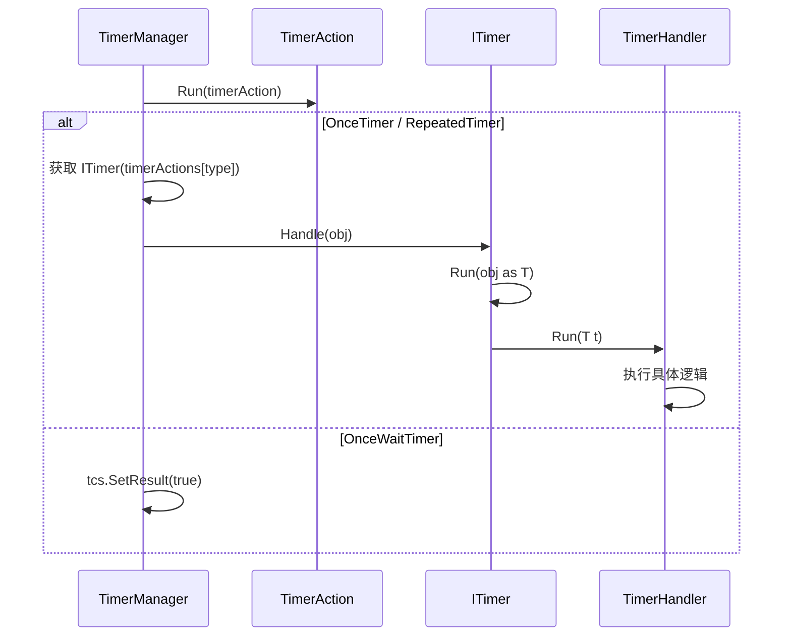

# ITimer.cs 注解文档

## 文件基本信息

| 属性 | 值 |
|------|-----|
| **文件名** | ITimer.cs |
| **路径** | Assets/Scripts/Mono/Module/Timer/ITimer.cs |
| **所属模块** | 框架层 → Mono/Module/Timer |
| **文件职责** | 定义定时器处理器接口，规范定时器触发时的行为 |

---

## 接口说明

### ITimer

**定义**:
```csharp
public interface ITimer
{
    void Handle(object args);
}
```

| 属性 | 说明 |
|------|------|
| **职责** | 定义定时器触发时的处理方法 |
| **参数** | `args` - 定时器触发时传递的参数对象 |
| **用途** | 所有定时器处理器必须实现此接口 |

---

## 抽象类说明

### ATimer<T>

**定义**:
```csharp
public abstract class ATimer<T> : ITimer where T : class
{
    public void Handle(object args)
    {
        this.Run(args as T);
    }

    public abstract void Run(T t);
}
```

| 属性 | 说明 |
|------|------|
| **职责** | 提供类型安全的定时器处理器基类 |
| **泛型参数** | `T` - 参数类型 |
| **继承关系** | 实现 `ITimer` |
| **设计模式** | 模板方法模式 |

**方法说明**:

#### Handle(object args)
- **职责**: ITimer 接口的实现，负责类型转换和委托
- **核心逻辑**: 将 `object args` 转换为 `T` 类型，然后调用 `Run(T t)`

#### Run(T t)
- **职责**: 子类实现的具体定时器逻辑
- **抽象方法**: 必须由子类实现

---

## 使用示例

### 示例 1: 基础定时器处理器

```csharp
// 定义定时器类型
public static class TimerType
{
    public const int MyTimer = 1001;
}

// 实现定时器处理器
[Timer(TimerType.MyTimer)]
public class MyTimerHandler : ATimer<MyClass>
{
    public override void Run(MyClass obj)
    {
        // 定时器触发时的逻辑
        obj.DoSomething();
    }
}

// 使用定时器
long timerId = TimerManager.Instance.NewOnceTimer(
    TimerManager.Instance.GetTimeNow() + 1000,
    TimerType.MyTimer,
    myObject
);
```

### 示例 2: 重复定时器处理器

```csharp
[Timer(TimerType.CheckTimer)]
public class CheckTimerHandler : ATimer<GameLogic>
{
    public override void Run(GameLogic logic)
    {
        // 每 5 秒检查一次
        logic.CheckStatus();
    }
}

// 创建重复定时器
long timerId = TimerManager.Instance.NewRepeatedTimer(
    5000,
    TimerType.CheckTimer,
    gameLogic
);
```

### 示例 3: 每帧定时器处理器

```csharp
[Timer(TimerType.FrameUpdate)]
public class FrameUpdateHandler : ATimer<Player>
{
    public override void Run(Player player)
    {
        // 每帧更新玩家状态
        player.UpdateFrame();
    }
}

// 创建每帧定时器
long timerId = TimerManager.Instance.NewFrameTimer(
    TimerType.FrameUpdate,
    player
);
```

### 示例 4: 带多个参数的定时器

```csharp
// 使用匿名对象或自定义类传递多个参数
public class TimerArgs
{
    public int Damage { get; set; }
    public GameObject Target { get; set; }
}

[Timer(TimerType.DamageOverTime)]
public class DamageOverTimeHandler : ATimer<TimerArgs>
{
    public override void Run(TimerArgs args)
    {
        // 对目标造成持续伤害
        args.Target.TakeDamage(args.Damage);
    }
}

// 使用
var timerArgs = new TimerArgs
{
    Damage = 10,
    Target = enemy
};

long timerId = TimerManager.Instance.NewRepeatedTimer(
    1000,
    TimerType.DamageOverTime,
    timerArgs
);
```

### 示例 5: 游戏计时器处理器

```csharp
[Timer(TimerType.GameTimer)]
public class GameTimerHandler : ATimer<GameSession>
{
    public override void Run(GameSession session)
    {
        // 更新游戏计时
        session.ElapsedTime += 1000;
        
        // 检查是否超时
        if (session.ElapsedTime >= session.MaxTime)
        {
            session.EndGame();
        }
    }
}
```

### 示例 6: 冷却定时器处理器

```csharp
[Timer(TimerType.SkillCooldown)]
public class SkillCooldownHandler : ATimer<Skill>
{
    public override void Run(Skill skill)
    {
        // 技能冷却完成
        skill.CooldownRemaining -= 1000;
        
        if (skill.CooldownRemaining <= 0)
        {
            skill.CooldownRemaining = 0;
            skill.OnCooldownComplete();
        }
    }
}
```

---

## 定时器注册机制

### TimerAttribute

定时器处理器通过 `[Timer]` 特性注册：

```csharp
[Timer(TimerType.MyTimer)]
public class MyTimerHandler : ATimer<MyClass>
{
    public override void Run(MyClass obj) { }
}
```

**TimerManager 初始化时**:
```csharp
// 通过反射获取所有带 [Timer] 特性的类
List<Type> types = AttributeManager.Instance.GetTypes(
    TypeInfo<TimerAttribute>.Type
);

// 创建实例并注册到 timerActions 数组
foreach (Type type in types)
{
    ITimer timer = Activator.CreateInstance(type) as ITimer;
    // 获取特性中的类型
    TimerAttribute attr = type.GetCustomAttribute<TimerAttribute>();
    timerActions[attr.Type] = timer;
}
```

---

## 定时器执行流程



---

## 阅读指引

### 建议的阅读顺序

1. **理解 ITimer 作用** - 为什么需要定时器处理器接口
2. **看 ATimer 基类** - 理解类型安全的实现方式
3. **了解 TimerAttribute** - 理解定时器注册机制
4. **结合 TimerManager** - 理解定时器执行流程

### 最值得学习的技术点

1. **接口设计**: `ITimer` 提供统一的定时器处理接口
2. **泛型基类**: `ATimer<T>` 提供类型安全的基类
3. **模板方法**: `Handle()` 调用 `Run()` 的模板方法模式
4. **特性注册**: 通过 `[Timer]` 特性自动注册处理器
5. **反射查找**: TimerManager 通过反射查找所有处理器

---

## 最佳实践

### 1. 使用有意义的 TimerType

```csharp
public static class TimerType
{
    public const int SkillCooldown = 1001;
    public const int BuffDuration = 1002;
    public const int CheckStatus = 1003;
    // ...
}
```

### 2. 处理器保持单一职责

```csharp
// ✅ 好的做法：一个处理器只做一件事
[Timer(TimerType.SkillCooldown)]
public class SkillCooldownHandler : ATimer<Skill>
{
    public override void Run(Skill skill)
    {
        skill.UpdateCooldown();
    }
}

// ❌ 不好的做法：一个处理器做太多事
[Timer(TimerType.Everything)]
public class EverythingHandler : ATimer<object>
{
    public override void Run(object obj)
    {
        // 处理技能、buff、任务...太乱了
    }
}
```

### 3. 使用强类型参数

```csharp
// ✅ 好的做法：使用具体类型
[Timer(TimerType.MyTimer)]
public class MyTimerHandler : ATimer<MyClass>
{
    public override void Run(MyClass obj)
    {
        obj.DoSomething(); // 可以直接访问方法
    }
}

// ❌ 不好的做法：使用 object
[Timer(TimerType.MyTimer)]
public class MyTimerHandler : ATimer<object>
{
    public override void Run(object obj)
    {
        (obj as MyClass)?.DoSomething(); // 需要类型转换
    }
}
```

### 4. 异常处理

```csharp
[Timer(TimerType.MyTimer)]
public class MyTimerHandler : ATimer<MyClass>
{
    public override void Run(MyClass obj)
    {
        try
        {
            obj.DoSomething();
        }
        catch (Exception ex)
        {
            Log.Error(ex);
        }
    }
}
```

---

## 相关文档

- [TimerManager.cs.md](./TimerManager.cs.md) - 定时器管理器
- [TimerAttribute.cs.md](./TimerAttribute.cs.md) - 定时器特性
- [TimerAction.cs.md](./TimerAction.cs.md) - 定时器动作

---

*文档生成时间：2026-03-01 | OpenClaw AI 助手*
